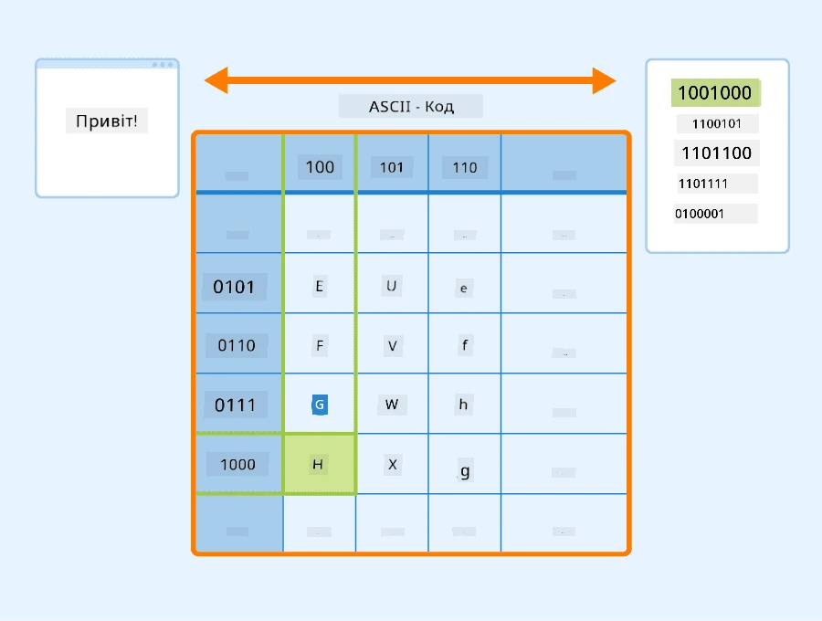
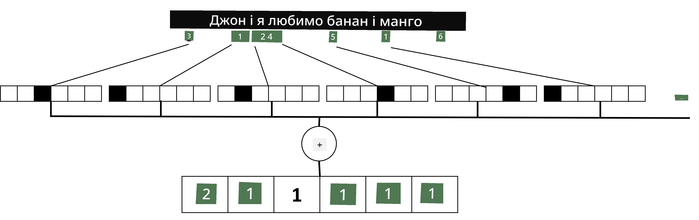

# Представлення тексту як тензорів

## [Тест перед лекцією](https://ff-quizzes.netlify.app/en/ai/quiz/25)

## Класифікація тексту

Протягом першої частини цього розділу ми зосередимося на завданні **класифікації тексту**. Ми використаємо набір даних [AG News](https://www.kaggle.com/amananandrai/ag-news-classification-dataset), який містить новинні статті, наприклад:

* Категорія: Наука/Технології
* Заголовок: Ky. Company Wins Grant to Study Peptides (AP)
* Текст: AP - Компанія, заснована дослідником хімії з Університету Луїсвілля, отримала грант на розробку...

Наша мета — класифікувати новинний матеріал в одну з категорій на основі тексту.

## Представлення тексту

Якщо ми хочемо вирішувати завдання обробки природної мови (NLP) за допомогою нейронних мереж, нам потрібен спосіб представлення тексту як тензорів. Комп’ютери вже представляють текстові символи як числа, які відповідають шрифтам на вашому екрані, використовуючи кодування, такі як ASCII або UTF-8.

> [Джерело зображення](https://www.seobility.net/en/wiki/ASCII)

Як люди, ми розуміємо, що кожна літера **означає**, і як усі символи об’єднуються, щоб утворити слова в реченні. Однак комп’ютери самі по собі не мають такого розуміння, і нейронна мережа повинна навчитися значення під час тренування.

Тому ми можемо використовувати різні підходи для представлення тексту:

* **Представлення на рівні символів**, коли ми представляємо текст, розглядаючи кожен символ як число. Оскільки у нас є *C* різних символів у нашому текстовому корпусі, слово *Hello* буде представлено як тензор розміром 5x*C*. Кожна літера відповідатиме стовпцю тензора в однохот-кодуванні.
* **Представлення на рівні слів**, у якому ми створюємо **словник** усіх слів у нашому тексті, а потім представляємо слова за допомогою однохот-кодування. Цей підхід є дещо кращим, оскільки кожна літера сама по собі не має великого значення, і, використовуючи більш високорівневі семантичні концепти — слова — ми спрощуємо завдання для нейронної мережі. Однак, враховуючи великий розмір словника, нам потрібно працювати з високовимірними розрідженими тензорами.

Незалежно від представлення, спочатку нам потрібно перетворити текст у послідовність **токенів**, де один токен може бути символом, словом або навіть частиною слова. Потім ми перетворюємо токен у число, зазвичай використовуючи **словник**, і це число можна передати в нейронну мережу за допомогою однохот-кодування.

## N-грами

У природній мові точне значення слів можна визначити лише в контексті. Наприклад, значення *нейронна мережа* і *рибальська мережа* абсолютно різні. Один із способів врахувати це — побудувати нашу модель на парах слів, розглядаючи пари слів як окремі токени словника. Таким чином, речення *I like to go fishing* буде представлено наступною послідовністю токенів: *I like*, *like to*, *to go*, *go fishing*. Проблема цього підходу полягає в тому, що розмір словника значно зростає, і комбінації, такі як *go fishing* і *go shopping*, представлені різними токенами, які не мають жодної семантичної схожості, незважаючи на однаковий дієслово.

У деяких випадках ми можемо розглянути використання триграм — комбінацій із трьох слів. Таким чином, цей підхід часто називають **n-грамами**. Також має сенс використовувати n-грами з представленням на рівні символів, у цьому випадку n-грами приблизно відповідатимуть різним складам.

## Мішок слів і TF/IDF

Під час вирішення завдань, таких як класифікація тексту, нам потрібно мати можливість представляти текст одним вектором фіксованого розміру, який ми будемо використовувати як вхід для фінального класифікатора. Один із найпростіших способів зробити це — об’єднати всі окремі представлення слів, наприклад, додаючи їх. Якщо ми додамо однохот-кодування кожного слова, ми отримаємо вектор частот, який показує, скільки разів кожне слово з’являється в тексті. Таке представлення тексту називається **мішок слів** (BoW).

> Зображення автора

BoW фактично представляє, які слова з’являються в тексті та в якій кількості, що дійсно може бути хорошим показником того, про що йдеться в тексті. Наприклад, новинна стаття про політику, ймовірно, містить слова, такі як *президент* і *країна*, тоді як наукова публікація матиме щось на кшталт *колайдер*, *відкрито* тощо. Таким чином, частоти слів у багатьох випадках можуть бути хорошим показником змісту тексту.

Проблема BoW полягає в тому, що певні загальні слова, такі як *і*, *є* тощо, з’являються в більшості текстів і мають найвищі частоти, приховуючи слова, які дійсно важливі. Ми можемо знизити важливість цих слів, враховуючи частоту, з якою слова зустрічаються в усій колекції документів. Це основна ідея підходу TF/IDF, який детальніше розглядається в ноутбуках, прикріплених до цього уроку.

Однак жоден із цих підходів не може повністю врахувати **семантику** тексту. Для цього нам потрібні більш потужні моделі нейронних мереж, які ми обговоримо пізніше в цьому розділі.

## ✍️ Вправи: Представлення тексту

Продовжуйте навчання в наступних ноутбуках:

* [Представлення тексту з PyTorch](TextRepresentationPyTorch.ipynb)
* [Представлення тексту з TensorFlow](TextRepresentationTF.ipynb)

## Висновок

На даний момент ми вивчили техніки, які можуть додати вагу частотам різних слів. Вони, однак, не здатні представляти значення або порядок. Як сказав відомий лінгвіст Дж. Р. Ферт у 1935 році: "Повне значення слова завжди є контекстуальним, і жодне дослідження значення поза контекстом не може бути серйозним". Ми дізнаємося пізніше в курсі, як захоплювати контекстуальну інформацію з тексту за допомогою мовного моделювання.

## 🚀 Виклик

Спробуйте інші вправи, використовуючи мішок слів і різні моделі даних. Вас може надихнути цей [конкурс на Kaggle](https://www.kaggle.com/competitions/word2vec-nlp-tutorial/overview/part-1-for-beginners-bag-of-words)

## [Тест після лекції](https://ff-quizzes.netlify.app/en/ai/quiz/26)

## Огляд і самостійне навчання

Практикуйте свої навички з текстовими вбудовуваннями та техніками мішка слів на [Microsoft Learn](https://docs.microsoft.com/learn/modules/intro-natural-language-processing-pytorch/?WT.mc_id=academic-77998-cacaste)

## [Завдання: Ноутбуки](assignment.md)

---

