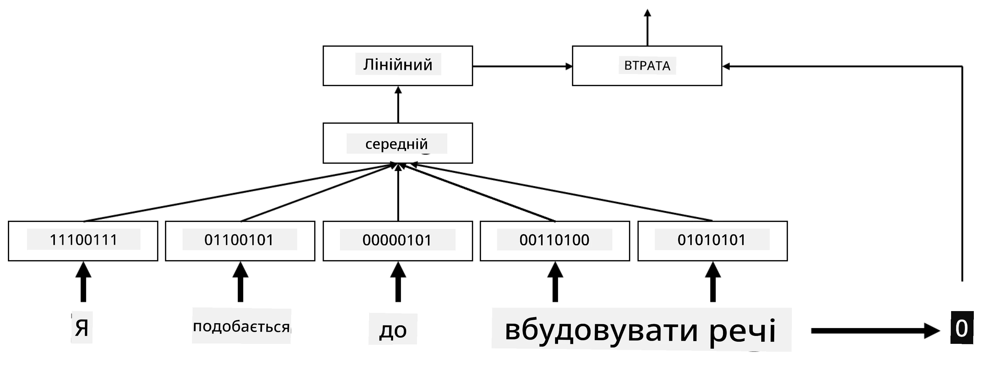

# Вбудовування

## [Тест перед лекцією](https://ff-quizzes.netlify.app/en/ai/quiz/27)

Під час навчання класифікаторів на основі BoW або TF/IDF ми працювали з високовимірними векторами "мішка слів" довжиною `vocab_size`, і явно перетворювали низьковимірні вектори позиційного представлення у розріджене однохотне представлення. Однак таке однохотне представлення не є ефективним з точки зору пам'яті. Крім того, кожне слово розглядається незалежно від інших, тобто однохотні вектори не виражають жодної семантичної схожості між словами.

Ідея **вбудовування** полягає в тому, щоб представляти слова за допомогою низьковимірних щільних векторів, які певним чином відображають семантичне значення слова. Ми пізніше обговоримо, як створювати значущі вбудовування слів, але наразі просто розглянемо вбудовування як спосіб зменшення розмірності вектора слова.

Отже, шар вбудовування приймає слово як вхідні дані і створює вихідний вектор заданого розміру `embedding_size`. У певному сенсі це дуже схоже на шар `Linear`, але замість того, щоб приймати однохотний вектор, він може приймати номер слова як вхідні дані, дозволяючи уникнути створення великих однохотних векторів.

Використовуючи шар вбудовування як перший шар у нашій мережі класифікатора, ми можемо перейти від моделі "мішка слів" до моделі **мішка вбудовувань**, де спочатку кожне слово в нашому тексті перетворюється у відповідне вбудовування, а потім обчислюється певна агрегатна функція над усіма цими вбудовуваннями, така як `sum`, `average` або `max`.

> Зображення автора

## ✍️ Вправи: Вбудовування

Продовжуйте навчання у наступних ноутбуках:
* [Вбудовування з PyTorch](EmbeddingsPyTorch.ipynb)
* [Вбудовування з TensorFlow](EmbeddingsTF.ipynb)

## Семантичні вбудовування: Word2Vec

Хоча шар вбудовування навчився відображати слова у векторне представлення, це представлення не обов'язково має багато семантичного значення. Було б добре навчити векторне представлення таким чином, щоб схожі слова або синоніми відповідали векторами, які близькі один до одного за певною векторною відстанню (наприклад, евклідовою відстанню).

Для цього нам потрібно попередньо навчити нашу модель вбудовування на великій колекції текстів у специфічний спосіб. Один із способів навчання семантичних вбудовувань називається [Word2Vec](https://en.wikipedia.org/wiki/Word2vec). Він базується на двох основних архітектурах, які використовуються для створення розподіленого представлення слів:

 - **Неперервний мішок слів** (CBoW) — у цій архітектурі ми навчаємо модель передбачати слово за навколишнім контекстом. Дано n-грам $(W_{-2},W_{-1},W_0,W_1,W_2)$, мета моделі — передбачити $W_0$ за $(W_{-2},W_{-1},W_1,W_2)$.
 - **Неперервний скіп-грам** — протилежний до CBoW. Модель використовує навколишнє вікно контекстних слів для передбачення поточного слова.

CBoW працює швидше, тоді як скіп-грам повільніший, але краще представляє рідковживані слова.

> Зображення з [цієї статті](https://arxiv.org/pdf/1301.3781.pdf)

Попередньо навчені вбудовування Word2Vec (а також інші схожі моделі, такі як GloVe) можуть бути використані замість шару вбудовування у нейронних мережах. Однак нам потрібно вирішити проблему словників, оскільки словник, використаний для попереднього навчання Word2Vec/GloVe, ймовірно, відрізняється від словника у нашому текстовому корпусі. Ознайомтеся з ноутбуками вище, щоб дізнатися, як можна вирішити цю проблему.

## Контекстуальні вбудовування

Одним із ключових обмежень традиційних попередньо навчених представлень вбудовувань, таких як Word2Vec, є проблема розрізнення значень слів. Хоча попередньо навчені вбудовування можуть захоплювати певне значення слів у контексті, кожне можливе значення слова кодується в одному і тому ж вбудовуванні. Це може викликати проблеми у наступних моделях, оскільки багато слів, таких як слово "play", мають різні значення залежно від контексту, у якому вони використовуються.

Наприклад, слово "play" у цих двох реченнях має зовсім різні значення:

- Я ходив на **виставу** в театрі.
- Джон хоче **грати** зі своїми друзями.

Попередньо навчені вбудовування вище представляють обидва ці значення слова "play" в одному і тому ж вбудовуванні. Щоб подолати це обмеження, нам потрібно створювати вбудовування на основі **мовної моделі**, яка навчена на великому корпусі текстів і *знає*, як слова можуть бути використані у різних контекстах. Обговорення контекстуальних вбудовувань виходить за рамки цього уроку, але ми повернемося до них, коли будемо говорити про мовні моделі пізніше у курсі.

## Висновок

У цьому уроці ви дізналися, як створювати і використовувати шари вбудовування у TensorFlow та Pytorch для кращого відображення семантичних значень слів.

## 🚀 Виклик

Word2Vec використовувався для деяких цікавих застосувань, включаючи створення текстів пісень і поезії. Ознайомтеся з [цією статтею](https://www.politetype.com/blog/word2vec-color-poems), яка описує, як автор використовував Word2Vec для створення поезії. Перегляньте [це відео від Дена Шиффмана](https://www.youtube.com/watch?v=LSS_bos_TPI&ab_channel=TheCodingTrain), щоб дізнатися інше пояснення цієї техніки. Потім спробуйте застосувати ці техніки до власного текстового корпусу, можливо, взятого з Kaggle.

## [Тест після лекції](https://ff-quizzes.netlify.app/en/ai/quiz/28)

## Огляд і самостійне навчання

Прочитайте цю статтю про Word2Vec: [Efficient Estimation of Word Representations in Vector Space](https://arxiv.org/pdf/1301.3781.pdf)

## [Завдання: Ноутбуки](assignment.md)

---

