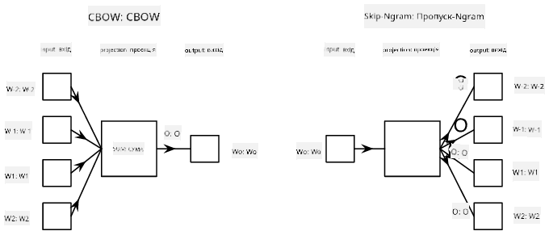

<!--
CO_OP_TRANSLATOR_METADATA:
{
  "original_hash": "31b46ba1f3aa78578134d4829f88be53",
  "translation_date": "2025-08-25T21:57:14+00:00",
  "source_file": "lessons/5-NLP/15-LanguageModeling/README.md",
  "language_code": "uk"
}
-->
# Моделювання мови

Семантичні векторні представлення, такі як Word2Vec і GloVe, насправді є першим кроком до **моделювання мови** — створення моделей, які певним чином *розуміють* (або *представляють*) природу мови.

## [Тест перед лекцією](https://red-field-0a6ddfd03.1.azurestaticapps.net/quiz/115)

Основна ідея моделювання мови полягає в тому, щоб навчати моделі на немаркованих наборах даних у ненаглядний спосіб. Це важливо, оскільки у нас є величезна кількість немаркованого тексту, тоді як обсяг маркованого тексту завжди буде обмежений зусиллями, які ми можемо витратити на маркування. Найчастіше ми можемо створювати мовні моделі, які можуть **передбачати пропущені слова** в тексті, оскільки легко приховати випадкове слово в тексті та використовувати його як навчальний зразок.

## Навчання векторних представлень

У попередніх прикладах ми використовували попередньо навчені семантичні векторні представлення, але цікаво побачити, як ці вектори можна навчати. Є кілька можливих підходів:

* **Моделювання мови за допомогою N-грам**, коли ми передбачаємо токен, аналізуючи N попередніх токенів (N-грам).
* **Безперервний мішок слів** (CBoW), коли ми передбачаємо середній токен $W_0$ у послідовності токенів $W_{-N}$, ..., $W_N$.
* **Skip-gram**, де ми передбачаємо набір сусідніх токенів {$W_{-N},\dots, W_{-1}, W_1,\dots, W_N$} на основі середнього токена $W_0$.

> Зображення з [цієї статті](https://arxiv.org/pdf/1301.3781.pdf)

## ✍️ Приклад блокнотів: Навчання моделі CBoW

Продовжуйте навчання за допомогою наступних блокнотів:

* [Навчання CBoW Word2Vec з TensorFlow](../../../../../lessons/5-NLP/15-LanguageModeling/CBoW-TF.ipynb)
* [Навчання CBoW Word2Vec з PyTorch](../../../../../lessons/5-NLP/15-LanguageModeling/CBoW-PyTorch.ipynb)

## Висновок

У попередньому уроці ми побачили, що векторні представлення слів працюють як магія! Тепер ми знаємо, що навчання векторних представлень слів — це не дуже складне завдання, і ми зможемо навчити власні векторні представлення для текстів у специфічних доменах, якщо це буде потрібно.

## [Тест після лекції](https://red-field-0a6ddfd03.1.azurestaticapps.net/quiz/215)

## Огляд і самостійне навчання

* [Офіційний підручник PyTorch з моделювання мови](https://pytorch.org/tutorials/beginner/nlp/word_embeddings_tutorial.html).
* [Офіційний підручник TensorFlow з навчання моделі Word2Vec](https://www.TensorFlow.org/tutorials/text/word2vec).
* Використання фреймворку **gensim** для навчання найпоширеніших векторних представлень у кілька рядків коду описано [в цій документації](https://pytorch.org/tutorials/beginner/nlp/word_embeddings_tutorial.html).

## 🚀 [Завдання: Навчання моделі Skip-Gram](lab/README.md)

У лабораторній роботі ми пропонуємо вам змінити код з цього уроку, щоб навчити модель Skip-Gram замість CBoW. [Детальніше](lab/README.md)

**Відмова від відповідальності**:  
Цей документ було перекладено за допомогою сервісу автоматичного перекладу [Co-op Translator](https://github.com/Azure/co-op-translator). Хоча ми прагнемо до точності, звертаємо вашу увагу, що автоматичні переклади можуть містити помилки або неточності. Оригінальний документ на його рідній мові слід вважати авторитетним джерелом. Для критично важливої інформації рекомендується професійний людський переклад. Ми не несемо відповідальності за будь-які непорозуміння або неправильні тлумачення, що виникли внаслідок використання цього перекладу.