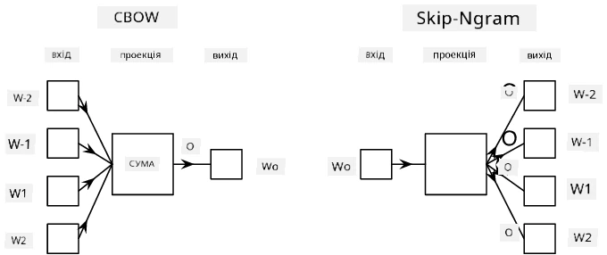

# Моделювання мови

Семантичні векторні представлення, такі як Word2Vec і GloVe, насправді є першим кроком до **моделювання мови** — створення моделей, які певним чином *розуміють* (або *представляють*) природу мови.

## [Передлекційна вікторина](https://ff-quizzes.netlify.app/en/ai/quiz/29)

Основна ідея моделювання мови полягає в тому, щоб навчати моделі на немаркованих наборах даних у ненаглядовий спосіб. Це важливо, оскільки у нас є величезна кількість немаркованого тексту, тоді як кількість маркованого тексту завжди буде обмежена зусиллями, які ми можемо витратити на маркування. Найчастіше ми можемо створювати мовні моделі, які можуть **передбачати пропущені слова** в тексті, оскільки легко замаскувати випадкове слово в тексті та використовувати його як навчальний приклад.

## Навчання векторних представлень

У попередніх прикладах ми використовували попередньо навчені семантичні векторні представлення, але цікаво побачити, як ці представлення можна навчати. Існує кілька можливих підходів:

* **Моделювання мови на основі N-грам**, коли ми передбачаємо токен, аналізуючи N попередніх токенів (N-грам).
* **Безперервний мішок слів** (CBoW), коли ми передбачаємо середній токен $W_0$ у послідовності токенів $W_{-N}$, ..., $W_N$.
* **Skip-gram**, де ми передбачаємо набір сусідніх токенів {$W_{-N},\dots, W_{-1}, W_1,\dots, W_N$} на основі середнього токена $W_0$.

> Зображення з [цієї статті](https://arxiv.org/pdf/1301.3781.pdf)

## ✍️ Прикладні ноутбуки: Навчання моделі CBoW

Продовжуйте навчання за допомогою наступних ноутбуків:

* [Навчання CBoW Word2Vec з TensorFlow](CBoW-TF.ipynb)
* [Навчання CBoW Word2Vec з PyTorch](CBoW-PyTorch.ipynb)

## Висновок

У попередньому уроці ми побачили, що векторні представлення слів працюють як магія! Тепер ми знаємо, що навчання векторних представлень слів — це не дуже складне завдання, і ми можемо навчати власні векторні представлення для текстів у специфічних доменах, якщо це необхідно.

## [Післялекційна вікторина](https://ff-quizzes.netlify.app/en/ai/quiz/30)

## Огляд і самостійне навчання

* [Офіційний підручник PyTorch з моделювання мови](https://pytorch.org/tutorials/beginner/nlp/word_embeddings_tutorial.html).
* [Офіційний підручник TensorFlow з навчання моделі Word2Vec](https://www.TensorFlow.org/tutorials/text/word2vec).
* Використання фреймворку **gensim** для навчання найпоширеніших векторних представлень у кілька рядків коду описано [в цій документації](https://pytorch.org/tutorials/beginner/nlp/word_embeddings_tutorial.html).

## 🚀 [Завдання: Навчання моделі Skip-Gram](lab/README.md)

У лабораторній роботі ми пропонуємо вам змінити код з цього уроку, щоб навчити модель skip-gram замість CBoW. [Деталі тут](lab/README.md)

---

