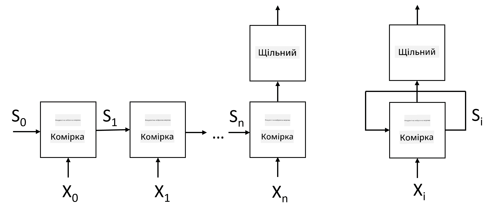
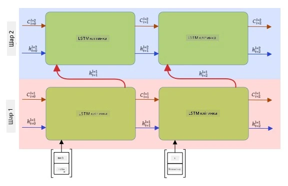

# Рекурентні нейронні мережі

## [Тест перед лекцією](https://ff-quizzes.netlify.app/en/ai/quiz/31)

У попередніх розділах ми використовували багаті семантичні представлення тексту та простий лінійний класифікатор поверх вбудов. Ця архітектура дозволяє захоплювати агреговане значення слів у реченні, але не враховує **порядок** слів, оскільки операція агрегування поверх вбудов видаляє цю інформацію з оригінального тексту. Через те, що ці моделі не можуть моделювати порядок слів, вони не здатні вирішувати складніші або неоднозначні завдання, такі як генерація тексту чи відповіді на запитання.

Щоб захопити значення текстової послідовності, нам потрібно використовувати іншу архітектуру нейронної мережі, яка називається **рекурентною нейронною мережею** або RNN. У RNN ми пропускаємо речення через мережу по одному символу за раз, і мережа створює певний **стан**, який ми потім передаємо назад у мережу разом із наступним символом.

> Зображення автора

З огляду на вхідну послідовність токенів X0,...,Xn, RNN створює послідовність блоків нейронної мережі та навчає цю послідовність від початку до кінця за допомогою зворотного поширення. Кожен блок мережі приймає пару (Xi,Si) як вхідні дані та створює Si+1 як результат. Кінцевий стан Sn або (вихід Yn) передається до лінійного класифікатора для отримання результату. Усі блоки мережі мають однакові ваги та навчаються від початку до кінця за допомогою одного проходу зворотного поширення.

Оскільки вектори стану S0,...,Sn передаються через мережу, вона здатна навчатися послідовним залежностям між словами. Наприклад, коли слово *не* з'являється десь у послідовності, мережа може навчитися заперечувати певні елементи у векторі стану, що призводить до заперечення.

> ✅ Оскільки ваги всіх блоків RNN на зображенні вище є спільними, те саме зображення можна представити як один блок (праворуч) із рекурентним зворотним зв’язком, який передає вихідний стан мережі назад на вхід.

## Анатомія клітини RNN

Давайте розглянемо, як організована проста клітина RNN. Вона приймає попередній стан Si-1 і поточний символ Xi як вхідні дані та має створити вихідний стан Si (а іноді нас також цікавить інший вихід Yi, як у випадку з генеративними мережами).

Проста клітина RNN має дві матриці ваг всередині: одна трансформує вхідний символ (назвемо її W), а інша трансформує вхідний стан (H). У цьому випадку вихід мережі обчислюється як &sigma;(W&times;Xi+H&times;Si-1+b), де &sigma; — це функція активації, а b — додатковий зсув.

> Зображення автора

У багатьох випадках вхідні токени пропускаються через шар вбудов перед входом у RNN для зменшення розмірності. У цьому випадку, якщо розмірність вхідних векторів — *emb_size*, а вектор стану — *hid_size*, то розмір W — *emb_size*&times;*hid_size*, а розмір H — *hid_size*&times;*hid_size*.

## Довготривала короткочасна пам'ять (LSTM)

Однією з основних проблем класичних RNN є так звана проблема **зникаючих градієнтів**. Оскільки RNN навчаються від початку до кінця за один проход зворотного поширення, їм важко передавати помилку до перших шарів мережі, і тому мережа не може навчитися взаємозв’язкам між далекими токенами. Один із способів уникнути цієї проблеми — запровадити **явне управління станом** за допомогою так званих **воріт**. Існують дві добре відомі архітектури такого типу: **довготривала короткочасна пам'ять** (LSTM) і **блок з керованою передачею** (GRU).

> Джерело зображення TBD

Мережа LSTM організована подібно до RNN, але є два стани, які передаються від шару до шару: фактичний стан C і прихований вектор H. У кожному блоці прихований вектор Hi об’єднується з вхідним Xi, і вони контролюють, що відбувається зі станом C через **ворота**. Кожен воріт — це нейронна мережа з сигмоїдною активацією (вихід у діапазоні [0,1]), яку можна розглядати як побітову маску при множенні на вектор стану. Існують такі ворота (зліва направо на зображенні вище):

* **Ворота забування** приймають прихований вектор і визначають, які компоненти вектора C потрібно забути, а які пропустити.
* **Ворота введення** беруть певну інформацію з вхідного та прихованого векторів і вставляють її в стан.
* **Ворота виведення** трансформують стан через лінійний шар із активацією *tanh*, а потім вибирають деякі його компоненти за допомогою прихованого вектора Hi, щоб створити новий стан Ci+1.

Компоненти стану C можна розглядати як певні прапорці, які можна вмикати та вимикати. Наприклад, коли ми зустрічаємо ім’я *Аліса* в послідовності, ми можемо припустити, що це стосується жіночого персонажа, і встановити прапорець у стані, що в реченні є жіночий іменник. Коли ми далі зустрічаємо фразу *і Том*, ми встановлюємо прапорець, що в нас є множинний іменник. Таким чином, маніпулюючи станом, ми можемо, ймовірно, відстежувати граматичні властивості частин речення.

> ✅ Чудовим ресурсом для розуміння внутрішньої роботи LSTM є ця чудова стаття [Understanding LSTM Networks](https://colah.github.io/posts/2015-08-Understanding-LSTMs/) Крістофера Олаха.

## Двонаправлені та багатошарові RNN

Ми обговорили рекурентні мережі, які працюють в одному напрямку — від початку послідовності до кінця. Це виглядає природно, оскільки нагадує спосіб, яким ми читаємо та слухаємо мовлення. Однак, оскільки в багатьох практичних випадках ми маємо випадковий доступ до вхідної послідовності, може мати сенс виконувати рекурентні обчислення в обох напрямках. Такі мережі називаються **двонаправленими** RNN. Працюючи з двонаправленою мережею, нам знадобляться два приховані вектори стану — один для кожного напрямку.

Рекурентна мережа, одностороння чи двонаправлена, захоплює певні шаблони в послідовності та може зберігати їх у векторі стану або передавати у вихід. Як і у випадку з згортковими мережами, ми можемо побудувати ще один рекурентний шар поверх першого, щоб захопити шаблони вищого рівня та побудувати з шаблонів нижчого рівня, які витягнув перший шар. Це приводить нас до поняття **багатошарової RNN**, яка складається з двох або більше рекурентних мереж, де вихід попереднього шару передається наступному шару як вхід.

*Зображення з [цієї чудової статті](https://towardsdatascience.com/from-a-lstm-cell-to-a-multilayer-lstm-network-with-pytorch-2899eb5696f3) Фернандо Лопеса*

## ✍️ Вправи: Вбудовування

Продовжуйте навчання в наступних блокнотах:

* [RNNs з PyTorch](RNNPyTorch.ipynb)
* [RNNs з TensorFlow](RNNTF.ipynb)

## Висновок

У цьому розділі ми побачили, що RNN можна використовувати для класифікації послідовностей, але насправді вони можуть виконувати набагато більше завдань, таких як генерація тексту, машинний переклад тощо. Ми розглянемо ці завдання в наступному розділі.

## 🚀 Виклик

Прочитайте деяку літературу про LSTM і розгляньте їх застосування:

- [Grid Long Short-Term Memory](https://arxiv.org/pdf/1507.01526v1.pdf)
- [Show, Attend and Tell: Neural Image Caption
Generation with Visual Attention](https://arxiv.org/pdf/1502.03044v2.pdf)

## [Тест після лекції](https://ff-quizzes.netlify.app/en/ai/quiz/32)

## Огляд і самостійне навчання

- [Understanding LSTM Networks](https://colah.github.io/posts/2015-08-Understanding-LSTMs/) Крістофера Олаха.

## [Завдання: Блокноти](assignment.md)

---

