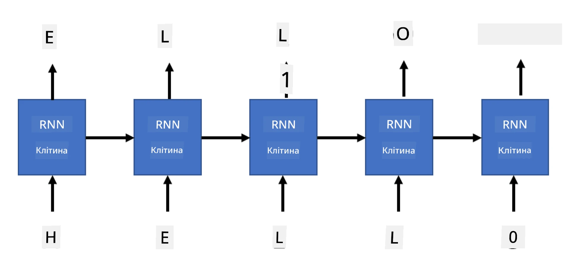

# Генеративні мережі

## [Тест перед лекцією](https://ff-quizzes.netlify.app/en/ai/quiz/33)

Рекурентні нейронні мережі (RNN) та їх варіанти з гейтованими комірками, такі як комірки довготривалої пам'яті (LSTM) та гейтовані рекурентні блоки (GRU), забезпечують механізм для моделювання мови, оскільки вони можуть навчатися порядку слів і передбачати наступне слово в послідовності. Це дозволяє використовувати RNN для **генеративних завдань**, таких як звичайне генерування тексту, машинний переклад і навіть створення підписів до зображень.

> ✅ Згадайте всі випадки, коли ви користувалися перевагами генеративних завдань, таких як автозаповнення тексту під час введення. Проведіть дослідження ваших улюблених додатків, щоб дізнатися, чи використовували вони RNN.

У архітектурі RNN, яку ми обговорювали в попередньому модулі, кожен блок RNN створював наступний прихований стан як вихід. Однак ми також можемо додати ще один вихід до кожного рекурентного блоку, що дозволить нам створювати **послідовність** (яка дорівнює за довжиною початковій послідовності). Більше того, ми можемо використовувати блоки RNN, які не приймають вхідні дані на кожному кроці, а лише беруть початковий вектор стану і створюють послідовність виходів.

Це дозволяє створювати різні нейронні архітектури, які показані на зображенні нижче:


> Зображення з блогу [Unreasonable Effectiveness of Recurrent Neural Networks](http://karpathy.github.io/2015/05/21/rnn-effectiveness/) авторства [Андрея Карпаті](http://karpathy.github.io/)

* **Один-до-одного** — це традиційна нейронна мережа з одним входом і одним виходом.
* **Один-до-багатьох** — це генеративна архітектура, яка приймає одне вхідне значення і генерує послідовність вихідних значень. Наприклад, якщо ми хочемо навчити мережу для **створення підписів до зображень**, яка створюватиме текстовий опис картинки, ми можемо передати картинку як вхідні дані, пропустити її через CNN для отримання прихованого стану, а потім рекурентний ланцюг генеруватиме підпис слово за словом.
* **Багато-до-одного** відповідає архітектурам RNN, які ми описували в попередньому модулі, наприклад, класифікація тексту.
* **Багато-до-багатьох**, або **послідовність-до-послідовності**, відповідає завданням, таким як **машинний переклад**, де перша RNN збирає всю інформацію з вхідної послідовності в прихований стан, а інший ланцюг RNN розгортає цей стан у вихідну послідовність.

У цьому модулі ми зосередимося на простих генеративних моделях, які допомагають нам генерувати текст. Для простоти ми використовуватимемо токенізацію на рівні символів.

Ми навчимо цю RNN генерувати текст крок за кроком. На кожному кроці ми братимемо послідовність символів довжиною `nchars` і проситимемо мережу створити наступний вихідний символ для кожного вхідного символу:



Під час генерації тексту (під час інференсу) ми починаємо з деякого **запиту**, який передається через блоки RNN для створення його проміжного стану, а потім з цього стану починається генерація. Ми генеруємо один символ за раз і передаємо стан та створений символ до іншого блоку RNN для генерації наступного, поки не буде створено достатню кількість символів.


> Зображення авторства автора

## ✍️ Вправи: Генеративні мережі

Продовжуйте навчання у наступних ноутбуках:

* [Генеративні мережі з PyTorch](GenerativePyTorch.ipynb)
* [Генеративні мережі з TensorFlow](GenerativeTF.ipynb)

## М'яке генерування тексту та температура

Вихід кожного блоку RNN — це розподіл ймовірностей символів. Якщо ми завжди обиратимемо символ із найвищою ймовірністю як наступний символ у створеному тексті, текст часто може "зациклюватися" між одними й тими ж послідовностями символів, як у цьому прикладі:

```
today of the second the company and a second the company ...
```

Однак, якщо ми подивимося на розподіл ймовірностей для наступного символу, може виявитися, що різниця між кількома найвищими ймовірностями незначна, наприклад, один символ може мати ймовірність 0.2, а інший — 0.19 тощо. Наприклад, при пошуку наступного символу в послідовності '*play*', наступним символом може однаково бути пробіл або **e** (як у слові *player*).

Це приводить нас до висновку, що не завжди "справедливо" обирати символ із найвищою ймовірністю, оскільки вибір другого за ймовірністю також може привести до осмисленого тексту. Більш розумно **вибирати** символи з розподілу ймовірностей, який надає вихід мережі. Ми також можемо використовувати параметр **температура**, який згладжує розподіл ймовірностей, якщо ми хочемо додати більше випадковості, або робить його більш крутим, якщо ми хочемо більше дотримуватися символів із найвищою ймовірністю.

Досліджуйте, як це м'яке генерування тексту реалізовано в ноутбуках, посилання на які наведено вище.

## Висновок

Хоча генерація тексту може бути корисною сама по собі, основні переваги полягають у здатності генерувати текст за допомогою RNN із початкового вектора ознак. Наприклад, генерація тексту використовується як частина машинного перекладу (послідовність-до-послідовності, у цьому випадку вектор стану з *кодера* використовується для створення або *декодування* перекладеного повідомлення) або створення текстового опису зображення (у цьому випадку вектор ознак надходить від CNN-екстрактора).

## 🚀 Виклик

Пройдіть кілька уроків на Microsoft Learn на цю тему:

* Генерація тексту з [PyTorch](https://docs.microsoft.com/learn/modules/intro-natural-language-processing-pytorch/6-generative-networks/?WT.mc_id=academic-77998-cacaste)/[TensorFlow](https://docs.microsoft.com/learn/modules/intro-natural-language-processing-tensorflow/5-generative-networks/?WT.mc_id=academic-77998-cacaste)

## [Тест після лекції](https://ff-quizzes.netlify.app/en/ai/quiz/34)

## Огляд і самостійне навчання

Ось кілька статей для розширення ваших знань:

* Різні підходи до генерації тексту з використанням Марковського ланцюга, LSTM та GPT-2: [блог](https://towardsdatascience.com/text-generation-gpt-2-lstm-markov-chain-9ea371820e1e)
* Приклад генерації тексту в [документації Keras](https://keras.io/examples/generative/lstm_character_level_text_generation/)

## [Завдання](lab/README.md)

Ми побачили, як генерувати текст символ за символом. У лабораторній роботі ви дослідите генерацію тексту на рівні слів.

---

