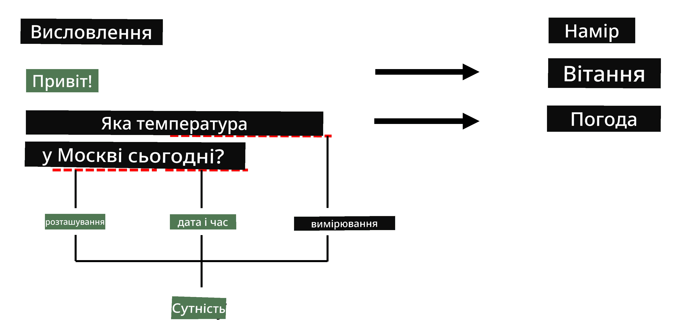
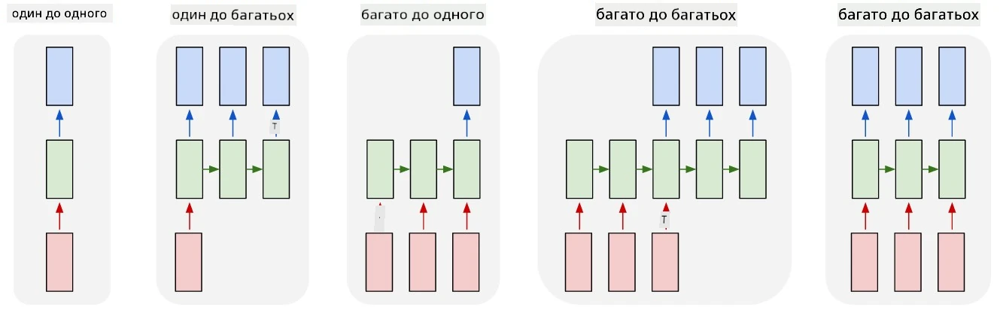

# Розпізнавання іменованих сутностей

До цього моменту ми здебільшого зосереджувалися на одному завданні NLP — класифікації. Однак існують й інші завдання NLP, які можна виконувати за допомогою нейронних мереж. Одним із таких завдань є **[Розпізнавання іменованих сутностей](https://wikipedia.org/wiki/Named-entity_recognition)** (NER), яке полягає у визначенні конкретних сутностей у тексті, таких як місця, імена людей, часові інтервали, хімічні формули тощо.

## [Тест перед лекцією](https://ff-quizzes.netlify.app/en/ai/quiz/37)

## Приклад використання NER

Припустимо, ви хочете створити чат-бота, схожого на Amazon Alexa або Google Assistant. Інтелектуальні чат-боти працюють таким чином, щоб *зрозуміти*, чого хоче користувач, виконуючи класифікацію тексту вхідного речення. Результатом цієї класифікації є так званий **намір**, який визначає, що має зробити чат-бот.

> Зображення автора

Однак користувач може надати деякі параметри як частину фрази. Наприклад, запитуючи про погоду, він може вказати місце або дату. Бот повинен вміти розпізнавати ці сутності та заповнювати відповідні параметри перед виконанням дії. Саме тут і стає в пригоді NER.

> ✅ Інший приклад — [аналіз наукових медичних статей](https://soshnikov.com/science/analyzing-medical-papers-with-azure-and-text-analytics-for-health/). Одним із головних завдань є пошук конкретних медичних термінів, таких як хвороби та медичні речовини. Хоча невелику кількість хвороб можна, ймовірно, знайти за допомогою пошуку підрядків, складніші сутності, такі як хімічні сполуки та назви ліків, потребують більш складного підходу.

## NER як класифікація токенів

Моделі NER фактично є моделями **класифікації токенів**, оскільки для кожного вхідного токена потрібно визначити, чи належить він до сутності, і якщо належить — до якого класу сутності.

Розглянемо наступну назву статті:

**Регургітація трикуспідального клапана** та **карбонат літію** **токсичність** у новонародженого.

Сутності тут такі:

* Регургітація трикуспідального клапана — це хвороба (`DIS`)
* Карбонат літію — це хімічна речовина (`CHEM`)
* Токсичність — це також хвороба (`DIS`)

Зверніть увагу, що одна сутність може охоплювати кілька токенів. І, як у цьому випадку, нам потрібно розрізняти дві послідовні сутності. Тому зазвичай використовуються два класи для кожної сутності — один для першого токена сутності (зазвичай використовується префікс `B-`, що означає **початок**), а інший — для продовження сутності (`I-`, для **внутрішнього токена**). Ми також використовуємо `O` як клас для позначення всіх **інших** токенів. Таке маркування токенів називається [BIO маркуванням](https://en.wikipedia.org/wiki/Inside%E2%80%93outside%E2%80%93beginning_(tagging)) (або IOB). Після маркування наша назва виглядатиме так:

Токен | Тег
------|-----
Tricuspid | B-DIS
valve | I-DIS
regurgitation | I-DIS
and | O
lithium | B-CHEM
carbonate | I-CHEM
toxicity | B-DIS
in | O
a | O
newborn | O
infant | O
. | O

Оскільки нам потрібно створити однозначну відповідність між токенами та класами, ми можемо навчити правосторонню **багатозначну** модель нейронної мережі з цієї схеми:

> *Зображення з [цього блогу](http://karpathy.github.io/2015/05/21/rnn-effectiveness/) від [Андрія Карпатія](http://karpathy.github.io/). Моделі класифікації токенів для NER відповідають правосторонній архітектурі мережі на цьому зображенні.*

## Навчання моделей NER

Оскільки модель NER фактично є моделлю класифікації токенів, ми можемо використовувати RNN, з якими ми вже знайомі, для цього завдання. У цьому випадку кожен блок рекурентної мережі буде повертати ID токена. Наступний приклад ноутбука показує, як навчити LSTM для класифікації токенів.

## ✍️ Приклад ноутбуків: NER

Продовжуйте навчання за наступним ноутбуком:

* [NER з TensorFlow](NER-TF.ipynb)

## Висновок

Модель NER — це **модель класифікації токенів**, що означає, що її можна використовувати для виконання класифікації токенів. Це дуже поширене завдання в NLP, яке допомагає розпізнавати конкретні сутності в тексті, включаючи місця, імена, дати тощо.

## 🚀 Виклик

Виконайте завдання за посиланням нижче, щоб навчити модель розпізнавання іменованих сутностей для медичних термінів, а потім спробуйте її на іншому наборі даних.

## [Тест після лекції](https://ff-quizzes.netlify.app/en/ai/quiz/38)

## Огляд і самостійне навчання

Прочитайте блог [Неймовірна ефективність рекурентних нейронних мереж](http://karpathy.github.io/2015/05/21/rnn-effectiveness/) і ознайомтеся з розділом "Додаткове читання" у цій статті, щоб поглибити свої знання.

## [Завдання](lab/README.md)

У завданні до цього уроку вам потрібно буде навчити модель розпізнавання медичних сутностей. Ви можете почати з навчання моделі LSTM, як описано в цьому уроці, і продовжити використання моделі трансформера BERT. Прочитайте [інструкції](lab/README.md), щоб отримати всі деталі.

---

