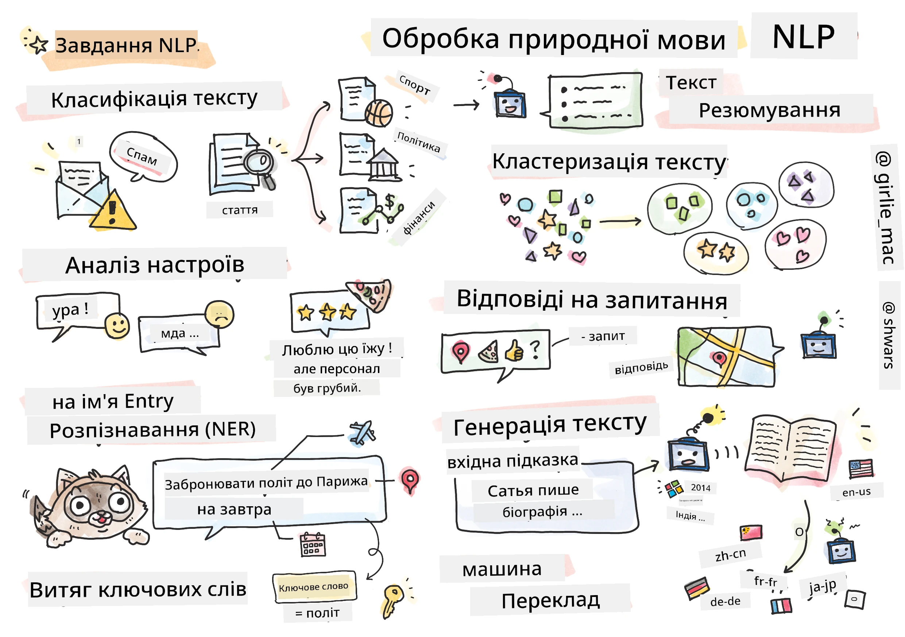

# Обробка природної мови



У цьому розділі ми зосередимося на використанні нейронних мереж для вирішення задач, пов'язаних із **обробкою природної мови (NLP)**. Існує багато проблем NLP, які ми хочемо, щоб комп'ютери могли вирішувати:

* **Класифікація тексту** — це типова задача класифікації, що стосується текстових послідовностей. Приклади включають класифікацію електронних листів як спам або не спам, або категоризацію статей як спорт, бізнес, політика тощо. Також, при розробці чат-ботів, нам часто потрібно зрозуміти, що користувач хотів сказати — у цьому випадку ми маємо справу з **класифікацією намірів**. У класифікації намірів часто доводиться працювати з багатьма категоріями.
* **Аналіз настроїв** — це типова задача регресії, де потрібно приписати числове значення (настрій), що відповідає тому, наскільки позитивним/негативним є значення речення. Більш просунута версія аналізу настроїв — це **аналіз настроїв на основі аспектів** (ABSA), де ми приписуємо настрій не всьому реченню, а його окремим частинам (аспектам), наприклад: *У цьому ресторані мені сподобалася кухня, але атмосфера була жахливою*.
* **Розпізнавання іменованих сутностей** (NER) стосується задачі вилучення певних сутностей із тексту. Наприклад, нам може знадобитися зрозуміти, що у фразі *Мені потрібно летіти до Парижа завтра* слово *завтра* означає ДАТУ, а *Париж* — ЛОКАЦІЮ.  
* **Виділення ключових слів** схоже на NER, але тут потрібно автоматично виділяти слова, важливі для значення речення, без попереднього навчання для конкретних типів сутностей.
* **Кластеризація тексту** може бути корисною, коли ми хочемо згрупувати схожі речення, наприклад, схожі запити в технічній підтримці.
* **Відповіді на запитання** стосуються здатності моделі відповідати на конкретне запитання. Модель отримує текстовий уривок і запитання як вхідні дані, і повинна надати місце в тексті, де міститься відповідь на запитання (або, іноді, згенерувати текст відповіді).
* **Генерація тексту** — це здатність моделі створювати новий текст. Це можна розглядати як задачу класифікації, яка прогнозує наступну літеру/слово на основі певного *текстового запиту*. Просунуті моделі генерації тексту, такі як GPT-3, здатні вирішувати інші задачі NLP, наприклад класифікацію, використовуючи техніку [програмування запитів](https://towardsdatascience.com/software-3-0-how-prompting-will-change-the-rules-of-the-game-a982fbfe1e0) або [інженерії запитів](https://medium.com/swlh/openai-gpt-3-and-prompt-engineering-dcdc2c5fcd29).
* **Резюмування тексту** — це техніка, коли ми хочемо, щоб комп'ютер "прочитав" довгий текст і підсумував його кількома реченнями.
* **Машинний переклад** можна розглядати як комбінацію розуміння тексту однією мовою та генерації тексту іншою.

Спочатку більшість задач NLP вирішувалися за допомогою традиційних методів, таких як граматики. Наприклад, у машинному перекладі використовувалися парсери для перетворення початкового речення у синтаксичне дерево, потім витягувалися семантичні структури вищого рівня для представлення значення речення, і на основі цього значення та граматики цільової мови генерувався результат. Сьогодні багато задач NLP ефективніше вирішуються за допомогою нейронних мереж.

> Багато класичних методів NLP реалізовані у Python-бібліотеці [Natural Language Processing Toolkit (NLTK)](https://www.nltk.org). Існує чудова [книга NLTK](https://www.nltk.org/book/), доступна онлайн, яка охоплює, як різні задачі NLP можна вирішувати за допомогою NLTK.

У нашому курсі ми здебільшого зосередимося на використанні нейронних мереж для NLP, і будемо використовувати NLTK за потреби.

Ми вже вивчили використання нейронних мереж для роботи з табличними даними та зображеннями. Основна відмінність між цими типами даних і текстом полягає в тому, що текст — це послідовність змінної довжини, тоді як розмір вхідних даних у випадку зображень відомий заздалегідь. Хоча згорткові мережі можуть витягувати шаблони з вхідних даних, шаблони в тексті є більш складними. Наприклад, заперечення може бути відокремлене від суб'єкта довільною кількістю слів (наприклад, *Мені не подобаються апельсини* проти *Мені не подобаються ті великі кольорові смачні апельсини*), і це все одно має інтерпретуватися як один шаблон. Таким чином, для обробки мови нам потрібно впроваджувати нові типи нейронних мереж, такі як *рекурентні мережі* та *трансформери*.

## Встановлення бібліотек

Якщо ви використовуєте локальну установку Python для запуску цього курсу, можливо, вам потрібно встановити всі необхідні бібліотеки для NLP за допомогою наступних команд:

**Для PyTorch**
```bash
pip install -r requirements-torch.txt
```
**Для TensorFlow**
```bash
pip install -r requirements-tf.txt
```

> Ви можете спробувати NLP з TensorFlow на [Microsoft Learn](https://docs.microsoft.com/learn/modules/intro-natural-language-processing-tensorflow/?WT.mc_id=academic-77998-cacaste)

## Попередження щодо GPU

У цьому розділі в деяких прикладах ми будемо навчати досить великі моделі.
* **Використовуйте комп'ютер із підтримкою GPU**: Рекомендується запускати ваші ноутбуки на комп'ютері з підтримкою GPU, щоб зменшити час очікування при роботі з великими моделями.
* **Обмеження пам'яті GPU**: Робота на GPU може призвести до ситуацій, коли пам'ять GPU закінчується, особливо при навчанні великих моделей.
* **Споживання пам'яті GPU**: Кількість пам'яті GPU, що споживається під час навчання, залежить від різних факторів, включаючи розмір мініпакету.
* **Мінімізуйте розмір мініпакету**: Якщо ви стикаєтеся з проблемами пам'яті GPU, розгляньте можливість зменшення розміру мініпакету у вашому коді як потенційне рішення.
* **Вивільнення пам'яті GPU у TensorFlow**: Старі версії TensorFlow можуть некоректно вивільняти пам'ять GPU при навчанні кількох моделей в одному ядрі Python. Щоб ефективно керувати використанням пам'яті GPU, ви можете налаштувати TensorFlow на виділення пам'яті GPU лише за потреби.
* **Включення коду**: Щоб налаштувати TensorFlow на зростання виділення пам'яті GPU лише за потреби, включіть наступний код у ваші ноутбуки:

```python
physical_devices = tf.config.list_physical_devices('GPU') 
if len(physical_devices)>0:
    tf.config.experimental.set_memory_growth(physical_devices[0], True) 
```

Якщо вас цікавить вивчення NLP з точки зору класичного ML, відвідайте [цей набір уроків](https://github.com/microsoft/ML-For-Beginners/tree/main/6-NLP)

## У цьому розділі
У цьому розділі ми навчимося:

* [Представлення тексту у вигляді тензорів](13-TextRep/README.md)
* [Вбудовування слів](14-Emdeddings/README.md)
* [Моделювання мови](15-LanguageModeling/README.md)
* [Рекурентні нейронні мережі](16-RNN/README.md)
* [Генеративні мережі](17-GenerativeNetworks/README.md)
* [Трансформери](18-Transformers/README.md)

**Відмова від відповідальності**:  
Цей документ було перекладено за допомогою сервісу автоматичного перекладу [Co-op Translator](https://github.com/Azure/co-op-translator). Хоча ми прагнемо до точності, звертаємо вашу увагу, що автоматичні переклади можуть містити помилки або неточності. Оригінальний документ мовою оригіналу слід вважати авторитетним джерелом. Для критично важливої інформації рекомендується професійний людський переклад. Ми не несемо відповідальності за будь-які непорозуміння або неправильні тлумачення, що виникли внаслідок використання цього перекладу.