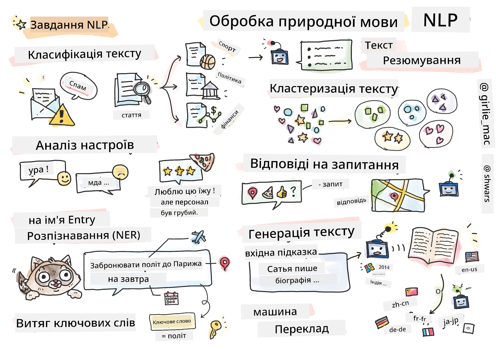

# Обробка природної мови



У цьому розділі ми зосередимося на використанні нейронних мереж для виконання завдань, пов’язаних із **Обробкою природної мови (NLP)**. Існує багато проблем NLP, які ми хочемо, щоб комп’ютери вміли розв’язувати:

* **Класифікація тексту** — типова задача класифікації, що стосується послідовностей тексту. Прикладами є класифікація електронних листів як спам або не спам, або категоризація статей як спорт, бізнес, політика тощо. Також при розробці чат-ботів часто необхідно зрозуміти, що користувач хотів сказати — у цьому випадку ми маємо справу з **класифікацією намірів**. Часто при класифікації намірів потрібно працювати з багатьма категоріями.
* **Аналіз настроїв** — типова задача регресії, де потрібно призначити число (настрій), що відповідає тому, наскільки позитивним чи негативним є сенс речення. Більш просунута версія аналізу настроїв — це **аналіз настроїв за аспектами** (ABSA), де настрій призначається не всьому реченню, а різним його частинам (аспектам), напр., *У цьому ресторані мені сподобалась кухня, але атмосфера була жахливою*.
* **Розпізнавання іменованих сутностей** (NER) стосується проблеми вилучення певних сутностей із тексту. Наприклад, потрібно зрозуміти, що у фразі *I need to fly to Paris tomorrow* слово *tomorrow* позначає ДАТУ, а *Paris* — МІСЦЕ.  
* **Виділення ключових слів** схоже на NER, але ми повинні автоматично вилучати слова, важливі для сенсу речення, без попереднього навчання для конкретних типів сутностей.
* **Кластеризація тексту** може бути корисною, коли ми хочемо групувати схожі речення, наприклад, схожі запити в технічній підтримці.
* **Відповіді на питання** — це здатність моделі відповідати на конкретне питання. Модель отримує на вхід текстовий уривок і питання, і має вказати місце в тексті, де міститься відповідь на питання (або іноді згенерувати текст відповіді).
* **Генерація тексту** — здатність моделі генерувати новий текст. Її можна вважати задачею класифікації, що передбачає наступну літеру/слово на основі певного *текстового підказки*. Просунуті моделі генерації тексту, такі як GPT-3, можуть розв’язувати й інші завдання NLP, як-от класифікацію, використовуючи техніку, що називається [prompt programming](https://towardsdatascience.com/software-3-0-how-prompting-will-change-the-rules-of-the-game-a982fbfe1e0) або [prompt engineering](https://medium.com/swlh/openai-gpt-3-and-prompt-engineering-dcdc2c5fcd29)
* **Текстове резюмування** — це техніка, коли ми хочемо, щоб комп’ютер «прочитав» великий текст і підсумував його в кількох реченнях.
* **Машинний переклад** можна розглядати як комбінацію розуміння тексту однією мовою та генерації тексту іншою мовою.

Спочатку більшість завдань NLP розв’язувалися за допомогою традиційних методів, таких як граматики. Наприклад, у машинному перекладі парсери використовувалися для перетворення початкового речення у синтаксичне дерево, потім витягувалися вищого рівня семантичні структури для представлення смислу речення, і на основі цього значення та граматики цільової мови генерувався результат. Сьогодні багато завдань NLP більш ефективно розв’язуються за допомогою нейронних мереж.

> Багато класичних методів NLP реалізовано в бібліотеці Python [Natural Language Processing Toolkit (NLTK)](https://www.nltk.org). Існує чудова [книга NLTK](https://www.nltk.org/book/), доступна онлайн, що охоплює, як різні завдання NLP можна розв’язати за допомогою NLTK.

У нашому курсі ми здебільшого зосередимось на використанні нейронних мереж для NLP і використовуватимемо NLTK за потребою.

Ми вже вивчали використання нейронних мереж для роботи з табличними даними та зображеннями. Основна відмінність між цими типами даних і текстом у тому, що текст — це послідовність змінної довжини, тоді як розмір вхідних даних у випадку зображень відомий наперед. Хоча згорткові мережі можуть витягувати патерни з вхідних даних, патерни в тексті складніші. Наприклад, заперечення може відділятися від підмета на багато слів (напр., *I do not like oranges* проти *I do not like those big colorful tasty oranges*), і все це має інтерпретуватись як один патерн. Тому для роботи з мовою потрібно вводити нові типи нейронних мереж, такі як *рекурентні мережі* і *трансформери*.

## Встановлення бібліотек

Якщо ви використовуєте локальну інсталяцію Python для проходження цього курсу, можливо, вам знадобиться встановити всі необхідні бібліотеки для NLP за допомогою таких команд:

**Для PyTorch**
```bash
pip install -r requirements-pytorch.txt
```
**Для TensorFlow**
```bash
pip install -r requirements-tf.txt
```

> Ви можете спробувати NLP з TensorFlow на [Microsoft Learn](https://docs.microsoft.com/learn/modules/intro-natural-language-processing-tensorflow/?WT.mc_id=academic-77998-cacaste)

## Попередження щодо GPU

У цьому розділі в деяких прикладах ми тренуватимемо досить великі моделі.
* **Використовуйте комп’ютер із підтримкою GPU**: рекомендовано запускати ваші ноутбуки на комп’ютері з підтримкою GPU, щоб зменшити час очікування при роботі з великими моделями.
* **Обмеження пам’яті GPU**: запуск на GPU може призводити до ситуацій, коли пам’яті GPU не вистачає, особливо при тренуванні великих моделей.
* **Використання пам’яті GPU**: обсяг пам’яті GPU, що використовується під час тренування, залежить від різних факторів, зокрема від розміру міні-пакету.
* **Зменшення розміру міні-пакету**: якщо ви стикаєтеся з проблемами пам’яті GPU, спробуйте зменшити розмір міні-пакету у вашому коді як потенційне рішення.
* **Звільнення пам’яті GPU в TensorFlow**: старі версії TensorFlow можуть некоректно звільняти пам’ять GPU під час тренування кількох моделей у одному ядрі Python. Щоб ефективно управляти використанням пам’яті GPU, можна налаштувати TensorFlow так, щоб він виділяв пам’ять GPU тільки за потребою.
* **Включення коду**: щоб налаштувати TensorFlow на поступове виділення пам’яті GPU, додайте в свої ноутбуки наступний код:

```python
physical_devices = tf.config.list_physical_devices('GPU') 
if len(physical_devices)>0:
    tf.config.experimental.set_memory_growth(physical_devices[0], True) 
```

Якщо ви зацікавлені у вивченні NLP з класичної перспективи машинного навчання, відвідайте [цей набір уроків](https://github.com/microsoft/ML-For-Beginners/tree/main/6-NLP)

## У цьому розділі
У цьому розділі ми вивчимо:

* [Подання тексту у вигляді тензорів](13-TextRep/README.md)
* [Векторне подання слів (Word Embeddings)](14-Embeddings/README.md)
* [Моделювання мови](15-LanguageModeling/README.md)
* [Рекурентні нейронні мережі](16-RNN/README.md)
* [Генеративні мережі](17-GenerativeNetworks/README.md)
* [Трансформери](18-Transformers/README.md)

---

<!-- CO-OP TRANSLATOR DISCLAIMER START -->
**Відмова від відповідальності**:
Цей документ було перекладено за допомогою сервісу штучного інтелекту для перекладу [Co-op Translator](https://github.com/Azure/co-op-translator). Хоча ми прагнемо до точності, будь ласка, майте на увазі, що автоматичні переклади можуть містити помилки або неточності. Оригінальний документ рідною мовою слід вважати авторитетним джерелом. Для критично важливої інформації рекомендується професійний людський переклад. Ми не несемо відповідальності за будь-які непорозуміння або неправильні тлумачення, що виникли внаслідок використання цього перекладу.
<!-- CO-OP TRANSLATOR DISCLAIMER END -->