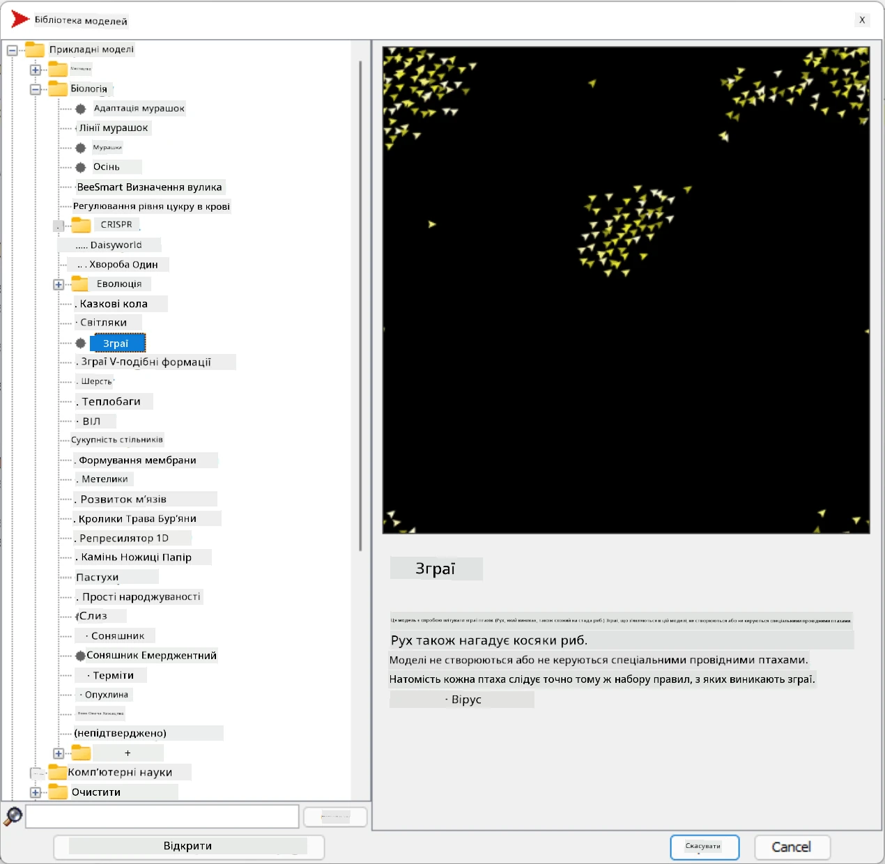
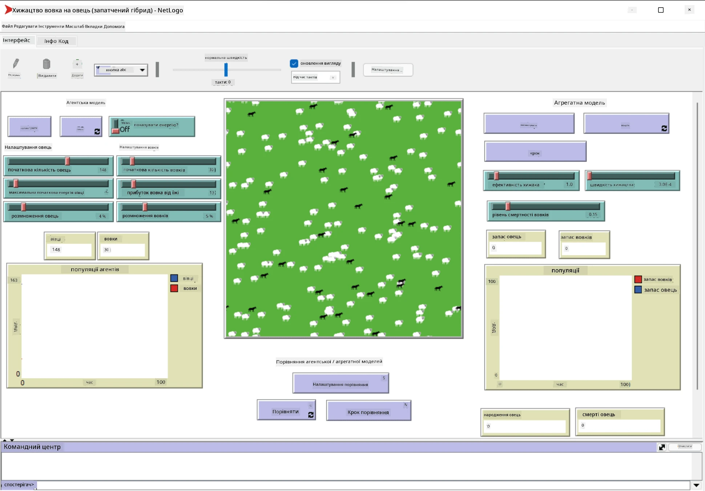

# Багатоагентні системи

Одним із можливих способів досягнення інтелекту є так званий **емергентний** (або **синергетичний**) підхід, який базується на тому, що комбінована поведінка багатьох відносно простих агентів може призвести до загальної більш складної (або інтелектуальної) поведінки системи в цілому. Теоретично це базується на принципах [Колективного інтелекту](https://en.wikipedia.org/wiki/Collective_intelligence), [Емерджентизму](https://en.wikipedia.org/wiki/Global_brain) та [Еволюційної кібернетики](https://en.wikipedia.org/wiki/Global_brain), які стверджують, що системи вищого рівня отримують певну додаткову цінність, коли вони правильно комбінуються з систем нижчого рівня (так званий *принцип переходу до метасистеми*).

## [Тест перед лекцією](https://ff-quizzes.netlify.app/en/ai/quiz/45)

Напрямок **багатоагентних систем** виник у сфері штучного інтелекту в 1990-х роках як відповідь на розвиток Інтернету та розподілених систем. Один із класичних підручників зі штучного інтелекту, [Artificial Intelligence: A Modern Approach](https://en.wikipedia.org/wiki/Artificial_Intelligence:_A_Modern_Approach), розглядає класичний штучний інтелект з точки зору багатоагентних систем.

Центральним поняттям багатоагентного підходу є **агент** — сутність, яка існує в певному **середовищі**, яке вона може сприймати та впливати на нього. Це дуже широке визначення, і існує багато різних типів і класифікацій агентів:

* За здатністю до мислення:
   - **Реактивні** агенти зазвичай мають просту поведінку типу запит-відповідь
   - **Деліберативні** агенти використовують певний вид логічного мислення та/або планування
* За місцем виконання коду агента:
   - **Статичні** агенти працюють на виділеному вузлі мережі
   - **Мобільні** агенти можуть переміщувати свій код між вузлами мережі
* За поведінкою:
   - **Пасивні агенти** не мають конкретних цілей. Такі агенти можуть реагувати на зовнішні стимули, але не ініціюють дії самостійно.
   - **Активні агенти** мають певні цілі, яких вони прагнуть
   - **Когнітивні агенти** включають складне планування та мислення

Багатоагентні системи сьогодні використовуються в ряді застосувань:

* У іграх багато персонажів, які не є гравцями, використовують певний вид штучного інтелекту і можуть вважатися інтелектуальними агентами
* У відеовиробництві рендеринг складних 3D-сцен, які включають натовпи, зазвичай виконується за допомогою багатоагентного моделювання
* У моделюванні систем багатоагентний підхід використовується для моделювання поведінки складної моделі. Наприклад, багатоагентний підхід успішно використовувався для прогнозування поширення COVID-19 у всьому світі. Подібний підхід можна використовувати для моделювання міського трафіку та аналізу його реакції на зміни правил дорожнього руху.
* У складних автоматизованих системах кожен пристрій може діяти як незалежний агент, що робить всю систему менш монолітною та більш стійкою.

Ми не будемо витрачати багато часу на глибоке вивчення багатоагентних систем, але розглянемо один приклад **багатоагентного моделювання**.

## NetLogo

[NetLogo](https://ccl.northwestern.edu/netlogo/) — це середовище для багатоагентного моделювання, засноване на модифікованій версії мови програмування [Logo](https://en.wikipedia.org/wiki/Logo_(programming_language)). Ця мова була розроблена для навчання дітей концепціям програмування, і вона дозволяє керувати агентом, який називається **черепашка**, що може рухатися, залишаючи слід. Це дозволяє створювати складні геометричні фігури, що є дуже наочним способом зрозуміти поведінку агента.

У NetLogo ми можемо створити багато черепашок за допомогою команди `create-turtles`. Потім ми можемо наказати всім черепашкам виконати певні дії (у прикладі нижче — рухатися вперед на 10 одиниць):

```
create-turtles 10
ask turtles [
  forward 10
]
```

Звісно, нецікаво, коли всі черепашки роблять одне й те саме, тому ми можемо `ask` групи черепашок, наприклад, тих, які знаходяться поблизу певної точки. Ми також можемо створювати черепашок різних *порід* за допомогою команди `breed [cats cat]`. Тут `cat` — це назва породи, і нам потрібно вказати як однину, так і множину, оскільки різні команди використовують різні форми для ясності.

> ✅ Ми не будемо вивчати саму мову NetLogo — ви можете відвідати чудовий ресурс [Beginner's Interactive NetLogo Dictionary](https://ccl.northwestern.edu/netlogo/bind/), якщо вас цікавить детальне навчання.

Ви можете [завантажити](https://ccl.northwestern.edu/netlogo/download.shtml) і встановити NetLogo, щоб спробувати його.

### Бібліотека моделей

Чудовою особливістю NetLogo є те, що він містить бібліотеку готових моделей, які ви можете спробувати. Перейдіть до **File &rightarrow; Models Library**, і у вас буде багато категорій моделей на вибір.



> Знімок екрана бібліотеки моделей від Дмитра Сошникова

Ви можете відкрити одну з моделей, наприклад **Biology &rightarrow; Flocking**.

### Основні принципи

Після відкриття моделі ви потрапляєте на головний екран NetLogo. Ось приклад моделі, яка описує популяцію вовків і овець за умови обмежених ресурсів (трави).



> Знімок екрана від Дмитра Сошникова

На цьому екрані ви можете побачити:

* Розділ **Interface**, який містить:
  - Основне поле, де живуть усі агенти
  - Різні елементи керування: кнопки, повзунки тощо
  - Графіки, які можна використовувати для відображення параметрів симуляції
* Вкладку **Code**, яка містить редактор, де ви можете писати програму NetLogo

У більшості випадків інтерфейс матиме кнопку **Setup**, яка ініціалізує стан симуляції, і кнопку **Go**, яка запускає виконання. Ці кнопки обробляються відповідними обробниками в коді, які виглядають так:

```
to go [
...
]
```

Світ NetLogo складається з таких об'єктів:

* **Агенти** (черепашки), які можуть переміщатися по полю та виконувати дії. Ви керуєте агентами за допомогою синтаксису `ask turtles [...]`, і код у дужках виконується всіма агентами в *режимі черепашки*.
* **Патчі** — це квадратні області поля, на яких живуть агенти. Ви можете звертатися до всіх агентів на одному патчі або змінювати кольори патчів та інші властивості. Ви також можете `ask patches` виконати певні дії.
* **Спостерігач** — це унікальний агент, який контролює світ. Усі обробники кнопок виконуються в *режимі спостерігача*.

> ✅ Краса багатоагентного середовища полягає в тому, що код, який виконується в режимі черепашки або патча, виконується одночасно всіма агентами паралельно. Таким чином, написавши невеликий код і запрограмувавши поведінку окремого агента, ви можете створити складну поведінку всієї симуляційної системи.

### Зграї

Як приклад багатоагентної поведінки, розглянемо **[зграї](https://en.wikipedia.org/wiki/Flocking_(behavior))**. Зграї — це складний патерн, який дуже схожий на те, як літають зграї птахів. Спостерігаючи за їх польотом, можна подумати, що вони слідують певному колективному алгоритму або мають якусь форму *колективного інтелекту*. Однак ця складна поведінка виникає, коли кожен окремий агент (у цьому випадку *птах*) лише спостерігає за іншими агентами на короткій відстані від себе та дотримується трьох простих правил:

* **Вирівнювання** — агент спрямовується до середнього напрямку сусідніх агентів
* **Згуртованість** — агент намагається спрямуватися до середньої позиції сусідів (*довготривале тяжіння*)
* **Розділення** — коли агент наближається до інших птахів, він намагається віддалитися (*короткотривале відштовхування*)

Ви можете запустити приклад зграї та спостерігати за поведінкою. Ви також можете налаштувати параметри, такі як *ступінь розділення* або *діапазон огляду*, який визначає, як далеко кожен птах може бачити. Зверніть увагу, що якщо ви зменшите діапазон огляду до 0, усі птахи стануть сліпими, і зграя припинить існування. Якщо ви зменшите розділення до 0, усі птахи зберуться в одну пряму лінію.

> ✅ Перейдіть до вкладки **Code** і подивіться, де три правила зграї (вирівнювання, згуртованість і розділення) реалізовані в коді. Зверніть увагу, як ми звертаємося лише до тих агентів, які знаходяться в полі зору.

### Інші моделі для перегляду

Є кілька цікавих моделей, які ви можете спробувати:

* **Art &rightarrow; Fireworks** показує, як феєрверк може бути розглянутий як колективна поведінка окремих потоків вогню
* **Social Science &rightarrow; Traffic Basic** і **Social Science &rightarrow; Traffic Grid** показують моделі міського трафіку в 1D і 2D сітці з або без світлофорів. Кожна машина в симуляції дотримується таких правил:
   - Якщо простір перед машиною порожній — прискорюватися (до певної максимальної швидкості)
   - Якщо бачить перешкоду попереду — гальмувати (і ви можете налаштувати, як далеко водій може бачити)
* **Social Science &rightarrow; Party** показує, як люди групуються під час коктейльної вечірки. Ви можете знайти комбінацію параметрів, яка призводить до найшвидшого збільшення щастя групи.

Як видно з цих прикладів, багатоагентні симуляції можуть бути досить корисним способом зрозуміти поведінку складної системи, що складається з індивідуальних елементів, які дотримуються однакової або схожої логіки. Це також може бути використано для управління віртуальними агентами, такими як [NPC](https://en.wikipedia.org/wiki/NPC) у комп'ютерних іграх або агентами в 3D-анімованих світах.

## Деліберативні агенти

Агенти, описані вище, дуже прості, вони реагують на зміни в середовищі, використовуючи певний алгоритм. Таким чином, вони є **реактивними агентами**. Однак іноді агенти можуть мислити та планувати свої дії, у цьому випадку їх називають **деліберативними**.

Типовим прикладом може бути персональний агент, який отримує інструкцію від людини забронювати тур для відпочинку. Припустимо, що в Інтернеті є багато агентів, які можуть допомогти йому. Він повинен зв’язатися з іншими агентами, щоб дізнатися, які рейси доступні, які ціни на готелі для різних дат, і спробувати домовитися про найкращу ціну. Коли план відпочинку буде завершений і підтверджений власником, він може перейти до бронювання.

Для цього агенти повинні **спілкуватися**. Для успішного спілкування їм потрібні:

* Деякі **стандартні мови для обміну знаннями**, такі як [Knowledge Interchange Format](https://en.wikipedia.org/wiki/Knowledge_Interchange_Format) (KIF) і [Knowledge Query and Manipulation Language](https://en.wikipedia.org/wiki/Knowledge_Query_and_Manipulation_Language) (KQML). Ці мови розроблені на основі [теорії мовленнєвих актів](https://en.wikipedia.org/wiki/Speech_act).
* Ці мови також повинні включати деякі **протоколи для переговорів**, засновані на різних **типах аукціонів**.
* **Спільна онтологія**, щоб агенти могли посилатися на однакові концепції, знаючи їх семантику
* Спосіб **виявлення**, що можуть робити різні агенти, також заснований на певному типі онтології

Деліберативні агенти набагато складніші, ніж реактивні, оскільки вони не тільки реагують на зміни в середовищі, але й повинні *ініціювати* дії. Однією з запропонованих архітектур для деліберативних агентів є так званий агент Віра-Бажання-Намір (BDI):

* **Вірування** формують набір знань про середовище агента. Це може бути структуровано як база знань або набір правил, які агент може застосувати до конкретної ситуації в середовищі.
* **Бажання** визначають, чого агент хоче досягти, тобто його цілі. Наприклад, мета персонального помічника, описаного вище, — забронювати тур, а мета агента готелю — максимізувати прибуток.
* **Наміри** — це конкретні дії, які агент планує виконати для досягнення своїх цілей. Дії зазвичай змінюють середовище та викликають спілкування з іншими агентами.

Існують деякі платформи для створення багатоагентних систем, такі як [JADE](https://jade.tilab.com/). [Ця стаття](https://arxiv.org/ftp/arxiv/papers/2007/2007.08961.pdf) містить огляд багатоагентних платформ разом із короткою історією багатоагентних систем і їх різними сценаріями використання.

## Висновок

Багатоагентні системи можуть набувати дуже різних форм і використовуватися в багатьох різних застосуваннях. 
Вони всі прагнуть зосередитися на простішій поведінці окремого агента та досягти більш складної поведінки всієї системи завдяки **синергетичному ефекту**.

## 🚀 Виклик

Перенесіть цей урок у реальний світ і спробуйте концептуалізувати багатоагентну систему, яка може вирішити проблему. Що, наприклад, повинна робити багатоагентна система, щоб оптимізувати маршрут шкільного автобуса? Як вона могла б працювати в пекарні?

## [Тест після лекції](https://ff-quizzes.netlify.app/en/ai/quiz/46)

## Огляд і самостійне навчання

Ознайомтеся з використанням цього типу систем у промисловості. Виберіть галузь, наприклад виробництво або індустрію відеоігор, і дізнайтеся, як багатоагентні системи можуть бути використані для вирішення унікальних проблем.

## [Завдання NetLogo](assignment.md)

---

