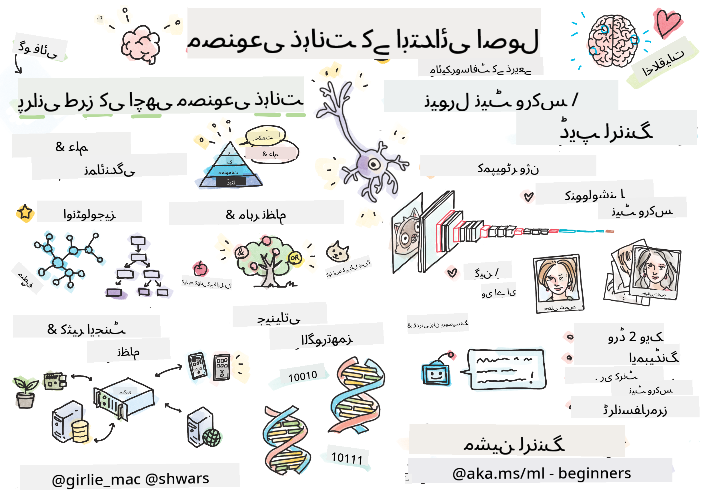

<!--
CO_OP_TRANSLATOR_METADATA:
{
  "original_hash": "0dc6311637b811abb415a936669d7e76",
  "translation_date": "2026-01-05T14:45:36+00:00",
  "source_file": "README.md",
  "language_code": "ur"
}
-->
[](https://github.com/microsoft/AI-For-Beginners/blob/main/LICENSE)
[](https://GitHub.com/microsoft/AI-For-Beginners/graphs/contributors/)
[](https://GitHub.com/microsoft/AI-For-Beginners/issues/)
[](https://GitHub.com/microsoft/AI-For-Beginners/pulls/)
[](http://makeapullrequest.com)

[](https://GitHub.com/microsoft/AI-For-Beginners/watchers/)
[](https://GitHub.com/microsoft/AI-For-Beginners/network/)
[](https://GitHub.com/microsoft/AI-For-Beginners/stargazers/)
[](https://mybinder.org/v2/gh/microsoft/ai-for-beginners/HEAD)
[](https://gitter.im/Microsoft/ai-for-beginners?utm_source=badge&utm_medium=badge&utm_campaign=pr-badge)

[](https://discord.gg/nTYy5BXMWG)

# مصنوعی ذہانت برائے مبتدی - ایک نصاب

||
|:---:|
| AI For Beginners - _سکیچ نوٹ بذریعہ [@girlie_mac](https://twitter.com/girlie_mac)_ |

**مصنوعی ذہانت** (AI) کی دنیا کو ہمارے 12 ہفتوں، 24 اسباق کے نصاب کے ساتھ دریافت کریں! اس میں عملی اسباق، کوئزز، اور لیبارٹری شامل ہیں۔ نصاب مبتدیوں کے لیے مناسب ہے اور TensorFlow اور PyTorch جیسے ٹولز کے ساتھ ساتھ AI میں اخلاقیات کا احاطہ کرتا ہے۔

### 🌐 کثیر زبان سپورٹ

#### GitHub ایکشن کے ذریعے سپورٹ شدہ (خودکار اور ہمیشہ تازہ ترین)

<!-- CO-OP TRANSLATOR LANGUAGES TABLE START -->
[Arabic](../ar/README.md) | [Bengali](../bn/README.md) | [Bulgarian](../bg/README.md) | [Burmese (Myanmar)](../my/README.md) | [Chinese (Simplified)](../zh/README.md) | [Chinese (Traditional, Hong Kong)](../hk/README.md) | [Chinese (Traditional, Macau)](../mo/README.md) | [Chinese (Traditional, Taiwan)](../tw/README.md) | [Croatian](../hr/README.md) | [Czech](../cs/README.md) | [Danish](../da/README.md) | [Dutch](../nl/README.md) | [Estonian](../et/README.md) | [Finnish](../fi/README.md) | [French](../fr/README.md) | [German](../de/README.md) | [Greek](../el/README.md) | [Hebrew](../he/README.md) | [Hindi](../hi/README.md) | [Hungarian](../hu/README.md) | [Indonesian](../id/README.md) | [Italian](../it/README.md) | [Japanese](../ja/README.md) | [Kannada](../kn/README.md) | [Korean](../ko/README.md) | [Lithuanian](../lt/README.md) | [Malay](../ms/README.md) | [Malayalam](../ml/README.md) | [Marathi](../mr/README.md) | [Nepali](../ne/README.md) | [Nigerian Pidgin](../pcm/README.md) | [Norwegian](../no/README.md) | [Persian (Farsi)](../fa/README.md) | [Polish](../pl/README.md) | [Portuguese (Brazil)](../br/README.md) | [Portuguese (Portugal)](../pt/README.md) | [Punjabi (Gurmukhi)](../pa/README.md) | [Romanian](../ro/README.md) | [Russian](../ru/README.md) | [Serbian (Cyrillic)](../sr/README.md) | [Slovak](../sk/README.md) | [Slovenian](../sl/README.md) | [Spanish](../es/README.md) | [Swahili](../sw/README.md) | [Swedish](../sv/README.md) | [Tagalog (Filipino)](../tl/README.md) | [Tamil](../ta/README.md) | [Telugu](../te/README.md) | [Thai](../th/README.md) | [Turkish](../tr/README.md) | [Ukrainian](../uk/README.md) | [Urdu](./README.md) | [Vietnamese](../vi/README.md)

> **مقامی طور پر کلون کرنا پسند کریں گے؟**

> یہ ذخیرہ 50+ زبانوں کے تراجم شامل کرتا ہے جو ڈاؤن لوڈ کے حجم میں نمایاں اضافہ کرتے ہیں۔ بغیر تراجم کے کلون کرنے کے لیے، sparse checkout استعمال کریں:
> ```bash
> git clone --filter=blob:none --sparse https://github.com/microsoft/AI-For-Beginners.git
> cd AI-For-Beginners
> git sparse-checkout set --no-cone '/*' '!translations' '!translated_images'
> ```
> اس سے آپ کو کورس مکمل کرنے کے لیے درکار ہر چیز مل جائے گی اور ڈاؤن لوڈ بھی بہت تیز ہو جائے گا۔
<!-- CO-OP TRANSLATOR LANGUAGES TABLE END -->

**اگر آپ چاہیں کہ اضافی ترجمہ زبانیں شامل کی جائیں تو وہ یہاں [listed](https://github.com/Azure/co-op-translator/blob/main/getting_started/supported-languages.md) دستیاب ہیں۔**

## کمیونٹی میں شامل ہوں
[](https://discord.gg/nTYy5BXMWG)

## آپ کیا سیکھیں گے

**[کورس کا مائنڈ میپ](http://soshnikov.com/courses/ai-for-beginners/mindmap.html)**

اس نصاب میں آپ سیکھیں گے:

* مصنوعی ذہانت کے مختلف طریقے، جن میں "پرانی اچھی" علامتی طریقہ کار شامل ہے جس میں **علم کی نمائندگی** اور دلیل شامل ہے ([GOFAI](https://en.wikipedia.org/wiki/Symbolic_artificial_intelligence))۔
* **نیورل نیٹ ورکس** اور **گہری تعلیم**، جو جدید AI کا مرکزی حصہ ہیں۔ ہم ان اہم موضوعات کے پیچھے کے تصورات کو دو مشہور فریم ورکس — [TensorFlow](http://Tensorflow.org) اور [PyTorch](http://pytorch.org) — میں کوڈ کے ذریعے واضح کریں گے۔
* تصویروں اور متون کے ساتھ کام کرنے کے لیے **نیورل آرکیٹیکچرز**۔ ہم حالیہ ماڈلز کا احاطہ کریں گے مگر جدید ترین کی سطح پر کچھ کمی ہو سکتی ہے۔
* کم مقبول AI طریقے، جیسے **جینیاتی الگورتھمز** اور **متعدد ایجنٹ سسٹمز**۔

اس نصاب میں ہم کیا شامل نہیں کریں گے:

> [اس کورس کے لیے تمام اضافی وسائل ہماری Microsoft Learn کلیکشن میں تلاش کریں](https://learn.microsoft.com/en-us/collections/7w28iy2xrqzdj0?WT.mc_id=academic-77998-bethanycheum)

* کاروبار میں **AI کے استعمال** کے کاروباری کیسز۔ اس کے لیے آپ Microsoft Learn پر [Introduction to AI for business users](https://docs.microsoft.com/learn/paths/introduction-ai-for-business-users/?WT.mc_id=academic-77998-bethanycheum) لرننگ پاتھ یا [AI Business School](https://www.microsoft.com/ai/ai-business-school/?WT.mc_id=academic-77998-bethanycheum) استعمال کر سکتے ہیں، جو [INSEAD](https://www.insead.edu/) کے تعاون سے تیار کیا گیا ہے۔
* **کلاسیکی مشین لرننگ**، جو ہمارے [Machine Learning for Beginners Curriculum](http://github.com/Microsoft/ML-for-Beginners) میں اچھی طرح بیان کی گئی ہے۔
* عملی AI ایپلیکیشنز جو **[Cognitive Services](https://azure.microsoft.com/services/cognitive-services/?WT.mc_id=academic-77998-bethanycheum)** کے استعمال سے بنائی گئی ہوں۔ اس کے لیے ہم تجویز کرتے ہیں کہ آپ Microsoft Learn کے ماڈیولز جیسے [vision](https://docs.microsoft.com/learn/paths/create-computer-vision-solutions-azure-cognitive-services/?WT.mc_id=academic-77998-bethanycheum)، [natural language processing](https://docs.microsoft.com/learn/paths/explore-natural-language-processing/?WT.mc_id=academic-77998-bethanycheum)، **[Generative AI with Azure OpenAI Service](https://learn.microsoft.com/en-us/training/paths/develop-ai-solutions-azure-openai/?WT.mc_id=academic-77998-bethanycheum)** وغیرہ سے شروع کریں۔
* مخصوص ML **کلاؤڈ فریم ورکس**، جیسے [Azure Machine Learning](https://azure.microsoft.com/services/machine-learning/?WT.mc_id=academic-77998-bethanycheum)، [Microsoft Fabric](https://learn.microsoft.com/en-us/training/paths/get-started-fabric/?WT.mc_id=academic-77998-bethanycheum)، یا [Azure Databricks](https://docs.microsoft.com/learn/paths/data-engineer-azure-databricks?WT.mc_id=academic-77998-bethanycheum)۔ آپ [Build and operate machine learning solutions with Azure Machine Learning](https://docs.microsoft.com/learn/paths/build-ai-solutions-with-azure-ml-service/?WT.mc_id=academic-77998-bethanycheum) اور [Build and Operate Machine Learning Solutions with Azure Databricks](https://docs.microsoft.com/learn/paths/build-operate-machine-learning-solutions-azure-databricks/?WT.mc_id=academic-77998-bethanycheum) لرننگ پاتھ استعمال کر سکتے ہیں۔
* **مکالماتی AI** اور **چیٹ بوٹس**۔ اس کے لیے ایک علیحدہ [Create conversational AI solutions](https://docs.microsoft.com/learn/paths/create-conversational-ai-solutions/?WT.mc_id=academic-77998-bethanycheum) لرننگ پاتھ موجود ہے اور آپ مزید تفصیل کے لیے [یہ بلاگ پوسٹ](https://soshnikov.com/azure/hello-bot-conversational-ai-on-microsoft-platform/) بھی دیکھ سکتے ہیں۔
* گہری تعلیم کے پیچھے کا **گہرا ریاضی**۔ اس کے لیے ہم Ian Goodfellow, Yoshua Bengio اور Aaron Courville کی کتاب [Deep Learning](https://www.amazon.com/Deep-Learning-Adaptive-Computation-Machine/dp/0262035618) کی سفارش کرتے ہیں، جو آن لائن بھی دستیاب ہے: [https://www.deeplearningbook.org/](https://www.deeplearningbook.org/)۔

اگر آپ _کلاؤڈ میں AI_ کے موضوعات کا نرمی سے تعارف چاہتے ہیں تو آپ [Get started with artificial intelligence on Azure](https://docs.microsoft.com/learn/paths/get-started-with-artificial-intelligence-on-azure/?WT.mc_id=academic-77998-bethanycheum) لرننگ پاتھ پر غور کر سکتے ہیں۔

# مواد

|     |                                                                 سبق کا لنک                                                                   |                                           PyTorch/Keras/TensorFlow                                          | تجربہ گاہ                                                            |
| :-: | :------------------------------------------------------------------------------------------------------------------------------------------: | :---------------------------------------------------------------------------------------------: | ------------------------------------------------------------------------------ |
| 0  |                                 [کورس سیٹ اپ](./lessons/0-course-setup/setup.md)                                 |                      [اپنا ڈیولپمنٹ ماحول ترتیب دیں](./lessons/0-course-setup/how-to-run.md)                       |   |
| I  |               [**مصنوعی ذہانت کا تعارف**](./lessons/1-Intro/README.md)      | | |
| 01  |       [مصنوعی ذہانت کا تعارف اور تاریخ](./lessons/1-Intro/README.md)       |           -                            | -  |
| II |              **علامتی AI**              |
| 02  |       [علم کی نمائندگی اور ماہر نظام](./lessons/2-Symbolic/README.md)       |            [ماہر نظام](./lessons/2-Symbolic/Animals.ipynb) /  [آنتولوجی](./lessons/2-Symbolic/FamilyOntology.ipynb) /[تصوری گراف](./lessons/2-Symbolic/MSConceptGraph.ipynb)                             |  |
| III |                        [**نیورل نیٹ ورکس کا تعارف**](./lessons/3-NeuralNetworks/README.md) |||
| 03  |                [پرسپٹرون](./lessons/3-NeuralNetworks/03-Perceptron/README.md)                 |                       [نوٹ بک](./lessons/3-NeuralNetworks/03-Perceptron/Perceptron.ipynb)                      | [لیب](./lessons/3-NeuralNetworks/03-Perceptron/lab/README.md) |
| 04  |                   [ملٹی لئیرڈ پرسپٹرون اور ہمارا اپنا فریم ورک بنانا](./lessons/3-NeuralNetworks/04-OwnFramework/README.md)                   |        [نوٹ بک](./lessons/3-NeuralNetworks/04-OwnFramework/OwnFramework.ipynb)        | [لیب](./lessons/3-NeuralNetworks/04-OwnFramework/lab/README.md) |
| 05  |            [فریم ورکس کا تعارف (PyTorch/TensorFlow) اور اوورفٹنگ](./lessons/3-NeuralNetworks/05-Frameworks/README.md)             |           [پائی ٹورچ](./lessons/3-NeuralNetworks/05-Frameworks/IntroPyTorch.ipynb) / [کیرس](./lessons/3-NeuralNetworks/05-Frameworks/IntroKeras.ipynb) / [ٹینسر فلو](./lessons/3-NeuralNetworks/05-Frameworks/IntroKerasTF.ipynb)             | [لیب](./lessons/3-NeuralNetworks/05-Frameworks/lab/README.md) |
| IV  |            [**کمپیوٹر وژن**](./lessons/4-ComputerVision/README.md)             | [پائی ٹورچ](https://docs.microsoft.com/learn/modules/intro-computer-vision-pytorch/?WT.mc_id=academic-77998-cacaste) / [ٹینسر فلو](https://docs.microsoft.com/learn/modules/intro-computer-vision-TensorFlow/?WT.mc_id=academic-77998-cacaste)| [مائیکروسافٹ ایژر پر کمپیوٹر وژن دریافت کریں](https://learn.microsoft.com/en-us/collections/7w28iy2xrqzdj0?WT.mc_id=academic-77998-bethanycheum) |
| 06  |            [کمپیوٹر وژن کا تعارف۔ اوپن سی وی](./lessons/4-ComputerVision/06-IntroCV/README.md)             |           [نوٹ بک](./lessons/4-ComputerVision/06-IntroCV/OpenCV.ipynb)         | [لیب](./lessons/4-ComputerVision/06-IntroCV/lab/README.md) |
| 07  |            [کنولوشنل نیورل نیٹ ورکس](./lessons/4-ComputerVision/07-ConvNets/README.md) &  [CNN فن تعمیر](./lessons/4-ComputerVision/07-ConvNets/CNN_Architectures.md)             |           [پائی ٹورچ](./lessons/4-ComputerVision/07-ConvNets/ConvNetsPyTorch.ipynb) /[ٹینسر فلو](./lessons/4-ComputerVision/07-ConvNets/ConvNetsTF.ipynb)             | [لیب](./lessons/4-ComputerVision/07-ConvNets/lab/README.md) |
| 08  |            [پری ٹرینڈ نیٹ ورکس اور ٹرانسفر لرننگ](./lessons/4-ComputerVision/08-TransferLearning/README.md) اور [ٹریننگ چالاکیاں](./lessons/4-ComputerVision/08-TransferLearning/TrainingTricks.md)             |           [پائی ٹورچ](./lessons/4-ComputerVision/08-TransferLearning/TransferLearningPyTorch.ipynb) / [ٹینسر فلو](./lessons/3-NeuralNetworks/05-Frameworks/IntroKerasTF.ipynb)             | [لیب](./lessons/4-ComputerVision/08-TransferLearning/lab/README.md) |
| 09  |            [آٹو انکوڈرز اور وی اے ایز](./lessons/4-ComputerVision/09-Autoencoders/README.md)             |           [پائی ٹورچ](./lessons/4-ComputerVision/09-Autoencoders/AutoEncodersPyTorch.ipynb) / [ٹینسر فلو](./lessons/4-ComputerVision/09-Autoencoders/AutoencodersTF.ipynb)             |  |
| 10  |            [جنریٹیو ایڈورسیریل نیٹ ورکس اور آرٹسٹک اسٹائل ٹرانسفر](./lessons/4-ComputerVision/10-GANs/README.md)             |           [پائی ٹورچ](./lessons/4-ComputerVision/10-GANs/GANPyTorch.ipynb) / [ٹینسر فلو](./lessons/4-ComputerVision/10-GANs/GANTF.ipynb)             |  |
| 11  |            [آبجیکٹ ڈیٹیکشن](./lessons/4-ComputerVision/11-ObjectDetection/README.md)             |         [ٹینسر فلو](./lessons/4-ComputerVision/11-ObjectDetection/ObjectDetection.ipynb)             | [لیب](./lessons/4-ComputerVision/11-ObjectDetection/lab/README.md) |
| 12  |            [سیمانٹک سیگمنٹیشن۔ یو-نیٹ](./lessons/4-ComputerVision/12-Segmentation/README.md)             |           [پائی ٹورچ](./lessons/4-ComputerVision/12-Segmentation/SemanticSegmentationPytorch.ipynb) / [ٹینسر فلو](./lessons/4-ComputerVision/12-Segmentation/SemanticSegmentationTF.ipynb)             |  |
| V  |            [**قدرتی زبان کی پروسیسنگ**](./lessons/5-NLP/README.md)             | [پائی ٹورچ](https://docs.microsoft.com/learn/modules/intro-natural-language-processing-pytorch/?WT.mc_id=academic-77998-cacaste) /[ٹینسر فلو](https://docs.microsoft.com/learn/modules/intro-natural-language-processing-TensorFlow/?WT.mc_id=academic-77998-cacaste) | [مائیکروسافٹ ایژر پر قدرتی زبان کی پروسیسنگ دریافت کریں](https://learn.microsoft.com/en-us/collections/7w28iy2xrqzdj0?WT.mc_id=academic-77998-bethanycheum)|
| 13  |            [متن کی نمائندگی۔ باؤ/ٹی ایف-آئی ڈی ایف](./lessons/5-NLP/13-TextRep/README.md)             |           [پائی ٹورچ](https://github.com/microsoft/AI-For-Beginners/blob/main/lessons/5-NLP/13-TextRep/TextRepresentationPyTorch.ipynb) / [ٹینسر فلو](https://github.com/microsoft/AI-For-Beginners/blob/main/lessons/5-NLP/13-TextRep/TextRepresentationTF.ipynb)             | |
| 14  |            [سیمانٹک ورڈ ایمبیڈنگز۔ ورڈ2ویک اور گلوو](./lessons/5-NLP/14-Embeddings/README.md)             |           [پائی ٹورچ](https://github.com/microsoft/AI-For-Beginners/blob/main/lessons/5-NLP/14-Embeddings/EmbeddingsPyTorch.ipynb) / [ٹینسر فلو](https://github.com/microsoft/AI-For-Beginners/blob/main/lessons/5-NLP/14-Embeddings/EmbeddingsTF.ipynb)             |  |
| 15  |            [زبان کی ماڈلنگ۔ اپنی امبیڈنگز ٹرین کریں](./lessons/5-NLP/15-LanguageModeling/README.md)             |           [پائی ٹورچ](https://github.com/microsoft/AI-For-Beginners/blob/main/lessons/5-NLP/15-LanguageModeling/CBoW-PyTorch.ipynb) / [ٹینسر فلو](https://github.com/microsoft/AI-For-Beginners/blob/main/lessons/5-NLP/15-LanguageModeling/CBoW-TF.ipynb)             | [لیب](./lessons/5-NLP/15-LanguageModeling/lab/README.md) |
| 16  |            [ریکرنٹ نیورل نیٹ ورکس](./lessons/5-NLP/16-RNN/README.md)             |           [پائی ٹورچ](https://github.com/microsoft/AI-For-Beginners/blob/main/lessons/5-NLP/16-RNN/RNNPyTorch.ipynb) / [ٹینسر فلو](https://github.com/microsoft/AI-For-Beginners/blob/main/lessons/5-NLP/16-RNN/RNNTF.ipynb)             |  |
| 17  |            [جنریٹیو ریکرنٹ نیٹ ورکس](./lessons/5-NLP/17-GenerativeNetworks/README.md)             |           [پائی ٹورچ](https://github.com/microsoft/AI-For-Beginners/blob/main/lessons/5-NLP/17-GenerativeNetworks/GenerativePyTorch.ipynb) / [ٹینسر فلو](https://github.com/microsoft/AI-For-Beginners/blob/main/lessons/5-NLP/17-GenerativeNetworks/GenerativeTF.ipynb)             | [لیب](./lessons/5-NLP/17-GenerativeNetworks/lab/README.md) |
| 18  |            [ٹرانسفارمرز۔ برٹ۔](./lessons/5-NLP/18-Transformers/README.md)             |           [پائی ٹورچ](https://github.com/microsoft/AI-For-Beginners/blob/main/lessons/5-NLP/18-Transformers/TransformersPyTorch.ipynb) /[ٹینسر فلو](https://github.com/microsoft/AI-For-Beginners/blob/main/lessons/5-NLP/18-Transformers/TransformersTF.ipynb)             |  |
| 19  |            [نامزد اکائی کی پہچان](./lessons/5-NLP/19-NER/README.md)             |           [ٹینسر فلو](https://microsoft.github.io/AI-For-Beginners/lessons/5-NLP/19-NER/NER-TF.ipynb)             | [لیب](./lessons/5-NLP/19-NER/lab/README.md) |
| 20  |            [بڑے زبان کے ماڈلز، پرامپٹ پروگرامنگ اور چند شاٹس کے کام](./lessons/5-NLP/20-LangModels/README.md)             |           [پائی ٹورچ](https://microsoft.github.io/AI-For-Beginners/lessons/5-NLP/20-LangModels/GPT-PyTorch.ipynb) | |
| VI |            **دیگر AI تکنیکیں** || |
| 21  |            [جینیاتی الگورتھمز](./lessons/6-Other/21-GeneticAlgorithms/README.md)             |           [نوٹ بک](./lessons/6-Other/21-GeneticAlgorithms/Genetic.ipynb) | |
| 22  |            [گہری تقویتی تعلیم](./lessons/6-Other/22-DeepRL/README.md)             |           [پائی ٹورچ](./lessons/6-Other/22-DeepRL/CartPole-RL-PyTorch.ipynb) /[ٹینسر فلو](./lessons/6-Other/22-DeepRL/CartPole-RL-TF.ipynb)             | [لیب](./lessons/6-Other/22-DeepRL/lab/README.md) |
| 23  |            [کئی ایجنٹ سسٹمز](./lessons/6-Other/23-MultiagentSystems/README.md)             |  | |
| VII |            **AI اخلاقیات** | | |
| 24  |            [AI اخلاقیات اور ذمہ دار AI](./lessons/7-Ethics/README.md)             |           [مائیکروسافٹ لرن: ذمہ دار AI اصول](https://docs.microsoft.com/learn/paths/responsible-ai-business-principles/?WT.mc_id=academic-77998-cacaste) | |
| IX  |            **اضافی مواد** | | |
| 25  |            [کثیر الوضع نیٹ ورکس، کلپ اور وی کیو جی اے این](./lessons/X-Extras/X1-MultiModal/README.md)             |           [نوٹ بک](./lessons/X-Extras/X1-MultiModal/Clip.ipynb)    | |

## ہر سبق میں شامل ہے

* قبل از مطالعہ مواد
* قابل عمل جوپیٹر نوٹ بکس، جو اکثر مخصوص فریم ورک (**پائی ٹورچ** یا **ٹینسر فلو**) کے لیے ہوتے ہیں۔ قابل عمل نوٹ بک میں بہت سا نظریاتی مواد بھی ہوتا ہے، اس لیے موضوع کو سمجھنے کے لیے آپ کو کم از کم نوٹ بک کا ایک ورژن دیکھنا ضروری ہے (چاہے وہ پائی ٹورچ ہو یا ٹینسر فلو)۔
* کچھ موضوعات کے لیے **لیبز** دستیاب ہیں، جو آپ کو سیکھی ہوئی مواد کو کسی مخصوص مسئلے پر آزمانے کا موقع دیتے ہیں۔
* کچھ حصوں میں متعلقہ موضوعات کا احاطہ کرنے والے [**MS Learn**](https://learn.microsoft.com/en-us/collections/7w28iy2xrqzdj0?WT.mc_id=academic-77998-bethanycheum) ماڈیول کے لنکس شامل ہیں۔

## شروع کریں

### 🎯 AI میں نیا ہیں؟ یہاں سے شروع کریں!

اگر آپ مکمل طور پر AI میں نئے ہیں اور فوری، عملی مثالیں چاہتے ہیں، تو ہمارے [**ابتدائی دوستانہ مثالیں**](./examples/README.md) دیکھیں! ان میں شامل ہیں:

- 🌟 **ہیلو AI ورلڈ** - آپ کا پہلا AI پروگرام (پیٹرن کی پہچان)
- 🧠 **سادہ نیورل نیٹ ورک** - نیورل نیٹ ورک شروع سے بنائیں  
- 🖼️ **تصویری درجہ بندی کرنے والا** - تصاویر کی درجہ بندی تفصیلی تبصروں کے ساتھ
- 💬 **متن کا جذباتی تجزیہ** - مثبت/منفی متن کا تجزیہ کریں

یہ مثالیں آپ کو مکمل نصاب میں شامل ہونے سے پہلے AI تصورات کو سمجھنے میں مدد دینے کے لیے تیار کی گئی ہیں۔

### 📚 مکمل نصاب کی ترتیب

- ہم نے آپ کے ترقیاتی ماحول کو سیٹ اپ کرنے میں مدد کے لیے ایک [سیٹ اپ سبق](./lessons/0-course-setup/setup.md) بنایا ہے۔ - اساتذہ کے لیے بھی ہم نے ایک [نصاب سیٹ اپ سبق](./lessons/0-course-setup/for-teachers.md) بنایا ہے!
- VSCode یا Codepace میں [کوڈ کیسے چلائیں](./lessons/0-course-setup/how-to-run.md)

یہ اقدامات کریں:

ریزپوزٹری کو فورک کریں: اس صفحہ کے اوپری دائیں کونے میں "Fork" بٹن پر کلک کریں۔

ریزپوزٹری کلون کریں: `git clone https://github.com/microsoft/AI-For-Beginners.git`

اس رپو کو بعد میں آسانی سے تلاش کرنے کے لیے اس پر ستارہ (🌟) لگانا نہ بھولیں۔

## دوسرے سیکھنے والوں سے ملیں

دوسرے سیکھنے والوں سے ملاقات اور رابطہ کے لیے ہمارے [سرکاری AI Discord سرور](https://aka.ms/genai-discord?WT.mc_id=academic-105485-bethanycheum) میں شامل ہوں جو یہ کورس کر رہے ہیں اور مدد حاصل کریں۔

اگر آپ کے پاس پروڈکٹ فیڈبیک یا سوالات ہیں تو ہمارے [Azure AI Foundry Developer Forum](https://aka.ms/foundry/forum) پر جائیں۔

## کوئزز

> **کوئزز کے بارے میں نوٹ**: تمام کوئزز Quiz-app فولڈر میں etc\quiz-app میں موجود ہیں، یا [آن لائن یہاں](https://ff-quizzes.netlify.app/) یہ اسباق میں لنک کیے گئے ہیں۔ کوئز ایپ کو لوکل چلایا جا سکتا ہے یا Azure پر ڈیپلائے کیا جا سکتا ہے؛ `quiz-app` فولڈر میں ہدایات پر عمل کریں۔ انہیں آہستہ آہستہ مقامی زبانوں میں ڈھالا جا رہا ہے۔

## مدد درکار ہے

کیا آپ کے پاس تجاویز ہیں یا کوئی املا یا کوڈ کی غلطیاں ملی ہیں؟ مسئلہ اٹھائیں یا پل ریکویسٹ بنائیں۔

## خصوصی شکریہ

* **✍️ بنیادی مصنف:** [Dmitry Soshnikov](http://soshnikov.com)، پی ایچ ڈی  
* **🔥 ایڈیٹر:** [Jen Looper](https://twitter.com/jenlooper)، پی ایچ ڈی  
* **🎨 سکیچ نوٹ مصور:** [Tomomi Imura](https://twitter.com/girlie_mac)  
* **✅ کوئز بنانے والا:** [Lateefah Bello](https://github.com/CinnamonXI)، [MLSA](https://studentambassadors.microsoft.com/)  
* **🙏 بنیادی شراکت دار:** [Evgenii Pishchik](https://github.com/Pe4enIks)

## دیگر نصاب

ہماری ٹیم دوسرے نصاب بھی تیار کرتی ہے! دیکھیں:

<!-- CO-OP TRANSLATOR OTHER COURSES START -->
### لینگ چین
[](https://aka.ms/langchain4j-for-beginners)
[](https://aka.ms/langchainjs-for-beginners?WT.mc_id=m365-94501-dwahlin)

---

### Azure / Edge / MCP / ایجنٹس
[](https://github.com/microsoft/AZD-for-beginners?WT.mc_id=academic-105485-koreyst)
[](https://github.com/microsoft/edgeai-for-beginners?WT.mc_id=academic-105485-koreyst)
[](https://github.com/microsoft/mcp-for-beginners?WT.mc_id=academic-105485-koreyst)
[](https://github.com/microsoft/ai-agents-for-beginners?WT.mc_id=academic-105485-koreyst)

---
 
### جنرٹیو AI سیریز
[](https://github.com/microsoft/generative-ai-for-beginners?WT.mc_id=academic-105485-koreyst)
[-9333EA?style=for-the-badge&labelColor=E5E7EB&color=9333EA)](https://github.com/microsoft/Generative-AI-for-beginners-dotnet?WT.mc_id=academic-105485-koreyst)
[-C084FC?style=for-the-badge&labelColor=E5E7EB&color=C084FC)](https://github.com/microsoft/generative-ai-for-beginners-java?WT.mc_id=academic-105485-koreyst)
[-E879F9?style=for-the-badge&labelColor=E5E7EB&color=E879F9)](https://github.com/microsoft/generative-ai-with-javascript?WT.mc_id=academic-105485-koreyst)

---
 
### بنیادی تعلیم
[](https://aka.ms/ml-beginners?WT.mc_id=academic-105485-koreyst)
[](https://aka.ms/datascience-beginners?WT.mc_id=academic-105485-koreyst)
[](https://aka.ms/ai-beginners?WT.mc_id=academic-105485-koreyst)
[](https://github.com/microsoft/Security-101?WT.mc_id=academic-96948-sayoung)
[](https://aka.ms/webdev-beginners?WT.mc_id=academic-105485-koreyst)
[](https://aka.ms/iot-beginners?WT.mc_id=academic-105485-koreyst)
[](https://github.com/microsoft/xr-development-for-beginners?WT.mc_id=academic-105485-koreyst)

---
 
### کوپائلٹ سیریز
[](https://aka.ms/GitHubCopilotAI?WT.mc_id=academic-105485-koreyst)
[](https://github.com/microsoft/mastering-github-copilot-for-dotnet-csharp-developers?WT.mc_id=academic-105485-koreyst)
[](https://github.com/microsoft/CopilotAdventures?WT.mc_id=academic-105485-koreyst)
<!-- CO-OP TRANSLATOR OTHER COURSES END -->

## مدد حاصل کرنا

اگر آپ پھنس جائیں یا AI ایپس بنانے کے دوران کوئی سوال ہو۔ MCP پر ساتھی سیکھنے والوں اور تجربہ کار ڈیولپرز کے ساتھ بحث میں شامل ہوں۔ یہ ایک معاون کمیونٹی ہے جہاں سوالات کا خیرمقدم کیا جاتا ہے اور علم آزادانہ طور پر بانٹا جاتا ہے۔

[](https://discord.gg/nTYy5BXMWG)

اگر آپ کے پاس پروڈکٹ فیڈبیک یا تعمیر کے دوران غلطیاں ہوں تو ملاحظہ کریں:

[](https://aka.ms/foundry/forum)

---

<!-- CO-OP TRANSLATOR DISCLAIMER START -->
**دستخطی دستبرداری**:
یہ دستاویز AI ترجمہ سروس [Co-op Translator](https://github.com/Azure/co-op-translator) کے ذریعے ترجمہ کی گئی ہے۔ اگرچہ ہم درستگی کی کوشش کرتے ہیں، براہ کرم یہ ذہن میں رکھیں کہ خودکار تراجم میں غلطیاں یا عدم درستیاں ہو سکتی ہیں۔ اصل دستاویز اپنی مادری زبان میں معتبر ماخذ سمجھی جانی چاہیے۔ اہم معلومات کے لیے پیشہ ور انسانی ترجمہ تجویز کیا جاتا ہے۔ اس ترجمے کے استعمال سے پیدا ہونے والی کسی بھی غلط فہمی یا غلط تشریح کی ذمہ داری ہم پر نہیں ہوگی۔
<!-- CO-OP TRANSLATOR DISCLAIMER END -->