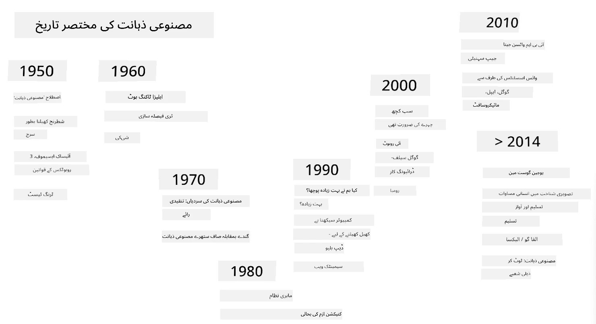

# مصنوعی ذہانت کا تعارف

> خاکہ: [Tomomi Imura](https://twitter.com/girlie_mac)

## [لیکچر سے پہلے کا کوئز](https://ff-quizzes.netlify.app/en/ai/quiz/1)

**مصنوعی ذہانت** ایک دلچسپ سائنسی شعبہ ہے جو یہ مطالعہ کرتا ہے کہ ہم کمپیوٹرز کو ذہین رویہ ظاہر کرنے کے قابل کیسے بنا سکتے ہیں، مثلاً وہ کام کرنا جو انسان بخوبی انجام دے سکتے ہیں۔

ابتدائی طور پر، کمپیوٹرز کو [چارلس بیبج](https://en.wikipedia.org/wiki/Charles_Babbage) نے اعداد پر ایک واضح طریقہ کار کے تحت کام کرنے کے لیے ایجاد کیا تھا - ایک الگورتھم۔ جدید کمپیوٹرز، اگرچہ انیسویں صدی میں پیش کیے گئے اصل ماڈل سے کہیں زیادہ ترقی یافتہ ہیں، پھر بھی کنٹرول شدہ حسابات کے اسی خیال پر عمل کرتے ہیں۔ اس لیے، اگر ہمیں وہ درست مراحل معلوم ہوں جو کسی مقصد کو حاصل کرنے کے لیے ضروری ہیں، تو کمپیوٹر کو پروگرام کرنا ممکن ہے۔

> تصویر: [Vickie Soshnikova](http://twitter.com/vickievalerie)

> ✅ کسی شخص کی تصویر سے اس کی عمر کا تعین کرنا ایک ایسا کام ہے جسے واضح طور پر پروگرام نہیں کیا جا سکتا، کیونکہ ہمیں یہ معلوم نہیں کہ ہم اپنے ذہن میں یہ نمبر کیسے نکالتے ہیں۔

---

تاہم، کچھ کام ایسے ہیں جنہیں ہم واضح طور پر حل کرنے کا طریقہ نہیں جانتے۔ مثال کے طور پر، کسی شخص کی تصویر سے اس کی عمر کا تعین کرنا۔ ہم یہ کرنا سیکھ لیتے ہیں کیونکہ ہم نے مختلف عمروں کے لوگوں کی بہت سی مثالیں دیکھی ہوتی ہیں، لیکن ہم واضح طور پر یہ نہیں بتا سکتے کہ ہم یہ کیسے کرتے ہیں، اور نہ ہی ہم کمپیوٹر کو یہ کرنے کے لیے پروگرام کر سکتے ہیں۔ یہی وہ قسم کے کام ہیں جو **مصنوعی ذہانت** (مختصراً AI) کے لیے دلچسپی کا باعث ہیں۔

✅ ان کاموں کے بارے میں سوچیں جو آپ کمپیوٹر کو سونپ سکتے ہیں اور جو AI سے فائدہ اٹھا سکتے ہیں۔ مالیات، طب، اور فنون کے شعبوں پر غور کریں - آج یہ شعبے AI سے کیسے فائدہ اٹھا رہے ہیں؟

## کمزور AI بمقابلہ مضبوط AI

کمزور AI | مضبوط AI
---------------------------------------|-------------------------------------
کمزور AI ان نظاموں کو کہتے ہیں جو کسی خاص کام یا محدود کاموں کے لیے ڈیزائن اور تربیت یافتہ ہوتے ہیں۔| مضبوط AI، یا مصنوعی عمومی ذہانت (AGI)، ان نظاموں کو کہتے ہیں جو انسانی سطح کی ذہانت اور سمجھ بوجھ رکھتے ہیں۔
یہ AI نظام عمومی طور پر ذہین نہیں ہوتے؛ یہ کسی پہلے سے طے شدہ کام میں مہارت رکھتے ہیں لیکن حقیقی سمجھ بوجھ یا شعور سے محروم ہوتے ہیں۔| یہ AI نظام کسی بھی ذہنی کام کو انجام دینے، مختلف شعبوں میں ڈھلنے، اور شعور یا خود آگاہی کی ایک شکل رکھنے کی صلاحیت رکھتے ہیں۔
کمزور AI کی مثالوں میں ورچوئل اسسٹنٹس جیسے Siri یا Alexa، اسٹریمنگ سروسز کے تجویزاتی الگورتھمز، اور مخصوص کسٹمر سروس کے لیے ڈیزائن کردہ چیٹ بوٹس شامل ہیں۔| مضبوط AI کا حصول AI تحقیق کا ایک طویل مدتی مقصد ہے اور اس کے لیے ایسے AI نظاموں کی ترقی کی ضرورت ہوگی جو مختلف کاموں اور سیاق و سباق میں استدلال، سیکھنے، سمجھنے، اور ڈھلنے کی صلاحیت رکھتے ہوں۔
کمزور AI انتہائی مخصوص ہوتا ہے اور اس کے پاس انسانی جیسی علمی صلاحیتیں یا عمومی مسئلہ حل کرنے کی صلاحیتیں نہیں ہوتیں۔| مضبوط AI فی الحال ایک نظریاتی تصور ہے، اور کوئی بھی AI نظام اس سطح کی عمومی ذہانت تک نہیں پہنچا ہے۔

مزید معلومات کے لیے **[مصنوعی عمومی ذہانت](https://en.wikipedia.org/wiki/Artificial_general_intelligence)** (AGI) کا حوالہ دیں۔

## ذہانت کی تعریف اور ٹورنگ ٹیسٹ

**[ذہانت](https://en.wikipedia.org/wiki/Intelligence)** کی اصطلاح سے نمٹنے میں ایک مسئلہ یہ ہے کہ اس کی کوئی واضح تعریف نہیں ہے۔ کوئی یہ دلیل دے سکتا ہے کہ ذہانت کا تعلق **تجریدی سوچ** یا **خود آگاہی** سے ہے، لیکن ہم اسے مناسب طریقے سے بیان نہیں کر سکتے۔

> [تصویر](https://unsplash.com/photos/75715CVEJhI) از [Amber Kipp](https://unsplash.com/@sadmax) Unsplash سے

ذہانت کی اصطلاح کی مبہمیت کو دیکھنے کے لیے، اس سوال کا جواب دینے کی کوشش کریں: "کیا بلی ذہین ہے؟" مختلف لوگ اس سوال کے مختلف جوابات دینے کا رجحان رکھتے ہیں، کیونکہ اس دعوے کو سچ یا غلط ثابت کرنے کے لیے کوئی عالمی طور پر قبول شدہ ٹیسٹ موجود نہیں ہے۔ اور اگر آپ سمجھتے ہیں کہ ایسا کوئی ٹیسٹ ہے - تو اپنی بلی کو IQ ٹیسٹ سے گزار کر دیکھیں...

✅ ایک منٹ کے لیے سوچیں کہ آپ ذہانت کو کیسے بیان کرتے ہیں۔ کیا وہ کوا جو بھول بھلیاں حل کر کے کھانے تک پہنچتا ہے ذہین ہے؟ کیا ایک بچہ ذہین ہے؟

---

جب AGI کی بات کی جائے تو ہمیں یہ جانچنے کا کوئی طریقہ ہونا چاہیے کہ آیا ہم نے واقعی ایک ذہین نظام تخلیق کیا ہے۔ [ایلن ٹورنگ](https://en.wikipedia.org/wiki/Alan_Turing) نے ایک طریقہ تجویز کیا جسے **[ٹورنگ ٹیسٹ](https://en.wikipedia.org/wiki/Turing_test)** کہا جاتا ہے، جو ذہانت کی تعریف کے طور پر بھی کام کرتا ہے۔ یہ ٹیسٹ کسی دیے گئے نظام کا موازنہ کسی فطری طور پر ذہین چیز - ایک حقیقی انسان - سے کرتا ہے، اور چونکہ کوئی بھی خودکار موازنہ کمپیوٹر پروگرام کے ذریعے نظرانداز کیا جا سکتا ہے، ہم ایک انسانی انٹروگیٹر کا استعمال کرتے ہیں۔ لہٰذا، اگر ایک انسان متن پر مبنی مکالمے میں ایک حقیقی شخص اور کمپیوٹر نظام کے درمیان فرق کرنے سے قاصر ہو - تو اس نظام کو ذہین سمجھا جاتا ہے۔

> ایک چیٹ بوٹ [Eugene Goostman](https://en.wikipedia.org/wiki/Eugene_Goostman)، جو سینٹ پیٹرزبرگ میں تیار کیا گیا، نے 2014 میں ٹورنگ ٹیسٹ پاس کرنے کے قریب پہنچ کر ایک چالاک شخصیت کا حربہ استعمال کیا۔ اس نے پہلے ہی اعلان کر دیا کہ وہ ایک 13 سالہ یوکرینی لڑکا ہے، جو علم کی کمی اور متن میں کچھ تضادات کی وضاحت کرے گا۔ بوٹ نے 30% ججوں کو قائل کر لیا کہ وہ ایک انسان ہے، ایک میٹرک جس کے بارے میں ٹورنگ کا خیال تھا کہ ایک مشین 2000 تک پاس کر لے گی۔ تاہم، یہ سمجھنا ضروری ہے کہ اس کا مطلب یہ نہیں کہ ہم نے ایک ذہین نظام تخلیق کیا ہے، یا کہ کمپیوٹر نظام نے انسانی انٹروگیٹر کو دھوکہ دیا ہے - نظام نے انسانوں کو دھوکہ نہیں دیا، بلکہ بوٹ کے تخلیق کاروں نے کیا!

✅ کیا آپ کبھی کسی چیٹ بوٹ کے ذریعے دھوکہ کھا گئے ہیں کہ آپ کسی انسان سے بات کر رہے ہیں؟ اس نے آپ کو کیسے قائل کیا؟

## AI کے مختلف طریقے

اگر ہم چاہتے ہیں کہ کمپیوٹر انسان کی طرح برتاؤ کرے، تو ہمیں کسی طرح کمپیوٹر کے اندر ہماری سوچنے کے طریقے کو ماڈل کرنا ہوگا۔ نتیجتاً، ہمیں یہ سمجھنے کی کوشش کرنی ہوگی کہ انسان کو ذہین کیا بناتا ہے۔

> مشین میں ذہانت پروگرام کرنے کے قابل ہونے کے لیے، ہمیں یہ سمجھنے کی ضرورت ہے کہ ہمارے اپنے فیصلے کرنے کے عمل کیسے کام کرتے ہیں۔ اگر آپ تھوڑی سی خود شناسی کریں، تو آپ کو احساس ہوگا کہ کچھ عمل لاشعوری طور پر ہوتے ہیں – مثلاً ہم بلی اور کتے میں فرق کر سکتے ہیں بغیر سوچے سمجھے - جبکہ کچھ دیگر عمل استدلال پر مبنی ہوتے ہیں۔

اس مسئلے کے دو ممکنہ طریقے ہیں:

ٹاپ ڈاؤن اپروچ (علامتی استدلال) | باٹم اپ اپروچ (نیورل نیٹ ورکس)
---------------------------------------|-------------------------------------
ٹاپ ڈاؤن اپروچ اس ماڈل کو پیش کرتا ہے کہ ایک شخص مسئلہ حل کرنے کے لیے کیسے استدلال کرتا ہے۔ اس میں انسان سے **علم** نکالنا اور اسے کمپیوٹر کے قابل پڑھنے کی شکل میں پیش کرنا شامل ہے۔ ہمیں کمپیوٹر کے اندر **استدلال** کو ماڈل کرنے کا ایک طریقہ بھی تیار کرنے کی ضرورت ہے۔ | باٹم اپ اپروچ انسانی دماغ کی ساخت کو ماڈل کرتا ہے، جو کہ سادہ یونٹس کی ایک بڑی تعداد پر مشتمل ہوتا ہے جنہیں **نیورونز** کہا جاتا ہے۔ ہر نیورون اپنے ان پٹ کا ایک وزنی اوسط کی طرح کام کرتا ہے، اور ہم نیورونز کے نیٹ ورک کو تربیت دے سکتے ہیں تاکہ مفید مسائل کو حل کیا جا سکے، **تربیتی ڈیٹا** فراہم کر کے۔

ذہانت کے لیے کچھ دیگر ممکنہ طریقے بھی ہیں:

* ایک **ابھرتا ہوا**، **ہم آہنگ** یا **کثیر ایجنٹ طریقہ** اس حقیقت پر مبنی ہے کہ پیچیدہ ذہین رویہ ایک بڑی تعداد کے سادہ ایجنٹس کے تعامل سے حاصل کیا جا سکتا ہے۔ [ارتقائی سائبرنیٹکس](https://en.wikipedia.org/wiki/Global_brain#Evolutionary_cybernetics) کے مطابق، ذہانت زیادہ سادہ، ردعمل والے رویے سے *میٹاسسٹم ٹرانزیشن* کے عمل میں *ابھر* سکتی ہے۔

* ایک **ارتقائی طریقہ**، یا **جینیاتی الگورتھم** ایک اصلاحی عمل ہے جو ارتقاء کے اصولوں پر مبنی ہے۔

ہم ان طریقوں پر کورس کے بعد غور کریں گے، لیکن ابھی ہم دو اہم سمتوں پر توجہ مرکوز کریں گے: ٹاپ ڈاؤن اور باٹم اپ۔

### ٹاپ ڈاؤن اپروچ

ایک **ٹاپ ڈاؤن اپروچ** میں، ہم اپنے استدلال کو ماڈل کرنے کی کوشش کرتے ہیں۔ چونکہ ہم اپنے خیالات کی پیروی کر سکتے ہیں جب ہم استدلال کرتے ہیں، ہم اس عمل کو رسمی شکل دینے اور اسے کمپیوٹر کے اندر پروگرام کرنے کی کوشش کر سکتے ہیں۔ اسے **علامتی استدلال** کہا جاتا ہے۔

انسانوں کے ذہن میں کچھ اصول ہوتے ہیں جو ان کے فیصلے کرنے کے عمل کی رہنمائی کرتے ہیں۔ مثال کے طور پر، جب ایک ڈاکٹر کسی مریض کی تشخیص کر رہا ہوتا ہے، تو وہ محسوس کر سکتا ہے کہ کسی شخص کو بخار ہے، اور اس طرح جسم کے اندر کچھ سوزش ہو سکتی ہے۔ ایک مخصوص مسئلے پر اصولوں کے ایک بڑے سیٹ کو لاگو کر کے، ڈاکٹر حتمی تشخیص پر پہنچ سکتا ہے۔

یہ طریقہ **علم کی نمائندگی** اور **استدلال** پر بہت زیادہ انحصار کرتا ہے۔ انسانی ماہر سے علم نکالنا سب سے مشکل حصہ ہو سکتا ہے، کیونکہ بہت سے معاملات میں ڈاکٹر کو بالکل معلوم نہیں ہوتا کہ وہ کسی خاص تشخیص پر کیوں پہنچ رہا ہے۔ کبھی کبھی حل اس کے ذہن میں بغیر کسی واضح سوچ کے آ جاتا ہے۔ کچھ کام، جیسے کسی شخص کی تصویر سے عمر کا تعین کرنا، بالکل بھی علم کو جوڑنے تک محدود نہیں کیا جا سکتا۔

### باٹم اپ اپروچ

دوسری طرف، ہم اپنے دماغ کے سب سے سادہ عناصر – نیورون – کو ماڈل کرنے کی کوشش کر سکتے ہیں۔ ہم کمپیوٹر کے اندر ایک نام نہاد **مصنوعی نیورل نیٹ ورک** بنا سکتے ہیں، اور پھر اسے مثالیں دے کر مسائل حل کرنے کی تربیت دے سکتے ہیں۔ یہ عمل اس طرح ہے جیسے ایک نوزائیدہ بچہ اپنے ارد گرد کے ماحول کے بارے میں مشاہدات کر کے سیکھتا ہے۔

✅ تحقیق کریں کہ بچے کیسے سیکھتے ہیں۔ بچے کے دماغ کے بنیادی عناصر کیا ہیں؟

> | مشین لرننگ کے بارے میں کیا خیال ہے؟         |      |
> |--------------|-----------|
> | مصنوعی ذہانت کا وہ حصہ جو کمپیوٹر کو کچھ ڈیٹا کی بنیاد پر مسئلہ حل کرنے کے لیے سیکھنے پر مبنی ہے، اسے **مشین لرننگ** کہا جاتا ہے۔ ہم اس کورس میں کلاسیکل مشین لرننگ پر غور نہیں کریں گے - ہم آپ کو ایک علیحدہ [مشین لرننگ کے ابتدائی کورس](http://aka.ms/ml-beginners) کی طرف رجوع کرتے ہیں۔ |       |

## مصنوعی ذہانت کی مختصر تاریخ

مصنوعی ذہانت کو بیسویں صدی کے وسط میں ایک شعبے کے طور پر شروع کیا گیا۔ ابتدا میں، علامتی استدلال ایک غالب طریقہ تھا، اور اس نے کئی اہم کامیابیاں حاصل کیں، جیسے ماہر نظام – کمپیوٹر پروگرامز جو محدود مسئلہ کے شعبوں میں ماہر کے طور پر کام کر سکتے تھے۔ تاہم، جلد ہی یہ واضح ہو گیا کہ یہ طریقہ اچھی طرح سے توسیع پذیر نہیں ہے۔ ماہر سے علم نکالنا، اسے کمپیوٹر میں پیش کرنا، اور اس علم کے ذخیرے کو درست رکھنا ایک بہت پیچیدہ کام ثابت ہوا، اور بہت سے معاملات میں عملی طور پر بہت مہنگا۔ اس نے 1970 کی دہائی میں نام نہاد [AI سردی](https://en.wikipedia.org/wiki/AI_winter) کو جنم دیا۔

> تصویر: [Dmitry Soshnikov](http://soshnikov.com)

وقت گزرنے کے ساتھ، کمپیوٹنگ وسائل سستے ہو گئے، اور زیادہ ڈیٹا دستیاب ہو گیا، اس لیے نیورل نیٹ ورک کے طریقے بہت سے شعبوں میں انسانوں کے ساتھ مقابلہ کرنے میں بہترین کارکردگی کا مظاہرہ کرنے لگے، جیسے کمپیوٹر وژن یا تقریر کی سمجھ۔ پچھلی دہائی میں، مصنوعی ذہانت کی اصطلاح زیادہ تر نیورل نیٹ ورکس کے مترادف کے طور پر استعمال کی گئی ہے، کیونکہ AI کی زیادہ تر کامیابیاں جن کے بارے میں ہم سنتے ہیں، ان پر مبنی ہیں۔

ہم دیکھ سکتے ہیں کہ شطرنج کھیلنے والے کمپیوٹر پروگرام بنانے کے طریقے کیسے بدلے:

* ابتدائی شطرنج پروگرامز تلاش پر مبنی تھے – ایک پروگرام واضح طور پر ایک دیے گئے تعداد کے اگلے چالوں کے لیے حریف کے ممکنہ چالوں کا اندازہ لگانے کی کوشش کرتا تھا، اور چند چالوں میں حاصل کی جا سکنے والی بہترین پوزیشن کی بنیاد پر ایک بہترین چال کا انتخاب کرتا تھا۔ اس نے نام نہاد [الفا-بیٹا پروننگ](https://en.wikipedia.org/wiki/Alpha%E2%80%93beta_pruning) تلاش کے الگورتھم کی ترقی کی طرف راہ ہموار کی۔
* تلاش کی حکمت عملی کھیل کے اختتام کی طرف اچھی طرح کام کرتی ہے، جہاں تلاش کی جگہ ممکنہ چالوں کی ایک چھوٹی تعداد سے محدود ہوتی ہے۔ تاہم، کھیل کے آغاز میں، تلاش کی جگہ بہت بڑی ہوتی ہے، اور الگورتھم کو انسانی کھلاڑیوں کے درمیان موجودہ میچز سے سیکھ کر بہتر بنایا جا سکتا ہے۔ بعد کے تجربات نے نام نہاد [کیس پر مبنی استدلال](https://en.wikipedia.org/wiki/Case-based_reasoning) کو اپنایا، جہاں پروگرام علم کے ذخیرے میں موجودہ پوزیشن سے بہت ملتے جلتے کیسز تلاش کرتا تھا۔
* جدید پروگرامز جو انسانی کھلاڑیوں کو شکست دیتے ہیں، نیورل نیٹ ورکس اور [ری انفورسمنٹ لرننگ](https://en.wikipedia.org/wiki/Reinforcement_learning) پر مبنی ہیں، جہاں پروگرامز صرف اپنے آپ کے خلاف طویل عرصے تک کھیل کر اور اپنی غلطیوں سے سیکھ کر کھیلنا سیکھتے ہیں – بالکل اسی طرح جیسے انسان شطرنج کھیلنا سیکھتے ہیں۔ تاہم، ایک کمپیوٹر پروگرام بہت کم وقت میں بہت زیادہ کھیل سکتا ہے، اور اس طرح بہت تیزی سے سیکھ سکتا ہے۔

✅ دیگر کھیلوں پر تحقیق کریں جو AI کے ذریعے کھیلے گئے ہیں۔

اسی طرح، ہم دیکھ سکتے ہیں کہ "بات کرنے والے پروگرامز" (جو ٹورنگ ٹیسٹ پاس کر سکتے ہیں) بنانے کے طریقے کیسے بدلے:

* اس قسم کے ابتدائی پروگرامز، جیسے [Eliza](https://en.wikipedia.org/wiki/ELIZA)، بہت سادہ گرامر کے اصولوں اور ان پٹ جملے کو سوال میں دوبارہ ترتیب دینے پر مبنی تھے۔
* جدید اسسٹنٹس، جیسے Cortana، Siri یا Google Assistant، سب ہائبرڈ سسٹمز ہیں جو نیورل نیٹ ورکس کا استعمال کرتے ہیں تاکہ تقریر کو متن میں تبدیل کریں اور ہمارے ارادے کو پہچانیں، اور پھر کچھ استدلال یا واضح الگورتھمز کو مطلوبہ اعمال انجام دینے کے لیے استعمال کریں۔
* مستقبل میں، ہم توقع کر سکتے ہیں کہ ایک مکمل نیورل پر مبنی ماڈل خود ہی مکالمے کو سنبھالے گا۔ حالیہ GPT اور [Turing-NLG](https://www.microsoft.com/research/blog/turing-nlg-a-17-billion-parameter-language-model-by-microsoft) نیورل نیٹ ورکس کے خاندان اس میں بڑی کامیابی دکھا رہے ہیں۔

> تصویر از دمتری سوشنیکوف، [تصویر](https://unsplash.com/photos/r8LmVbUKgns) از [مارینا ابروسیمووا](https://unsplash.com/@abrosimova_marina_foto)، انسپلیش

## حالیہ AI تحقیق

نیورل نیٹ ورک تحقیق میں حالیہ زبردست ترقی تقریباً 2010 کے آس پاس شروع ہوئی، جب بڑے عوامی ڈیٹا سیٹس دستیاب ہونے لگے۔ تصاویر کا ایک بڑا مجموعہ جسے [ImageNet](https://en.wikipedia.org/wiki/ImageNet) کہا جاتا ہے، جس میں تقریباً 14 ملین تشریح شدہ تصاویر شامل ہیں، نے [ImageNet Large Scale Visual Recognition Challenge](https://image-net.org/challenges/LSVRC/) کو جنم دیا۔

> تصویر از [دمتری سوشنیکوف](http://soshnikov.com)

2012 میں، [Convolutional Neural Networks](../4-ComputerVision/07-ConvNets/README.md) کو پہلی بار تصویر کی درجہ بندی میں استعمال کیا گیا، جس سے درجہ بندی کی غلطیوں میں نمایاں کمی ہوئی (تقریباً 30% سے 16.4% تک)۔ 2015 میں، مائیکروسافٹ ریسرچ کی ResNet آرکیٹیکچر نے [انسانی سطح کی درستگی حاصل کی](https://doi.org/10.1109/ICCV.2015.123)۔

تب سے، نیورل نیٹ ورکس نے کئی کاموں میں بہت کامیاب رویہ دکھایا ہے:

---

سال | انسانی برابری حاصل کی گئی
-----|--------
2015 | [تصویر کی درجہ بندی](https://doi.org/10.1109/ICCV.2015.123)
2016 | [گفتگو کی تقریر کی شناخت](https://arxiv.org/abs/1610.05256)
2018 | [خودکار مشین ترجمہ](https://arxiv.org/abs/1803.05567) (چینی سے انگریزی)
2020 | [تصویر کی وضاحت](https://arxiv.org/abs/2009.13682)

گزشتہ چند سالوں میں ہم نے بڑے زبان ماڈلز جیسے BERT اور GPT-3 کے ساتھ زبردست کامیابیاں دیکھی ہیں۔ یہ زیادہ تر اس وجہ سے ہوا کہ عام متن کے ڈیٹا کی بڑی مقدار دستیاب ہے، جو ہمیں ماڈلز کو متن کی ساخت اور معنی کو سمجھنے کے لیے تربیت دینے کی اجازت دیتی ہے، انہیں عمومی متن کے مجموعوں پر پہلے سے تربیت دیتی ہے، اور پھر ان ماڈلز کو زیادہ مخصوص کاموں کے لیے ماہر بناتی ہے۔ ہم اس کورس میں بعد میں [قدرتی زبان کی پروسیسنگ](../5-NLP/README.md) کے بارے میں مزید سیکھیں گے۔

## 🚀 چیلنج

انٹرنیٹ کا جائزہ لیں تاکہ یہ معلوم کریں کہ آپ کی رائے میں AI سب سے مؤثر طریقے سے کہاں استعمال ہو رہا ہے۔ کیا یہ کسی میپنگ ایپ میں ہے، یا کسی تقریر کو متن میں تبدیل کرنے کی سروس میں یا کسی ویڈیو گیم میں؟ تحقیق کریں کہ یہ نظام کیسے بنایا گیا۔

## [لیکچر کے بعد کا کوئز](https://ff-quizzes.netlify.app/en/ai/quiz/2)

## جائزہ اور خود مطالعہ

AI اور ML کی تاریخ کا جائزہ لینے کے لیے [یہ سبق](https://github.com/microsoft/ML-For-Beginners/tree/main/1-Introduction/2-history-of-ML) پڑھیں۔ اس سبق یا اس سبق کے اوپر موجود اسکیچ نوٹ سے ایک عنصر لیں اور اس کے ارتقاء کے ثقافتی سیاق کو سمجھنے کے لیے اس پر مزید گہرائی سے تحقیق کریں۔

**اسائنمنٹ**: [گیم جام](assignment.md)

---

<!-- CO-OP TRANSLATOR DISCLAIMER START -->
**اعلانِ لاتعلقی**:  
یہ دستاویز AI ترجمہ سروس [Co-op Translator](https://github.com/Azure/co-op-translator) کا استعمال کرتے ہوئے ترجمہ کی گئی ہے۔ ہم درستگی کے لیے کوشش کرتے ہیں، لیکن براہ کرم آگاہ رہیں کہ خودکار ترجمے میں غلطیاں یا غیر درستیاں ہو سکتی ہیں۔ اصل دستاویز کو اس کی اصل زبان میں مستند ذریعہ سمجھا جانا چاہیے۔ اہم معلومات کے لیے، پیشہ ور انسانی ترجمہ کی سفارش کی جاتی ہے۔ ہم اس ترجمے کے استعمال سے پیدا ہونے والی کسی بھی غلط فہمی یا غلط تشریح کے ذمہ دار نہیں ہیں۔
<!-- CO-OP TRANSLATOR DISCLAIMER END -->