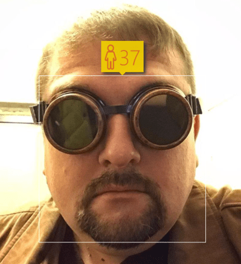

<!--
CO_OP_TRANSLATOR_METADATA:
{
  "original_hash": "0c84b280e654e05ed658023021a6a975",
  "translation_date": "2025-09-23T06:45:40+00:00",
  "source_file": "lessons/1-Intro/README.md",
  "language_code": "ur"
}
-->
# مصنوعی ذہانت کا تعارف

> خاکہ نوٹ [Tomomi Imura](https://twitter.com/girlie_mac) کی جانب سے

## [لیکچر سے پہلے کا کوئز](https://ff-quizzes.netlify.app/en/ai/quiz/1)

**مصنوعی ذہانت** ایک دلچسپ سائنسی شعبہ ہے جو یہ مطالعہ کرتا ہے کہ ہم کمپیوٹرز کو ذہین رویہ ظاہر کرنے کے قابل کیسے بنا سکتے ہیں، مثلاً وہ کام کرنا جو انسانوں کو کرنے میں مہارت حاصل ہے۔

ابتدائی طور پر، کمپیوٹرز کو [چارلس بیبج](https://en.wikipedia.org/wiki/Charles_Babbage) نے اعداد پر کام کرنے کے لیے ایجاد کیا تھا، جو ایک واضح طریقہ کار یعنی الگورتھم کی پیروی کرتے تھے۔ جدید کمپیوٹرز، حالانکہ 19ویں صدی میں پیش کیے گئے اصل ماڈل سے بہت زیادہ ترقی یافتہ ہیں، پھر بھی کنٹرول شدہ حسابات کے اسی خیال کی پیروی کرتے ہیں۔ اس طرح، اگر ہمیں وہ صحیح ترتیب معلوم ہو جو ہمیں اپنے مقصد کو حاصل کرنے کے لیے کرنی ہے، تو کمپیوٹر کو کسی کام کے لیے پروگرام کرنا ممکن ہے۔

> تصویر [Vickie Soshnikova](http://twitter.com/vickievalerie) کی جانب سے

> ✅ کسی شخص کی تصویر سے اس کی عمر کا تعین کرنا ایک ایسا کام ہے جسے واضح طور پر پروگرام نہیں کیا جا سکتا، کیونکہ ہمیں یہ معلوم نہیں کہ ہم اپنے ذہن میں ایک نمبر کیسے لے کر آتے ہیں جب ہم یہ کرتے ہیں۔

---

کچھ کام ایسے ہیں جنہیں ہم واضح طور پر حل کرنے کا طریقہ نہیں جانتے۔ مثال کے طور پر، کسی شخص کی تصویر سے اس کی عمر کا تعین کرنا۔ ہم یہ کرنا سیکھتے ہیں کیونکہ ہم نے مختلف عمر کے لوگوں کی بہت سی مثالیں دیکھی ہیں، لیکن ہم واضح طور پر یہ نہیں بتا سکتے کہ ہم یہ کیسے کرتے ہیں، اور نہ ہی ہم کمپیوٹر کو یہ کرنے کے لیے پروگرام کر سکتے ہیں۔ یہ بالکل وہی قسم کے کام ہیں جو **مصنوعی ذہانت** (مختصر میں AI) کے لیے دلچسپی کا باعث ہیں۔

✅ ان کاموں کے بارے میں سوچیں جنہیں آپ کمپیوٹر پر منتقل کر سکتے ہیں اور AI سے فائدہ اٹھا سکتے ہیں۔ مالیات، طب، اور فنون کے شعبوں پر غور کریں - آج یہ شعبے AI سے کیسے فائدہ اٹھا رہے ہیں؟

## کمزور AI بمقابلہ مضبوط AI

کمزور AI | مضبوط AI
---------------------------------------|-------------------------------------
کمزور AI ان نظاموں کو کہتے ہیں جو کسی خاص کام یا محدود کاموں کے لیے ڈیزائن اور تربیت یافتہ ہوتے ہیں۔|مضبوط AI، یا مصنوعی عمومی ذہانت (AGI)، ان نظاموں کو کہتے ہیں جو انسانی سطح کی ذہانت اور سمجھ بوجھ رکھتے ہیں۔
یہ AI نظام عام طور پر ذہین نہیں ہوتے؛ یہ ایک مخصوص کام میں مہارت رکھتے ہیں لیکن حقیقی سمجھ بوجھ یا شعور سے محروم ہوتے ہیں۔|یہ AI نظام کسی بھی ذہنی کام کو انجام دینے کی صلاحیت رکھتے ہیں جو انسان کر سکتا ہے، مختلف شعبوں میں ڈھلنے کی صلاحیت رکھتے ہیں، اور شعور یا خود آگاہی کی ایک شکل رکھتے ہیں۔
کمزور AI کی مثالوں میں ورچوئل اسسٹنٹس جیسے Siri یا Alexa، اسٹریمنگ سروسز کے تجویز کردہ الگورتھمز، اور مخصوص کسٹمر سروس کے کاموں کے لیے ڈیزائن کردہ چیٹ بوٹس شامل ہیں۔|مضبوط AI کا حصول AI تحقیق کا طویل مدتی مقصد ہے اور اس کے لیے ایسے AI نظاموں کی ترقی کی ضرورت ہوگی جو مختلف کاموں اور سیاق و سباق میں استدلال، سیکھنے، سمجھنے، اور ڈھلنے کی صلاحیت رکھتے ہوں۔
کمزور AI انتہائی مخصوص ہے اور اس کے محدود دائرہ کار سے باہر انسانی جیسی علمی صلاحیتیں یا عمومی مسئلہ حل کرنے کی صلاحیتیں نہیں رکھتا۔|مضبوط AI فی الحال ایک نظریاتی تصور ہے، اور کوئی بھی AI نظام اس سطح کی عمومی ذہانت تک نہیں پہنچا ہے۔

مزید معلومات کے لیے **[Artificial General Intelligence](https://en.wikipedia.org/wiki/Artificial_general_intelligence)** (AGI) کا حوالہ دیں۔

## ذہانت کی تعریف اور ٹورنگ ٹیسٹ

**[ذہانت](https://en.wikipedia.org/wiki/Intelligence)** کی اصطلاح سے نمٹنے میں ایک مسئلہ یہ ہے کہ اس اصطلاح کی کوئی واضح تعریف نہیں ہے۔ کوئی یہ دلیل دے سکتا ہے کہ ذہانت **تجریدی سوچ** یا **خود آگاہی** سے جڑی ہوئی ہے، لیکن ہم اسے مناسب طریقے سے بیان نہیں کر سکتے۔

> [تصویر](https://unsplash.com/photos/75715CVEJhI) [Amber Kipp](https://unsplash.com/@sadmax) کی جانب سے Unsplash سے

ذہانت کی اصطلاح کی مبہمیت کو دیکھنے کے لیے، ایک سوال کا جواب دینے کی کوشش کریں: "کیا بلی ذہین ہے؟" مختلف لوگ اس سوال کے مختلف جواب دینے کا رجحان رکھتے ہیں، کیونکہ اس دعوے کو سچ یا غلط ثابت کرنے کے لیے کوئی عالمی طور پر قبول شدہ ٹیسٹ نہیں ہے۔ اور اگر آپ کو لگتا ہے کہ ایسا ہے - اپنی بلی کو IQ ٹیسٹ کے ذریعے چلانے کی کوشش کریں...

✅ ایک لمحے کے لیے سوچیں کہ آپ ذہانت کو کیسے بیان کرتے ہیں۔ کیا وہ کوا جو بھول بھلیاں حل کر کے کھانے تک پہنچ سکتا ہے ذہین ہے؟ کیا بچہ ذہین ہے؟

---

جب AGI کے بارے میں بات کرتے ہیں تو ہمیں کسی طرح یہ بتانے کی ضرورت ہوتی ہے کہ آیا ہم نے واقعی ایک ذہین نظام تخلیق کیا ہے۔ [ایلن ٹورنگ](https://en.wikipedia.org/wiki/Alan_Turing) نے ایک طریقہ تجویز کیا جسے **[ٹورنگ ٹیسٹ](https://en.wikipedia.org/wiki/Turing_test)** کہا جاتا ہے، جو ذہانت کی تعریف کے طور پر بھی کام کرتا ہے۔ یہ ٹیسٹ دیے گئے نظام کا موازنہ کسی ایسی چیز سے کرتا ہے جو فطری طور پر ذہین ہو - ایک حقیقی انسان، اور چونکہ کوئی بھی خودکار موازنہ کمپیوٹر پروگرام کے ذریعے نظرانداز کیا جا سکتا ہے، ہم ایک انسانی انٹروگیٹر کا استعمال کرتے ہیں۔ لہذا، اگر کوئی انسان متن پر مبنی مکالمے میں حقیقی شخص اور کمپیوٹر نظام کے درمیان فرق کرنے سے قاصر ہے - تو نظام کو ذہین سمجھا جاتا ہے۔

> ایک چیٹ بوٹ جسے [Eugene Goostman](https://en.wikipedia.org/wiki/Eugene_Goostman) کہا جاتا ہے، جو سینٹ پیٹرزبرگ میں تیار کیا گیا تھا، نے 2014 میں ٹورنگ ٹیسٹ پاس کرنے کے قریب پہنچ کر ایک ہوشیار شخصیت کی چال استعمال کی۔ اس نے پہلے ہی اعلان کر دیا کہ وہ ایک 13 سالہ یوکرینی لڑکا ہے، جو علم کی کمی اور متن میں کچھ تضادات کی وضاحت کرے گا۔ بوٹ نے 30% ججوں کو قائل کیا کہ وہ انسان ہے، ایک میٹرک جسے ٹورنگ نے یقین کیا تھا کہ ایک مشین 2000 تک پاس کر سکے گی۔ تاہم، یہ سمجھنا ضروری ہے کہ اس سے یہ ظاہر نہیں ہوتا کہ ہم نے ایک ذہین نظام تخلیق کیا ہے، یا کہ کمپیوٹر نظام نے انسانی انٹروگیٹر کو دھوکہ دیا ہے - نظام نے انسانوں کو دھوکہ نہیں دیا، بلکہ بوٹ تخلیق کاروں نے کیا!

✅ کیا آپ کبھی کسی چیٹ بوٹ کے ذریعے دھوکہ کھا گئے ہیں کہ آپ کسی انسان سے بات کر رہے ہیں؟ اس نے آپ کو کیسے قائل کیا؟

## AI کے مختلف طریقے

اگر ہم چاہتے ہیں کہ کمپیوٹر انسان کی طرح برتاؤ کرے، تو ہمیں کسی طرح کمپیوٹر کے اندر ہماری سوچنے کے طریقے کو ماڈل کرنا ہوگا۔ نتیجتاً، ہمیں یہ سمجھنے کی کوشش کرنی ہوگی کہ انسان کو ذہین کیا بناتا ہے۔

> مشین میں ذہانت کو پروگرام کرنے کے قابل ہونے کے لیے، ہمیں یہ سمجھنا ہوگا کہ ہمارے اپنے فیصلے کرنے کے عمل کیسے کام کرتے ہیں۔ اگر آپ تھوڑی سی خود شناسی کریں، تو آپ کو احساس ہوگا کہ کچھ عمل لاشعوری طور پر ہوتے ہیں – مثلاً ہم بلی کو کتے سے بغیر سوچے فرق کر سکتے ہیں - جبکہ کچھ دیگر استدلال شامل کرتے ہیں۔

اس مسئلے کے دو ممکنہ طریقے ہیں:

ٹاپ ڈاؤن اپروچ (علامتی استدلال) | باٹم اپ اپروچ (نیورل نیٹ ورکس)
---------------------------------------|-------------------------------------
ٹاپ ڈاؤن اپروچ اس طریقے کو ماڈل کرتا ہے جس سے کوئی شخص مسئلہ حل کرنے کے لیے استدلال کرتا ہے۔ اس میں انسان سے **علم** نکالنا اور اسے کمپیوٹر کے قابل پڑھنے کی شکل میں پیش کرنا شامل ہے۔ ہمیں کمپیوٹر کے اندر **استدلال** کو ماڈل کرنے کا ایک طریقہ بھی تیار کرنے کی ضرورت ہے۔ | باٹم اپ اپروچ انسانی دماغ کی ساخت کو ماڈل کرتا ہے، جو سادہ یونٹس کی ایک بڑی تعداد پر مشتمل ہوتا ہے جنہیں **نیورونز** کہا جاتا ہے۔ ہر نیورون اپنے ان پٹ کا وزنی اوسط کی طرح کام کرتا ہے، اور ہم نیورونز کے نیٹ ورک کو مفید مسائل حل کرنے کے لیے تربیت دے سکتے ہیں، **تربیتی ڈیٹا** فراہم کر کے۔

ذہانت کے لیے کچھ دیگر ممکنہ طریقے بھی ہیں:

* ایک **ابھرتا ہوا**، **ہم آہنگ** یا **کثیر ایجنٹ طریقہ** اس حقیقت پر مبنی ہے کہ پیچیدہ ذہین رویہ بڑی تعداد میں سادہ ایجنٹس کے تعامل سے حاصل کیا جا سکتا ہے۔ [ارتقائی سائبرنیٹکس](https://en.wikipedia.org/wiki/Global_brain#Evolutionary_cybernetics) کے مطابق، ذہانت زیادہ سادہ، رد عمل والے رویے سے *میٹاسسٹم ٹرانزیشن* کے عمل میں *ابھر سکتی ہے*۔

* ایک **ارتقائی طریقہ**، یا **جینیاتی الگورتھم** ایک اصلاحی عمل ہے جو ارتقاء کے اصولوں پر مبنی ہے۔

ہم ان طریقوں پر کورس کے بعد غور کریں گے، لیکن ابھی ہم دو اہم سمتوں پر توجہ مرکوز کریں گے: ٹاپ ڈاؤن اور باٹم اپ۔

### ٹاپ ڈاؤن اپروچ

**ٹاپ ڈاؤن اپروچ** میں، ہم اپنے استدلال کو ماڈل کرنے کی کوشش کرتے ہیں۔ چونکہ ہم اپنے خیالات کی پیروی کر سکتے ہیں جب ہم استدلال کرتے ہیں، ہم اس عمل کو رسمی بنانے اور اسے کمپیوٹر کے اندر پروگرام کرنے کی کوشش کر سکتے ہیں۔ اسے **علامتی استدلال** کہا جاتا ہے۔

لوگوں کے ذہن میں کچھ اصول ہوتے ہیں جو ان کے فیصلہ سازی کے عمل کی رہنمائی کرتے ہیں۔ مثال کے طور پر، جب کوئی ڈاکٹر مریض کی تشخیص کر رہا ہوتا ہے، تو وہ محسوس کر سکتا ہے کہ کسی شخص کو بخار ہے، اور اس طرح جسم کے اندر کچھ سوزش ہو سکتی ہے۔ ایک مخصوص مسئلے پر اصولوں کے ایک بڑے سیٹ کو لاگو کر کے، ڈاکٹر حتمی تشخیص پر پہنچ سکتا ہے۔

یہ طریقہ **علم کی نمائندگی** اور **استدلال** پر بہت زیادہ انحصار کرتا ہے۔ انسانی ماہر سے علم نکالنا سب سے مشکل حصہ ہو سکتا ہے، کیونکہ بہت سے معاملات میں ڈاکٹر کو بالکل معلوم نہیں ہوتا کہ وہ کسی خاص تشخیص پر کیوں پہنچ رہا ہے۔ کبھی کبھی حل اس کے ذہن میں بغیر واضح سوچ کے آ جاتا ہے۔ کچھ کام، جیسے کسی شخص کی تصویر سے عمر کا تعین کرنا، بالکل بھی علم کو جوڑنے تک محدود نہیں کیا جا سکتا۔

### باٹم اپ اپروچ

متبادل طور پر، ہم اپنے دماغ کے سب سے سادہ عناصر – نیورون کو ماڈل کرنے کی کوشش کر سکتے ہیں۔ ہم کمپیوٹر کے اندر ایک **مصنوعی نیورل نیٹ ورک** بنا سکتے ہیں، اور پھر اسے مثالیں دے کر مسائل حل کرنے کے لیے سکھانے کی کوشش کر سکتے ہیں۔ یہ عمل اس طرح ہے جیسے ایک نوزائیدہ بچہ اپنے ارد گرد کے ماحول کے بارے میں مشاہدات کر کے سیکھتا ہے۔

✅ تحقیق کریں کہ بچے کیسے سیکھتے ہیں۔ بچے کے دماغ کے بنیادی عناصر کیا ہیں؟

> | مشین لرننگ کے بارے میں کیا خیال ہے؟         |      |
> |--------------|-----------|
> | مصنوعی ذہانت کا وہ حصہ جو کمپیوٹر کو کچھ ڈیٹا کی بنیاد پر مسئلہ حل کرنے کے لیے سیکھنے پر مبنی ہے، اسے **مشین لرننگ** کہا جاتا ہے۔ ہم اس کورس میں کلاسیکل مشین لرننگ پر غور نہیں کریں گے - ہم آپ کو ایک الگ [Machine Learning for Beginners](http://aka.ms/ml-beginners) نصاب کا حوالہ دیتے ہیں۔ |       |

## AI کی مختصر تاریخ

مصنوعی ذہانت کو بیسویں صدی کے وسط میں ایک شعبے کے طور پر شروع کیا گیا۔ ابتدائی طور پر، علامتی استدلال ایک غالب طریقہ تھا، اور اس نے کچھ اہم کامیابیاں حاصل کیں، جیسے ماہر نظام – کمپیوٹر پروگرام جو کچھ محدود مسئلہ کے شعبوں میں ماہر کے طور پر کام کرنے کے قابل تھے۔ تاہم، جلد ہی یہ واضح ہو گیا کہ ایسا طریقہ اچھی طرح سے پیمانہ نہیں کرتا۔ ماہر سے علم نکالنا، اسے کمپیوٹر میں پیش کرنا، اور اس علم کے ذخیرے کو درست رکھنا ایک بہت پیچیدہ کام ثابت ہوا، اور بہت سے معاملات میں عملی طور پر بہت مہنگا۔ اس نے 1970 کی دہائی میں نام نہاد [AI Winter](https://en.wikipedia.org/wiki/AI_winter) کو جنم دیا۔

> تصویر [Dmitry Soshnikov](http://soshnikov.com) کی جانب سے

وقت گزرنے کے ساتھ، کمپیوٹنگ وسائل سستے ہو گئے، اور زیادہ ڈیٹا دستیاب ہو گیا، لہذا نیورل نیٹ ورک کے طریقے انسانوں کے ساتھ مقابلہ کرنے میں بہت سے شعبوں میں زبردست کارکردگی کا مظاہرہ کرنے لگے، جیسے کمپیوٹر وژن یا تقریر کی سمجھ۔ پچھلی دہائی میں، مصنوعی ذہانت کی اصطلاح کو زیادہ تر نیورل نیٹ ورکس کے مترادف کے طور پر استعمال کیا گیا ہے، کیونکہ AI کی زیادہ تر کامیابیاں جن کے بارے میں ہم سنتے ہیں، ان پر مبنی ہیں۔

ہم دیکھ سکتے ہیں کہ شطرنج کھیلنے والے کمپیوٹر پروگرام بنانے کے طریقے کیسے بدلے:

* ابتدائی شطرنج پروگرام تلاش پر مبنی تھے – ایک پروگرام واضح طور پر ایک دیے گئے تعداد کے اگلے چالوں کے لیے مخالف کے ممکنہ چالوں کا اندازہ لگانے کی کوشش کرتا تھا، اور چند چالوں میں حاصل کی جا سکنے والی بہترین پوزیشن کی بنیاد پر ایک بہترین چال کا انتخاب کرتا تھا۔ اس نے نام نہاد [alpha-beta pruning](https://en.wikipedia.org/wiki/Alpha%E2%80%93beta_pruning) تلاش الگورتھم کی ترقی کی۔
* تلاش کی حکمت عملی کھیل کے اختتام کی طرف اچھی طرح کام کرتی ہیں، جہاں تلاش کی جگہ محدود ہوتی ہے۔
> تصویر از دمتری سوشنیکوف، [تصویر](https://unsplash.com/photos/r8LmVbUKgns) از [مارینا ابروسیمووا](https://unsplash.com/@abrosimova_marina_foto)، Unsplash

## حالیہ AI تحقیق

نیورل نیٹ ورک تحقیق میں حالیہ بڑی ترقی تقریباً 2010 کے آس پاس شروع ہوئی، جب بڑے عوامی ڈیٹا سیٹس دستیاب ہونے لگے۔ تصاویر کا ایک بڑا مجموعہ جسے [ImageNet](https://en.wikipedia.org/wiki/ImageNet) کہا جاتا ہے، جس میں تقریباً 14 ملین تشریح شدہ تصاویر شامل ہیں، نے [ImageNet Large Scale Visual Recognition Challenge](https://image-net.org/challenges/LSVRC/) کو جنم دیا۔

> تصویر از [دمتری سوشنیکوف](http://soshnikov.com)

2012 میں، [Convolutional Neural Networks](../4-ComputerVision/07-ConvNets/README.md) کو پہلی بار تصویر کی درجہ بندی میں استعمال کیا گیا، جس سے درجہ بندی کی غلطیوں میں نمایاں کمی ہوئی (تقریباً 30% سے 16.4% تک)۔ 2015 میں، Microsoft Research کی ResNet آرکیٹیکچر نے [انسانی سطح کی درستگی حاصل کی](https://doi.org/10.1109/ICCV.2015.123)۔

تب سے، نیورل نیٹ ورکس نے کئی کاموں میں بہت کامیاب رویہ دکھایا ہے:

---

سال | انسانی برابری حاصل کی گئی
-----|--------
2015 | [تصویر کی درجہ بندی](https://doi.org/10.1109/ICCV.2015.123)
2016 | [گفتگو کی تقریر کی شناخت](https://arxiv.org/abs/1610.05256)
2018 | [خودکار مشین ترجمہ](https://arxiv.org/abs/1803.05567) (چینی سے انگریزی)
2020 | [تصویر کی وضاحت](https://arxiv.org/abs/2009.13682)

گزشتہ چند سالوں میں ہم نے بڑے زبان ماڈلز جیسے BERT اور GPT-3 کے ساتھ بڑی کامیابیاں دیکھی ہیں۔ یہ زیادہ تر اس وجہ سے ہوا کہ عام متن کے ڈیٹا کی بڑی مقدار دستیاب ہے جو ہمیں ماڈلز کو متن کی ساخت اور معنی کو سمجھنے کے لیے تربیت دینے کی اجازت دیتی ہے، انہیں عمومی متن کے مجموعوں پر پہلے سے تربیت دینے اور پھر ان ماڈلز کو زیادہ مخصوص کاموں کے لیے مہارت دینے کی اجازت دیتی ہے۔ ہم اس کورس میں بعد میں [Natural Language Processing](../5-NLP/README.md) کے بارے میں مزید سیکھیں گے۔

## 🚀 چیلنج

انٹرنیٹ کا جائزہ لیں اور یہ طے کریں کہ آپ کی رائے میں AI سب سے مؤثر طریقے سے کہاں استعمال ہو رہا ہے۔ کیا یہ کسی نقشہ سازی ایپ میں ہے، یا کسی تقریر سے متن کی خدمت میں یا کسی ویڈیو گیم میں؟ تحقیق کریں کہ یہ نظام کیسے بنایا گیا۔

## [لیکچر کے بعد کا کوئز](https://ff-quizzes.netlify.app/en/ai/quiz/2)

## جائزہ اور خود مطالعہ

AI اور ML کی تاریخ کا جائزہ لینے کے لیے [اس سبق](https://github.com/microsoft/ML-For-Beginners/tree/main/1-Introduction/2-history-of-ML) کو پڑھیں۔ اس سبق یا اس سبق کے اوپر موجود اسکیچ نوٹ سے ایک عنصر لیں اور اس کے ارتقاء کو سمجھنے کے لیے اس کے ثقافتی سیاق و سباق پر مزید تحقیق کریں۔

**اسائنمنٹ**: [گیم جام](assignment.md)

---

