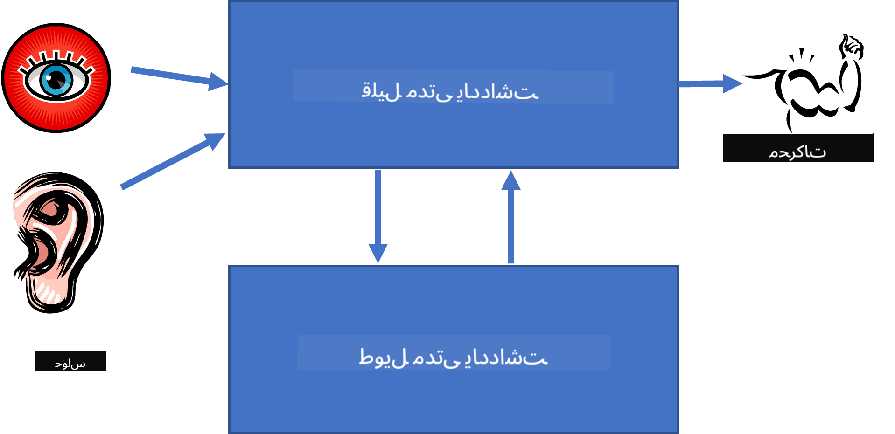

<!--
CO_OP_TRANSLATOR_METADATA:
{
  "original_hash": "7d097f7fda9166ead615e4c34552381b",
  "translation_date": "2025-09-23T06:44:40+00:00",
  "source_file": "lessons/2-Symbolic/README.md",
  "language_code": "ur"
}
-->
# علم کی نمائندگی اور ماہر نظام


> اسکیچ نوٹ از [Tomomi Imura](https://twitter.com/girlie_mac)

مصنوعی ذہانت کی تلاش علم کی تلاش پر مبنی ہے، تاکہ دنیا کو انسانوں کی طرح سمجھا جا سکے۔ لیکن یہ کیسے ممکن ہے؟

## [لیکچر سے پہلے کا کوئز](https://ff-quizzes.netlify.app/en/ai/quiz/3)

AI کے ابتدائی دنوں میں، ذہین نظام بنانے کے لیے اوپر سے نیچے تک کا طریقہ (پچھلے سبق میں بیان کیا گیا) مقبول تھا۔ اس کا مقصد لوگوں سے علم کو مشین کے قابل پڑھنے کے قابل شکل میں نکالنا اور پھر اسے خودکار طریقے سے مسائل حل کرنے کے لیے استعمال کرنا تھا۔ یہ طریقہ دو بڑے خیالات پر مبنی تھا:

* علم کی نمائندگی
* استدلال

## علم کی نمائندگی

سمبولک AI کے اہم تصورات میں سے ایک **علم** ہے۔ علم کو *معلومات* یا *ڈیٹا* سے الگ کرنا ضروری ہے۔ مثال کے طور پر، کہا جا سکتا ہے کہ کتابیں علم پر مشتمل ہیں، کیونکہ کتابوں کا مطالعہ کر کے کوئی ماہر بن سکتا ہے۔ تاہم، کتابوں میں جو کچھ ہوتا ہے اسے دراصل *ڈیٹا* کہا جاتا ہے، اور کتابیں پڑھ کر اور اس ڈیٹا کو اپنی دنیا کے ماڈل میں ضم کر کے ہم اس ڈیٹا کو علم میں تبدیل کرتے ہیں۔

> ✅ **علم** وہ چیز ہے جو ہمارے دماغ میں موجود ہوتی ہے اور دنیا کے بارے میں ہماری سمجھ کی نمائندگی کرتی ہے۔ یہ ایک فعال **سیکھنے** کے عمل کے ذریعے حاصل کیا جاتا ہے، جو ہمیں موصول ہونے والی معلومات کے ٹکڑوں کو ہماری دنیا کے فعال ماڈل میں ضم کرتا ہے۔

اکثر اوقات، ہم علم کی سختی سے وضاحت نہیں کرتے، بلکہ ہم اسے دوسرے متعلقہ تصورات کے ساتھ [DIKW Pyramid](https://en.wikipedia.org/wiki/DIKW_pyramid) کے ذریعے ہم آہنگ کرتے ہیں۔ اس میں درج ذیل تصورات شامل ہیں:

* **ڈیٹا** وہ چیز ہے جو جسمانی میڈیا میں ظاہر ہوتی ہے، جیسے کہ تحریری متن یا بولے گئے الفاظ۔ ڈیٹا انسانوں سے آزاد ہوتا ہے اور لوگوں کے درمیان منتقل کیا جا سکتا ہے۔
* **معلومات** وہ ہے جس طرح ہم اپنے دماغ میں ڈیٹا کی تشریح کرتے ہیں۔ مثال کے طور پر، جب ہم لفظ *کمپیوٹر* سنتے ہیں، تو ہمیں اس کے بارے میں کچھ سمجھ آتی ہے۔
* **علم** وہ معلومات ہے جو ہمارے دنیا کے ماڈل میں ضم ہو جاتی ہے۔ مثال کے طور پر، ایک بار جب ہم سیکھ لیتے ہیں کہ کمپیوٹر کیا ہے، تو ہمیں اس کے کام کرنے کے طریقے، اس کی قیمت، اور اس کے استعمال کے بارے میں کچھ خیالات ہونے لگتے ہیں۔ یہ باہم جڑے ہوئے تصورات کا نیٹ ورک ہمارا علم بناتا ہے۔
* **دانائی** ہماری دنیا کی سمجھ کا ایک اور سطح ہے، اور یہ *میٹا-علم* کی نمائندگی کرتی ہے، جیسے کہ یہ جاننا کہ علم کو کب اور کیسے استعمال کرنا چاہیے۔


*تصویر [ویکیپیڈیا سے](https://commons.wikimedia.org/w/index.php?curid=37705247)، از Longlivetheux - Own work, CC BY-SA 4.0*

لہٰذا، **علم کی نمائندگی** کا مسئلہ یہ ہے کہ کمپیوٹر کے اندر علم کو ڈیٹا کی شکل میں مؤثر طریقے سے کیسے پیش کیا جائے، تاکہ اسے خودکار طور پر استعمال کیا جا سکے۔ اسے ایک اسپیکٹرم کے طور پر دیکھا جا سکتا ہے:


> تصویر از [Dmitry Soshnikov](http://soshnikov.com)

* بائیں جانب، علم کی نمائندگی کی بہت سادہ اقسام ہیں جو کمپیوٹرز کے ذریعے مؤثر طریقے سے استعمال کی جا سکتی ہیں۔ سب سے سادہ قسم الگوریتھمک ہے، جہاں علم کو کمپیوٹر پروگرام کے ذریعے پیش کیا جاتا ہے۔ تاہم، یہ علم کی نمائندگی کا بہترین طریقہ نہیں ہے، کیونکہ یہ لچکدار نہیں ہے۔ ہمارے دماغ میں موجود علم اکثر غیر الگوریتھمک ہوتا ہے۔
* دائیں جانب، قدرتی متن جیسی نمائندگیاں ہیں۔ یہ سب سے زیادہ طاقتور ہے، لیکن خودکار استدلال کے لیے استعمال نہیں کی جا سکتی۔

> ✅ ایک منٹ کے لیے سوچیں کہ آپ اپنے دماغ میں علم کو کیسے پیش کرتے ہیں اور اسے نوٹس میں کیسے تبدیل کرتے ہیں۔ کیا کوئی خاص فارمیٹ ہے جو آپ کے لیے یادداشت میں مددگار ثابت ہوتا ہے؟

## کمپیوٹر علم کی نمائندگی کی درجہ بندی

ہم کمپیوٹر علم کی نمائندگی کے مختلف طریقوں کو درج ذیل زمروں میں درجہ بندی کر سکتے ہیں:

* **نیٹ ورک نمائندگی** اس حقیقت پر مبنی ہیں کہ ہمارے دماغ میں باہم جڑے ہوئے تصورات کا ایک نیٹ ورک موجود ہے۔ ہم کمپیوٹر کے اندر ایک گراف کے طور پر وہی نیٹ ورک دوبارہ بنانے کی کوشش کر سکتے ہیں - جسے **سیمینٹک نیٹ ورک** کہا جاتا ہے۔

1. **آبجیکٹ-ایٹریبیوٹ-ویلیو ٹرپلٹس** یا **ایٹریبیوٹ-ویلیو جوڑے**۔ چونکہ گراف کو کمپیوٹر کے اندر نوڈز اور ایجز کی فہرست کے طور پر پیش کیا جا سکتا ہے، ہم سیمینٹک نیٹ ورک کو ٹرپلٹس کی فہرست کے ذریعے پیش کر سکتے ہیں، جس میں اشیاء، صفات، اور اقدار شامل ہیں۔ مثال کے طور پر، ہم پروگرامنگ زبانوں کے بارے میں درج ذیل ٹرپلٹس بنا سکتے ہیں:

Object | Attribute | Value
-------|-----------|------
Python | is | Untyped-Language
Python | invented-by | Guido van Rossum
Python | block-syntax | indentation
Untyped-Language | doesn't have | type definitions

> ✅ سوچیں کہ ٹرپلٹس کو علم کی دیگر اقسام کی نمائندگی کے لیے کیسے استعمال کیا جا سکتا ہے۔

2. **درجہ بندی کی نمائندگی** اس بات پر زور دیتی ہے کہ ہم اکثر اپنے دماغ میں اشیاء کی ایک درجہ بندی بناتے ہیں۔ مثال کے طور پر، ہم جانتے ہیں کہ کینری ایک پرندہ ہے، اور تمام پرندوں کے پر ہوتے ہیں۔ ہمیں یہ بھی اندازہ ہوتا ہے کہ کینری کا رنگ عام طور پر کیا ہوتا ہے، اور ان کی پرواز کی رفتار کیا ہوتی ہے۔

   - **فریم نمائندگی** ہر شے یا اشیاء کے طبقے کو ایک **فریم** کے طور پر پیش کرنے پر مبنی ہے، جس میں **سلاٹس** شامل ہیں۔ سلاٹس میں ممکنہ ڈیفالٹ اقدار، قدر کی پابندیاں، یا محفوظ شدہ طریقہ کار ہو سکتے ہیں جو سلاٹ کی قدر حاصل کرنے کے لیے بلائے جا سکتے ہیں۔ تمام فریمز ایک درجہ بندی بناتے ہیں جو آبجیکٹ اورینٹڈ پروگرامنگ زبانوں میں آبجیکٹ درجہ بندی سے مشابہت رکھتی ہے۔
   - **مناظر** فریمز کی ایک خاص قسم ہیں جو پیچیدہ حالات کی نمائندگی کرتے ہیں جو وقت کے ساتھ کھل سکتے ہیں۔

**Python**

Slot | Value | Default value | Interval |
-----|-------|---------------|----------|
Name | Python | | |
Is-A | Untyped-Language | | |
Variable Case | | CamelCase | |
Program Length | | | 5-5000 lines |
Block Syntax | Indent | | |

3. **عملی نمائندگی** اس بات پر مبنی ہیں کہ علم کو اعمال کی ایک فہرست کے ذریعے پیش کیا جائے جو کسی خاص حالت میں عمل میں لائی جا سکتی ہیں۔
   - پروڈکشن رولز وہ if-then بیانات ہیں جو ہمیں نتائج اخذ کرنے کی اجازت دیتے ہیں۔ مثال کے طور پر، ایک ڈاکٹر کے پاس ایک قاعدہ ہو سکتا ہے جو کہتا ہے کہ **اگر** مریض کو تیز بخار ہو **یا** خون کے ٹیسٹ میں سی-ری ایکٹیو پروٹین کی سطح زیادہ ہو **تو** اسے سوزش ہے۔ جب ہم ان میں سے کسی ایک حالت کا سامنا کرتے ہیں، تو ہم سوزش کے بارے میں نتیجہ اخذ کر سکتے ہیں، اور پھر اسے مزید استدلال میں استعمال کر سکتے ہیں۔
   - الگوریتھمز کو عملی نمائندگی کی ایک اور شکل سمجھا جا سکتا ہے، حالانکہ انہیں علم پر مبنی نظاموں میں شاذ و نادر ہی براہ راست استعمال کیا جاتا ہے۔

4. **منطق** کو اصل میں ارسطو نے انسانی علم کی عالمگیر نمائندگی کے طور پر تجویز کیا تھا۔
   - پریڈی کیٹ منطق ایک ریاضیاتی نظریہ کے طور پر بہت زیادہ پیچیدہ ہے، اس لیے عام طور پر اس کا کوئی سب سیٹ استعمال کیا جاتا ہے، جیسے کہ Prolog میں استعمال ہونے والے ہارن کلاز۔
   - وضاحتی منطق منطقی نظاموں کا ایک خاندان ہے جو اشیاء کی درجہ بندی اور تقسیم شدہ علم کی نمائندگی جیسے *سیمینٹک ویب* کے بارے میں استدلال کرنے کے لیے استعمال ہوتا ہے۔

## ماہر نظام

سمبولک AI کی ابتدائی کامیابیوں میں سے ایک **ماہر نظام** تھے - کمپیوٹر سسٹمز جو کسی محدود مسئلہ کے دائرہ کار میں ماہر کے طور پر کام کرنے کے لیے ڈیزائن کیے گئے تھے۔ یہ ایک **علمی بنیاد** پر مبنی تھے جو ایک یا زیادہ انسانی ماہرین سے نکالا گیا تھا، اور ان میں ایک **استدلالی انجن** شامل تھا جو اس پر کچھ استدلال کرتا تھا۔

 | 
---------------------------------------------|------------------------------------------------
انسانی اعصابی نظام کی سادہ ساخت | علم پر مبنی نظام کی ساخت

ماہر نظام انسانی استدلالی نظام کی طرح بنائے گئے ہیں، جس میں **مختصر مدتی یادداشت** اور **طویل مدتی یادداشت** شامل ہیں۔ اسی طرح، علم پر مبنی نظاموں میں ہم درج ذیل اجزاء کو الگ کرتے ہیں:

* **مسئلہ کی یادداشت**: اس میں اس مسئلے کے بارے میں علم شامل ہوتا ہے جو اس وقت حل کیا جا رہا ہے، جیسے کہ مریض کا درجہ حرارت یا بلڈ پریشر، آیا اسے سوزش ہے یا نہیں، وغیرہ۔ اس علم کو **جامد علم** بھی کہا جاتا ہے، کیونکہ اس میں وہ چیز شامل ہوتی ہے جو ہم اس وقت مسئلے کے بارے میں جانتے ہیں - جسے *مسئلہ کی حالت* کہا جاتا ہے۔
* **علمی بنیاد**: یہ کسی مسئلہ کے دائرہ کار کے بارے میں طویل مدتی علم کی نمائندگی کرتی ہے۔ یہ انسانی ماہرین سے دستی طور پر نکالا جاتا ہے، اور مشاورت سے مشاورت تک تبدیل نہیں ہوتا۔ چونکہ یہ ہمیں ایک مسئلہ کی حالت سے دوسرے میں نیویگیٹ کرنے کی اجازت دیتا ہے، اسے **متحرک علم** بھی کہا جاتا ہے۔
* **استدلالی انجن**: یہ مسئلہ کی حالت کی جگہ میں تلاش کے پورے عمل کو منظم کرتا ہے، جب ضروری ہو تو صارف سے سوالات پوچھتا ہے۔ یہ ہر حالت پر لاگو ہونے والے صحیح قواعد تلاش کرنے کا بھی ذمہ دار ہے۔

ایک مثال کے طور پر، آئیے ایک ماہر نظام پر غور کریں جو کسی جانور کا تعین اس کی جسمانی خصوصیات کی بنیاد پر کرتا ہے:


> تصویر از [Dmitry Soshnikov](http://soshnikov.com)

اس ڈایاگرام کو **AND-OR درخت** کہا جاتا ہے، اور یہ پروڈکشن رولز کے ایک سیٹ کی گرافیکل نمائندگی ہے۔ درخت بنانا ماہر سے علم نکالنے کے آغاز میں مفید ہے۔ کمپیوٹر کے اندر علم کی نمائندگی کے لیے قواعد کا استعمال زیادہ آسان ہے:

```
IF the animal eats meat
OR (animal has sharp teeth
    AND animal has claws
    AND animal has forward-looking eyes
) 
THEN the animal is a carnivore
```

آپ دیکھ سکتے ہیں کہ قاعدے کے بائیں جانب کی حالت اور عمل بنیادی طور پر آبجیکٹ-ایٹریبیوٹ-ویلیو (OAV) ٹرپلٹس ہیں۔ **ورکنگ میموری** ان OAV ٹرپلٹس کے سیٹ پر مشتمل ہے جو اس وقت حل کیے جا رہے مسئلے سے مطابقت رکھتے ہیں۔ ایک **رولز انجن** ان قواعد کو تلاش کرتا ہے جن کی حالت پوری ہو رہی ہو اور انہیں لاگو کرتا ہے، ورکنگ میموری میں ایک اور ٹرپلٹ شامل کرتا ہے۔

> ✅ اپنے پسندیدہ موضوع پر اپنا AND-OR درخت بنائیں!

### فارورڈ بمقابلہ بیکورڈ استدلال

اوپر بیان کردہ عمل کو **فارورڈ استدلال** کہا جاتا ہے۔ یہ مسئلے کے بارے میں ورکنگ میموری میں دستیاب کچھ ابتدائی ڈیٹا سے شروع ہوتا ہے، اور پھر درج ذیل استدلالی لوپ کو انجام دیتا ہے:

1. اگر ہدف کی صفت ورکنگ میموری میں موجود ہو - رک جائیں اور نتیجہ دیں۔
2. ان تمام قواعد کو تلاش کریں جن کی حالت اس وقت پوری ہو رہی ہو - قواعد کے **تنازعہ سیٹ** کو حاصل کریں۔
3. **تنازعہ حل** انجام دیں - ایک قاعدہ منتخب کریں جو اس مرحلے پر نافذ کیا جائے گا۔ مختلف تنازعہ حل کی حکمت عملی ہو سکتی ہیں:
   - علمی بنیاد میں پہلا قابل اطلاق قاعدہ منتخب کریں۔
   - ایک تصادفی قاعدہ منتخب کریں۔
   - ایک *زیادہ مخصوص* قاعدہ منتخب کریں، یعنی وہ جو "بائیں جانب" (LHS) میں سب سے زیادہ حالات کو پورا کرتا ہو۔
4. منتخب قاعدہ لاگو کریں اور مسئلہ کی حالت میں نیا علم شامل کریں۔
5. مرحلہ 1 سے دوبارہ شروع کریں۔

تاہم، بعض صورتوں میں ہم مسئلے کے بارے میں خالی علم سے شروع کرنا چاہتے ہیں، اور ایسے سوالات پوچھنا چاہتے ہیں جو ہمیں نتیجہ تک پہنچنے میں مدد دیں۔ مثال کے طور پر، جب طبی تشخیص کی بات آتی ہے، تو ہم عام طور پر مریض کی تشخیص شروع کرنے سے پہلے تمام طبی تجزیے نہیں کرتے۔ ہم اس وقت تجزیے کرنا چاہتے ہیں جب کوئی فیصلہ کرنا ہو۔

اس عمل کو **بیکورڈ استدلال** کے ذریعے ماڈل کیا جا سکتا ہے۔ یہ **ہدف** کے ذریعے چلایا جاتا ہے - وہ صفت جس کی قدر ہم تلاش کرنا چاہتے ہیں:

1. ان تمام قواعد کو منتخب کریں جو ہمیں ہدف کی قدر دے سکتے ہیں (یعنی ہدف RHS ("دائیں جانب") پر ہو) - ایک تنازعہ سیٹ۔
1. اگر اس صفت کے لیے کوئی قاعدہ موجود نہ ہو، یا کوئی قاعدہ ہو جو کہتا ہو کہ ہمیں صارف سے قدر پوچھنی چاہیے - اس سے پوچھیں، ورنہ:
1. تنازعہ حل کی حکمت عملی کا استعمال کرتے ہوئے ایک قاعدہ منتخب کریں جسے ہم *مفروضہ* کے طور پر استعمال کریں گے - ہم اسے ثابت کرنے کی کوشش کریں گے۔
1. قاعدے کے LHS میں موجود تمام صفات کے لیے عمل کو بار بار دہرائیں، انہیں اہداف کے طور پر ثابت کرنے کی کوشش کریں۔
1. اگر کسی بھی وقت عمل ناکام ہو جائے - مرحلہ 3 پر دوسرا قاعدہ استعمال کریں۔

> ✅ کن حالات میں فارورڈ استدلال زیادہ مناسب ہے؟ اور بیکورڈ استدلال کب بہتر ہے؟

### ماہر نظاموں کا نفاذ

ماہر نظام مختلف ٹولز کا استعمال کرتے ہوئے نافذ کیے جا سکتے ہیں:

* انہیں کسی اعلیٰ سطحی پروگرامنگ زبان میں براہ راست پروگرام کرنا۔ یہ بہترین خیال نہیں ہے، کیونکہ علم پر مبنی نظام کا بنیادی فائدہ یہ ہے کہ علم استدلال سے الگ ہوتا ہے، اور ممکنہ طور پر مسئلہ کے دائرہ کار کے ماہر کو قواعد لکھنے کے قابل ہونا چاہیے بغیر استدلالی عمل کی تفصیلات کو سمجھے۔
* **ماہر نظام شیل** کا استعمال، یعنی ایک ایسا نظام جو خاص طور پر کسی علم کی نمائندگی کی زبان کا استعمال کرتے ہوئے علم سے آباد ہونے کے لیے ڈیزائن کیا گیا ہو۔

## ✍️ مشق: جانوروں کا استدلال

[Animals.ipynb](https://github.com/microsoft/AI-For-Beginners/blob/main/lessons/2-Symbolic/Animals.ipynb) دیکھیں، جو فارورڈ اور بیکورڈ استدلال ماہر نظام کو نافذ کرنے کی ایک مثال ہے۔

> **نوٹ**: یہ مثال کافی سادہ ہے، اور صرف یہ بتاتی ہے کہ ماہر نظام کیسا نظر آتا ہے۔ جب آپ ایسا نظام بنانا شروع کریں گے، تو آپ کو اس میں کچھ *ذہین* رویہ اس وقت نظر آئے گا جب آپ 200+ قواعد تک پہنچ جائیں گے۔ ایک وقت ایسا آئے گا جب قواعد اتنے پیچیدہ ہو جائیں گے کہ آپ ان سب کو ذہن میں نہیں رکھ سکیں گے، اور اس وقت آپ سوچ سکتے ہیں کہ نظام نے کچھ فیصلے کیوں کیے۔ تاہم، علم پر مبنی نظاموں کی ایک اہم خصوصیت یہ ہے کہ آپ ہمیشہ *وضاحت* کر سکتے ہیں کہ کسی بھی فیصلے کو کیسے بنایا گیا۔

## اونٹولوجیز اور سیمینٹک ویب

20ویں صدی کے آخر میں ایک پہل کی گئی کہ علم کی نمائندگی کو انٹرنیٹ وسائل کو تشریح کرنے کے لیے استعمال کیا جائے، تاکہ یہ ممکن ہو کہ بہت مخصوص سوالات کے مطابق وسائل تلاش کیے جا سکیں۔ اس تحریک کو **سیمینٹک ویب** کہا گیا، اور یہ کئی تصورات پر مبنی تھی:

- **[وضاحتی منطق](https://en.wikipedia.org/wiki/Description_logic)** (DL) پر مبنی ایک خاص علم کی نمائندگی۔ یہ فریم علم کی نمائندگی سے مشابہت رکھتی ہے، کیونکہ یہ اشیاء کی خصوصیات کے ساتھ ایک درجہ بندی بناتی ہے، لیکن اس میں رسمی منطقی معنویت اور استدلال ہوتا ہے۔ DLs کا ایک پورا خاندان ہے جو اظہاریت اور استدلال کی الگورتھمک پیچیدگی کے درمیان توازن رکھتا ہے۔
- تقسیم شدہ علم کی نمائندگی، جہاں تمام تصورات کو ایک عالمی URI شناخت کنندہ کے ذریعے پیش کیا جاتا ہے، جس سے انٹرنیٹ پر علم کی درجہ بندی بنانا ممکن ہوتا ہے۔
- XML پر مبنی زبانوں کا ایک خاندان جو علم کی وضاحت کے لیے استعمال ہوتا ہے: RDF (Resource Description Framework)، RDFS (RDF Schema)، OWL (Ontology Web Language)۔

سمینٹک ویب میں ایک بنیادی تصور **Ontology** کا ہے۔ یہ کسی مسئلے کے دائرہ کار کی واضح وضاحت کو ظاہر کرتا ہے، جو کسی رسمی علم کی نمائندگی کے ذریعے کی جاتی ہے۔ سب سے سادہ ontology صرف مسئلے کے دائرہ کار میں اشیاء کی ایک درجہ بندی ہو سکتی ہے، لیکن زیادہ پیچیدہ ontologies میں ایسے قواعد شامل ہوں گے جو استنباط کے لیے استعمال کیے جا سکتے ہیں۔

سمینٹک ویب میں تمام نمائندگیاں triplets پر مبنی ہوتی ہیں۔ ہر شے اور ہر تعلق کو URI کے ذریعے منفرد طور پر شناخت کیا جاتا ہے۔ مثال کے طور پر، اگر ہم یہ بیان کرنا چاہیں کہ یہ AI Curriculum دمتری سوشنیکوف نے 1 جنوری 2022 کو تیار کیا ہے - تو ہم ان triplets کا استعمال کر سکتے ہیں:


```
http://github.com/microsoft/ai-for-beginners http://www.example.com/terms/creation-date “Jan 13, 2007”
http://github.com/microsoft/ai-for-beginners http://purl.org/dc/elements/1.1/creator http://soshnikov.com
```

> ✅ یہاں `http://www.example.com/terms/creation-date` اور `http://purl.org/dc/elements/1.1/creator` کچھ معروف اور عالمی سطح پر قبول شدہ URIs ہیں جو *creator* اور *creation date* کے تصورات کو ظاہر کرتے ہیں۔

زیادہ پیچیدہ صورت میں، اگر ہم تخلیق کاروں کی فہرست کو بیان کرنا چاہیں، تو ہم RDF میں بیان کردہ کچھ ڈیٹا ڈھانچے استعمال کر سکتے ہیں۔


> اوپر کے ڈایاگرامز [دمتری سوشنیکوف](http://soshnikov.com) کے ذریعے۔

سمینٹک ویب کی تعمیر کی پیش رفت کو سرچ انجنز اور قدرتی زبان کی پروسیسنگ تکنیکوں کی کامیابی نے کسی حد تک سست کر دیا، جو متن سے منظم ڈیٹا نکالنے کی اجازت دیتی ہیں۔ تاہم، کچھ شعبوں میں اب بھی ontologies اور knowledge bases کو برقرار رکھنے کے لیے اہم کوششیں کی جا رہی ہیں۔ چند قابل ذکر منصوبے:

* [WikiData](https://wikidata.org/) مشین ریڈ ایبل knowledge bases کا مجموعہ ہے جو Wikipedia سے منسلک ہے۔ زیادہ تر ڈیٹا Wikipedia *InfoBoxes* سے نکالا جاتا ہے، جو Wikipedia صفحات کے اندر منظم مواد کے ٹکڑے ہیں۔ آپ [query](https://query.wikidata.org/) wikidata کو SPARQL میں کر سکتے ہیں، جو سمینٹک ویب کے لیے ایک خاص query زبان ہے۔ یہاں ایک نمونہ query ہے جو انسانوں میں سب سے زیادہ مقبول آنکھوں کے رنگ دکھاتا ہے:

```sparql
#defaultView:BubbleChart
SELECT ?eyeColorLabel (COUNT(?human) AS ?count)
WHERE
{
  ?human wdt:P31 wd:Q5.       # human instance-of homo sapiens
  ?human wdt:P1340 ?eyeColor. # human eye-color ?eyeColor
  SERVICE wikibase:label { bd:serviceParam wikibase:language "en". }
}
GROUP BY ?eyeColorLabel
```

* [DBpedia](https://www.dbpedia.org/) WikiData جیسی ایک اور کوشش ہے۔

> ✅ اگر آپ اپنی ontologies بنانے یا موجودہ کو کھولنے کے ساتھ تجربہ کرنا چاہتے ہیں، تو ایک بہترین بصری ontology ایڈیٹر [Protégé](https://protege.stanford.edu/) ہے۔ اسے ڈاؤن لوڈ کریں، یا آن لائن استعمال کریں۔


*Web Protégé ایڈیٹر Romanov Family ontology کے ساتھ کھلا ہوا۔ اسکرین شاٹ دمتری سوشنیکوف کے ذریعے*

## ✍️ مشق: ایک فیملی Ontology

[FamilyOntology.ipynb](https://github.com/Ezana135/AI-For-Beginners/blob/main/lessons/2-Symbolic/FamilyOntology.ipynb) دیکھیں، جو سمینٹک ویب تکنیکوں کا استعمال کرتے ہوئے خاندانی تعلقات کے بارے میں استدلال کرنے کی مثال فراہم کرتا ہے۔ ہم ایک فیملی ٹری کو عام GEDCOM فارمیٹ میں اور خاندانی تعلقات کی ontology کو لے کر دیے گئے افراد کے سیٹ کے لیے تمام خاندانی تعلقات کا گراف بنائیں گے۔

## Microsoft Concept Graph

زیادہ تر معاملات میں، ontologies کو احتیاط سے ہاتھ سے تیار کیا جاتا ہے۔ تاہم، یہ بھی ممکن ہے کہ **mine** ontologies کو غیر منظم ڈیٹا سے نکالا جائے، مثال کے طور پر، قدرتی زبان کے متن سے۔

ایسا ہی ایک تجربہ Microsoft Research نے کیا، جس کے نتیجے میں [Microsoft Concept Graph](https://blogs.microsoft.com/ai/microsoft-researchers-release-graph-that-helps-machines-conceptualize/?WT.mc_id=academic-77998-cacaste) سامنے آیا۔

یہ entities کا ایک بڑا مجموعہ ہے جو `is-a` inheritance تعلق کے ذریعے گروپ کیا گیا ہے۔ یہ سوالات کے جواب دینے کی اجازت دیتا ہے جیسے "Microsoft کیا ہے؟" - جواب کچھ اس طرح ہوگا "ایک کمپنی، امکان 0.87 کے ساتھ، اور ایک برانڈ، امکان 0.75 کے ساتھ"۔

Graph REST API کے طور پر دستیاب ہے، یا ایک بڑے ڈاؤن لوڈ کے قابل ٹیکسٹ فائل کے طور پر جو تمام entity pairs کو فہرست میں شامل کرتا ہے۔

## ✍️ مشق: ایک Concept Graph

[MSConceptGraph.ipynb](https://github.com/microsoft/AI-For-Beginners/blob/main/lessons/2-Symbolic/MSConceptGraph.ipynb) نوٹ بک آزمائیں تاکہ یہ دیکھ سکیں کہ ہم Microsoft Concept Graph کا استعمال کرتے ہوئے نیوز آرٹیکلز کو کئی زمروں میں کیسے گروپ کر سکتے ہیں۔

## نتیجہ

آج کل، AI کو اکثر *Machine Learning* یا *Neural Networks* کا مترادف سمجھا جاتا ہے۔ تاہم، ایک انسان بھی واضح استدلال کا مظاہرہ کرتا ہے، جو کچھ ایسا ہے جو فی الحال neural networks کے ذریعے نہیں سنبھالا جا رہا۔ حقیقی دنیا کے منصوبوں میں، واضح استدلال اب بھی ان کاموں کو انجام دینے کے لیے استعمال کیا جاتا ہے جن کے لیے وضاحت کی ضرورت ہوتی ہے، یا نظام کے رویے کو کنٹرول شدہ طریقے سے تبدیل کرنے کی صلاحیت۔

## 🚀 چیلنج

اس سبق سے منسلک Family Ontology نوٹ بک میں، دیگر خاندانی تعلقات کے ساتھ تجربہ کرنے کا موقع موجود ہے۔ فیملی ٹری میں لوگوں کے درمیان نئے تعلقات دریافت کرنے کی کوشش کریں۔

## [لیکچر کے بعد کا کوئز](https://ff-quizzes.netlify.app/en/ai/quiz/4)

## جائزہ اور خود مطالعہ

انٹرنیٹ پر تحقیق کریں تاکہ ان شعبوں کو دریافت کریں جہاں انسانوں نے علم کو مقدار میں تبدیل کرنے اور کوڈفائی کرنے کی کوشش کی ہے۔ Bloom's Taxonomy پر نظر ڈالیں، اور تاریخ میں واپس جائیں تاکہ یہ جان سکیں کہ انسانوں نے اپنی دنیا کو سمجھنے کی کوشش کیسے کی۔ Linnaeus کے کام کو دریافت کریں تاکہ جانداروں کی درجہ بندی بنائی جا سکے، اور دیکھیں کہ Dmitri Mendeleev نے کیمیائی عناصر کو بیان کرنے اور گروپ کرنے کا طریقہ کیسے بنایا۔ آپ کون سے دیگر دلچسپ مثالیں تلاش کر سکتے ہیں؟

**اسائنمنٹ**: [ایک Ontology بنائیں](assignment.md)

---

