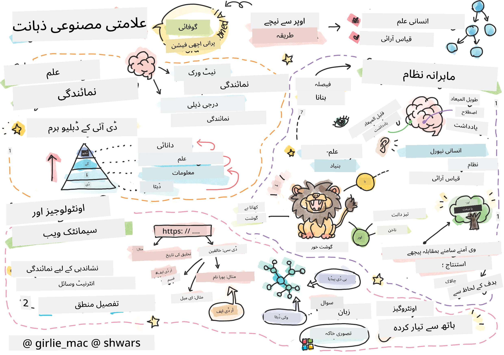
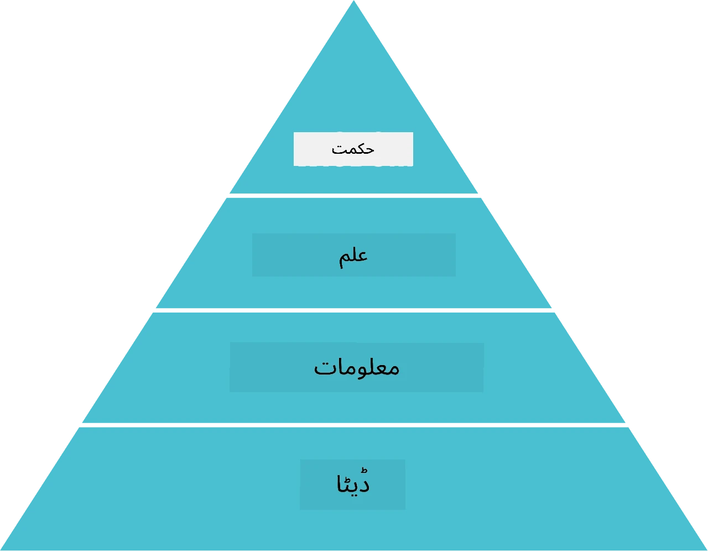
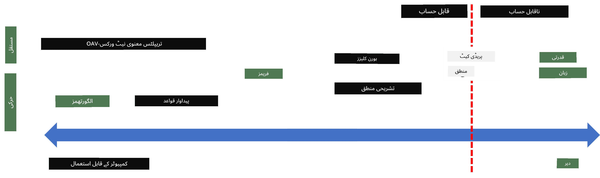
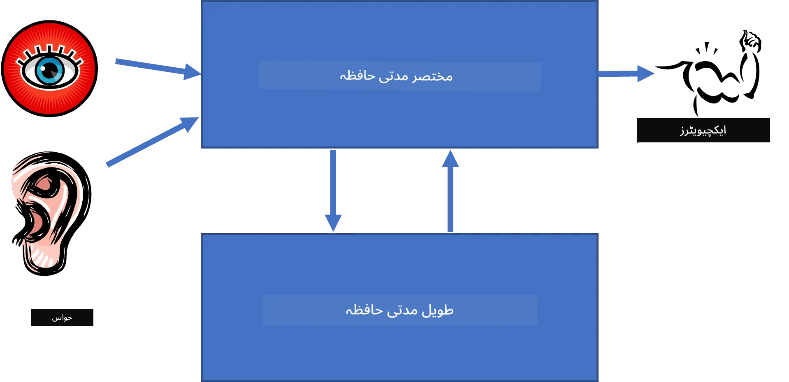
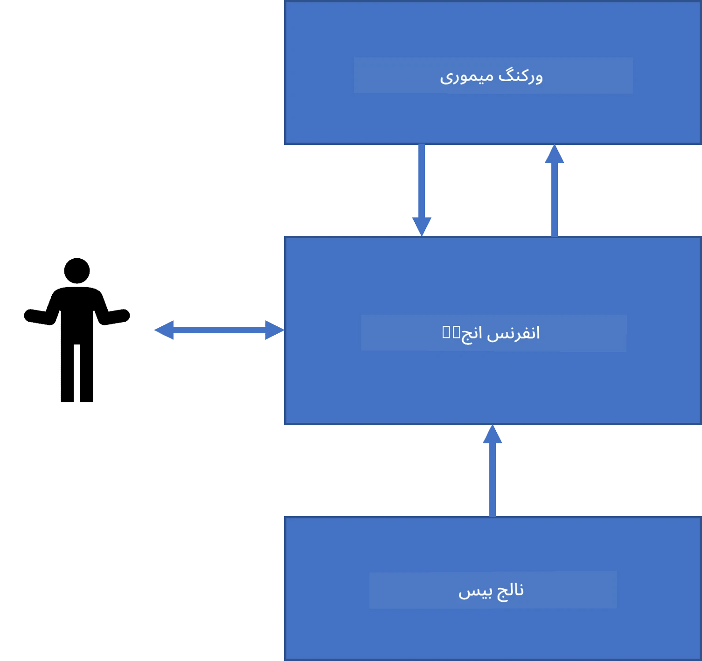
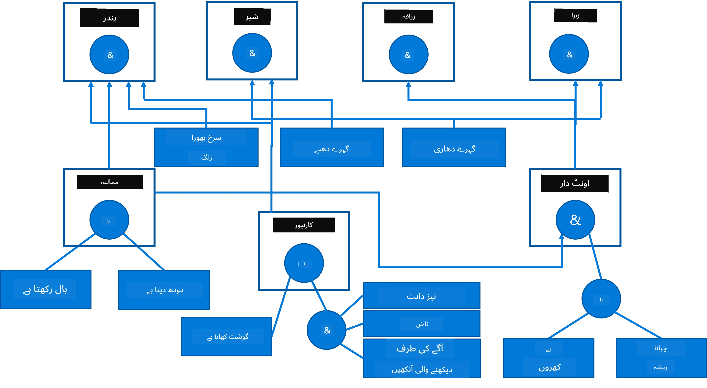
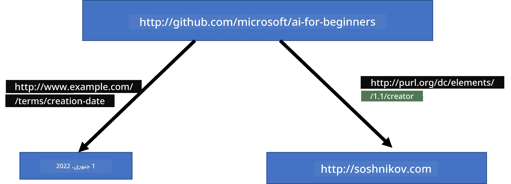
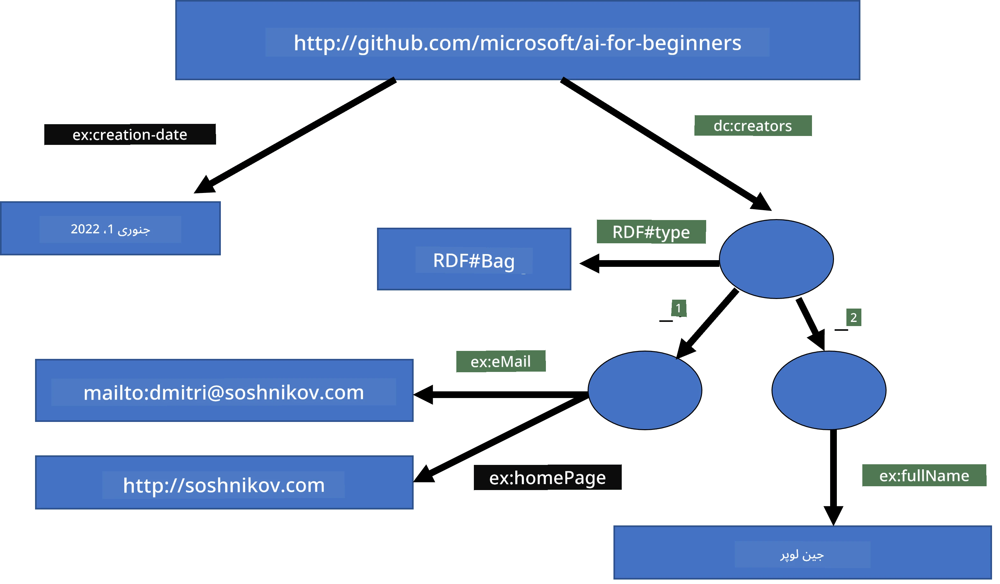
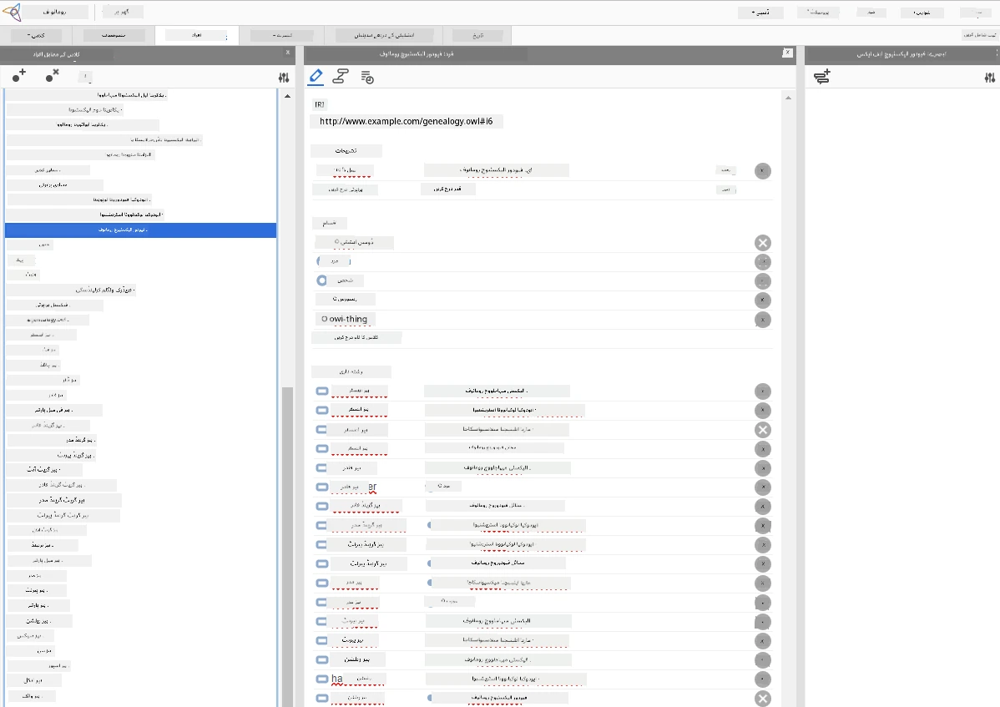

# علم کی نمائندگی اور ماہر نظام



> اسکیچنوٹ بذریعہ [تومومی ایمورا](https://twitter.com/girlie_mac)

مصنوعی ذہانت کی تلاش علم کی تلاش پر مبنی ہے، تاکہ دنیا کو ویسا ہی سمجھا جائے جس طرح انسان سمجھتے ہیں۔ لیکن آپ یہ کیسے کر سکتے ہیں؟

## [لیکچر سے پہلے کا کوئز](https://ff-quizzes.netlify.app/en/ai/quiz/3)

AI کے ابتدائی دنوں میں، ذہین نظام بنانے کا اوپر سے نیچے کا طریقہ (جو پچھلے سبق میں زیر بحث آیا) مقبول تھا۔ خیال یہ تھا کہ لوگوں سے علم نکال کر اسے کسی کمپیوٹر قابل پڑھائی شکل میں ڈالا جائے، اور پھر خودکار طور پر مسائل حل کیے جائیں۔ یہ طریقہ دو بڑے خیالوں پر مبنی تھا:

* علم کی نمائندگی
* استدلال

## علم کی نمائندگی

علامتی AI کے اہم تصورات میں سے ایک **علم** ہے۔ علم کو *معلومات* یا *ڈیٹا* سے فرق کرنا ضروری ہے۔ مثال کے طور پر، کہا جا سکتا ہے کہ کتابوں میں علم ہوتا ہے، کیونکہ کتابوں کا مطالعہ کر کے کوئی ماہر بن سکتا ہے۔ تاہم، کتابوں میں جو چیز ہوتی ہے اسے درحقیقت *ڈیٹا* کہا جاتا ہے، اور کتابوں کو پڑھ کر اور اس ڈیٹا کو اپنے عالمی ماڈل میں ضم کر کے ہم اس ڈیٹا کو علم میں تبدیل کرتے ہیں۔

> ✅ **علم** وہ چیز ہے جو ہمارے ذہن میں ہوتی ہے اور ہماری دنیا کی سمجھ کی نمائندگی کرتی ہے۔ یہ ایک فعال **سیکھنے** کے عمل کے ذریعے حاصل کیا جاتا ہے، جو ہمیں موصول ہونے والی معلومات کے ٹکڑوں کو ہماری متحرک عالمی ماڈل میں ضم کرتا ہے۔

اکثر اوقات، ہم علم کو سختی سے تعریف نہیں کرتے، بلکہ اسے دیگر متعلقہ تصورات کے ساتھ [DIKW پیرامڈ](https://en.wikipedia.org/wiki/DIKW_pyramid) کے ذریعے ہم آہنگ کرتے ہیں۔ اس میں درج ذیل تصورات شامل ہیں:

* **ڈیٹا** وہ چیز ہے جو مادی میڈیا میں ظاہر ہوتی ہے، جیسے لکھا ہوا متن یا بولا ہوا لفظ۔ ڈیٹا انسانوں سے آزاد وجود رکھتا ہے اور لوگوں کے درمیان منتقل ہو سکتا ہے۔
* **معلومات** وہ ہے جو ہم اپنے دماغ میں ڈیٹا کی تعبیر کرتے ہیں۔ مثال کے طور پر، جب ہم لفظ *کمپیوٹر* سنتے ہیں، تو ہمارے ذہن میں اس کا کچھ مطلب آتا ہے۔
* **علم** وہ معلومات ہے جو ہمارے عالمی ماڈل میں شدت سے شامل ہوتی ہے۔ مثال کے طور پر، جب ہم سیکھتے ہیں کہ کمپیوٹر کیا ہے، تو ہم اس کے کام کرنے کے طریقے، اس کی قیمت، اور اس کے استعمال کے بارے میں کچھ خیالات پیدا کرتے ہیں۔ یہ باہم جڑے ہوئے تصورات کا جال ہمارا علم بناتے ہیں۔
* **حکمت** ہماری دنیا کی سمجھ کا ایک اور درجہ ہے، اور یہ *میٹا-علم* کی نمائندگی کرتی ہے، جیسے کہ علم کو کب اور کیسے استعمال کرنا چاہیے۔



*تصویر [ویکیپیڈیا سے](https://commons.wikimedia.org/w/index.php?curid=37705247)، بذریعہ Longlivetheux - اپنی تخلیق، CC BY-SA 4.0*

لہٰذا، **علم کی نمائندگی** کا مسئلہ یہ ہے کہ علم کو کمپیوٹر کے اندر ڈیٹا کی شکل میں مؤثر طریقے سے قابل استعمال بنانے کا کوئی طریقہ تلاش کیا جائے۔ اسے ایک پھیلاؤ کے طور پر دیکھا جا سکتا ہے:



> تصویر بذریعہ [دمتری سوشنیکوف](http://soshnikov.com)

* بائیں جانب، بہت سادہ اقسام کی علم کی نمائندگی ہیں جو کمپیوٹروں کے ذریعے مؤثر طریقے سے استعمال کی جا سکتی ہیں۔ سب سے آسان الگورتھمک ہوتی ہے، جب علم کمپیوٹر پروگرام کے ذریعے ظاہر کیا جاتا ہے۔ تاہم، یہ علم کی بہترین نمائندگی نہیں ہے، کیونکہ یہ لچکدار نہیں ہوتی۔ ہمارے ذہن میں موجود علم اکثر غیر الگورتھمک ہوتا ہے۔
* دائیں جانب، ایسی نمائندگیاں ہیں جیسے قدرتی متن۔ یہ سب سے زیادہ طاقتور ہے، لیکن خودکار استدلال کے لیے استعمال نہیں ہو سکتی۔

> ✅ ایک لمحے کے لیے سوچیں کہ آپ اپنے ذہن میں علم کو کیسے ظاہر کرتے ہیں اور اسے نوٹس میں تبدیل کرتے ہیں۔ کیا کوئی مخصوص فارمیٹ ہے جو یادداشت میں مدد دیتا ہے؟

## کمپیوٹر علم کی نمائندگی کی اقسام

ہم مختلف کمپیوٹر علم نمائندگی کے طریقوں کو درج ذیل اقسام میں تقسیم کر سکتے ہیں:

* **نیٹ ورک نمائندگیاں** اس حقیقت پر مبنی ہیں کہ ہمارے ذہن میں باہم جڑے ہوئے تصورات کا نیٹ ورک ہوتا ہے۔ ہم کمپیوٹر کے اندر اسی نیٹ ورک کو ایک گراف کی شکل میں دوبارہ بنا سکتے ہیں - جسے **سیمنٹک نیٹ ورک** کہتے ہیں۔

1. **آبجیکٹ-اتریبیوٹ-ویلیو ٹرپلٹس** یا **اتریبیوٹ-ویلیو جوڑے**۔ چونکہ گراف کو کمپیوٹر میں نوڈز اور ایجز کی فہرست کے طور پر ظاہر کیا جا سکتا ہے، ہم سیمنٹک نیٹ ورک کو ٹرپلٹس کی فہرست کے ذریعے بیان کر سکتے ہیں، جو آبجیکٹس، صفات، اور قدروں پر مشتمل ہو۔ مثال کے طور پر، ہم درج ذیل ٹرپلٹس پروگرامنگ زبانوں کے بارے میں بناتے ہیں:

Object | Attribute | Value
-------|-----------|------
Python | ہے | غیر ٹائپڈ زبان
Python | ایجاد کنندہ | گوئڈو وان روسم
Python | بلاک نحو | وقفہ یا انڈینٹیشن
غیر ٹائپڈ زبان | نہیں رکھتی | قسم کی تعریفیں

> ✅ سوچیں کہ ٹرپلٹس کو دیگر اقسام کے علم کی نمائندگی کے لیے کیسے استعمال کیا جا سکتا ہے۔

2. **درجہ بندی نمائندگیاں** اس بات پر زور دیتی ہیں کہ ہم اکثر اپنے ذہن میں اشیاء کی درجہ بندی کرتے ہیں۔ مثال کے طور پر، ہم جانتے ہیں کہ کناری ایک پرندہ ہے، اور تمام پرندوں کے پر ہوتے ہیں۔ ہمارے پاس یہ بھی اندازہ ہوتا ہے کہ کناری کا رنگ عام طور پر کیا ہوتا ہے، اور اس کی پرواز کی رفتار کیا ہے۔

   - **فریم نمائندگی** ہر آبجیکٹ یا آبجیکٹ کی قسم کو ایک **فریم** کے طور پر ظاہر کرنے پر مبنی ہے، جس میں **سلاٹ** ہوتے ہیں۔ سلاٹس کے ممکنہ ڈیفالٹ ویلیوز، ویلیو کی پابندیاں، یا اسٹور کیے گئے پروسیجرز ہو سکتے ہیں جنہیں کال کیا جا سکتا ہے تاکہ سلاٹ کی ویلیو حاصل ہو۔ تمام فریم آبجیکٹ کی درجہ بندی کی طرح ایک ہائیرارکی بناتے ہیں، جیسا کہ آبجیکٹ اورینٹڈ پروگرامنگ زبانوں میں ہوتا ہے۔
   - **مناظر** ایسی خاص قسم کے فریم ہوتے ہیں جو پیچیدہ حالات کی نمائندگی کرتے ہیں جو وقت کے ساتھ بدل سکتے ہیں۔

**پائتھن**

Slot | Value | Default value | Interval |
-----|-------|---------------|----------|
نام | Python | | |
ایسا ہے | غیر ٹائپڈ زبان | | |
ویری ایبل کیس | | CamelCase | |
پروگرام کی لمبائی | | | ۵-۵۰۰۰ لائنیں |
بلاک نحو | انڈینٹ | | |

3. **طریقہ کار کی نمائندگی** علم کو کارروائیوں کی فہرست کے ذریعے ظاہر کرتی ہے جو کسی شرط کی موجودگی پر انجام دی جا سکتی ہیں۔
   - پروڈکشن رولز اگر-تو کے قواعد ہوتے ہیں جو ہمیں نتائج اخذ کرنے دیتے ہیں۔ مثال کے طور پر، ایک ڈاکٹر کا قاعدہ ہو سکتا ہے کہ **اگر** مریض کو تیز بخار ہو **یا** خون کے ٹیسٹ میں C-ری ایکٹیو پروٹین کی سطح زیادہ ہو **تو** اسے سوزش ہے۔ جب ہم ان شرائط میں سے کسی ایک کا سامنا کریں، تو ہم سوزش کا نتیجہ اخذ کر سکتے ہیں، اور پھر اس کا استعمال مزید استدلال میں کرتے ہیں۔
   - الگورتھمز کو طریقہ کار کی نمائندگی کی ایک اور شکل سمجھا جا سکتا ہے، حالانکہ وہ علم کے نظاموں میں عام طور پر براہِ راست استعمال نہیں ہوتے۔

4. **منطق** ابتدا میں ارسطو نے اسے عالمی انسانی علم کی نمائندگی کا ذریعہ تجویز کیا تھا۔
   - پریڈیکیٹ لاجک بطور ریاضیاتی نظریہ بہت وسیع ہے کہ کمپیوٹ کیا جا سکے، لہٰذا اس کا کچھ ذیلی حصہ عمومًا استعمال ہوتا ہے، جیسے Prolog میں ہارن کلاز۔
   - ڈسکرپٹو لاجک ایسی منطقی نظاموں کا خاندان ہے جو اشیاء کی درجہ بندی اور تقسیم شدہ علم کی نمائندگی اور استدلال کے لیے استعمال ہوتے ہیں، جیسے کہ *سیمنٹک ویب*۔

## ماہر نظام

علامتی AI کی ابتدائی کامیابیوں میں سے ایک ایسے کمپیوٹر نظام تھے جنہیں **ماہر نظام** کہا جاتا ہے — کمپیوٹر نظام جو کسی محدود مسئلہ کے میدان میں ماہر کی طرح کام کرنے کے لیے بنائے گئے تھے۔ یہ ایک **علمی بنیاد** پر مبنی ہوتے تھے جو ایک یا زیادہ انسانی ماہرین سے نکالا جاتا تھا، اور اس میں ایک **استدلال انجن** ہوتا تھا جو اس پر کچھ استدلال کرتا تھا۔

 | 
---------------------------------------------|------------------------------------------------
انسانی عصبی نظام کی سادہ ساخت | علمی نظام کی ساخت

ماہر نظام کو انسانی استدلالی نظام کی طرح بنایا جاتا ہے، جس میں **مختصر مدت حافظہ** اور **طویل مدت حافظہ** ہوتا ہے۔ اسی طرح، علمی نظام میں درج ذیل اجزاء کی تمیز کی جاتی ہے:

* **مسئلہ حافظہ**: اس میں مسئلہ کے متعلق علم ہوتا ہے جو اس وقت حل ہو رہا ہوتا ہے، مثلاً کسی مریض کا درجہ حرارت یا بلڈ پریشر، کیا اسے سوزش ہے یا نہیں، وغیرہ۔ اسے **جامد علم** بھی کہا جاتا ہے، کیونکہ یہ مسئلہ کی موجودہ حالت کا عکس ہوتا ہے — جسے *مسئلہ کا حال* کہتے ہیں۔
* **علمی بنیاد**: مسئلہ کے میدان کے بارے میں طویل مدت کا علم ظاہر کرتی ہے۔ یہ انسانی ماہرین سے دستی طور پر نکالا جاتا ہے، اور مشورے کے دوران تبدیل نہیں ہوتا۔ چونکہ یہ ایک مسئلہ کی حالت سے دوسری پر جانے کی اجازت دیتی ہے، اسے **متحرک علم** بھی کہا جاتا ہے۔
* **استدلال انجن**: پورے مسئلہ کی حالت کی تلاش کے عمل کو منظم کرتا ہے، جب ضرورت ہو صارف سے سوالات پوچھتا ہے۔ یہ ہر حالت پر لاگو ہونے والے درست قواعد تلاش کرنے کا ذمہ دار بھی ہے۔

مثال کے طور پر، آئیے ایک ماہر نظام پر غور کریں جو کسی جانور کو اس کی جسمانی خصوصیات کی بنیاد پر شناخت کرتا ہے:



> تصویر بذریعہ [دمتری سوشنیکوف](http://soshnikov.com)

اس خاکے کو **اور-یا درخت** کہا جاتا ہے، اور یہ پروڈکشن قواعد کے مجموعہ کی گرافیکل نمائندگی ہے۔ ماہر سے علم حاصل کرنے کے عمل کے آغاز میں درخت بنانا مفید ہوتا ہے۔ کمپیوٹر کے اندر علم کی نمائندگی کے لیے قوانین کا استعمال زیادہ مناسب ہے:

```
IF the animal eats meat
OR (animal has sharp teeth
    AND animal has claws
    AND animal has forward-looking eyes
) 
THEN the animal is a carnivore
```

آپ دیکھ سکتے ہیں کہ ہر شرط جو قواعد کے بائیں طرف ہے اور عمل درحقیقت آبجیکٹ-اتریبیوٹ-ویلیو (OAV) ٹرپلٹس ہوتے ہیں۔ **کام کرنے والا حافظہ** OAV ٹرپلٹس کے سیٹ پر مشتمل ہوتا ہے جو اس مسئلہ سے متعلق ہوتا ہے جو فی الحال حل ہو رہا ہوتا ہے۔ **قواعد کا انجن** ایسے قواعد کے لیے تلاش کرتا ہے جن کی شرط پوری ہو گئی ہو اور انہیں نافذ کرتا ہے، نئے ٹرپلٹس کو کام کرنے والے حافظے میں شامل کرتے ہوئے۔

> ✅ اپنی پسند کے موضوع پر اپنا اور-یا درخت بنائیں!

### آگے کے استدلال بمقابلہ پیچھے کے استدلال

مندرجہ بالا عمل کو **آگے کی استدلال** کہا جاتا ہے۔ یہ مسئلہ کے بارے میں ابتدائی ڈیٹا سے شروع ہوتا ہے جو کام کرنے والے حافظے میں موجود ہوتا ہے، اور پھر درج ذیل استدلال کے چکر کو انجام دیتا ہے:

1. اگر مطلوبہ وصف کام کرنے والے حافظے میں موجود ہو — رکیں اور نتیجہ دیں
2. تمام ایسے قواعد تلاش کریں جن کی شرط اس وقت پوری ہو — **تنازعہ کے قواعد** حاصل کریں۔
3. **تنازعہ کے حل** کریں — ایک قاعدہ منتخب کریں جسے اس مرحلے پر نافذ کیا جائے گا۔ مختلف تنازعہ حل کی حکمت عملیاں ہو سکتی ہیں:
   - علمی بنیاد میں پہلے قابل اطلاق قاعدے کا انتخاب کریں
   - کوئی بھی قاعدہ بخت آزما منتخب کریں
   - *زیادہ مخصوص* قاعدہ منتخب کریں، یعنی وہ جو "بائیں طرف" (LHS) میں زیادہ شرائط پوری کرتا ہو۔
4. منتخب کردہ قاعدہ نافذ کریں اور مسئلہ کی حالت میں نیا علم شامل کریں
5. قدم 1 سے دوبارہ آغاز کریں۔

تاہم، بعض حالات میں ہم مسئلے کے بارے میں خالی علم سے شروع کرنا چاہتے ہیں، اور ایسے سوالات پوچھتے ہیں جو نتیجہ تک پہنچنے میں مدد دیں۔ مثال کے طور پر، طبی تشخیص کرتے وقت، ہم عموماً پیشگی تمام میڈیکل تجزیے نہیں کرتے۔ ہم تجزیے تب کرتے ہیں جب فیصلہ کرنا ہو۔

اس عمل کو **پیچھے کی استدلال** کے ذریعے ماڈل کیا جا سکتا ہے۔ یہ **ہدف** کے تحت چلتا ہے — جس وصف کی قدر ہم تلاش کرنا چاہتے ہیں:

1. تمام وہ قواعد منتخب کریں جو ہمیں ہدف کی قدر دے سکیں (یعنی جن میں ہدف "دائیں طرف" (RHS) میں ہو) — تنازعہ کا سیٹ
2. اگر اس وصف کے لیے کوئی قواعد موجود نہیں، یا ایسا قاعدہ ہو جو کہتا ہو کہ ہمیں صارف سے قدر پوچھنی چاہیے — پوچھیں، ورنہ:
3. تنازعہ حل کی حکمت عملی استعمال کر کے ایک قاعدہ منتخب کریں جسے ہم *مفروضہ* سمجھ کر ثابت کرنے کی کوشش کریں گے
4. قاعدہ کے LHS میں موجود تمام صفات کے لیے اس عمل کو دہرائیں، انہیں ہدف بنا کر ثابت کرنے کی کوشش کریں
5. اگر کسی بھی مقام پر عمل ناکام ہو جائے — قدم 3 میں دوسرا قاعدہ استعمال کریں۔

> ✅ کن حالات میں آگے کی استدلال زیادہ مناسب ہے؟ اور پیچھے کی استدلال کے بارے میں کیا خیال ہے؟

### ماہر نظام کی عمل درآمد

ماہر نظام مختلف اوزار استعمال کر کے بنائے جا سکتے ہیں:

* انہیں براہِ راست کسی اعلیٰ سطح کی پروگرامنگ زبان میں پروگرام کرنا۔ یہ مناسب نہیں کیونکہ علم پر مبنی نظام کا سب سے بڑا فائدہ یہ ہے کہ علم استدلال سے الگ ہوتا ہے، اور ممکنہ طور پر مسئلہ کے ماہر کو استدلال کی تفصیلات سمجھے بغیر قواعد لکھنے کا موقع ملتا ہے۔
* **ماہر نظام شیل** کا استعمال، یعنی ایسا نظام خاص طور پر ڈیزائن کیا گیا ہو جو علم نمائندگی کی زبان کے ذریعے علم سے بھر دیا جا سکے۔

## ✍️ مشق: جانور کی استدلال

آگے اور پیچھے کی استدلال ماہر نظام کی مثال کے لیے [Animals.ipynb](https://github.com/microsoft/AI-For-Beginners/blob/main/lessons/2-Symbolic/Animals.ipynb) دیکھیں۔

> **نوٹ**: یہ مثال سادہ ہے، اور صرف یہ سمجھانے کے لیے ہے کہ ماہر نظام کیسا ہوتا ہے۔ جب آپ اس طرح کا نظام بنانا شروع کریں گے، تو آپ کو صرف کچھ *ذہین* رویہ نظر آئے گا جب آپ کی قواعد کی تعداد تقریباً ۲۰۰+ ہو جائے۔ کسی وقت قواعد اتنے پیچیدہ ہو جاتے ہیں کہ تمام کو یاد رکھنا مشکل ہو جاتا ہے، اور آپ سوچنے لگتے ہیں کہ نظام کچھ فیصلے کیوں کر رہا ہے۔ تاہم، علم پر مبنی نظام کی اہم بات یہ ہے کہ آپ ہمیشہ *بالکل بتا سکتے ہیں* کہ کسی بھی فیصلے تک کیسے پہنچا گیا۔

## انتولوجیز اور سیمنٹک ویب

۲۰ویں صدی کے آخر میں، انٹرنیٹ کے وسائل کو نوٹ کرنے کے لیے علم کی نمائندگی استعمال کرنے کی ایک تحریک ہوئی، تاکہ مخصوص سوالات کے جواب میں وسائل تلاش کیے جا سکیں۔ اس کوشش کو **سیمنٹک ویب** کہا جاتا ہے، اور یہ چند تصورات پر مبنی تھی:

- علم کی ایک خاص نمائندگی جو **[ڈسکرپشن لاجکس](https://en.wikipedia.org/wiki/Description_logic)** (DL) پر مبنی ہے۔ یہ فریم علم کی نمائندگی سے مشابہت رکھتی ہے، کیونکہ اس میں اشیاء کی درجہ بندی اور خصوصیات شامل ہوتی ہیں، لیکن اس کا رسمی منطقی مفہوم اور استدلال ہوتا ہے۔ DLs کا ایک گروپ ہے جو اظہاریت اور استدلال کی الگورتھمک پیچیدگی کے درمیان توازن رکھتا ہے۔
- تقسیم شدہ علم کی نمائندگی، جہاں تمام تصورات کو ایک عالمی URI شناخت کے ذریعے ظاہر کیا جاتا ہے، جس سے انٹرنیٹ پر وسیع علم کی درجہ بندی بنانا ممکن ہوتا ہے۔
- ایک XML پر مبنی زبانوں کا خاندان علم کی وضاحت کے لیے: RDF (Resource Description Framework)، RDFS (RDF Schema)، OWL (Ontology Web Language)۔

سیمانٹک ویب کا ایک بنیادی تصور **Ontology** ہے۔ اس سے مراد کسی مسئلے کے دائرہ کار کی واضح وضاحت ہوتی ہے جو کسی رسمی علم کی نمائندگی کے استعمال سے کی جاتی ہے۔ سب سے سادہ آنٹولوجی مسئلہ کے دائرہ کار میں اشیاء کا ہائرارکی ہو سکتی ہے، لیکن زیادہ پیچیدہ آنٹولوجیز میں قواعد شامل ہوتے ہیں جو استنتاج کے لیے استعمال کیے جا سکتے ہیں۔

سیمانٹک ویب میں، تمام نمائندگیاں ٹرپلٹس (triplets) پر مبنی ہوتی ہیں۔ ہر شے اور ہر تعلق کو منفرد طور پر URI سے شناخت کیا جاتا ہے۔ مثال کے طور پر، اگر ہم یہ بیان کرنا چاہیں کہ یہ AI نصاب Dmitry Soshnikov نے 1 جنوری، 2022 کو تیار کیا ہے - تو یہاں استعمال کیے جانے والے ٹرپلٹس ہیں:



```
http://github.com/microsoft/ai-for-beginners http://www.example.com/terms/creation-date “Jan 1, 2022”
http://github.com/microsoft/ai-for-beginners http://purl.org/dc/elements/1.1/creator http://soshnikov.com
```

> ✅ یہاں `http://www.example.com/terms/creation-date` اور `http://purl.org/dc/elements/1.1/creator` کچھ معروف اور عالمی سطح پر قبول شدہ URIs ہیں جو *creator* اور *creation date* کے تصورات کو ظاہر کرتے ہیں۔

ایک زیادہ پیچیدہ صورت میں، اگر ہم تخلیق کاروں کی فہرست تعریف کرنا چاہیں تو ہم RDF میں تعریف کردہ کچھ ڈیٹا سٹرکچرز استعمال کر سکتے ہیں۔



> اوپر کے خاکے [Dmitry Soshnikov](http://soshnikov.com) کے ہیں

سیمانٹک ویب کی تعمیر کی پیش رفت کچھ حد تک سرچ انجنز اور قدرتی زبان کی پروسیسنگ تکنیکس کی کامیابی کی وجہ سے سست پڑ گئی، جو متن سے منظم ڈیٹا نکالنے کی اجازت دیتی ہیں۔ تاہم، کچھ شعبوں میں اب بھی آنٹولوجیز اور علم کی بنیادوں کو برقرار رکھنے کی خاطر قابل ذکر کوششیں جاری ہیں۔ چند قابل ذکر پروجیکٹس:

* [WikiData](https://wikidata.org/) مشین قابلِ پڑھائی علم کی بنیادوں کا مجموعہ ہے جو ویکیپیڈیا سے منسلک ہے۔ زیادہ تر ڈیٹا ویکیپیڈیا *InfoBoxes* سے نکالا جاتا ہے، جو ویکیپیڈیا صفحات کے اندر منظم مواد کے ٹکڑے ہیں۔ آپ [query](https://query.wikidata.org/) میں SPARQL، جو سیمانٹک ویب کے لیے ایک خاص کوئری زبان ہے، استعمال کر کے ویک ڈیٹا کو تلاش کر سکتے ہیں۔ یہاں ایک نمونہ کوئری ہے جو انسانوں میں سب سے زیادہ مقبول آنکھوں کے رنگ دکھاتی ہے:

```sparql
#defaultView:BubbleChart
SELECT ?eyeColorLabel (COUNT(?human) AS ?count)
WHERE
{
  ?human wdt:P31 wd:Q5.       # human instance-of homo sapiens
  ?human wdt:P1340 ?eyeColor. # human eye-color ?eyeColor
  SERVICE wikibase:label { bd:serviceParam wikibase:language "en". }
}
GROUP BY ?eyeColorLabel
```

* [DBpedia](https://www.dbpedia.org/) ویکیڈیٹا کے مشابہ ایک اور کوشش ہے۔

> ✅ اگر آپ اپنی خود کی آنٹولوجیز بنانے یا موجودہ آنٹولوجیز کو کھولنے کا تجربہ کرنا چاہتے ہیں، تو ایک بہترین بصری آنٹولوجی ایڈیٹر ہے [Protégé](https://protege.stanford.edu/)۔ اسے ڈاؤن لوڈ کریں، یا آن لائن استعمال کریں۔



*ویب پروٹیج ایڈیٹر رومانوف خاندان کی آنٹولوجی کے ساتھ کھلا ہوا۔ سکرین شاٹ Dmitry Soshnikov کی طرف سے*

## ✍️ مشق: خاندان کی آنٹولوجی

دیکھیں [FamilyOntology.ipynb](https://github.com/Ezana135/AI-For-Beginners/blob/main/lessons/2-Symbolic/FamilyOntology.ipynb) ایک مثال کے لیے کہ کیسے سیمانٹک ویب تکنیکس کو خاندان کے تعلقات پر غور کرنے کے لیے استعمال کیا جا سکتا ہے۔ ہم GEDCOM فارمیٹ میں نمائندہ خاندان کا درخت اور خاندان کے تعلقات کی آنٹولوجی لیں گے اور مخصوص افراد کے لیے تمام خاندان کے تعلقات کا ایک گراف بنائیں گے۔

## مائیکروسافٹ کانسپٹ گراف

زیادہ تر معاملات میں، آنٹولوجیز احتیاط سے ہاتھ سے بنائی جاتی ہیں۔ تاہم، ان اسٹرکچرڈ ڈیٹا سے آنٹولوجیز **مین** کرنا بھی ممکن ہے، مثلاً قدرتی زبان کے متون سے۔

ایسی ایک کوشش مائیکروسافٹ ریسرچ نے کی، اور اس کا نتیجہ [Microsoft Concept Graph](https://blogs.microsoft.com/ai/microsoft-researchers-release-graph-that-helps-machines-conceptualize/?WT.mc_id=academic-77998-cacaste) نکلا۔

یہ کثیر تعداد میں اشیاء کا مجموعہ ہے جو `is-a` موروثی تعلق کے ذریعے گروپ بند کیا گیا ہے۔ یہ ایسے سوالات کے جوابات فراہم کرتا ہے جیسے "مائیکروسافٹ کیا ہے؟" - جواب کچھ یوں ہو گا "ایک کمپنی احتمال 0.87 کے ساتھ، اور ایک برانڈ احتمال 0.75 کے ساتھ"۔

یہ گراف REST API اور ایک بڑی ڈاؤن لوڈ کرنے والی ٹیکسٹ فائل کی صورت میں دستیاب ہے جس میں تمام اشیاء کے جوڑے درج ہیں۔

## ✍️ مشق: کانسپٹ گراف

[MSConceptGraph.ipynb](https://github.com/microsoft/AI-For-Beginners/blob/main/lessons/2-Symbolic/MSConceptGraph.ipynb) نوٹ بک آزمائیں کہ کیسے ہم مائیکروسافٹ کانسپٹ گراف کو خبری مضامین کو کئی زمروں میں گروپ کرنے کے لیے استعمال کر سکتے ہیں۔

## نتیجہ

آج کل، AI کو اکثر *مشین لرننگ* یا *نیورل نیٹ ورکس* کا مترادف سمجھا جاتا ہے۔ تاہم، ایک انسان واضح استدلال بھی دکھاتا ہے، جو فی الحال نیورل نیٹ ورکس کے ذریعہ نہیں سنبھالا جاتا۔ حقیقی دنیا کے پروجیکٹس میں، واضح استدلال ابھی بھی ان کاموں کے لیے استعمال ہوتا ہے جنہیں وضاحتیں درکار ہوتی ہیں، یا نظام کے رویے کو ایک کنٹرول شدہ طریقے سے تبدیل کرنے کی ضرورت ہوتی ہے۔

## 🚀 چیلنج

اس سبق کے ساتھ ہونی والی فیملی آنٹولوجی نوٹ بک میں، خاندان کے دیگر تعلقات کے تجربے کا موقع موجود ہے۔ خاندان کے درخت میں لوگوں کے نئے تعلقات دریافت کرنے کی کوشش کریں۔

## [لیکچر کے بعد کوئز](https://ff-quizzes.netlify.app/en/ai/quiz/4)

## جائزہ اور خود مطالعہ

انٹرنیٹ پر تحقیق کریں تاکہ ایسی جگہوں کا پتہ لگا سکیں جہاں انسانوں نے علم کی مقدار کو ناپنے اور ضابطہ بندی کرنے کی کوشش کی ہے۔ Bloom کی ٹیکسونومی پر نظر ڈالیں، اور تاریخ میں واپس جائیں کہ انسانوں نے کیسے اپنی دنیا کو سمجھنے کی کوشش کی۔ Linnaeus کے کام کو دریافت کریں جس نے جانداروں کی ٹیکسونومی بنائی، اور مِندلیف کے طریقے کو مشاہدہ کریں جس سے کیمیائی عناصر کی وضاحت اور گروہ بندی ممکن ہوئی۔ آپ کو اور کون سے دلچسپ مثالیں مل سکتی ہیں؟

**کام**: [ایک آنٹولوجی بنائیں](assignment.md)

---

<!-- CO-OP TRANSLATOR DISCLAIMER START -->
**دستخطی بیان**:  
یہ دستاویز AI ترجمہ خدمت [Co-op Translator](https://github.com/Azure/co-op-translator) کے ذریعے ترجمہ کی گئی ہے۔ اگرچہ ہم درستگی کی پوری کوشش کرتے ہیں، براہ کرم اس بات سے آگاہ رہیں کہ خودکار ترجمے میں غلطیاں یا نقائص ہو سکتے ہیں۔ اصل دستاویز اپنی مادری زبان میں ہی معتبر ماخذ سمجھی جائے گی۔ اہم معلومات کے لئے پیشہ ورانہ انسانی ترجمہ تجویز کیا جاتا ہے۔ اس ترجمے کے استعمال سے پیدا ہونے والی کسی بھی غلط فہمی یا غلط تشریح کی ذمہ داری ہم پر نہیں عائد ہوگی۔
<!-- CO-OP TRANSLATOR DISCLAIMER END -->