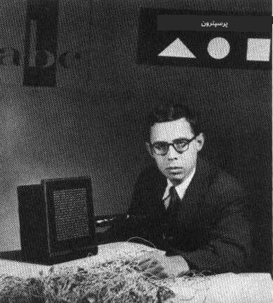
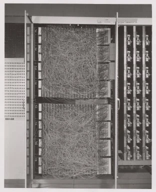

# نیورل نیٹ ورکس کا تعارف: پرسیپٹرون

## [لیکچر سے پہلے کا کوئز](https://ff-quizzes.netlify.app/en/ai/quiz/5)

جدید نیورل نیٹ ورک کے تصور کو عملی جامہ پہنانے کی پہلی کوشش 1957 میں کارنیل ایئروناٹیکل لیبارٹری کے فرینک روزن بلیٹ نے کی۔ یہ ایک ہارڈویئر پر مبنی نظام تھا جسے "مارک-1" کہا جاتا تھا، اور اس کا مقصد بنیادی جیومیٹرک اشکال جیسے مثلث، مربع اور دائرے کو پہچاننا تھا۔

|      |      |
|--------------|-----------|
| | |

> تصاویر [ویکیپیڈیا سے](https://en.wikipedia.org/wiki/Perceptron)

ان پٹ تصویر کو 20x20 فوٹو سیل کے ایک آرے کے ذریعے ظاہر کیا جاتا تھا، جس سے نیورل نیٹ ورک کے 400 ان پٹ اور ایک بائنری آؤٹ پٹ ہوتا تھا۔ ایک سادہ نیٹ ورک میں ایک نیورون ہوتا تھا، جسے **تھریش ہولڈ لاجک یونٹ** بھی کہا جاتا ہے۔ نیورل نیٹ ورک کے وزن پوٹینشیومیٹرز کی طرح کام کرتے تھے، جنہیں تربیت کے دوران دستی طور پر ایڈجسٹ کرنا پڑتا تھا۔

> ✅ پوٹینشیومیٹر ایک ایسا آلہ ہے جو صارف کو سرکٹ کی مزاحمت کو ایڈجسٹ کرنے کی اجازت دیتا ہے۔

> نیویارک ٹائمز نے اس وقت پرسیپٹرون کے بارے میں لکھا: *ایک الیکٹرانک کمپیوٹر کا جنین جس سے [بحریہ] توقع کرتی ہے کہ وہ چل سکے گا، بات کر سکے گا، دیکھ سکے گا، لکھ سکے گا، خود کو دوبارہ پیدا کر سکے گا اور اپنی موجودگی سے آگاہ ہو سکے گا۔*

## پرسیپٹرون ماڈل

فرض کریں کہ ہمارے ماڈل میں N فیچرز ہیں، اس صورت میں ان پٹ ویکٹر N سائز کا ایک ویکٹر ہوگا۔ پرسیپٹرون ایک **بائنری کلاسیفکیشن** ماڈل ہے، یعنی یہ ان پٹ ڈیٹا کی دو کلاسز کے درمیان فرق کر سکتا ہے۔ ہم فرض کریں گے کہ ہر ان پٹ ویکٹر x کے لیے ہمارے پرسیپٹرون کا آؤٹ پٹ یا تو +1 ہوگا یا -1، ڈیٹا کی کلاس پر منحصر ہے۔ آؤٹ پٹ درج ذیل فارمولے کے ذریعے حساب کیا جائے گا:

y(x) = f(w<sup>T</sup>x)

جہاں f ایک اسٹیپ ایکٹیویشن فنکشن ہے


## پرسیپٹرون کی تربیت

پرسیپٹرون کو تربیت دینے کے لیے ہمیں ایک وزن ویکٹر w تلاش کرنا ہوگا جو زیادہ تر اقدار کو درست طریقے سے درجہ بندی کرے، یعنی کم سے کم **غلطی** پیدا کرے۔ یہ غلطی E درج ذیل **پرسیپٹرون معیار** کے ذریعے بیان کی جاتی ہے:

E(w) = -&sum;w<sup>T</sup>x<sub>i</sub>t<sub>i</sub>

جہاں:

* جمع ان تربیتی ڈیٹا پوائنٹس i پر لی جاتی ہے جو غلط درجہ بندی کا نتیجہ دیتے ہیں
* x<sub>i</sub> ان پٹ ڈیٹا ہے، اور t<sub>i</sub> منفی اور مثبت مثالوں کے لیے بالترتیب -1 یا +1 ہے۔

یہ معیار وزن w کے ایک فنکشن کے طور پر سمجھا جاتا ہے، اور ہمیں اسے کم سے کم کرنا ہوتا ہے۔ اکثر، ایک طریقہ جسے **گریڈینٹ ڈیسنٹ** کہا جاتا ہے استعمال کیا جاتا ہے، جس میں ہم کچھ ابتدائی وزن w<sup>(0)</sup> سے شروع کرتے ہیں، اور پھر ہر قدم پر وزن کو درج ذیل فارمولے کے مطابق اپ ڈیٹ کرتے ہیں:

w<sup>(t+1)</sup> = w<sup>(t)</sup> - &eta;&nabla;E(w)

یہاں &eta; کو **لرننگ ریٹ** کہا جاتا ہے، اور &nabla;E(w) E کا **گریڈینٹ** ظاہر کرتا ہے۔ جب ہم گریڈینٹ کا حساب لگاتے ہیں، تو ہمیں درج ذیل حاصل ہوتا ہے:

w<sup>(t+1)</sup> = w<sup>(t)</sup> + &sum;&eta;x<sub>i</sub>t<sub>i</sub>

Python میں اس کا الگورتھم کچھ یوں دکھائی دیتا ہے:

```python
def train(positive_examples, negative_examples, num_iterations = 100, eta = 1):

    weights = [0,0,0] # Initialize weights (almost randomly :)
        
    for i in range(num_iterations):
        pos = random.choice(positive_examples)
        neg = random.choice(negative_examples)

        z = np.dot(pos, weights) # compute perceptron output
        if z < 0: # positive example classified as negative
            weights = weights + eta*weights.shape

        z  = np.dot(neg, weights)
        if z >= 0: # negative example classified as positive
            weights = weights - eta*weights.shape

    return weights
```


## نتیجہ

اس سبق میں، آپ نے پرسیپٹرون کے بارے میں سیکھا، جو ایک بائنری کلاسیفکیشن ماڈل ہے، اور اسے وزن ویکٹر کے ذریعے تربیت دینے کا طریقہ۔

## 🚀 چیلنج

اگر آپ اپنا پرسیپٹرون بنانا چاہتے ہیں، تو [Microsoft Learn](https://docs.microsoft.com/en-us/azure/machine-learning/component-reference/two-class-averaged-perceptron?WT.mc_id=academic-77998-cacaste) پر موجود اس لیب کو آزمائیں، جو [Azure ML designer](https://docs.microsoft.com/en-us/azure/machine-learning/concept-designer?WT.mc_id=academic-77998-cacaste) استعمال کرتی ہے۔

## [لیکچر کے بعد کا کوئز](https://ff-quizzes.netlify.app/en/ai/quiz/6)

## جائزہ اور خود مطالعہ

یہ دیکھنے کے لیے کہ ہم پرسیپٹرون کو کھلونا مسئلے اور حقیقی زندگی کے مسائل کو حل کرنے کے لیے کیسے استعمال کر سکتے ہیں، اور مزید سیکھنے کے لیے - [Perceptron](Perceptron.ipynb) نوٹ بک پر جائیں۔

یہ ایک دلچسپ [مضمون پرسیپٹرون کے بارے میں](https://towardsdatascience.com/what-is-a-perceptron-basics-of-neural-networks-c4cfea20c590) بھی ہے۔

## [اسائنمنٹ](lab/README.md)

اس سبق میں، ہم نے بائنری کلاسیفکیشن کے کام کے لیے ایک پرسیپٹرون نافذ کیا، اور اسے دو ہاتھ سے لکھے گئے ہندسوں کے درمیان درجہ بندی کرنے کے لیے استعمال کیا۔ اس لیب میں، آپ سے پورے ہندسہ درجہ بندی کے مسئلے کو حل کرنے کے لیے کہا گیا ہے، یعنی یہ تعین کریں کہ دی گئی تصویر کے مطابق کون سا ہندسہ سب سے زیادہ ممکنہ ہے۔

* [ہدایات](lab/README.md)
* [نوٹ بک](lab/PerceptronMultiClass.ipynb)

---

