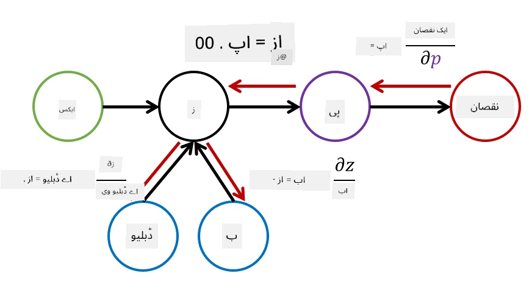

# نیورل نیٹ ورکس کا تعارف: ملٹی لیئرڈ پرسیپٹرون

پچھلے حصے میں، آپ نے سب سے سادہ نیورل نیٹ ورک ماڈل کے بارے میں سیکھا - ایک لیئرڈ پرسیپٹرون، جو ایک لکیری دو کلاسز کی درجہ بندی کا ماڈل ہے۔

اس حصے میں ہم اس ماڈل کو ایک زیادہ لچکدار فریم ورک میں تبدیل کریں گے، جو ہمیں درج ذیل کام کرنے کی اجازت دے گا:

* **ملٹی کلاس درجہ بندی** انجام دینا، دو کلاسز کے علاوہ
* **ریگریشن مسائل** حل کرنا، درجہ بندی کے علاوہ
* ایسی کلاسز کو الگ کرنا جو لکیری طور پر الگ نہیں ہیں

ہم Python میں اپنا ماڈیولر فریم ورک بھی تیار کریں گے جو ہمیں مختلف نیورل نیٹ ورک آرکیٹیکچرز بنانے کی اجازت دے گا۔

## [لیکچر سے پہلے کا کوئز](https://ff-quizzes.netlify.app/en/ai/quiz/7)

## مشین لرننگ کی رسمی تعریف

آئیے مشین لرننگ کے مسئلے کو رسمی طور پر بیان کرتے ہیں۔ فرض کریں کہ ہمارے پاس ایک تربیتی ڈیٹا سیٹ **X** ہے جس کے لیبلز **Y** ہیں، اور ہمیں ایک ماڈل *f* بنانا ہے جو سب سے زیادہ درست پیش گوئیاں کرے۔ پیش گوئیوں کے معیار کو **لاس فنکشن** &lagran; کے ذریعے ماپا جاتا ہے۔ درج ذیل لاس فنکشنز اکثر استعمال کیے جاتے ہیں:

* ریگریشن مسئلے کے لیے، جب ہمیں ایک عدد کی پیش گوئی کرنی ہو، ہم **ایبسولیوٹ ایرر** &sum;i|f(x(i))-y(i)| یا **اسکوئرڈ ایرر** &sum;i(f(x(i))-y(i))2 استعمال کر سکتے ہیں۔
* درجہ بندی کے لیے، ہم **0-1 لاس** (جو بنیادی طور پر ماڈل کی **درستگی** کے برابر ہے) یا **لاجسٹک لاس** استعمال کرتے ہیں۔

ایک لیول پرسیپٹرون کے لیے، فنکشن *f* کو ایک لکیری فنکشن *f(x)=wx+b* کے طور پر بیان کیا گیا تھا (یہاں *w* وزن میٹرکس ہے، *x* ان پٹ فیچرز کا ویکٹر ہے، اور *b* بایس ویکٹر ہے)۔ مختلف نیورل نیٹ ورک آرکیٹیکچرز کے لیے، یہ فنکشن زیادہ پیچیدہ شکل اختیار کر سکتا ہے۔

> درجہ بندی کے معاملے میں، اکثر یہ مطلوب ہوتا ہے کہ نیٹ ورک آؤٹ پٹ کے طور پر متعلقہ کلاسز کی احتمالات حاصل کی جائیں۔ غیر معمولی نمبروں کو احتمالات میں تبدیل کرنے کے لیے (مثلاً آؤٹ پٹ کو نارملائز کرنے کے لیے)، ہم اکثر **سافٹ میکس** فنکشن &sigma; استعمال کرتے ہیں، اور فنکشن *f* بن جاتا ہے *f(x)=&sigma;(wx+b)*۔

اوپر دی گئی *f* کی تعریف میں، *w* اور *b* کو **پیرامیٹرز** &theta;=⟨*w,b*⟩ کہا جاتا ہے۔ دیے گئے ڈیٹا سیٹ ⟨**X**,**Y**⟩ کے ساتھ، ہم پورے ڈیٹا سیٹ پر مجموعی غلطی کو پیرامیٹرز &theta; کے فنکشن کے طور پر حساب کر سکتے ہیں۔

> ✅ **نیورل نیٹ ورک کی تربیت کا مقصد غلطی کو کم کرنا ہے، پیرامیٹرز &theta; کو تبدیل کر کے۔**

## گریڈینٹ ڈیسینٹ آپٹیمائزیشن

فنکشن آپٹیمائزیشن کا ایک معروف طریقہ **گریڈینٹ ڈیسینٹ** ہے۔ اس کا خیال یہ ہے کہ ہم لاس فنکشن کا مشتق (کثیر جہتی صورت میں **گریڈینٹ** کہا جاتا ہے) پیرامیٹرز کے لحاظ سے حساب کر سکتے ہیں، اور پیرامیٹرز کو اس طرح تبدیل کر سکتے ہیں کہ غلطی کم ہو جائے۔ اسے درج ذیل طور پر رسمی بنایا جا سکتا ہے:

* پیرامیٹرز کو کچھ بے ترتیب اقدار w(0), b(0) سے شروع کریں۔
* درج ذیل قدم کئی بار دہرائیں:
    - w(i+1) = w(i)-&eta;&part;&lagran;/&part;w
    - b(i+1) = b(i)-&eta;&part;&lagran;/&part;b

تربیت کے دوران، آپٹیمائزیشن کے قدم پورے ڈیٹا سیٹ کو مدنظر رکھتے ہوئے حساب کیے جانے چاہئیں (یاد رکھیں کہ لاس تمام تربیتی نمونوں کے ذریعے مجموعہ کے طور پر حساب کیا جاتا ہے)۔ تاہم، حقیقی زندگی میں ہم ڈیٹا سیٹ کے چھوٹے حصے لیتے ہیں جنہیں **منی بیچز** کہا جاتا ہے، اور ڈیٹا کے ذیلی سیٹ کی بنیاد پر گریڈینٹس حساب کرتے ہیں۔ چونکہ ہر بار ذیلی سیٹ کو بے ترتیب طور پر لیا جاتا ہے، اس طریقے کو **اسٹوکاسٹک گریڈینٹ ڈیسینٹ** (SGD) کہا جاتا ہے۔

## ملٹی لیئرڈ پرسیپٹرونز اور بیک پروپیگیشن

ایک لیئرڈ نیٹ ورک، جیسا کہ ہم نے اوپر دیکھا، لکیری طور پر الگ کلاسز کی درجہ بندی کرنے کے قابل ہے۔ ایک زیادہ بھرپور ماڈل بنانے کے لیے، ہم نیٹ ورک کی کئی لیئرز کو یکجا کر سکتے ہیں۔ ریاضیاتی طور پر اس کا مطلب ہوگا کہ فنکشن *f* زیادہ پیچیدہ شکل اختیار کرے گا، اور کئی مراحل میں حساب کیا جائے گا:
* z1=w1x+b1
* z2=w2&alpha;(z1)+b2
* f = &sigma;(z2)

یہاں، &alpha; ایک **غیر لکیری ایکٹیویشن فنکشن** ہے، &sigma; ایک سافٹ میکس فنکشن ہے، اور پیرامیٹرز &theta;=<*w1,b1,w2,b2*> ہیں۔

گریڈینٹ ڈیسینٹ الگورتھم وہی رہے گا، لیکن گریڈینٹس کا حساب کرنا زیادہ مشکل ہوگا۔ چین ڈیفرینسیشن رول کے مطابق، ہم مشتقات کا حساب درج ذیل طور پر کر سکتے ہیں:

* &part;&lagran;/&part;w2 = (&part;&lagran;/&part;&sigma;)(&part;&sigma;/&part;z2)(&part;z2/&part;w2)
* &part;&lagran;/&part;w1 = (&part;&lagran;/&part;&sigma;)(&part;&sigma;/&part;z2)(&part;z2/&part;&alpha;)(&part;&alpha;/&part;z1)(&part;z1/&part;w1)

> ✅ چین ڈیفرینسیشن رول لاس فنکشن کے پیرامیٹرز کے لحاظ سے مشتقات کا حساب کرنے کے لیے استعمال کیا جاتا ہے۔

نوٹ کریں کہ ان تمام تاثرات کا بائیں طرف کا حصہ ایک جیسا ہے، اور اس طرح ہم مؤثر طریقے سے مشتقات کا حساب لاس فنکشن سے شروع کر کے "پیچھے کی طرف" کمپیوٹیشنل گراف کے ذریعے کر سکتے ہیں۔ اس طرح ملٹی لیئرڈ پرسیپٹرون کی تربیت کا طریقہ **بیک پروپیگیشن** یا 'بیک پروپ' کہلاتا ہے۔

> TODO: تصویر کا حوالہ

> ✅ ہم بیک پروپ کو اپنے نوٹ بک کی مثال میں بہت زیادہ تفصیل سے کور کریں گے۔

## نتیجہ

اس سبق میں، ہم نے اپنی نیورل نیٹ ورک لائبریری بنائی، اور اسے ایک سادہ دو جہتی درجہ بندی کے کام کے لیے استعمال کیا۔

## 🚀 چیلنج

ساتھ دی گئی نوٹ بک میں، آپ ملٹی لیئرڈ پرسیپٹرونز بنانے اور تربیت دینے کے لیے اپنا فریم ورک نافذ کریں گے۔ آپ جدید نیورل نیٹ ورکس کے کام کرنے کے طریقے کو تفصیل سے دیکھ سکیں گے۔

[OwnFramework](OwnFramework.ipynb) نوٹ بک پر جائیں اور اس پر کام کریں۔

## [لیکچر کے بعد کا کوئز](https://ff-quizzes.netlify.app/en/ai/quiz/8)

## جائزہ اور خود مطالعہ

بیک پروپیگیشن AI اور ML میں استعمال ہونے والا ایک عام الگورتھم ہے، جس کا [تفصیل سے مطالعہ](https://wikipedia.org/wiki/Backpropagation) کرنا فائدہ مند ہے۔

## [اسائنمنٹ](lab/README.md)

اس لیب میں، آپ سے کہا گیا ہے کہ آپ اس سبق میں بنائے گئے فریم ورک کو استعمال کرتے ہوئے MNIST ہاتھ سے لکھے گئے ہندسوں کی درجہ بندی حل کریں۔

* [ہدایات](lab/README.md)
* [نوٹ بک](lab/MyFW_MNIST.ipynb)

---

