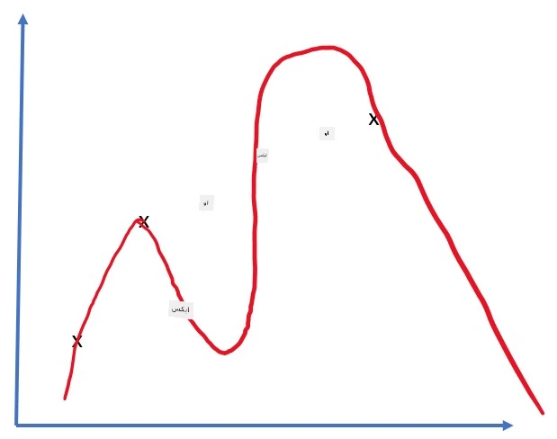
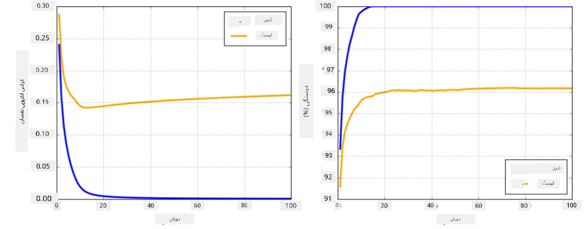

# نیورل نیٹ ورک فریم ورک

جیسا کہ ہم پہلے ہی سیکھ چکے ہیں، نیورل نیٹ ورکس کو مؤثر طریقے سے تربیت دینے کے لیے ہمیں دو کام کرنے کی ضرورت ہے:

* ٹینسرز پر کام کرنا، جیسے ضرب دینا، جمع کرنا، اور کچھ فنکشنز جیسے sigmoid یا softmax کا حساب لگانا۔
* تمام ایکسپریشنز کے گریڈینٹس کا حساب لگانا، تاکہ گریڈینٹ ڈیسنٹ آپٹیمائزیشن انجام دی جا سکے۔

## [پری لیکچر کوئز](https://ff-quizzes.netlify.app/en/ai/quiz/9)

جبکہ `numpy` لائبریری پہلا کام کر سکتی ہے، ہمیں گریڈینٹس کا حساب لگانے کے لیے کچھ میکانزم کی ضرورت ہے۔ [ہمارے فریم ورک](../04-OwnFramework/OwnFramework.ipynb) میں، جو ہم نے پچھلے سیکشن میں تیار کیا تھا، ہمیں `backward` میتھڈ کے اندر تمام ڈیریویٹیو فنکشنز کو دستی طور پر پروگرام کرنا پڑا، جو بیک پروپیگیشن کرتا ہے۔ مثالی طور پر، ایک فریم ورک ہمیں *کسی بھی ایکسپریشن* کے گریڈینٹس کا حساب لگانے کا موقع فراہم کرنا چاہیے جو ہم ڈیفائن کر سکتے ہیں۔

ایک اور اہم چیز یہ ہے کہ GPU یا کسی دوسرے مخصوص کمپیوٹ یونٹس، جیسے [TPU](https://en.wikipedia.org/wiki/Tensor_Processing_Unit) پر کمپیوٹیشنز انجام دینے کے قابل ہونا۔ ڈیپ نیورل نیٹ ورک کی تربیت کے لیے *بہت زیادہ* کمپیوٹیشنز کی ضرورت ہوتی ہے، اور GPU پر ان کمپیوٹیشنز کو پیراللائز کرنے کے قابل ہونا بہت اہم ہے۔

> ✅ 'پیراللائز' کا مطلب ہے کہ کمپیوٹیشنز کو متعدد ڈیوائسز پر تقسیم کرنا۔

فی الحال، دو سب سے زیادہ مقبول نیورل فریم ورک ہیں: [TensorFlow](http://TensorFlow.org) اور [PyTorch](https://pytorch.org/)۔ دونوں CPU اور GPU پر ٹینسرز کے ساتھ کام کرنے کے لیے ایک لو لیول API فراہم کرتے ہیں۔ لو لیول API کے اوپر، ایک ہائی لیول API بھی موجود ہے، جسے [Keras](https://keras.io/) اور [PyTorch Lightning](https://pytorchlightning.ai/) کہا جاتا ہے۔

Low-Level API | [TensorFlow](http://TensorFlow.org) | [PyTorch](https://pytorch.org/)
--------------|-------------------------------------|--------------------------------
High-level API| [Keras](https://keras.io/) | [PyTorch Lightning](https://pytorchlightning.ai/)

**لو لیول APIs** دونوں فریم ورکس میں آپ کو **کمپیوٹیشنل گراف** بنانے کی اجازت دیتے ہیں۔ یہ گراف ڈیفائن کرتا ہے کہ دیے گئے ان پٹ پیرامیٹرز کے ساتھ آؤٹ پٹ (عام طور پر لاس فنکشن) کو کیسے کمپیوٹ کیا جائے، اور اگر GPU دستیاب ہو تو اسے کمپیوٹیشن کے لیے GPU پر بھیجا جا سکتا ہے۔ اس کمپیوٹیشنل گراف کو ڈیفرینشیٹ کرنے اور گریڈینٹس کا حساب لگانے کے لیے فنکشنز موجود ہیں، جنہیں پھر ماڈل پیرامیٹرز کو آپٹیمائز کرنے کے لیے استعمال کیا جا سکتا ہے۔

**ہائی لیول APIs** نیورل نیٹ ورکس کو بنیادی طور پر **لیئرز کی ترتیب** کے طور پر دیکھتے ہیں، اور زیادہ تر نیورل نیٹ ورکس کی تعمیر کو بہت آسان بنا دیتے ہیں۔ ماڈل کی تربیت عام طور پر ڈیٹا تیار کرنے اور پھر `fit` فنکشن کو کال کرنے کی ضرورت ہوتی ہے۔

ہائی لیول API آپ کو عام نیورل نیٹ ورکس کو بہت جلد تعمیر کرنے کی اجازت دیتا ہے بغیر بہت سی تفصیلات کی فکر کیے۔ دوسری طرف، لو لیول API تربیتی عمل پر زیادہ کنٹرول فراہم کرتا ہے، اور اس لیے تحقیق میں بہت زیادہ استعمال ہوتا ہے، جب آپ نئے نیورل نیٹ ورک آرکیٹیکچرز کے ساتھ کام کر رہے ہوں۔

یہ سمجھنا بھی ضروری ہے کہ آپ دونوں APIs کو ایک ساتھ استعمال کر سکتے ہیں، جیسے آپ لو لیول API کا استعمال کرتے ہوئے اپنی نیٹ ورک لیئر آرکیٹیکچر تیار کر سکتے ہیں، اور پھر اسے بڑے نیٹ ورک کے اندر استعمال کر سکتے ہیں جو ہائی لیول API کے ساتھ تعمیر اور تربیت یافتہ ہو۔ یا آپ ہائی لیول API کا استعمال کرتے ہوئے نیٹ ورک کو لیئرز کی ترتیب کے طور پر ڈیفائن کر سکتے ہیں، اور پھر اپنے لو لیول تربیتی لوپ کا استعمال کرتے ہوئے آپٹیمائزیشن انجام دے سکتے ہیں۔ دونوں APIs ایک ہی بنیادی تصورات استعمال کرتے ہیں، اور انہیں ایک ساتھ کام کرنے کے لیے ڈیزائن کیا گیا ہے۔

## سیکھنا

اس کورس میں، ہم زیادہ تر مواد PyTorch اور TensorFlow دونوں کے لیے پیش کرتے ہیں۔ آپ اپنی پسندیدہ فریم ورک کا انتخاب کر سکتے ہیں اور صرف متعلقہ نوٹ بکس کے ذریعے جا سکتے ہیں۔ اگر آپ کو یقین نہیں ہے کہ کون سا فریم ورک منتخب کرنا ہے، تو **PyTorch vs. TensorFlow** کے بارے میں انٹرنیٹ پر کچھ مباحثے پڑھیں۔ آپ دونوں فریم ورکس کو دیکھ کر بہتر سمجھ بھی حاصل کر سکتے ہیں۔

جہاں ممکن ہو، ہم سادگی کے لیے ہائی لیول APIs استعمال کریں گے۔ تاہم، ہمارا ماننا ہے کہ نیورل نیٹ ورکس کو بنیادی سطح سے سمجھنا ضروری ہے، اس لیے شروع میں ہم لو لیول API اور ٹینسرز کے ساتھ کام کرتے ہیں۔ تاہم، اگر آپ جلدی شروع کرنا چاہتے ہیں اور ان تفصیلات کو سیکھنے میں زیادہ وقت نہیں لگانا چاہتے، تو آپ انہیں چھوڑ کر سیدھے ہائی لیول API نوٹ بکس میں جا سکتے ہیں۔

## ✍️ مشقیں: فریم ورکس

اپنی تعلیم کو درج ذیل نوٹ بکس میں جاری رکھیں:

Low-Level API | [TensorFlow+Keras Notebook](IntroKerasTF.ipynb) | [PyTorch](IntroPyTorch.ipynb)
--------------|-------------------------------------|--------------------------------
High-level API| [Keras](IntroKeras.ipynb) | *PyTorch Lightning*

فریم ورکس میں مہارت حاصل کرنے کے بعد، آئیے اوورفٹنگ کے تصور کو دوبارہ دیکھتے ہیں۔

# اوورفٹنگ

اوورفٹنگ مشین لرننگ میں ایک انتہائی اہم تصور ہے، اور اسے صحیح طریقے سے سمجھنا بہت ضروری ہے!

ذیل میں 5 نقاط کو اپروکسیمیٹ کرنے کے مسئلے پر غور کریں (گراف میں `x` کے ذریعے ظاہر کیے گئے):

 | 
-------------------------|--------------------------
**لینیئر ماڈل، 2 پیرامیٹرز** | **نان-لینیئر ماڈل، 7 پیرامیٹرز**
ٹریننگ ایرر = 5.3 | ٹریننگ ایرر = 0
ویلیڈیشن ایرر = 5.1 | ویلیڈیشن ایرر = 20

* بائیں جانب، ہم ایک اچھی سیدھی لائن اپروکسیمیشن دیکھتے ہیں۔ کیونکہ پیرامیٹرز کی تعداد مناسب ہے، ماڈل پوائنٹ ڈسٹریبیوشن کے پیچھے آئیڈیا کو صحیح طریقے سے سمجھتا ہے۔
* دائیں جانب، ماڈل بہت طاقتور ہے۔ کیونکہ ہمارے پاس صرف 5 پوائنٹس ہیں اور ماڈل کے پاس 7 پیرامیٹرز ہیں، یہ اس طرح ایڈجسٹ کر سکتا ہے کہ تمام پوائنٹس سے گزرے، جس سے ٹریننگ ایرر 0 ہو جاتا ہے۔ تاہم، یہ ماڈل کو ڈیٹا کے پیچھے صحیح پیٹرن کو سمجھنے سے روکتا ہے، اس لیے ویلیڈیشن ایرر بہت زیادہ ہے۔

ماڈل کی پیچیدگی (پیرامیٹرز کی تعداد) اور تربیتی نمونوں کی تعداد کے درمیان صحیح توازن قائم کرنا بہت ضروری ہے۔

## اوورفٹنگ کیوں ہوتی ہے؟

  * تربیتی ڈیٹا کی کمی
  * بہت طاقتور ماڈل
  * ان پٹ ڈیٹا میں بہت زیادہ شور

## اوورفٹنگ کا پتہ کیسے لگائیں؟

جیسا کہ آپ اوپر گراف سے دیکھ سکتے ہیں، اوورفٹنگ کا پتہ بہت کم ٹریننگ ایرر اور بہت زیادہ ویلیڈیشن ایرر سے لگایا جا سکتا ہے۔ عام طور پر تربیت کے دوران ہم دیکھیں گے کہ ٹریننگ اور ویلیڈیشن ایرر دونوں کم ہونا شروع ہو جاتے ہیں، اور پھر کسی وقت ویلیڈیشن ایرر کم ہونا بند کر سکتا ہے اور بڑھنا شروع کر سکتا ہے۔ یہ اوورفٹنگ کی علامت ہوگی، اور اس بات کا اشارہ کہ ہمیں شاید اس وقت تربیت روک دینی چاہیے (یا کم از کم ماڈل کا اسنیپ شاٹ لینا چاہیے)۔

## اوورفٹنگ کو کیسے روکا جائے؟

اگر آپ دیکھتے ہیں کہ اوورفٹنگ ہو رہی ہے، تو آپ درج ذیل میں سے کوئی ایک کام کر سکتے ہیں:

 * تربیتی ڈیٹا کی مقدار بڑھائیں
 * ماڈل کی پیچیدگی کم کریں
 * کچھ [ریگولرائزیشن تکنیک](../../4-ComputerVision/08-TransferLearning/TrainingTricks.md) استعمال کریں، جیسے [Dropout](../../4-ComputerVision/08-TransferLearning/TrainingTricks.md#Dropout)، جس پر ہم بعد میں غور کریں گے۔

## اوورفٹنگ اور بائس-واریئنس ٹریڈ آف

اوورفٹنگ دراصل شماریات میں ایک زیادہ عمومی مسئلے کا کیس ہے جسے [Bias-Variance Tradeoff](https://en.wikipedia.org/wiki/Bias%E2%80%93variance_tradeoff) کہا جاتا ہے۔ اگر ہم اپنے ماڈل میں ایرر کے ممکنہ ذرائع پر غور کریں، تو ہم دو قسم کے ایرر دیکھ سکتے ہیں:

* **بائس ایرر** ہمارے الگورتھم کی وجہ سے ہوتا ہے جو تربیتی ڈیٹا کے درمیان تعلق کو صحیح طریقے سے سمجھنے میں ناکام ہوتا ہے۔ یہ اس حقیقت سے پیدا ہو سکتا ہے کہ ہمارا ماڈل کافی طاقتور نہیں ہے (**انڈر فٹنگ**).
* **واریئنس ایرر**، جو ماڈل کے ان پٹ ڈیٹا میں شور کو معنی خیز تعلق کے بجائے اپروکسیمیٹ کرنے کی وجہ سے ہوتا ہے (**اوورفٹنگ**).

تربیت کے دوران، بائس ایرر کم ہوتا ہے (جب ہمارا ماڈل ڈیٹا کو اپروکسیمیٹ کرنا سیکھتا ہے)، اور واریئنس ایرر بڑھتا ہے۔ اوورفٹنگ کو روکنے کے لیے تربیت کو روکنا ضروری ہے - یا تو دستی طور پر (جب ہم اوورفٹنگ کا پتہ لگاتے ہیں) یا خودکار طور پر (ریگولرائزیشن متعارف کروا کر)۔

## نتیجہ

اس سبق میں، آپ نے دو سب سے زیادہ مقبول AI فریم ورکس، TensorFlow اور PyTorch کے مختلف APIs کے درمیان فرق کے بارے میں سیکھا۔ اس کے علاوہ، آپ نے ایک بہت اہم موضوع، اوورفٹنگ کے بارے میں سیکھا۔

## 🚀 چیلنج

ساتھ والے نوٹ بکس میں، آپ کو نیچے 'ٹاسکس' ملیں گے؛ نوٹ بکس کے ذریعے کام کریں اور ٹاسکس مکمل کریں۔

## [پوسٹ لیکچر کوئز](https://ff-quizzes.netlify.app/en/ai/quiz/10)

## جائزہ اور خود مطالعہ

درج ذیل موضوعات پر کچھ تحقیق کریں:

- TensorFlow
- PyTorch
- اوورفٹنگ

اپنے آپ سے درج ذیل سوالات پوچھیں:

- TensorFlow اور PyTorch میں کیا فرق ہے؟
- اوورفٹنگ اور انڈر فٹنگ میں کیا فرق ہے؟

## [اسائنمنٹ](lab/README.md)

اس لیب میں، آپ سے PyTorch یا TensorFlow کا استعمال کرتے ہوئے سنگل اور ملٹی لیئرڈ مکمل طور پر کنیکٹڈ نیٹ ورکس کے ذریعے دو کلاسیفیکیشن مسائل حل کرنے کو کہا گیا ہے۔

* [ہدایات](lab/README.md)
* [نوٹ بک](lab/LabFrameworks.ipynb)

---

