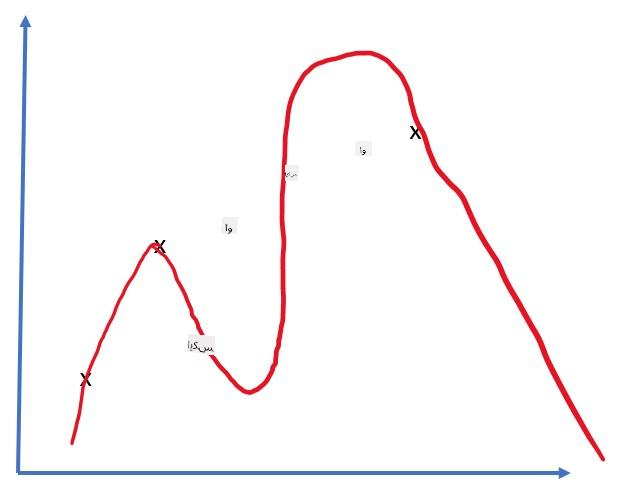
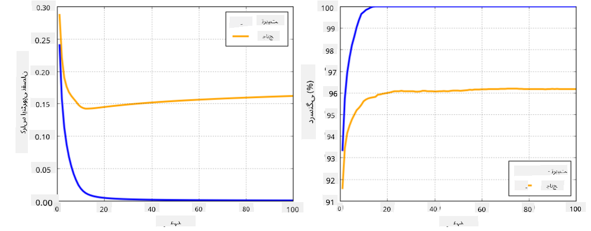

<!--
CO_OP_TRANSLATOR_METADATA:
{
  "original_hash": "2b544f20b796402507fb05a0df893323",
  "translation_date": "2025-08-26T10:30:28+00:00",
  "source_file": "lessons/3-NeuralNetworks/05-Frameworks/README.md",
  "language_code": "ur"
}
-->
# نیورل نیٹ ورک فریم ورک

جیسا کہ ہم پہلے ہی سیکھ چکے ہیں، نیورل نیٹ ورکس کو مؤثر طریقے سے ٹرین کرنے کے لیے ہمیں دو کام کرنے کی ضرورت ہے:

* ٹینسرز پر کام کرنا، جیسے ضرب دینا، جمع کرنا، اور کچھ فنکشنز جیسے سگموئڈ یا سوفٹ میکس کا حساب لگانا  
* تمام ایکسپریشنز کے گریڈینٹس کا حساب لگانا، تاکہ گریڈینٹ ڈیسنٹ آپٹیمائزیشن کی جا سکے  

## [لیکچر سے پہلے کا کوئز](https://ff-quizzes.netlify.app/en/ai/quiz/9)

اگرچہ `numpy` لائبریری پہلا کام کر سکتی ہے، ہمیں گریڈینٹس کا حساب لگانے کے لیے کسی میکانزم کی ضرورت ہے۔ [ہمارے فریم ورک](../../../../../lessons/3-NeuralNetworks/04-OwnFramework/OwnFramework.ipynb) میں، جو ہم نے پچھلے سیکشن میں تیار کیا تھا، ہمیں `backward` میتھڈ کے اندر تمام ڈیریویٹو فنکشنز کو دستی طور پر پروگرام کرنا پڑا، جو بیک پروپیگیشن کرتا ہے۔ مثالی طور پر، ایک فریم ورک ہمیں *کسی بھی ایکسپریشن* کے گریڈینٹس کا حساب لگانے کا موقع فراہم کرے۔

ایک اور اہم چیز یہ ہے کہ جی پی یو یا کسی اور خاص کمپیوٹ یونٹ، جیسے [TPU](https://en.wikipedia.org/wiki/Tensor_Processing_Unit) پر کمپیوٹیشنز انجام دینے کے قابل ہونا۔ ڈیپ نیورل نیٹ ورک کی ٹریننگ میں *بہت زیادہ* کمپیوٹیشنز کی ضرورت ہوتی ہے، اور ان کمپیوٹیشنز کو جی پی یوز پر پیراللائز کرنا بہت اہم ہے۔

> ✅ 'پیراللائز' کا مطلب ہے کہ کمپیوٹیشنز کو متعدد ڈیوائسز پر تقسیم کرنا۔

فی الحال، دو سب سے زیادہ مقبول نیورل فریم ورک ہیں: [TensorFlow](http://TensorFlow.org) اور [PyTorch](https://pytorch.org/)۔ دونوں سی پی یو اور جی پی یو پر ٹینسرز کے ساتھ کام کرنے کے لیے ایک لو-لیول API فراہم کرتے ہیں۔ لو-لیول API کے اوپر، ایک ہائی-لیول API بھی موجود ہے، جسے بالترتیب [Keras](https://keras.io/) اور [PyTorch Lightning](https://pytorchlightning.ai/) کہا جاتا ہے۔

Low-Level API | [TensorFlow](http://TensorFlow.org) | [PyTorch](https://pytorch.org/)  
--------------|-------------------------------------|--------------------------------  
High-level API| [Keras](https://keras.io/) | [PyTorch Lightning](https://pytorchlightning.ai/)  

**لو-لیول APIs** دونوں فریم ورکس میں آپ کو **کمپیوٹیشنل گراف** بنانے کی اجازت دیتے ہیں۔ یہ گراف یہ طے کرتا ہے کہ دیے گئے ان پٹ پیرامیٹرز کے ساتھ آؤٹ پٹ (عام طور پر لاس فنکشن) کو کیسے کمپیوٹ کیا جائے، اور اگر جی پی یو دستیاب ہو تو اسے کمپیوٹیشن کے لیے وہاں بھیجا جا سکتا ہے۔ اس کمپیوٹیشنل گراف کو ڈیفرینشیٹ کرنے اور گریڈینٹس کا حساب لگانے کے لیے فنکشنز موجود ہیں، جنہیں ماڈل پیرامیٹرز کو آپٹیمائز کرنے کے لیے استعمال کیا جا سکتا ہے۔

**ہائی-لیول APIs** نیورل نیٹ ورکس کو زیادہ تر **لیئرز کے سلسلے** کے طور پر دیکھتے ہیں، اور زیادہ تر نیورل نیٹ ورکس کی تعمیر کو بہت آسان بنا دیتے ہیں۔ ماڈل کی ٹریننگ عام طور پر ڈیٹا تیار کرنے اور پھر `fit` فنکشن کو کال کرنے کی ضرورت ہوتی ہے۔

ہائی-لیول API آپ کو عام نیورل نیٹ ورکس کو بہت تیزی سے بنانے کی اجازت دیتا ہے بغیر بہت سی تفصیلات کی فکر کیے۔ اسی وقت، لو-لیول API ٹریننگ کے عمل پر زیادہ کنٹرول فراہم کرتا ہے، اور اس لیے یہ تحقیق میں بہت زیادہ استعمال ہوتا ہے، جب آپ نئے نیورل نیٹ ورک آرکیٹیکچرز کے ساتھ کام کر رہے ہوں۔

یہ سمجھنا بھی ضروری ہے کہ آپ دونوں APIs کو ایک ساتھ استعمال کر سکتے ہیں، جیسے کہ آپ لو-لیول API کا استعمال کرتے ہوئے اپنی نیٹ ورک لیئر آرکیٹیکچر تیار کر سکتے ہیں، اور پھر اسے ہائی-لیول API کے ساتھ بنائے گئے اور ٹرین کیے گئے بڑے نیٹ ورک کے اندر استعمال کر سکتے ہیں۔ یا آپ ہائی-لیول API کا استعمال کرتے ہوئے لیئرز کے سلسلے کے طور پر نیٹ ورک کی تعریف کر سکتے ہیں، اور پھر آپٹیمائزیشن انجام دینے کے لیے اپنا لو-لیول ٹریننگ لوپ استعمال کر سکتے ہیں۔ دونوں APIs ایک ہی بنیادی تصورات کا استعمال کرتے ہیں، اور انہیں ایک ساتھ کام کرنے کے لیے ڈیزائن کیا گیا ہے۔

## سیکھنا

اس کورس میں، ہم زیادہ تر مواد PyTorch اور TensorFlow دونوں کے لیے پیش کرتے ہیں۔ آپ اپنی پسند کا فریم ورک منتخب کر سکتے ہیں اور صرف متعلقہ نوٹ بکس کے ذریعے جا سکتے ہیں۔ اگر آپ کو یقین نہیں ہے کہ کون سا فریم ورک منتخب کرنا ہے، تو انٹرنیٹ پر **PyTorch بمقابلہ TensorFlow** کے بارے میں کچھ مباحثے پڑھیں۔ آپ دونوں فریم ورکس کو دیکھ کر بھی بہتر سمجھ حاصل کر سکتے ہیں۔

جہاں ممکن ہو، ہم سادگی کے لیے ہائی-لیول APIs استعمال کریں گے۔ تاہم، ہمارا ماننا ہے کہ نیورل نیٹ ورکس کو بنیادی سطح سے سمجھنا ضروری ہے، اس لیے شروع میں ہم لو-لیول API اور ٹینسرز کے ساتھ کام کرنے سے آغاز کریں گے۔ تاہم، اگر آپ تیزی سے آگے بڑھنا چاہتے ہیں اور ان تفصیلات کو سیکھنے میں زیادہ وقت نہیں گزارنا چاہتے، تو آپ ان کو چھوڑ کر سیدھے ہائی-لیول API نوٹ بکس میں جا سکتے ہیں۔

## ✍️ مشقیں: فریم ورک

مندرجہ ذیل نوٹ بکس میں اپنی تعلیم جاری رکھیں:

Low-Level API | [TensorFlow+Keras Notebook](../../../../../lessons/3-NeuralNetworks/05-Frameworks/IntroKerasTF.ipynb) | [PyTorch](../../../../../lessons/3-NeuralNetworks/05-Frameworks/IntroPyTorch.ipynb)  
--------------|-------------------------------------|--------------------------------  
High-level API| [Keras](../../../../../lessons/3-NeuralNetworks/05-Frameworks/IntroKeras.ipynb) | *PyTorch Lightning*  

فریم ورک میں مہارت حاصل کرنے کے بعد، آئیے اوورفٹنگ کے تصور کا جائزہ لیں۔

# اوورفٹنگ

اوورفٹنگ مشین لرننگ میں ایک انتہائی اہم تصور ہے، اور اسے صحیح طریقے سے سمجھنا بہت ضروری ہے!

مندرجہ ذیل مسئلے پر غور کریں، جہاں ہمیں 5 پوائنٹس (گراف میں `x` سے ظاہر کیے گئے) کو اپروکسیمیٹ کرنا ہے:

 |   
-------------------------|--------------------------  
**لکیری ماڈل، 2 پیرامیٹرز** | **نان-لکیری ماڈل، 7 پیرامیٹرز**  
ٹریننگ ایرر = 5.3 | ٹریننگ ایرر = 0  
ویلیڈیشن ایرر = 5.1 | ویلیڈیشن ایرر = 20  

* بائیں طرف، ہم ایک اچھی سیدھی لائن اپروکسیمیشن دیکھتے ہیں۔ چونکہ پیرامیٹرز کی تعداد مناسب ہے، ماڈل پوائنٹس کی تقسیم کے پیچھے آئیڈیا کو صحیح طریقے سے سمجھتا ہے۔  
* دائیں طرف، ماڈل بہت زیادہ طاقتور ہے۔ چونکہ ہمارے پاس صرف 5 پوائنٹس ہیں اور ماڈل کے پاس 7 پیرامیٹرز ہیں، یہ اس طرح ایڈجسٹ ہو سکتا ہے کہ تمام پوائنٹس سے گزرے، جس سے ٹریننگ ایرر 0 ہو جائے۔ تاہم، یہ ماڈل کو ڈیٹا کے پیچھے صحیح پیٹرن کو سمجھنے سے روکتا ہے، اس لیے ویلیڈیشن ایرر بہت زیادہ ہے۔

یہ ماڈل کی پیچیدگی (پیرامیٹرز کی تعداد) اور ٹریننگ سیمپلز کی تعداد کے درمیان صحیح توازن قائم کرنا بہت اہم ہے۔

## اوورفٹنگ کیوں ہوتی ہے

  * ٹریننگ ڈیٹا کی کمی  
  * بہت زیادہ طاقتور ماڈل  
  * ان پٹ ڈیٹا میں بہت زیادہ شور  

## اوورفٹنگ کا پتہ کیسے لگائیں

جیسا کہ آپ اوپر گراف سے دیکھ سکتے ہیں، اوورفٹنگ کا پتہ بہت کم ٹریننگ ایرر اور بہت زیادہ ویلیڈیشن ایرر سے لگایا جا سکتا ہے۔ عام طور پر ٹریننگ کے دوران ہم دیکھیں گے کہ ٹریننگ اور ویلیڈیشن ایرر دونوں کم ہونا شروع ہو جاتے ہیں، اور پھر کسی وقت ویلیڈیشن ایرر کم ہونا بند کر سکتا ہے اور بڑھنا شروع کر سکتا ہے۔ یہ اوورفٹنگ کی علامت ہوگی، اور یہ اشارہ دے گا کہ ہمیں شاید اس وقت ٹریننگ روک دینی چاہیے (یا کم از کم ماڈل کا اسنیپ شاٹ لے لینا چاہیے)۔

## اوورفٹنگ کو کیسے روکا جائے

اگر آپ دیکھتے ہیں کہ اوورفٹنگ ہو رہی ہے، تو آپ درج ذیل میں سے کوئی ایک کام کر سکتے ہیں:

 * ٹریننگ ڈیٹا کی مقدار میں اضافہ کریں  
 * ماڈل کی پیچیدگی کو کم کریں  
 * کچھ [ریگولرائزیشن تکنیک](../../4-ComputerVision/08-TransferLearning/TrainingTricks.md) استعمال کریں، جیسے [ڈراپ آؤٹ](../../4-ComputerVision/08-TransferLearning/TrainingTricks.md#Dropout)، جس پر ہم بعد میں غور کریں گے۔  

## اوورفٹنگ اور بایس-ویریئنس ٹریڈ آف

اوورفٹنگ دراصل شماریات میں ایک زیادہ عمومی مسئلے کا معاملہ ہے جسے [بایس-ویریئنس ٹریڈ آف](https://en.wikipedia.org/wiki/Bias%E2%80%93variance_tradeoff) کہا جاتا ہے۔ اگر ہم اپنے ماڈل میں ایرر کے ممکنہ ذرائع پر غور کریں، تو ہم دو قسم کے ایررز دیکھ سکتے ہیں:

* **بایس ایررز**، جو ہمارے الگورتھم کی وجہ سے ٹریننگ ڈیٹا کے درمیان تعلق کو صحیح طریقے سے سمجھنے میں ناکامی کا نتیجہ ہیں۔ یہ اس حقیقت کی وجہ سے ہو سکتا ہے کہ ہمارا ماڈل کافی طاقتور نہیں ہے (**انڈر فٹنگ**)۔  
* **ویریئنس ایررز**، جو ان پٹ ڈیٹا میں شور کو معنی خیز تعلق کے بجائے اپروکسیمیٹ کرنے کی وجہ سے ہوتے ہیں (**اوورفٹنگ**)۔  

ٹریننگ کے دوران، بایس ایرر کم ہوتا ہے (کیونکہ ہمارا ماڈل ڈیٹا کو اپروکسیمیٹ کرنا سیکھتا ہے)، اور ویریئنس ایرر بڑھتا ہے۔ یہ ضروری ہے کہ ٹریننگ کو روک دیا جائے - یا تو دستی طور پر (جب ہم اوورفٹنگ کا پتہ لگائیں) یا خودکار طور پر (ریگولرائزیشن متعارف کروا کر) - تاکہ اوورفٹنگ کو روکا جا سکے۔

## نتیجہ

اس سبق میں، آپ نے دو سب سے زیادہ مقبول AI فریم ورکس، TensorFlow اور PyTorch کے مختلف APIs کے درمیان فرق کے بارے میں سیکھا۔ اس کے علاوہ، آپ نے ایک بہت اہم موضوع، اوورفٹنگ کے بارے میں سیکھا۔

## 🚀 چیلنج

ساتھ دی گئی نوٹ بکس میں، آپ کو 'ٹاسکس' نیچے ملیں گے؛ نوٹ بکس کے ذریعے کام کریں اور ٹاسکس مکمل کریں۔

## [لیکچر کے بعد کا کوئز](https://ff-quizzes.netlify.app/en/ai/quiz/10)

## جائزہ اور خود مطالعہ

مندرجہ ذیل موضوعات پر کچھ تحقیق کریں:

- TensorFlow  
- PyTorch  
- اوورفٹنگ  

اپنے آپ سے درج ذیل سوالات پوچھیں:

- TensorFlow اور PyTorch میں کیا فرق ہے؟  
- اوورفٹنگ اور انڈر فٹنگ میں کیا فرق ہے؟  

## [اسائنمنٹ](lab/README.md)

اس لیب میں، آپ سے PyTorch یا TensorFlow کا استعمال کرتے ہوئے سنگل اور ملٹی لیئرڈ مکمل طور پر کنیکٹڈ نیٹ ورکس کے ذریعے دو کلاسیفکیشن مسائل حل کرنے کو کہا گیا ہے۔

* [ہدایات](lab/README.md)  
* [نوٹ بک](../../../../../lessons/3-NeuralNetworks/05-Frameworks/lab/LabFrameworks.ipynb)  

**ڈسکلیمر**:  
یہ دستاویز AI ترجمہ سروس [Co-op Translator](https://github.com/Azure/co-op-translator) کا استعمال کرتے ہوئے ترجمہ کی گئی ہے۔ ہم درستگی کے لیے کوشش کرتے ہیں، لیکن براہ کرم آگاہ رہیں کہ خودکار ترجمے میں غلطیاں یا غیر درستیاں ہو سکتی ہیں۔ اصل دستاویز کو اس کی اصل زبان میں مستند ذریعہ سمجھا جانا چاہیے۔ اہم معلومات کے لیے، پیشہ ور انسانی ترجمہ کی سفارش کی جاتی ہے۔ ہم اس ترجمے کے استعمال سے پیدا ہونے والی کسی بھی غلط فہمی یا غلط تشریح کے ذمہ دار نہیں ہیں۔