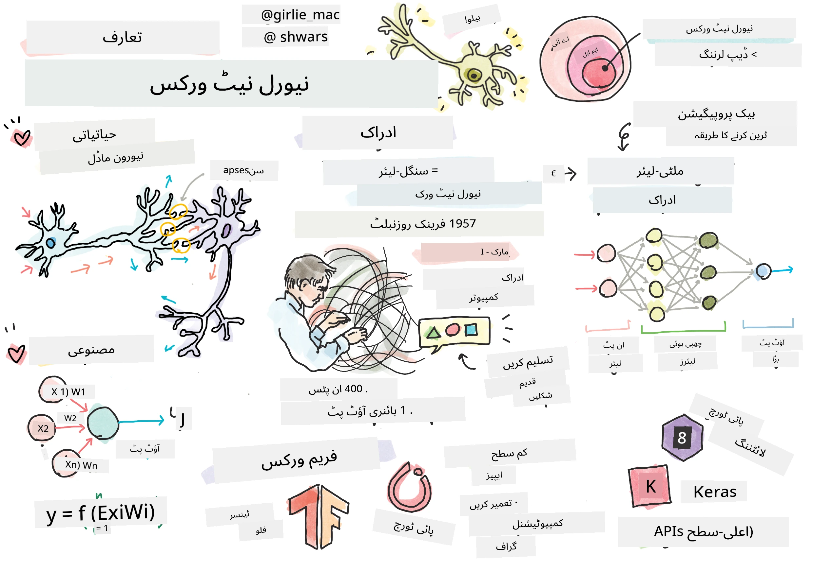
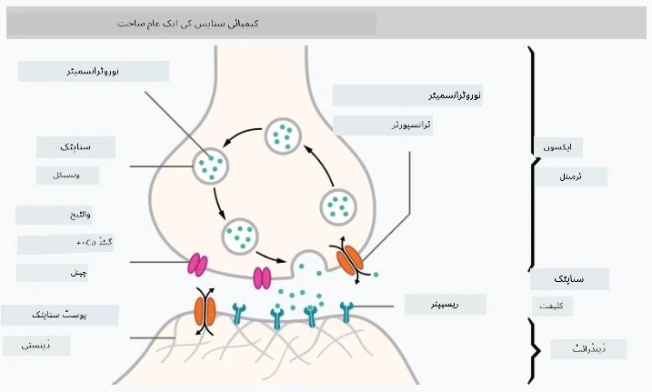

# نیورل نیٹ ورکس کا تعارف

جیسا کہ ہم نے تعارف میں بات کی تھی، ذہانت حاصل کرنے کے طریقوں میں سے ایک یہ ہے کہ ایک **کمپیوٹر ماڈل** یا **مصنوعی دماغ** کو تربیت دی جائے۔ بیسویں صدی کے وسط سے، محققین نے مختلف ریاضیاتی ماڈلز آزمائے، اور حالیہ برسوں میں یہ سمت بہت کامیاب ثابت ہوئی۔ دماغ کے ان ریاضیاتی ماڈلز کو **نیورل نیٹ ورکس** کہا جاتا ہے۔

> کبھی کبھار نیورل نیٹ ورکس کو *مصنوعی نیورل نیٹ ورکس* یا ANNs کہا جاتا ہے، تاکہ واضح کیا جا سکے کہ ہم ماڈلز کی بات کر رہے ہیں، نہ کہ حقیقی نیورونز کے نیٹ ورکس کی۔

## مشین لرننگ

نیورل نیٹ ورکس ایک بڑی شعبے کا حصہ ہیں جسے **مشین لرننگ** کہا جاتا ہے، جس کا مقصد ڈیٹا کا استعمال کرتے ہوئے کمپیوٹر ماڈلز کو تربیت دینا ہے جو مسائل حل کر سکیں۔ مشین لرننگ مصنوعی ذہانت کا ایک بڑا حصہ ہے، تاہم، ہم اس نصاب میں کلاسیکل مشین لرننگ کو شامل نہیں کرتے۔

> کلاسیکل مشین لرننگ کے بارے میں مزید جاننے کے لیے ہمارا الگ **[مشین لرننگ فار بیگنرز](http://github.com/microsoft/ml-for-beginners)** نصاب دیکھیں۔

مشین لرننگ میں، ہم فرض کرتے ہیں کہ ہمارے پاس کچھ مثالوں کا ڈیٹا سیٹ **X** اور اس کے مطابق آؤٹ پٹ ویلیوز **Y** موجود ہیں۔ مثالیں اکثر N-ڈائمینشنل ویکٹرز ہوتی ہیں جو **فیچرز** پر مشتمل ہوتی ہیں، اور آؤٹ پٹس کو **لیبلز** کہا جاتا ہے۔

ہم مشین لرننگ کے دو عام مسائل پر غور کریں گے:

* **کلاسیفیکیشن**، جہاں ہمیں ایک ان پٹ آبجیکٹ کو دو یا زیادہ کلاسز میں تقسیم کرنا ہوتا ہے۔
* **ریگریشن**، جہاں ہمیں ہر ان پٹ سیمپل کے لیے ایک عددی نمبر کی پیش گوئی کرنی ہوتی ہے۔

> جب ان پٹس اور آؤٹ پٹس کو ٹینسرز کے طور پر ظاہر کیا جاتا ہے، تو ان پٹ ڈیٹا سیٹ M&times;N سائز کی میٹرکس ہوتی ہے، جہاں M سیمپلز کی تعداد ہے اور N فیچرز کی تعداد ہے۔ آؤٹ پٹ لیبلز Y سائز M کا ویکٹر ہوتا ہے۔

اس نصاب میں، ہم صرف نیورل نیٹ ورک ماڈلز پر توجہ مرکوز کریں گے۔

## نیورون کا ماڈل

حیاتیات سے، ہم جانتے ہیں کہ ہمارا دماغ نیورل سیلز (نیورونز) پر مشتمل ہوتا ہے، جن میں سے ہر ایک کے پاس متعدد "ان پٹس" (ڈینڈریٹس) اور ایک "آؤٹ پٹ" (ایکسون) ہوتا ہے۔ ڈینڈریٹس اور ایکسون دونوں برقی سگنلز منتقل کر سکتے ہیں، اور ان کے درمیان کنکشنز — جنہیں سیناپسز کہا جاتا ہے — مختلف درجات کی کنڈکٹویٹی ظاہر کر سکتے ہیں، جو نیوروٹرانسمیٹرز کے ذریعے منظم کی جاتی ہیں۔

 | 
----|----
حقیقی نیورون *([تصویر](https://en.wikipedia.org/wiki/Synapse#/media/File:SynapseSchematic_lines.svg) ویکیپیڈیا سے)* | مصنوعی نیورون *(تصویر مصنف کی طرف سے)*

لہٰذا، نیورون کا سب سے سادہ ریاضیاتی ماڈل کئی ان پٹس X1, ..., XN اور ایک آؤٹ پٹ Y پر مشتمل ہوتا ہے، اور ایک سلسلہ وزن W1, ..., WN۔ آؤٹ پٹ کا حساب درج ذیل طریقے سے کیا جاتا ہے:

جہاں f کوئی غیر خطی **ایکٹیویشن فنکشن** ہے۔

> نیورون کے ابتدائی ماڈلز کو کلاسیکل مقالے [A logical calculus of the ideas immanent in nervous activity](https://www.cs.cmu.edu/~./epxing/Class/10715/reading/McCulloch.and.Pitts.pdf) میں وارن میککلوک اور والٹر پٹس نے 1943 میں بیان کیا۔ ڈونلڈ ہیب نے اپنی کتاب "[The Organization of Behavior: A Neuropsychological Theory](https://books.google.com/books?id=VNetYrB8EBoC)" میں ان نیٹ ورکس کو تربیت دینے کا طریقہ تجویز کیا۔

## اس سیکشن میں

اس سیکشن میں ہم سیکھیں گے:
* [پرسپٹرون](03-Perceptron/README.md)، دو کلاسز کی کلاسیفیکیشن کے لیے ابتدائی نیورل نیٹ ورک ماڈلز میں سے ایک
* [ملٹی لیئرڈ نیٹ ورکس](04-OwnFramework/README.md) کے ساتھ ایک نوٹ بک [اپنا فریم ورک کیسے بنائیں](04-OwnFramework/OwnFramework.ipynb)
* [نیورل نیٹ ورک فریم ورکس](05-Frameworks/README.md)، ان نوٹ بکس کے ساتھ: [پائی ٹورچ](05-Frameworks/IntroPyTorch.ipynb) اور [کیراس/ٹینسر فلو](05-Frameworks/IntroKerasTF.ipynb)
* [اوورفٹنگ](../../../../lessons/3-NeuralNetworks/05-Frameworks)

---

**ڈسکلیمر**:  
یہ دستاویز AI ترجمہ سروس [Co-op Translator](https://github.com/Azure/co-op-translator) کا استعمال کرتے ہوئے ترجمہ کی گئی ہے۔ ہم درستگی کے لیے کوشش کرتے ہیں، لیکن براہ کرم آگاہ رہیں کہ خودکار ترجمے میں غلطیاں یا غیر درستیاں ہو سکتی ہیں۔ اصل دستاویز کو اس کی اصل زبان میں مستند ذریعہ سمجھا جانا چاہیے۔ اہم معلومات کے لیے، پیشہ ور انسانی ترجمہ کی سفارش کی جاتی ہے۔ ہم اس ترجمے کے استعمال سے پیدا ہونے والی کسی بھی غلط فہمی یا غلط تشریح کے ذمہ دار نہیں ہیں۔