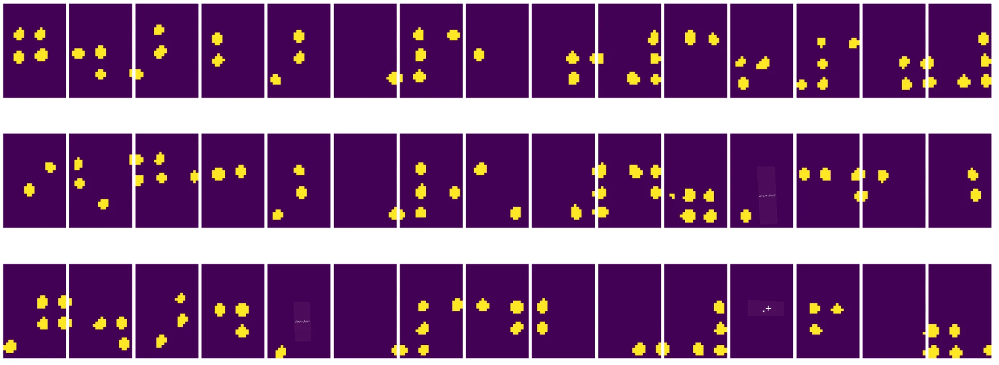

# کمپیوٹر وژن کا تعارف

[کمپیوٹر وژن](https://wikipedia.org/wiki/Computer_vision) ایک ایسا شعبہ ہے جس کا مقصد کمپیوٹرز کو ڈیجیٹل تصاویر کی اعلیٰ سطحی سمجھ بوجھ فراہم کرنا ہے۔ یہ ایک وسیع تعریف ہے کیونکہ *سمجھنا* مختلف چیزوں کا مطلب ہو سکتا ہے، جیسے تصویر میں کسی چیز کو تلاش کرنا (**آبجیکٹ ڈیٹیکشن**)، یہ سمجھنا کہ کیا ہو رہا ہے (**ایونٹ ڈیٹیکشن**)، تصویر کو متن میں بیان کرنا، یا منظر کو 3D میں دوبارہ بنانا۔ انسانی تصاویر سے متعلق کچھ خاص کام بھی ہیں: عمر اور جذبات کا اندازہ لگانا، چہرے کی شناخت اور پہچان، اور 3D پوز کا اندازہ لگانا، وغیرہ۔

## [لیکچر سے پہلے کا کوئز](https://ff-quizzes.netlify.app/en/ai/quiz/11)

کمپیوٹر وژن کا ایک سب سے آسان کام **تصویر کی درجہ بندی** ہے۔

کمپیوٹر وژن کو اکثر AI کی ایک شاخ سمجھا جاتا ہے۔ آج کل، کمپیوٹر وژن کے زیادہ تر کام نیورل نیٹ ورکس کے ذریعے حل کیے جاتے ہیں۔ ہم اس سیکشن میں کمپیوٹر وژن کے لیے استعمال ہونے والے نیورل نیٹ ورکس کی ایک خاص قسم، [کنوولوشنل نیورل نیٹ ورکس](../07-ConvNets/README.md)، کے بارے میں مزید سیکھیں گے۔

تاہم، تصویر کو نیورل نیٹ ورک میں بھیجنے سے پہلے، کئی صورتوں میں تصویر کو بہتر بنانے کے لیے کچھ الگورتھمک تکنیکوں کا استعمال کرنا سمجھداری ہو سکتی ہے۔

تصویر کی پروسیسنگ کے لیے کئی Python لائبریریاں دستیاب ہیں:

* **[imageio](https://imageio.readthedocs.io/en/stable/)** مختلف تصویر فارمیٹس کو پڑھنے/لکھنے کے لیے استعمال کی جا سکتی ہے۔ یہ ffmpeg کو بھی سپورٹ کرتی ہے، جو ویڈیو فریمز کو تصاویر میں تبدیل کرنے کا ایک مفید ٹول ہے۔
* **[Pillow](https://pillow.readthedocs.io/en/stable/index.html)** (جسے PIL بھی کہا جاتا ہے) زیادہ طاقتور ہے اور تصویر کی کچھ تبدیلیوں جیسے مورفنگ، پیلیٹ ایڈجسٹمنٹ، وغیرہ کو سپورٹ کرتی ہے۔
* **[OpenCV](https://opencv.org/)** ایک طاقتور تصویر پروسیسنگ لائبریری ہے جو C++ میں لکھی گئی ہے اور تصویر پروسیسنگ کے لیے *ڈی فیکٹو* معیار بن چکی ہے۔ اس کا ایک آسان Python انٹرفیس بھی ہے۔
* **[dlib](http://dlib.net/)** ایک C++ لائبریری ہے جو کئی مشین لرننگ الگورتھمز کو نافذ کرتی ہے، بشمول کچھ کمپیوٹر وژن الگورتھمز۔ اس کا Python انٹرفیس بھی ہے اور یہ چہرے اور چہرے کے نشانات کی شناخت جیسے مشکل کاموں کے لیے استعمال کی جا سکتی ہے۔

## OpenCV

[OpenCV](https://opencv.org/) تصویر پروسیسنگ کے لیے *ڈی فیکٹو* معیار سمجھا جاتا ہے۔ اس میں بہت سے مفید الگورتھمز شامل ہیں، جو C++ میں نافذ کیے گئے ہیں۔ آپ OpenCV کو Python سے بھی کال کر سکتے ہیں۔

OpenCV سیکھنے کے لیے ایک اچھا ذریعہ [یہ Learn OpenCV کورس](https://learnopencv.com/getting-started-with-opencv/) ہے۔ ہمارے نصاب میں، ہمارا مقصد OpenCV سیکھنا نہیں ہے بلکہ آپ کو کچھ مثالیں دکھانا ہے کہ اسے کب اور کیسے استعمال کیا جا سکتا ہے۔

### تصاویر لوڈ کرنا

Python میں تصاویر کو آسانی سے NumPy arrays کے ذریعے ظاہر کیا جا سکتا ہے۔ مثال کے طور پر، 320x200 پکسلز کے سائز کی گرے اسکیل تصاویر کو 200x320 array میں ذخیرہ کیا جائے گا، اور اسی سائز کی رنگین تصاویر کا شکل 200x320x3 ہوگا (3 رنگ چینلز کے لیے)۔ تصویر کو لوڈ کرنے کے لیے آپ درج ذیل کوڈ استعمال کر سکتے ہیں:

```python
import cv2
import matplotlib.pyplot as plt

im = cv2.imread('image.jpeg')
plt.imshow(im)
```

روایتی طور پر، OpenCV رنگین تصاویر کے لیے BGR (Blue-Green-Red) انکوڈنگ استعمال کرتا ہے، جبکہ Python کے دیگر ٹولز زیادہ روایتی RGB (Red-Green-Blue) استعمال کرتے ہیں۔ تصویر کو صحیح دکھانے کے لیے، آپ کو اسے RGB رنگ اسپیس میں تبدیل کرنا ہوگا، یا تو NumPy array میں ڈائمینشنز کو تبدیل کرکے یا OpenCV فنکشن کال کرکے:

```python
im = cv2.cvtColor(im,cv2.COLOR_BGR2RGB)
```

یہی `cvtColor` فنکشن دیگر رنگ اسپیس تبدیلیوں کے لیے بھی استعمال کیا جا سکتا ہے، جیسے تصویر کو گرے اسکیل یا HSV (Hue-Saturation-Value) رنگ اسپیس میں تبدیل کرنا۔

آپ OpenCV کا استعمال کرتے ہوئے ویڈیو کو فریم بہ فریم بھی لوڈ کر سکتے ہیں - ایک مثال [OpenCV Notebook](OpenCV.ipynb) میں دی گئی ہے۔

### تصویر کی پروسیسنگ

تصویر کو نیورل نیٹ ورک میں بھیجنے سے پہلے، آپ کئی پری پروسیسنگ مراحل کو لاگو کرنا چاہیں گے۔ OpenCV بہت کچھ کر سکتا ہے، بشمول:

* تصویر کو **ریسائز** کرنا `im = cv2.resize(im, (320,200),interpolation=cv2.INTER_LANCZOS)` کے ذریعے
* تصویر کو **بلر** کرنا `im = cv2.medianBlur(im,3)` یا `im = cv2.GaussianBlur(im, (3,3), 0)` کے ذریعے
* تصویر کی **روشنائی اور کنٹراسٹ** کو تبدیل کرنا NumPy array کے ذریعے کیا جا سکتا ہے، جیسا کہ [اس Stackoverflow نوٹ](https://stackoverflow.com/questions/39308030/how-do-i-increase-the-contrast-of-an-image-in-python-opencv) میں بیان کیا گیا ہے۔
* [تھریشولڈنگ](https://docs.opencv.org/4.x/d7/d4d/tutorial_py_thresholding.html) کا استعمال `cv2.threshold`/`cv2.adaptiveThreshold` فنکشنز کے ذریعے، جو اکثر روشنائی یا کنٹراسٹ کو ایڈجسٹ کرنے سے بہتر ہوتا ہے۔
* تصویر پر مختلف [تبدیلیاں](https://docs.opencv.org/4.5.5/da/d6e/tutorial_py_geometric_transformations.html) لاگو کرنا:
    - **[ایفائن تبدیلیاں](https://docs.opencv.org/4.5.5/d4/d61/tutorial_warp_affine.html)** مفید ہو سکتی ہیں اگر آپ کو تصویر میں تین پوائنٹس کے سورس اور ڈیسٹینیشن مقام معلوم ہوں اور آپ کو تصویر کو گھمانا، ریسائز کرنا اور جھکانا ہو۔ ایفائن تبدیلیاں متوازی لائنوں کو متوازی رکھتی ہیں۔
    - **[پرسپیکٹیو تبدیلیاں](https://medium.com/analytics-vidhya/opencv-perspective-transformation-9edffefb2143)** مفید ہو سکتی ہیں جب آپ کو تصویر میں چار پوائنٹس کے سورس اور ڈیسٹینیشن مقام معلوم ہوں۔ مثال کے طور پر، اگر آپ اسمارٹ فون کیمرے کے ذریعے کسی زاویے سے مستطیل دستاویز کی تصویر لیتے ہیں اور آپ دستاویز کی مستطیل تصویر بنانا چاہتے ہیں۔
* تصویر کے اندر حرکت کو سمجھنا **[آپٹیکل فلو](https://docs.opencv.org/4.5.5/d4/dee/tutorial_optical_flow.html)** کے ذریعے۔

## کمپیوٹر وژن کے استعمال کی مثالیں

ہمارے [OpenCV Notebook](OpenCV.ipynb) میں، ہم کچھ مثالیں دیتے ہیں کہ کمپیوٹر وژن کو مخصوص کاموں کو انجام دینے کے لیے کب استعمال کیا جا سکتا ہے:

* **بریل کتاب کی تصویر کی پری پروسیسنگ**۔ ہم اس پر توجہ دیتے ہیں کہ کس طرح تھریشولڈنگ، فیچر ڈیٹیکشن، پرسپیکٹیو تبدیلی اور NumPy تبدیلیوں کا استعمال کرکے بریل کے انفرادی علامات کو الگ کیا جا سکتا ہے تاکہ نیورل نیٹ ورک کے ذریعے مزید درجہ بندی کی جا سکے۔

 |  | 
----|-----|-----

> تصویر [OpenCV.ipynb](OpenCV.ipynb) سے

* **ویڈیو میں حرکت کا پتہ لگانا فریم فرق کے ذریعے**۔ اگر کیمرہ فکسڈ ہے، تو کیمرہ فیڈ کے فریمز ایک دوسرے سے کافی حد تک مشابہت رکھتے ہیں۔ چونکہ فریمز arrays کے طور پر ظاہر کیے جاتے ہیں، صرف ان arrays کو دو مسلسل فریمز کے لیے گھٹانے سے ہمیں پکسل فرق ملے گا، جو جامد فریمز کے لیے کم ہونا چاہیے، اور تصویر میں نمایاں حرکت ہونے پر زیادہ ہو جائے گا۔


> تصویر [OpenCV.ipynb](OpenCV.ipynb) سے

* **آپٹیکل فلو کے ذریعے حرکت کا پتہ لگانا**۔ [آپٹیکل فلو](https://docs.opencv.org/3.4/d4/dee/tutorial_optical_flow.html) ہمیں یہ سمجھنے کی اجازت دیتا ہے کہ ویڈیو فریمز پر انفرادی پکسلز کیسے حرکت کرتے ہیں۔ آپٹیکل فلو کی دو اقسام ہیں:

   - **ڈینس آپٹیکل فلو** وہ ویکٹر فیلڈ بناتا ہے جو ہر پکسل کے لیے دکھاتا ہے کہ وہ کہاں حرکت کر رہا ہے۔
   - **اسپارس آپٹیکل فلو** تصویر میں کچھ نمایاں خصوصیات (جیسے کنارے) لیتا ہے اور ان کی فریم سے فریم تک حرکت کی راہ بناتا ہے۔


> تصویر [OpenCV.ipynb](OpenCV.ipynb) سے

## ✍️ مثال نوٹ بکس: OpenCV [عمل میں OpenCV آزمائیں](OpenCV.ipynb)

آئیے [OpenCV Notebook](OpenCV.ipynb) کو دریافت کرکے OpenCV کے ساتھ کچھ تجربات کریں۔

## نتیجہ

کبھی کبھار، نسبتاً پیچیدہ کام جیسے حرکت کا پتہ لگانا یا انگلی کے سرے کا پتہ لگانا صرف کمپیوٹر وژن کے ذریعے حل کیا جا سکتا ہے۔ لہذا، کمپیوٹر وژن کی بنیادی تکنیکوں کو جاننا اور یہ کہ OpenCV جیسی لائبریریاں کیا کر سکتی ہیں، بہت مددگار ثابت ہوتا ہے۔

## 🚀 چیلنج

AI شو سے [یہ ویڈیو](https://docs.microsoft.com/shows/ai-show/ai-show--2021-opencv-ai-competition--grand-prize-winners--cortic-tigers--episode-32?WT.mc_id=academic-77998-cacaste) دیکھیں تاکہ Cortic Tigers پروجیکٹ کے بارے میں جان سکیں اور انہوں نے کمپیوٹر وژن کے کاموں کو روبوٹ کے ذریعے جمہوری بنانے کے لیے بلاک پر مبنی حل کیسے بنایا۔ ایسے دیگر پروجیکٹس پر تحقیق کریں جو نئے سیکھنے والوں کو اس شعبے میں شامل کرنے میں مدد کرتے ہیں۔

## [لیکچر کے بعد کا کوئز](https://ff-quizzes.netlify.app/en/ai/quiz/12)

## جائزہ اور خود مطالعہ

آپٹیکل فلو پر مزید پڑھیں [اس بہترین ٹیوٹوریل](https://learnopencv.com/optical-flow-in-opencv/) میں۔

## [اسائنمنٹ](lab/README.md)

اس لیب میں، آپ سادہ اشاروں کے ساتھ ایک ویڈیو لیں گے، اور آپ کا مقصد آپٹیکل فلو کا استعمال کرتے ہوئے اوپر/نیچے/بائیں/دائیں حرکتیں نکالنا ہوگا۔


---

