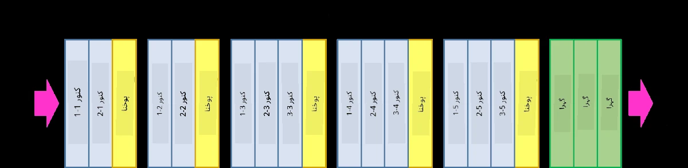
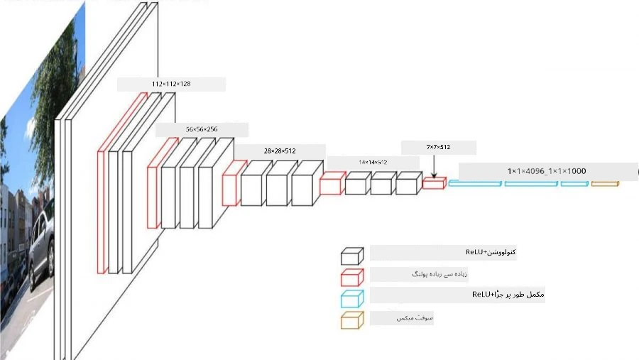
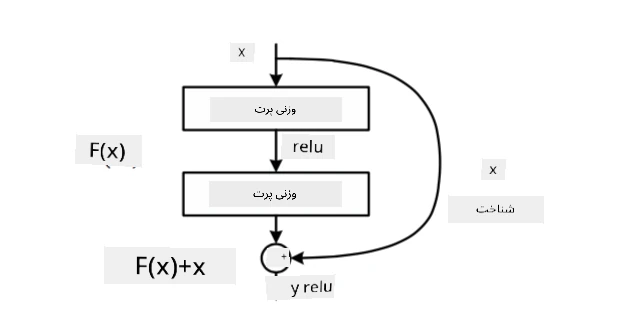
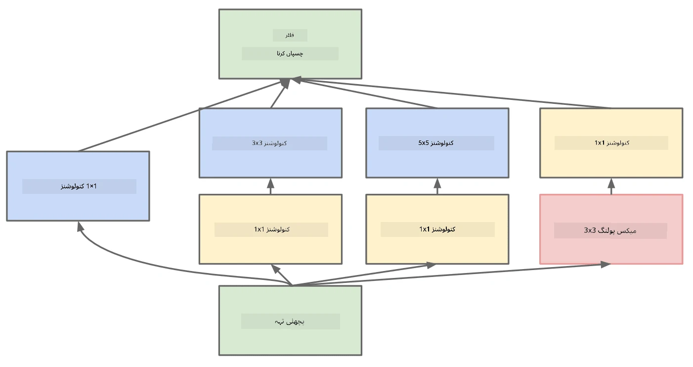

# مشہور سی این این آرکیٹیکچرز

### VGG-16

VGG-16 ایک نیٹ ورک ہے جس نے 2014 میں ImageNet کے ٹاپ-5 کلاسیفیکیشن میں 92.7% درستگی حاصل کی۔ اس کی درج ذیل لیئر ساخت ہے:

جیسا کہ آپ دیکھ سکتے ہیں، VGG ایک روایتی پیرامڈ آرکیٹیکچر کی پیروی کرتا ہے، جو کہ کنوولوشن-پولنگ لیئرز کی ترتیب ہے۔

> تصویر [Researchgate](https://www.researchgate.net/figure/Vgg16-model-structure-To-get-the-VGG-NIN-model-we-replace-the-2-nd-4-th-6-th-7-th_fig2_335194493) سے لی گئی ہے۔

### ResNet

ResNet ماڈلز کا ایک خاندان ہے جو 2015 میں Microsoft Research نے پیش کیا۔ ResNet کا بنیادی خیال **ریزیڈیول بلاکس** استعمال کرنا ہے:

> تصویر [اس مقالے](https://arxiv.org/pdf/1512.03385.pdf) سے لی گئی ہے۔

شناختی پاس تھرو استعمال کرنے کی وجہ یہ ہے کہ ہماری لیئر **فرق** کی پیش گوئی کرے جو پچھلی لیئر کے نتیجے اور ریزیڈیول بلاک کے آؤٹ پٹ کے درمیان ہے - اسی لیے اسے *ریزیڈیول* کہا جاتا ہے۔ یہ بلاکس تربیت دینے میں بہت آسان ہیں، اور ان بلاکس کے کئی سو نیٹ ورکس بنائے جا سکتے ہیں (سب سے عام اقسام ResNet-52، ResNet-101 اور ResNet-152 ہیں)۔

آپ اس نیٹ ورک کو ڈیٹا سیٹ کی پیچیدگی کے مطابق ایڈجسٹ کرنے کے قابل بھی سمجھ سکتے ہیں۔ شروع میں، جب آپ نیٹ ورک کی تربیت شروع کر رہے ہوتے ہیں، وزن کی قدریں چھوٹی ہوتی ہیں، اور زیادہ تر سگنل شناختی لیئرز کے ذریعے گزرتا ہے۔ جیسے جیسے تربیت آگے بڑھتی ہے اور وزن زیادہ ہو جاتے ہیں، نیٹ ورک کے پیرامیٹرز کی اہمیت بڑھتی ہے، اور نیٹ ورک مطلوبہ اظہار کی طاقت کو ایڈجسٹ کرتا ہے تاکہ تربیتی تصاویر کو صحیح طریقے سے درجہ بندی کیا جا سکے۔

### Google Inception

Google Inception آرکیٹیکچر اس خیال کو ایک قدم آگے لے جاتا ہے، اور ہر نیٹ ورک لیئر کو کئی مختلف راستوں کے امتزاج کے طور پر بناتا ہے:

> تصویر [Researchgate](https://www.researchgate.net/figure/Inception-module-with-dimension-reductions-left-and-schema-for-Inception-ResNet-v1_fig2_355547454) سے لی گئی ہے۔

یہاں، ہمیں 1x1 کنوولوشنز کے کردار پر زور دینا ہوگا، کیونکہ شروع میں یہ سمجھ میں نہیں آتا۔ ہم تصویر کو 1x1 فلٹر کے ساتھ کیوں چلائیں گے؟ تاہم، آپ کو یاد رکھنا ہوگا کہ کنوولوشن فلٹرز کئی گہرائی چینلز کے ساتھ بھی کام کرتے ہیں (اصل میں - RGB رنگ، بعد کی لیئرز میں - مختلف فلٹرز کے چینلز)، اور 1x1 کنوولوشن ان ان پٹ چینلز کو مختلف تربیت یافتہ وزن کے ذریعے ایک ساتھ ملانے کے لیے استعمال کیا جاتا ہے۔ اسے چینل کے طول و عرض پر ڈاؤن سیمپلنگ (پولنگ) کے طور پر بھی دیکھا جا سکتا ہے۔

یہاں [ایک اچھا بلاگ پوسٹ](https://medium.com/analytics-vidhya/talented-mr-1x1-comprehensive-look-at-1x1-convolution-in-deep-learning-f6b355825578) اس موضوع پر ہے، اور [اصل مقالہ](https://arxiv.org/pdf/1312.4400.pdf)۔

### MobileNet

MobileNet ماڈلز کا ایک خاندان ہے جس کا سائز کم ہے، اور یہ موبائل ڈیوائسز کے لیے موزوں ہے۔ انہیں استعمال کریں اگر آپ کے پاس وسائل کم ہیں، اور آپ تھوڑی سی درستگی قربان کر سکتے ہیں۔ ان کے پیچھے بنیادی خیال **ڈیپتھ وائز سیپریبل کنوولوشن** ہے، جو کنوولوشن فلٹرز کو اسپیشل کنوولوشنز اور گہرائی چینلز پر 1x1 کنوولوشن کے امتزاج کے ذریعے ظاہر کرنے کی اجازت دیتا ہے۔ یہ پیرامیٹرز کی تعداد کو نمایاں طور پر کم کرتا ہے، نیٹ ورک کو سائز میں چھوٹا بناتا ہے، اور کم ڈیٹا کے ساتھ تربیت دینا بھی آسان بناتا ہے۔

یہاں [MobileNet پر ایک اچھا بلاگ پوسٹ](https://medium.com/analytics-vidhya/image-classification-with-mobilenet-cc6fbb2cd470) ہے۔

## نتیجہ

اس یونٹ میں، آپ نے کمپیوٹر وژن نیورل نیٹ ورکس کے پیچھے بنیادی تصور سیکھا - کنوولوشنل نیٹ ورکس۔ حقیقی زندگی کے آرکیٹیکچرز جو امیج کلاسیفیکیشن، آبجیکٹ ڈیٹیکشن، اور یہاں تک کہ امیج جنریشن نیٹ ورکس کو طاقت دیتے ہیں، سب سی این اینز پر مبنی ہیں، بس زیادہ لیئرز اور کچھ اضافی تربیتی چالوں کے ساتھ۔

## 🚀 چیلنج

ساتھ والے نوٹ بکس میں، نیچے نوٹس ہیں کہ زیادہ درستگی کیسے حاصل کی جائے۔ کچھ تجربات کریں اور دیکھیں کہ کیا آپ زیادہ درستگی حاصل کر سکتے ہیں۔

## [لیکچر کے بعد کا کوئز](https://ff-quizzes.netlify.app/en/ai/quiz/14)

## جائزہ اور خود مطالعہ

جبکہ سی این اینز زیادہ تر کمپیوٹر وژن کے کاموں کے لیے استعمال ہوتے ہیں، وہ عام طور پر فکسڈ سائز کے پیٹرنز نکالنے کے لیے اچھے ہوتے ہیں۔ مثال کے طور پر، اگر ہم آوازوں سے نمٹ رہے ہیں، تو ہم آڈیو سگنل میں کچھ مخصوص پیٹرنز تلاش کرنے کے لیے سی این اینز استعمال کرنا چاہیں گے - اس صورت میں فلٹرز 1-ڈائمینشنل ہوں گے (اور اس سی این این کو 1D-CNN کہا جائے گا)۔ اسی طرح، کبھی کبھی 3D-CNN استعمال کیا جاتا ہے تاکہ کثیر جہتی جگہ میں خصوصیات نکالی جا سکیں، جیسے ویڈیو میں کچھ واقعات کا وقوع پذیر ہونا - سی این این وقت کے ساتھ خصوصیات میں تبدیلی کے کچھ پیٹرنز کو پکڑ سکتا ہے۔ سی این اینز کے ذریعے کیے جانے والے دیگر کاموں کے بارے میں جائزہ لیں اور خود مطالعہ کریں۔

## [اسائنمنٹ](lab/README.md)

اس لیب میں، آپ کو مختلف بلی اور کتے کی نسلوں کو درجہ بندی کرنے کا کام دیا گیا ہے۔ یہ تصاویر MNIST ڈیٹا سیٹ سے زیادہ پیچیدہ ہیں اور زیادہ طول و عرض کی حامل ہیں، اور کلاسز کی تعداد 10 سے زیادہ ہے۔

---

