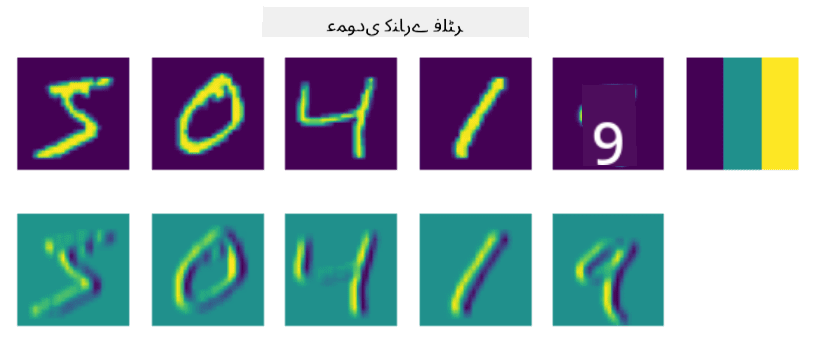
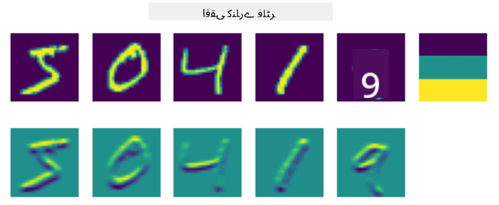
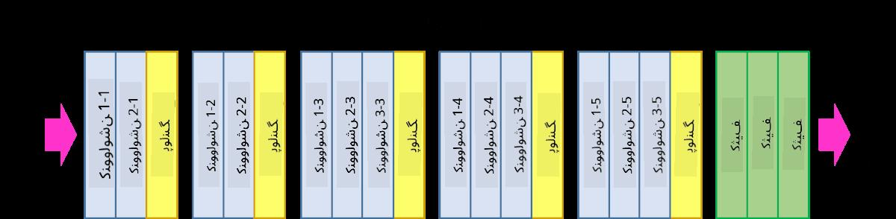
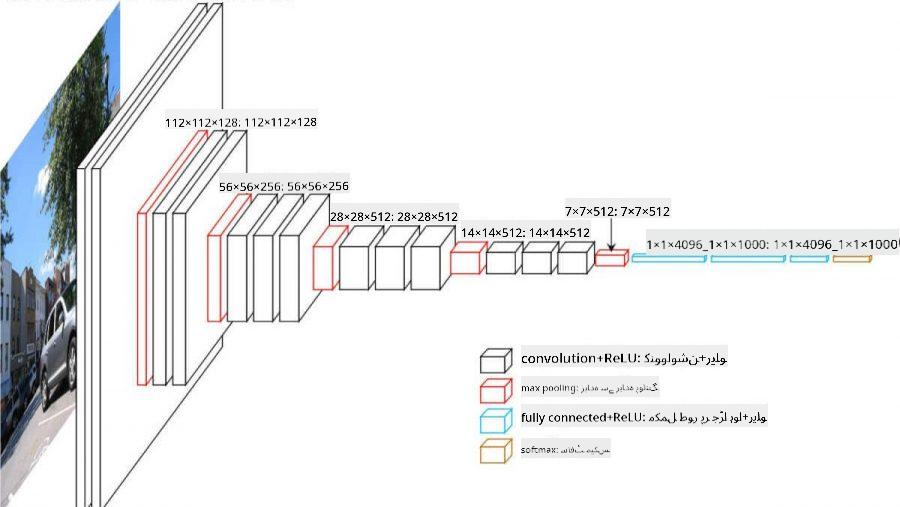

<!--
CO_OP_TRANSLATOR_METADATA:
{
  "original_hash": "088837b42b7d99198bf62db8a42411e0",
  "translation_date": "2025-08-26T09:26:41+00:00",
  "source_file": "lessons/4-ComputerVision/07-ConvNets/README.md",
  "language_code": "ur"
}
-->
# کنوولوشنل نیورل نیٹ ورکس

ہم نے پہلے دیکھا ہے کہ نیورل نیٹ ورکس تصاویر کے ساتھ کام کرنے میں کافی اچھے ہیں، اور یہاں تک کہ ایک لیئر پرسیپٹرون بھی MNIST ڈیٹاسیٹ سے ہاتھ سے لکھے گئے ہندسوں کو معقول درستگی کے ساتھ پہچان سکتا ہے۔ تاہم، MNIST ڈیٹاسیٹ بہت خاص ہے، اور تمام ہندسے تصویر کے اندر مرکز میں ہوتے ہیں، جو کام کو آسان بناتا ہے۔

## [لیکچر سے پہلے کا کوئز](https://red-field-0a6ddfd03.1.azurestaticapps.net/quiz/107)

حقیقی زندگی میں، ہم یہ چاہتے ہیں کہ تصویر میں کسی بھی جگہ پر موجود اشیاء کو پہچان سکیں۔ کمپیوٹر وژن عمومی درجہ بندی سے مختلف ہے، کیونکہ جب ہم تصویر میں کسی خاص شے کو تلاش کرنے کی کوشش کرتے ہیں، تو ہم تصویر کو اسکین کرتے ہیں اور کچھ مخصوص **پیٹرنز** اور ان کے امتزاج کو تلاش کرتے ہیں۔ مثال کے طور پر، جب ہم بلی کو تلاش کرتے ہیں، تو ہم پہلے افقی لائنوں کو دیکھ سکتے ہیں، جو مونچھوں کی شکل اختیار کر سکتی ہیں، اور پھر مونچھوں کے ایک خاص امتزاج سے ہمیں پتہ چلتا ہے کہ یہ دراصل بلی کی تصویر ہے۔ مخصوص پیٹرنز کی موجودگی اور ان کی نسبتی پوزیشن اہم ہے، نہ کہ ان کی تصویر میں بالکل درست جگہ۔

پیٹرنز نکالنے کے لیے، ہم **کنوولوشنل فلٹرز** کا استعمال کریں گے۔ جیسا کہ آپ جانتے ہیں، ایک تصویر کو 2D-میٹرکس یا رنگ کی گہرائی کے ساتھ 3D-ٹینسر کے طور پر ظاہر کیا جاتا ہے۔ فلٹر لگانے کا مطلب یہ ہے کہ ہم ایک نسبتاً چھوٹا **فلٹر کرنل** میٹرکس لیتے ہیں، اور اصل تصویر کے ہر پکسل کے لیے ہم پڑوسی پوائنٹس کے ساتھ وزنی اوسط کا حساب لگاتے ہیں۔ ہم اسے اس طرح دیکھ سکتے ہیں جیسے ایک چھوٹی کھڑکی پوری تصویر پر سلائیڈ کر رہی ہو، اور فلٹر کرنل میٹرکس میں وزن کے مطابق تمام پکسلز کو اوسط کر رہی ہو۔

 | 
----|----

> تصویر: دمتری سوشنیکوف

مثال کے طور پر، اگر ہم MNIST ہندسوں پر 3x3 ورٹیکل ایج اور ہوری زونٹل ایج فلٹرز لگائیں، تو ہم ان جگہوں پر نمایاں (مثلاً زیادہ ویلیوز) حاصل کر سکتے ہیں جہاں ہماری اصل تصویر میں ورٹیکل اور ہوری زونٹل ایجز موجود ہیں۔ اس طرح یہ دو فلٹرز ایجز "تلاش کرنے" کے لیے استعمال کیے جا سکتے ہیں۔ اسی طرح، ہم دوسرے کم سطحی پیٹرنز تلاش کرنے کے لیے مختلف فلٹرز ڈیزائن کر سکتے ہیں:

> [لیونگ-ملک فلٹر بینک](https://www.robots.ox.ac.uk/~vgg/research/texclass/filters.html) کی تصویر

تاہم، جہاں ہم کچھ پیٹرنز نکالنے کے لیے فلٹرز کو دستی طور پر ڈیزائن کر سکتے ہیں، وہیں ہم نیٹ ورک کو اس طرح بھی ڈیزائن کر سکتے ہیں کہ یہ پیٹرنز کو خود بخود سیکھ لے۔ یہ CNN کے پیچھے بنیادی خیالات میں سے ایک ہے۔

## CNN کے بنیادی خیالات

CNN کے کام کرنے کا طریقہ درج ذیل اہم خیالات پر مبنی ہے:

* کنوولوشنل فلٹرز پیٹرنز نکال سکتے ہیں۔
* ہم نیٹ ورک کو اس طرح ڈیزائن کر سکتے ہیں کہ فلٹرز خود بخود تربیت حاصل کریں۔
* ہم اسی طریقے کو اعلیٰ سطحی فیچرز میں پیٹرنز تلاش کرنے کے لیے استعمال کر سکتے ہیں، نہ صرف اصل تصویر میں۔ اس طرح CNN فیچر نکالنے کا کام فیچرز کی ایک درجہ بندی پر ہوتا ہے، جو کم سطحی پکسل امتزاج سے لے کر تصویر کے حصوں کے اعلیٰ سطحی امتزاج تک ہوتا ہے۔

> تصویر: [ہسلپ-لنچ کے مقالے](https://www.semanticscholar.org/paper/Computer-vision-based-pedestrian-trajectory-Hislop-Lynch/26e6f74853fc9bbb7487b06dc2cf095d36c9021d) سے، ان کی [تحقیق](https://dl.acm.org/doi/abs/10.1145/1553374.1553453) پر مبنی

## ✍️ مشقیں: کنوولوشنل نیورل نیٹ ورکس

آئیے مزید دریافت کریں کہ کنوولوشنل نیورل نیٹ ورکس کیسے کام کرتے ہیں، اور ہم تربیت یافتہ فلٹرز کیسے حاصل کر سکتے ہیں، متعلقہ نوٹ بکس کے ذریعے کام کر کے:

* [کنوولوشنل نیورل نیٹ ورکس - پائی ٹارچ](../../../../../lessons/4-ComputerVision/07-ConvNets/ConvNetsPyTorch.ipynb)
* [کنوولوشنل نیورل نیٹ ورکس - ٹینسر فلو](../../../../../lessons/4-ComputerVision/07-ConvNets/ConvNetsTF.ipynb)

## پیرامیڈ آرکیٹیکچر

زیادہ تر CNNs جو تصویر کی پروسیسنگ کے لیے استعمال ہوتے ہیں، ایک نام نہاد پیرامیڈ آرکیٹیکچر کی پیروی کرتے ہیں۔ اصل تصاویر پر لاگو ہونے والی پہلی کنوولوشنل لیئر میں عام طور پر فلٹرز کی تعداد نسبتاً کم ہوتی ہے (8-16)، جو مختلف پکسل امتزاجوں سے مطابقت رکھتی ہے، جیسے افقی/عمودی لائنیں یا اسٹروکس۔ اگلی سطح پر، ہم نیٹ ورک کے مکانی طول و عرض کو کم کرتے ہیں، اور فلٹرز کی تعداد بڑھاتے ہیں، جو سادہ فیچرز کے مزید ممکنہ امتزاج سے مطابقت رکھتی ہے۔ ہر لیئر کے ساتھ، جیسے جیسے ہم حتمی درجہ بندی کرنے والے کی طرف بڑھتے ہیں، تصویر کے مکانی طول و عرض کم ہوتے جاتے ہیں، اور فلٹرز کی تعداد بڑھتی جاتی ہے۔

مثال کے طور پر، آئیے VGG-16 کی آرکیٹیکچر پر نظر ڈالیں، ایک نیٹ ورک جس نے 2014 میں ImageNet کے ٹاپ-5 درجہ بندی میں 92.7% درستگی حاصل کی:

> تصویر: [ریسرچ گیٹ](https://www.researchgate.net/figure/Vgg16-model-structure-To-get-the-VGG-NIN-model-we-replace-the-2-nd-4-th-6-th-7-th_fig2_335194493) سے

## بہترین معروف CNN آرکیٹیکچرز

[بہترین معروف CNN آرکیٹیکچرز کے بارے میں اپنی تعلیم جاری رکھیں](CNN_Architectures.md)

**ڈسکلیمر**:  
یہ دستاویز AI ترجمہ سروس [Co-op Translator](https://github.com/Azure/co-op-translator) کا استعمال کرتے ہوئے ترجمہ کی گئی ہے۔ ہم درستگی کے لیے کوشش کرتے ہیں، لیکن براہ کرم آگاہ رہیں کہ خودکار ترجمے میں غلطیاں یا عدم درستگی ہو سکتی ہیں۔ اصل دستاویز، جو اس کی اصل زبان میں ہے، کو مستند ذریعہ سمجھا جانا چاہیے۔ اہم معلومات کے لیے، پیشہ ور انسانی ترجمہ کی سفارش کی جاتی ہے۔ اس ترجمے کے استعمال سے پیدا ہونے والی کسی بھی غلط فہمی یا غلط تشریح کے لیے ہم ذمہ دار نہیں ہیں۔