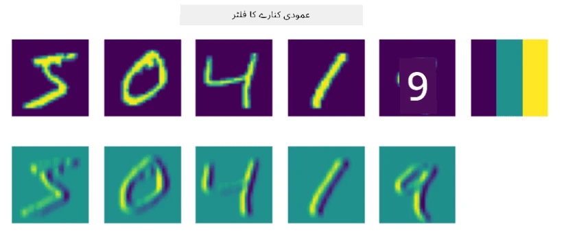
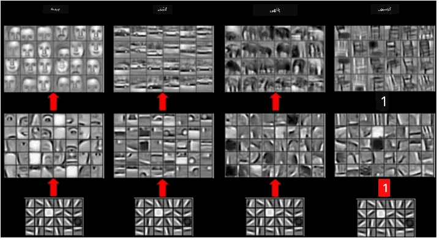

# کنولوشنل نیورل نیٹ ورکس

ہم نے پہلے دیکھا ہے کہ نیورل نیٹ ورکس تصاویر کے ساتھ کام کرنے میں کافی اچھے ہیں، اور ایک لیئر پرسیپٹرون بھی MNIST ڈیٹاسیٹ سے ہاتھ سے لکھے گئے اعداد کو معقول درستگی کے ساتھ پہچان سکتا ہے۔ تاہم، MNIST ڈیٹاسیٹ بہت خاص ہے، اور تمام اعداد تصویر کے اندر مرکز میں ہوتے ہیں، جو کام کو آسان بناتا ہے۔

## [لیکچر سے پہلے کا کوئز](https://ff-quizzes.netlify.app/en/ai/quiz/13)

حقیقی زندگی میں، ہم چاہتے ہیں کہ تصویر میں کسی بھی مقام پر موجود اشیاء کو پہچان سکیں۔ کمپیوٹر وژن عام درجہ بندی سے مختلف ہے، کیونکہ جب ہم تصویر میں کسی خاص شے کو تلاش کرنے کی کوشش کرتے ہیں، تو ہم تصویر کو اسکین کرتے ہیں تاکہ کچھ مخصوص **پیٹرنز** اور ان کے امتزاج کو تلاش کریں۔ مثال کے طور پر، جب ہم بلی کو تلاش کرتے ہیں، تو ہم پہلے افقی لائنوں کو دیکھ سکتے ہیں، جو مونچھیں بنا سکتی ہیں، اور پھر مونچھوں کے ایک خاص امتزاج سے ہمیں پتہ چلتا ہے کہ یہ واقعی بلی کی تصویر ہے۔ مخصوص پیٹرنز کی موجودگی اور ان کی نسبتی پوزیشن اہم ہے، نہ کہ ان کی تصویر میں بالکل درست جگہ۔

پیٹرنز نکالنے کے لیے، ہم **کنولوشنل فلٹرز** کا تصور استعمال کریں گے۔ جیسا کہ آپ جانتے ہیں، ایک تصویر کو 2D-میٹرکس یا رنگ کی گہرائی کے ساتھ 3D-ٹینسر کے طور پر ظاہر کیا جاتا ہے۔ فلٹر لگانے کا مطلب یہ ہے کہ ہم ایک نسبتاً چھوٹا **فلٹر کرنل** میٹرکس لیتے ہیں، اور اصل تصویر کے ہر پکسل کے لیے ہم پڑوسی پوائنٹس کے ساتھ وزنی اوسط کا حساب لگاتے ہیں۔ ہم اسے اس طرح دیکھ سکتے ہیں جیسے ایک چھوٹی ونڈو پوری تصویر پر سلائیڈ کر رہی ہو، اور فلٹر کرنل میٹرکس میں وزن کے مطابق تمام پکسلز کو اوسط کر رہی ہو۔

 | 
----|----

> تصویر: دمتری سوشنیکوف

مثال کے طور پر، اگر ہم MNIST اعداد پر 3x3 عمودی کنارے اور افقی کنارے فلٹرز لگائیں، تو ہم نمایاں حصے (مثلاً زیادہ قدر والے) حاصل کر سکتے ہیں جہاں ہماری اصل تصویر میں عمودی اور افقی کنارے موجود ہیں۔ اس طرح یہ دو فلٹرز کناروں کو "تلاش کرنے" کے لیے استعمال کیے جا سکتے ہیں۔ اسی طرح، ہم دوسرے کم سطحی پیٹرنز کو تلاش کرنے کے لیے مختلف فلٹرز ڈیزائن کر سکتے ہیں:

> تصویر: [لیونگ-ملک فلٹر بینک](https://www.robots.ox.ac.uk/~vgg/research/texclass/filters.html)

تاہم، جبکہ ہم فلٹرز کو کچھ پیٹرنز نکالنے کے لیے دستی طور پر ڈیزائن کر سکتے ہیں، ہم نیٹ ورک کو اس طرح بھی ڈیزائن کر سکتے ہیں کہ یہ پیٹرنز کو خود بخود سیکھ لے۔ یہ CNN کے پیچھے ایک اہم خیال ہے۔

## CNN کے بنیادی خیالات

CNN کے کام کرنے کا طریقہ درج ذیل اہم خیالات پر مبنی ہے:

* کنولوشنل فلٹرز پیٹرنز نکال سکتے ہیں
* ہم نیٹ ورک کو اس طرح ڈیزائن کر سکتے ہیں کہ فلٹرز خود بخود تربیت حاصل کریں
* ہم اسی طریقے کو اعلی سطحی خصوصیات میں پیٹرنز تلاش کرنے کے لیے استعمال کر سکتے ہیں، نہ صرف اصل تصویر میں۔ اس طرح CNN خصوصیات نکالنے کا کام خصوصیات کی ایک درجہ بندی پر کرتا ہے، جو کم سطحی پکسل امتزاج سے شروع ہو کر تصویر کے حصوں کے اعلی سطحی امتزاج تک جاتا ہے۔

> تصویر: [ہسلپ-لنچ کے مقالے](https://www.semanticscholar.org/paper/Computer-vision-based-pedestrian-trajectory-Hislop-Lynch/26e6f74853fc9bbb7487b06dc2cf095d36c9021d) سے، [ان کی تحقیق](https://dl.acm.org/doi/abs/10.1145/1553374.1553453) پر مبنی

## ✍️ مشقیں: کنولوشنل نیورل نیٹ ورکس

آئیے کنولوشنل نیورل نیٹ ورکس کے کام کرنے کے طریقے کو مزید دریافت کریں، اور یہ کہ ہم تربیت یافتہ فلٹرز کیسے حاصل کر سکتے ہیں، متعلقہ نوٹ بکس کے ذریعے کام کر کے:

* [کنولوشنل نیورل نیٹ ورکس - پائی ٹارچ](ConvNetsPyTorch.ipynb)
* [کنولوشنل نیورل نیٹ ورکس - ٹینسر فلو](ConvNetsTF.ipynb)

## پیرامڈ آرکیٹیکچر

زیادہ تر CNNs جو تصویر کی پروسیسنگ کے لیے استعمال ہوتے ہیں، ایک نام نہاد پیرامڈ آرکیٹیکچر کی پیروی کرتے ہیں۔ اصل تصاویر پر لگائی گئی پہلی کنولوشنل لیئر میں عام طور پر فلٹرز کی نسبتاً کم تعداد (8-16) ہوتی ہے، جو مختلف پکسل امتزاجوں سے مطابقت رکھتی ہے، جیسے افقی/عمودی لائنیں یا اسٹروکس۔ اگلے درجے پر، ہم نیٹ ورک کے مکانی طول و عرض کو کم کرتے ہیں، اور فلٹرز کی تعداد بڑھاتے ہیں، جو سادہ خصوصیات کے مزید ممکنہ امتزاج سے مطابقت رکھتی ہے۔ ہر لیئر کے ساتھ، جیسے ہم آخری درجہ بندی کرنے والے کی طرف بڑھتے ہیں، تصویر کے مکانی طول و عرض کم ہوتے ہیں، اور فلٹرز کی تعداد بڑھتی ہے۔

ایک مثال کے طور پر، آئیے VGG-16 کی آرکیٹیکچر کو دیکھیں، ایک نیٹ ورک جس نے 2014 میں ImageNet کے ٹاپ-5 درجہ بندی میں 92.7% درستگی حاصل کی:

> تصویر: [ریسرچ گیٹ](https://www.researchgate.net/figure/Vgg16-model-structure-To-get-the-VGG-NIN-model-we-replace-the-2-nd-4-th-6-th-7-th_fig2_335194493) سے

## بہترین معروف CNN آرکیٹیکچرز

[بہترین معروف CNN آرکیٹیکچرز کے بارے میں اپنی تعلیم جاری رکھیں](CNN_Architectures.md)

---

