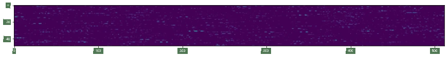
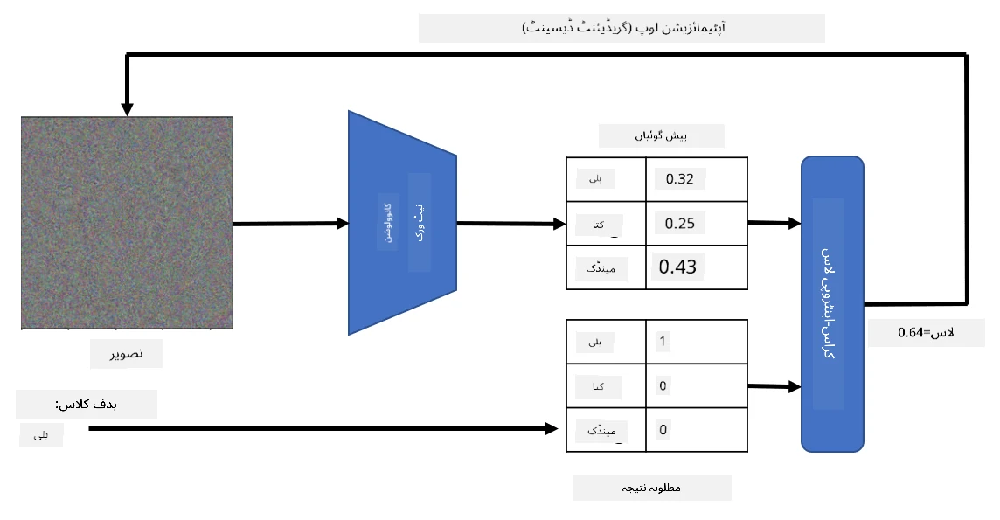

# پہلے سے تربیت یافتہ نیٹ ورکس اور ٹرانسفر لرننگ

CNNs کی تربیت میں کافی وقت لگ سکتا ہے، اور اس کے لیے بہت زیادہ ڈیٹا کی ضرورت ہوتی ہے۔ تاہم، زیادہ تر وقت نیٹ ورک کے بہترین لو لیول فلٹرز سیکھنے میں صرف ہوتا ہے جو تصاویر سے پیٹرنز نکالنے کے لیے استعمال کیے جا سکتے ہیں۔ ایک قدرتی سوال پیدا ہوتا ہے - کیا ہم ایک ڈیٹا سیٹ پر تربیت یافتہ نیورل نیٹ ورک کو استعمال کر سکتے ہیں اور اسے مختلف تصاویر کو کلاسفائی کرنے کے لیے ڈھال سکتے ہیں بغیر مکمل تربیتی عمل کی ضرورت کے؟

## [پری لیکچر کوئز](https://ff-quizzes.netlify.app/en/ai/quiz/15)

اس طریقے کو **ٹرانسفر لرننگ** کہا جاتا ہے، کیونکہ ہم ایک نیورل نیٹ ورک ماڈل سے دوسرے میں کچھ علم منتقل کرتے ہیں۔ ٹرانسفر لرننگ میں، ہم عام طور پر ایک پہلے سے تربیت یافتہ ماڈل سے شروع کرتے ہیں، جو کسی بڑے امیج ڈیٹا سیٹ، جیسے **ImageNet** پر تربیت یافتہ ہوتا ہے۔ یہ ماڈلز پہلے ہی عام تصاویر سے مختلف فیچرز نکالنے میں اچھا کام کر سکتے ہیں، اور اکثر ان نکالے گئے فیچرز پر ایک کلاسفائر بنانا اچھے نتائج دے سکتا ہے۔

> ✅ ٹرانسفر لرننگ ایک اصطلاح ہے جو دیگر علمی شعبوں، جیسے تعلیم، میں بھی پائی جاتی ہے۔ اس کا مطلب ہے ایک ڈومین سے علم لینا اور اسے دوسرے میں لاگو کرنا۔

## پہلے سے تربیت یافتہ ماڈلز بطور فیچر ایکسٹریکٹرز

پچھلے سیکشن میں جن کنوولوشنل نیٹ ورکس کا ذکر کیا گیا تھا، ان میں کئی لیئرز شامل تھیں، جن میں سے ہر ایک تصویر سے کچھ فیچرز نکالنے کے لیے بنائی گئی تھی، کم سطح کے پکسل کمبینیشنز (جیسے افقی/عمودی لائن یا اسٹروک) سے لے کر اعلیٰ سطح کے فیچرز کے کمبینیشنز تک، جو چیزوں جیسے شعلے کی آنکھ سے مطابقت رکھتے ہیں۔ اگر ہم CNN کو عام اور متنوع تصاویر کے کافی بڑے ڈیٹا سیٹ پر تربیت دیں، تو نیٹ ورک کو وہ عام فیچرز نکالنا سیکھنا چاہیے۔

Keras اور PyTorch دونوں میں کچھ عام آرکیٹیکچرز کے لیے پہلے سے تربیت یافتہ نیورل نیٹ ورک ویٹس کو آسانی سے لوڈ کرنے کے فنکشنز شامل ہیں، جن میں سے زیادہ تر ImageNet تصاویر پر تربیت یافتہ ہیں۔ سب سے زیادہ استعمال ہونے والے ماڈلز کا ذکر [CNN آرکیٹیکچرز](../07-ConvNets/CNN_Architectures.md) صفحے پر پچھلے سبق میں کیا گیا ہے۔ خاص طور پر، آپ درج ذیل میں سے کسی ایک کو استعمال کرنے پر غور کر سکتے ہیں:

* **VGG-16/VGG-19** جو نسبتاً سادہ ماڈلز ہیں لیکن پھر بھی اچھی درستگی دیتے ہیں۔ اکثر VGG کو پہلی کوشش کے طور پر استعمال کرنا ایک اچھا انتخاب ہوتا ہے تاکہ دیکھا جا سکے کہ ٹرانسفر لرننگ کیسے کام کر رہی ہے۔
* **ResNet** ماڈلز کا ایک خاندان ہے جسے 2015 میں Microsoft Research نے تجویز کیا تھا۔ ان میں زیادہ لیئرز ہوتی ہیں، اور اس لیے زیادہ وسائل لیتے ہیں۔
* **MobileNet** ماڈلز کا ایک خاندان ہے جس کا سائز کم ہوتا ہے، جو موبائل ڈیوائسز کے لیے موزوں ہے۔ انہیں استعمال کریں اگر آپ کے پاس وسائل کم ہیں اور آپ تھوڑی سی درستگی قربان کر سکتے ہیں۔

یہاں VGG-16 نیٹ ورک کے ذریعے بلی کی تصویر سے نکالے گئے نمونہ فیچرز ہیں:

## بلیوں اور کتوں کا ڈیٹا سیٹ

اس مثال میں، ہم [بلیوں اور کتوں](https://www.microsoft.com/download/details.aspx?id=54765&WT.mc_id=academic-77998-cacaste) کے ڈیٹا سیٹ کا استعمال کریں گے، جو حقیقی زندگی کی تصویر کی درجہ بندی کے منظر نامے کے بہت قریب ہے۔

## ✍️ مشق: ٹرانسفر لرننگ

آئیے متعلقہ نوٹ بکس میں ٹرانسفر لرننگ کو عملی طور پر دیکھتے ہیں:

* [ٹرانسفر لرننگ - PyTorch](TransferLearningPyTorch.ipynb)
* [ٹرانسفر لرننگ - TensorFlow](TransferLearningTF.ipynb)

## ایڈورسریل بلی کو بصری بنانا

پہلے سے تربیت یافتہ نیورل نیٹ ورک کے "دماغ" کے اندر مختلف پیٹرنز موجود ہوتے ہیں، جن میں **مثالی بلی** (اور مثالی کتا، مثالی زیبرا، وغیرہ) کے تصورات شامل ہوتے ہیں۔ یہ دلچسپ ہوگا کہ کسی طرح **اس تصویر کو بصری بنائیں**۔ تاہم، یہ آسان نہیں ہے، کیونکہ پیٹرنز نیٹ ورک ویٹس میں پھیلے ہوئے ہیں، اور ایک درجہ بندی کے ڈھانچے میں منظم ہیں۔

ایک طریقہ یہ ہے کہ ہم ایک بے ترتیب تصویر سے شروع کریں، اور پھر **گریڈینٹ ڈیسینٹ آپٹیمائزیشن** تکنیک کا استعمال کرتے ہوئے اس تصویر کو اس طرح ایڈجسٹ کریں کہ نیٹ ورک یہ سوچنا شروع کر دے کہ یہ بلی ہے۔

تاہم، اگر ہم ایسا کریں، تو ہمیں کچھ ایسا ملے گا جو بے ترتیب شور کے بہت قریب ہوگا۔ اس کی وجہ یہ ہے کہ *نیٹ ورک کو یہ سوچنے کے لیے کہ ان پٹ تصویر بلی ہے، بہت سے طریقے ہیں*، جن میں کچھ بصری طور پر معنی خیز نہیں ہیں۔ اگرچہ ان تصاویر میں بلی کے لیے عام پیٹرنز کی بہتات ہوتی ہے، لیکن انہیں بصری طور پر ممتاز ہونے کے لیے کچھ بھی مجبور نہیں کرتا۔

نتیجہ بہتر بنانے کے لیے، ہم نقصان کے فنکشن میں ایک اور اصطلاح شامل کر سکتے ہیں، جسے **ویریئشن لاس** کہا جاتا ہے۔ یہ ایک میٹرک ہے جو دکھاتا ہے کہ تصویر کے پڑوسی پکسلز کتنے مماثل ہیں۔ ویریئشن لاس کو کم کرنے سے تصویر ہموار ہو جاتی ہے، اور شور ختم ہو جاتا ہے - اس طرح زیادہ بصری طور پر دلکش پیٹرنز ظاہر ہوتے ہیں۔ یہاں ایسے "مثالی" تصاویر کی مثالیں ہیں، جو بلی اور زیبرا کے طور پر اعلیٰ امکان کے ساتھ درجہ بندی کی گئی ہیں:

 | 
-----|-----
 *مثالی بلی* | *مثالی زیبرا*

اسی طرح کا طریقہ نیورل نیٹ ورک پر **ایڈورسریل حملے** کرنے کے لیے استعمال کیا جا سکتا ہے۔ فرض کریں کہ ہم نیورل نیٹ ورک کو دھوکہ دینا چاہتے ہیں اور کتے کو بلی کی طرح دکھانا چاہتے ہیں۔ اگر ہم کتے کی تصویر لیں، جسے نیٹ ورک کتے کے طور پر پہچانتا ہے، تو ہم اسے تھوڑا سا ایڈجسٹ کر سکتے ہیں گریڈینٹ ڈیسینٹ آپٹیمائزیشن کا استعمال کرتے ہوئے، جب تک کہ نیٹ ورک اسے بلی کے طور پر درجہ بندی کرنا شروع نہ کر دے:

 | 
-----|-----
*کتے کی اصل تصویر* | *بلی کے طور پر درجہ بندی کی گئی کتے کی تصویر*

اوپر کے نتائج کو دوبارہ پیدا کرنے کے لیے کوڈ دیکھیں درج ذیل نوٹ بک میں:

* [مثالی اور ایڈورسریل بلی - TensorFlow](AdversarialCat_TF.ipynb)

## نتیجہ

ٹرانسفر لرننگ کا استعمال کرتے ہوئے، آپ کسی کسٹم آبجیکٹ کی درجہ بندی کے کام کے لیے جلدی سے ایک کلاسفائر بنا سکتے ہیں اور اعلیٰ درستگی حاصل کر سکتے ہیں۔ آپ دیکھ سکتے ہیں کہ زیادہ پیچیدہ کام جو ہم اب حل کر رہے ہیں زیادہ کمپیوٹیشنل پاور کی ضرورت ہے، اور انہیں آسانی سے CPU پر حل نہیں کیا جا سکتا۔ اگلی یونٹ میں، ہم کم کمپیوٹ وسائل کا استعمال کرتے ہوئے اسی ماڈل کو تربیت دینے کے لیے ایک زیادہ ہلکی پھلکی عمل درآمد کرنے کی کوشش کریں گے، جس کے نتیجے میں درستگی میں صرف تھوڑا سا فرق آئے گا۔

## 🚀 چیلنج

ساتھ والے نوٹ بکس میں، نیچے نوٹس ہیں کہ ٹرانسفر نالج بہترین کام کرتا ہے جب تربیتی ڈیٹا کسی حد تک مماثل ہو (شاید جانور کی ایک نئی قسم)۔ بالکل نئے قسم کی تصاویر کے ساتھ کچھ تجربہ کریں تاکہ یہ دیکھا جا سکے کہ آپ کے ٹرانسفر نالج ماڈلز کتنی اچھی یا خراب کارکردگی دکھاتے ہیں۔

## [پوسٹ لیکچر کوئز](https://ff-quizzes.netlify.app/en/ai/quiz/16)

## جائزہ اور خود مطالعہ

[TrainingTricks.md](TrainingTricks.md) کو پڑھیں تاکہ اپنے ماڈلز کو تربیت دینے کے کچھ دیگر طریقوں کے بارے میں اپنے علم کو گہرا کریں۔

## [اسائنمنٹ](lab/README.md)

اس لیب میں، ہم حقیقی زندگی کے [Oxford-IIIT](https://www.robots.ox.ac.uk/~vgg/data/pets/) پالتو جانوروں کے ڈیٹا سیٹ کا استعمال کریں گے جس میں بلیوں اور کتوں کی 35 نسلیں شامل ہیں، اور ہم ایک ٹرانسفر لرننگ کلاسفائر بنائیں گے۔

---

