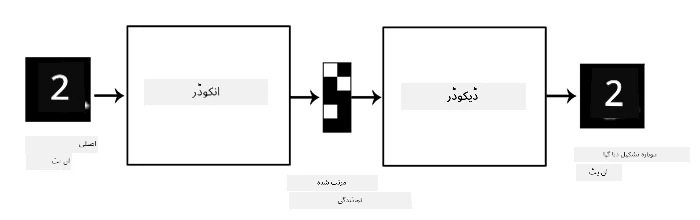
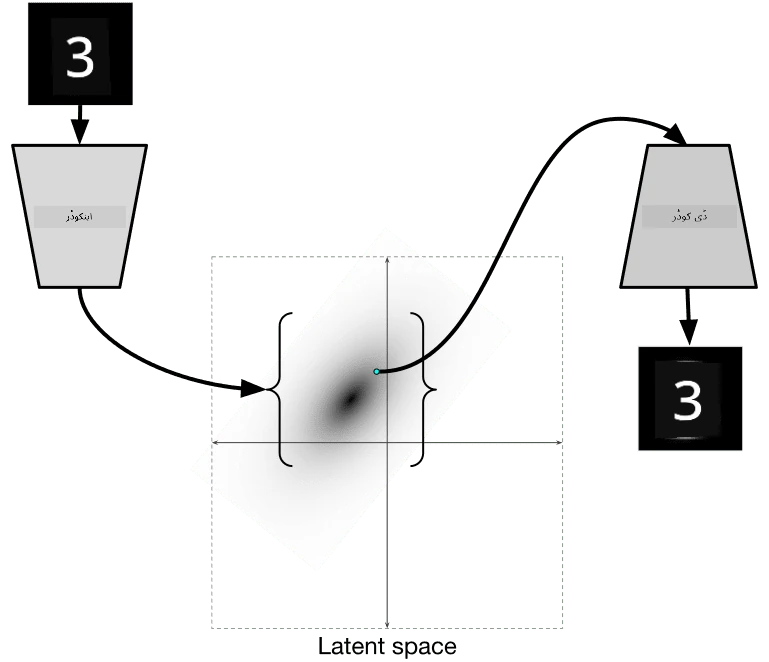

# آٹو اینکوڈرز

جب ہم CNNs کو تربیت دیتے ہیں، تو ایک مسئلہ یہ ہوتا ہے کہ ہمیں بہت زیادہ لیبل شدہ ڈیٹا کی ضرورت ہوتی ہے۔ تصویر کی درجہ بندی کے معاملے میں، ہمیں تصاویر کو مختلف کلاسز میں تقسیم کرنا پڑتا ہے، جو ایک دستی کوشش ہے۔

## [پری لیکچر کوئز](https://ff-quizzes.netlify.app/en/ai/quiz/17)

تاہم، ہم CNN فیچر ایکسٹریکٹرز کو تربیت دینے کے لیے خام (غیر لیبل شدہ) ڈیٹا استعمال کرنا چاہتے ہیں، جسے **سیلف سپروائزڈ لرننگ** کہا جاتا ہے۔ لیبلز کے بجائے، ہم تربیتی تصاویر کو نیٹ ورک ان پٹ اور آؤٹ پٹ دونوں کے طور پر استعمال کریں گے۔ **آٹو اینکوڈر** کا بنیادی خیال یہ ہے کہ ہمارے پاس ایک **اینکوڈر نیٹ ورک** ہوگا جو ان پٹ تصویر کو کسی **لیٹنٹ اسپیس** میں تبدیل کرے گا (عام طور پر یہ کچھ چھوٹے سائز کے ویکٹر ہوتا ہے)، پھر **ڈیکوڈر نیٹ ورک** ہوگا، جس کا مقصد اصل تصویر کو دوبارہ بنانا ہوگا۔

> ✅ ایک [آٹو اینکوڈر](https://wikipedia.org/wiki/Autoencoder) "ایک قسم کا مصنوعی نیورل نیٹ ورک ہے جو غیر لیبل شدہ ڈیٹا کے مؤثر کوڈنگز سیکھنے کے لیے استعمال ہوتا ہے۔"

چونکہ ہم آٹو اینکوڈر کو اصل تصویر سے زیادہ سے زیادہ معلومات حاصل کرنے کے لیے تربیت دے رہے ہیں تاکہ درست تعمیر نو ہو سکے، نیٹ ورک ان پٹ تصاویر کی بہترین **ایمبیڈنگ** تلاش کرنے کی کوشش کرتا ہے تاکہ معنی کو حاصل کیا جا سکے۔

> تصویر [Keras بلاگ](https://blog.keras.io/building-autoencoders-in-keras.html) سے لی گئی ہے

## آٹو اینکوڈرز کے استعمال کے منظرنامے

اگرچہ اصل تصاویر کو دوبارہ بنانا بذات خود مفید نہیں لگتا، لیکن کچھ منظرنامے ایسے ہیں جہاں آٹو اینکوڈرز خاص طور پر مفید ہیں:

* **تصاویر کے طول و عرض کو کم کرنا** یا **تصویری ایمبیڈنگز کی تربیت**۔ عام طور پر آٹو اینکوڈرز PCA سے بہتر نتائج دیتے ہیں، کیونکہ یہ تصاویر کی مکانی نوعیت اور درجہ بندی کی خصوصیات کو مدنظر رکھتے ہیں۔
* **شور کو ختم کرنا**، یعنی تصویر سے شور کو ہٹانا۔ چونکہ شور بہت زیادہ غیر ضروری معلومات لے کر آتا ہے، آٹو اینکوڈر اسے نسبتاً چھوٹے لیٹنٹ اسپیس میں فٹ نہیں کر سکتا، اور اس طرح یہ تصویر کے صرف اہم حصے کو حاصل کرتا ہے۔ جب ڈینائزرز کو تربیت دیتے ہیں، ہم اصل تصاویر سے شروع کرتے ہیں اور آٹو اینکوڈر کے ان پٹ کے طور پر مصنوعی طور پر شامل کردہ شور والی تصاویر استعمال کرتے ہیں۔
* **سپر ریزولوشن**، تصویر کی ریزولوشن بڑھانا۔ ہم اعلیٰ ریزولوشن تصاویر سے شروع کرتے ہیں اور آٹو اینکوڈر ان پٹ کے طور پر کم ریزولوشن والی تصویر استعمال کرتے ہیں۔
* **جنریٹو ماڈلز**۔ ایک بار جب ہم آٹو اینکوڈر کو تربیت دیتے ہیں، تو ڈیکوڈر حصہ نئے اشیاء بنانے کے لیے استعمال کیا جا سکتا ہے، جو کہ تصادفی لیٹنٹ ویکٹرز سے شروع ہوتا ہے۔

## ویرییشنل آٹو اینکوڈرز (VAE)

روایتی آٹو اینکوڈرز ان پٹ ڈیٹا کے طول و عرض کو کسی طرح کم کرتے ہیں، ان پٹ تصاویر کی اہم خصوصیات کو سمجھتے ہیں۔ تاہم، لیٹنٹ ویکٹرز اکثر زیادہ معنی خیز نہیں ہوتے۔ دوسرے الفاظ میں، MNIST ڈیٹاسیٹ کو مثال کے طور پر لیتے ہوئے، یہ سمجھنا کہ مختلف لیٹنٹ ویکٹرز کے مطابق کون سے ہندسے ہیں، آسان کام نہیں ہے، کیونکہ قریبی لیٹنٹ ویکٹرز ضروری نہیں کہ ایک ہی ہندسے کے مطابق ہوں۔

دوسری طرف، جنریٹو ماڈلز کو تربیت دینے کے لیے لیٹنٹ اسپیس کی کچھ سمجھ ہونا بہتر ہے۔ یہ خیال ہمیں **ویرییشنل آٹو اینکوڈر** (VAE) کی طرف لے جاتا ہے۔

VAE ایک آٹو اینکوڈر ہے جو لیٹنٹ پیرامیٹرز کی *شماریاتی تقسیم* کی پیش گوئی کرنا سیکھتا ہے، جسے **لیٹنٹ ڈسٹریبیوشن** کہا جاتا ہے۔ مثال کے طور پر، ہم چاہتے ہیں کہ لیٹنٹ ویکٹرز کچھ اوسط zmean اور معیاری انحراف zsigma کے ساتھ عام طور پر تقسیم ہوں (اوسط اور معیاری انحراف دونوں کچھ طول و عرض d کے ویکٹر ہیں)۔ VAE میں اینکوڈر ان پیرامیٹرز کی پیش گوئی کرنا سیکھتا ہے، اور پھر ڈیکوڈر اس تقسیم سے ایک تصادفی ویکٹر لیتا ہے تاکہ اشیاء کو دوبارہ بنایا جا سکے۔

خلاصہ:

* ان پٹ ویکٹر سے، ہم `z_mean` اور `z_log_sigma` کی پیش گوئی کرتے ہیں (معیاری انحراف کی بجائے، ہم اس کا لوگارتھم پیش گوئی کرتے ہیں)
* ہم تقسیم N(zmean,exp(zlog\_sigma)) سے ایک ویکٹر `sample` لیتے ہیں
* ڈیکوڈر `sample` کو ان پٹ ویکٹر کے طور پر استعمال کرتے ہوئے اصل تصویر کو دوبارہ بنانے کی کوشش کرتا ہے

> تصویر [اس بلاگ پوسٹ](https://ijdykeman.github.io/ml/2016/12/21/cvae.html) سے لی گئی ہے، از: Isaak Dykeman

ویرییشنل آٹو اینکوڈرز ایک پیچیدہ نقصان فنکشن استعمال کرتے ہیں جو دو حصوں پر مشتمل ہوتا ہے:

* **ریکنسٹرکشن نقصان** وہ نقصان فنکشن ہے جو ظاہر کرتا ہے کہ دوبارہ بنائی گئی تصویر ہدف کے کتنی قریب ہے (یہ Mean Squared Error یا MSE ہو سکتا ہے)۔ یہ وہی نقصان فنکشن ہے جو عام آٹو اینکوڈرز میں ہوتا ہے۔
* **KL نقصان**، جو یقینی بناتا ہے کہ لیٹنٹ ویریبل ڈسٹریبیوشن عام تقسیم کے قریب رہے۔ یہ [Kullback-Leibler divergence](https://www.countbayesie.com/blog/2017/5/9/kullback-leibler-divergence-explained) کے تصور پر مبنی ہے - دو شماریاتی تقسیموں کی مماثلت کا اندازہ لگانے کے لیے ایک میٹرک۔

VAEs کا ایک اہم فائدہ یہ ہے کہ وہ ہمیں نئی تصاویر نسبتا آسانی سے بنانے کی اجازت دیتے ہیں، کیونکہ ہمیں معلوم ہوتا ہے کہ لیٹنٹ ویکٹرز کو کس تقسیم سے نمونہ لینا ہے۔ مثال کے طور پر، اگر ہم MNIST پر 2D لیٹنٹ ویکٹر کے ساتھ VAE کو تربیت دیتے ہیں، تو ہم لیٹنٹ ویکٹر کے اجزاء کو مختلف کر کے مختلف ہندسے حاصل کر سکتے ہیں:

> تصویر از: [Dmitry Soshnikov](http://soshnikov.com)

مشاہدہ کریں کہ تصاویر ایک دوسرے میں کیسے ضم ہو رہی ہیں، جیسے ہی ہم لیٹنٹ پیرامیٹر اسپیس کے مختلف حصوں سے لیٹنٹ ویکٹرز حاصل کرتے ہیں۔ ہم اس اسپیس کو 2D میں بھی تصور کر سکتے ہیں:

 

> تصویر از: [Dmitry Soshnikov](http://soshnikov.com)

## ✍️ مشقیں: آٹو اینکوڈرز

آٹو اینکوڈرز کے بارے میں مزید جانیں ان متعلقہ نوٹ بکس میں:

* [TensorFlow میں آٹو اینکوڈرز](AutoencodersTF.ipynb)
* [PyTorch میں آٹو اینکوڈرز](AutoEncodersPyTorch.ipynb)

## آٹو اینکوڈرز کی خصوصیات

* **ڈیٹا مخصوص** - یہ صرف ان قسم کی تصاویر کے ساتھ اچھا کام کرتے ہیں جن پر انہیں تربیت دی گئی ہو۔ مثال کے طور پر، اگر ہم پھولوں پر سپر ریزولوشن نیٹ ورک کو تربیت دیں، تو یہ پورٹریٹس پر اچھا کام نہیں کرے گا۔ اس کی وجہ یہ ہے کہ نیٹ ورک تربیتی ڈیٹاسیٹ سے سیکھے گئے فیچرز سے باریک تفصیلات لے کر اعلیٰ ریزولوشن تصویر بنا سکتا ہے۔
* **لوسی** - دوبارہ بنائی گئی تصویر اصل تصویر جیسی نہیں ہوتی۔ نقصان کی نوعیت تربیت کے دوران استعمال ہونے والے *نقصان فنکشن* سے متعین ہوتی ہے۔
* **غیر لیبل شدہ ڈیٹا** پر کام کرتا ہے

## [پوسٹ لیکچر کوئز](https://ff-quizzes.netlify.app/en/ai/quiz/18)

## نتیجہ

اس سبق میں، آپ نے آٹو اینکوڈرز کی مختلف اقسام کے بارے میں سیکھا جو AI سائنسدان کے لیے دستیاب ہیں۔ آپ نے انہیں بنانے اور تصاویر کو دوبارہ بنانے کے لیے استعمال کرنے کا طریقہ سیکھا۔ آپ نے VAE کے بارے میں بھی سیکھا اور اسے نئی تصاویر بنانے کے لیے استعمال کرنے کا طریقہ سمجھا۔

## 🚀 چیلنج

اس سبق میں، آپ نے تصاویر کے لیے آٹو اینکوڈرز کے استعمال کے بارے میں سیکھا۔ لیکن انہیں موسیقی کے لیے بھی استعمال کیا جا سکتا ہے! Magenta پروجیکٹ کے [MusicVAE](https://magenta.tensorflow.org/music-vae) پروجیکٹ کو دیکھیں، جو موسیقی کو دوبارہ بنانے کے لیے آٹو اینکوڈرز کو سیکھنے کے لیے استعمال کرتا ہے۔ اس لائبریری کے ساتھ کچھ [تجربات](https://colab.research.google.com/github/magenta/magenta-demos/blob/master/colab-notebooks/Multitrack_MusicVAE.ipynb) کریں تاکہ دیکھیں آپ کیا تخلیق کر سکتے ہیں۔

## [پوسٹ لیکچر کوئز](https://ff-quizzes.netlify.app/en/ai/quiz/16)

## جائزہ اور خود مطالعہ

حوالہ کے لیے، ان وسائل میں آٹو اینکوڈرز کے بارے میں مزید پڑھیں:

* [Keras میں آٹو اینکوڈرز بنانا](https://blog.keras.io/building-autoencoders-in-keras.html)
* [NeuroHive پر بلاگ پوسٹ](https://neurohive.io/ru/osnovy-data-science/variacionnyj-avtojenkoder-vae/)
* [ویرییشنل آٹو اینکوڈرز کی وضاحت](https://kvfrans.com/variational-autoencoders-explained/)
* [کنڈیشنل ویرییشنل آٹو اینکوڈرز](https://ijdykeman.github.io/ml/2016/12/21/cvae.html)

## اسائنمنٹ

[TensorFlow کا استعمال کرتے ہوئے اس نوٹ بک](AutoencodersTF.ipynb) کے آخر میں آپ کو ایک 'ٹاسک' ملے گا - اسے اپنی اسائنمنٹ کے طور پر استعمال کریں۔

---

