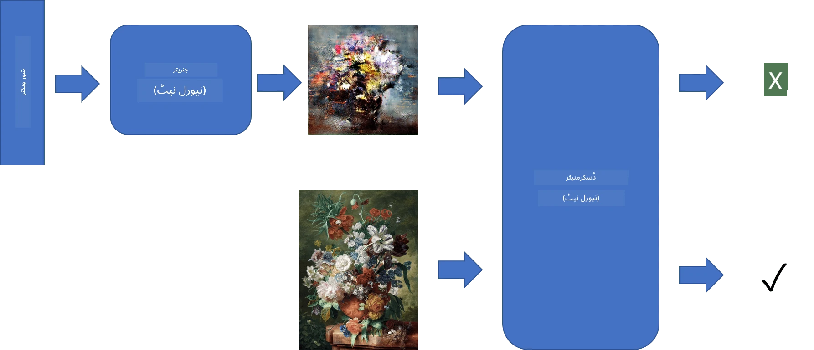
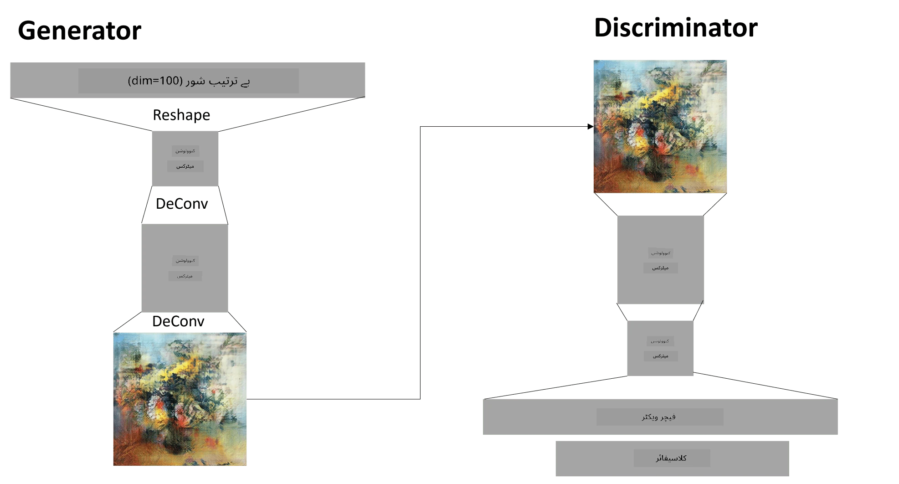

# جنریٹو ایڈورسیریل نیٹ ورکس

پچھلے حصے میں، ہم نے **جنریٹو ماڈلز** کے بارے میں سیکھا: ایسے ماڈلز جو تربیتی ڈیٹا سیٹ میں موجود تصاویر کے مشابہ نئی تصاویر بنا سکتے ہیں۔ VAE جنریٹو ماڈل کی ایک اچھی مثال تھی۔

## [پری لیکچر کوئز](https://ff-quizzes.netlify.app/en/ai/quiz/19)

تاہم، اگر ہم کچھ واقعی معنی خیز بنانا چاہیں، جیسے مناسب ریزولوشن پر ایک پینٹنگ، تو VAE کے ساتھ تربیت اچھی طرح سے نہیں ہوتی۔ اس استعمال کے لیے، ہمیں ایک اور آرکیٹیکچر کے بارے میں سیکھنا چاہیے جو خاص طور پر جنریٹو ماڈلز کے لیے بنایا گیا ہے - **جنریٹو ایڈورسیریل نیٹ ورکس**، یا GANs۔

GAN کا بنیادی خیال یہ ہے کہ دو نیورل نیٹ ورکس ہوں گے جو ایک دوسرے کے خلاف تربیت دیے جائیں گے:

> تصویر: [دمیتری سوشنیکوف](http://soshnikov.com)

> ✅ تھوڑی سی وضاحت:
> * **جنریٹر** ایک نیٹ ورک ہے جو کچھ بے ترتیب ویکٹر لیتا ہے اور نتیجے میں تصویر بناتا ہے۔
> * **ڈسکرمنیٹر** ایک نیٹ ورک ہے جو تصویر لیتا ہے اور یہ بتانا چاہیے کہ آیا یہ حقیقی تصویر ہے (تربیتی ڈیٹا سیٹ سے) یا یہ جنریٹر کے ذریعے بنائی گئی ہے۔ یہ بنیادی طور پر ایک تصویر کی درجہ بندی کرنے والا ہے۔

### ڈسکرمنیٹر

ڈسکرمنیٹر کی آرکیٹیکچر عام تصویر کی درجہ بندی کرنے والے نیٹ ورک سے مختلف نہیں ہے۔ سب سے آسان صورت میں، یہ مکمل طور پر مربوط درجہ بندی کرنے والا ہو سکتا ہے، لیکن زیادہ تر امکان ہے کہ یہ ایک [کنوولوشنل نیٹ ورک](../07-ConvNets/README.md) ہوگا۔

> ✅ کنوولوشنل نیٹ ورکس پر مبنی GAN کو [DCGAN](https://arxiv.org/pdf/1511.06434.pdf) کہا جاتا ہے۔

ایک CNN ڈسکرمنیٹر درج ذیل تہوں پر مشتمل ہوتا ہے: کئی کنوولوشنز+پولنگز (جس میں اسپیشل سائز کم ہوتا ہے) اور ایک یا زیادہ مکمل طور پر مربوط تہیں تاکہ "فیچر ویکٹر" حاصل کیا جا سکے، اور آخر میں بائنری درجہ بندی کرنے والا۔

> ✅ 'پولنگ' اس سیاق و سباق میں ایک تکنیک ہے جو تصویر کے سائز کو کم کرتی ہے۔ "پولنگ تہیں ڈیٹا کے ابعاد کو کم کرتی ہیں، ایک تہہ میں نیورون کلسٹرز کے آؤٹ پٹ کو اگلی تہہ میں ایک نیورون میں یکجا کر کے۔" - [ماخذ](https://wikipedia.org/wiki/Convolutional_neural_network#Pooling_layers)

### جنریٹر

جنریٹر تھوڑا زیادہ پیچیدہ ہے۔ آپ اسے ایک الٹا ڈسکرمنیٹر سمجھ سکتے ہیں۔ ایک لیٹنٹ ویکٹر سے شروع کرتے ہوئے (فیچر ویکٹر کی جگہ)، اس میں مطلوبہ سائز/شکل میں تبدیل کرنے کے لیے ایک مکمل طور پر مربوط تہہ ہوتی ہے، اس کے بعد ڈی کنوولوشنز+اپسکیلنگ۔ یہ [آٹو اینکوڈر](../09-Autoencoders/README.md) کے *ڈیکوڈر* حصے سے مشابہ ہے۔

> ✅ چونکہ کنوولوشن تہہ کو تصویر کے ذریعے ایک لکیری فلٹر کے طور پر نافذ کیا جاتا ہے، ڈی کنوولوشن بنیادی طور پر کنوولوشن جیسا ہی ہے، اور اسے اسی تہہ کی منطق کا استعمال کرتے ہوئے نافذ کیا جا سکتا ہے۔

> تصویر: [دمیتری سوشنیکوف](http://soshnikov.com)

### GAN کی تربیت

GANs کو **ایڈورسیریل** کہا جاتا ہے کیونکہ جنریٹر اور ڈسکرمنیٹر کے درمیان مسلسل مقابلہ ہوتا ہے۔ اس مقابلے کے دوران، جنریٹر اور ڈسکرمنیٹر دونوں بہتر ہوتے ہیں، اس طرح نیٹ ورک بہتر اور بہتر تصاویر بنانا سیکھتا ہے۔

تربیت دو مراحل میں ہوتی ہے:

* **ڈسکرمنیٹر کی تربیت**۔ یہ کام کافی سیدھا ہے: ہم جنریٹر کے ذریعے تصاویر کا ایک بیچ بناتے ہیں، انہیں 0 کے لیبل کے ساتھ لیبل کرتے ہیں، جو جعلی تصویر کے لیے ہے، اور ان پٹ ڈیٹا سیٹ سے تصاویر کا ایک بیچ لیتے ہیں (لیبل 1، حقیقی تصویر کے ساتھ)۔ ہم کچھ *ڈسکرمنیٹر نقصان* حاصل کرتے ہیں، اور بیک پروپ کرتے ہیں۔
* **جنریٹر کی تربیت**۔ یہ تھوڑا زیادہ پیچیدہ ہے، کیونکہ ہم جنریٹر کے لیے براہ راست متوقع آؤٹ پٹ نہیں جانتے۔ ہم پورے GAN نیٹ ورک کو جنریٹر کے بعد ڈسکرمنیٹر کے ساتھ لیتے ہیں، اسے کچھ بے ترتیب ویکٹرز کے ساتھ فیڈ کرتے ہیں، اور توقع کرتے ہیں کہ نتیجہ 1 ہوگا (جو حقیقی تصاویر سے مطابقت رکھتا ہے)۔ پھر ہم ڈسکرمنیٹر کے پیرامیٹرز کو منجمد کرتے ہیں (ہم نہیں چاہتے کہ یہ اس مرحلے پر تربیت دی جائے)، اور بیک پروپ کرتے ہیں۔

اس عمل کے دوران، جنریٹر اور ڈسکرمنیٹر دونوں کے نقصانات نمایاں طور پر کم نہیں ہو رہے ہوتے۔ مثالی صورتحال میں، انہیں دو طرفہ ہونا چاہیے، جو دونوں نیٹ ورکس کی کارکردگی کو بہتر بنانے کے مطابق ہو۔

## ✍️ مشقیں: GANs

* [GAN نوٹ بک TensorFlow/Keras میں](GANTF.ipynb)
* [GAN نوٹ بک PyTorch میں](GANPyTorch.ipynb)

### GAN کی تربیت کے مسائل

GANs کو تربیت دینا خاص طور پر مشکل سمجھا جاتا ہے۔ یہاں کچھ مسائل ہیں:

* **موڈ کولپس**۔ اس اصطلاح سے مراد ہے کہ جنریٹر ایک کامیاب تصویر بنانا سیکھتا ہے جو جنریٹر کو دھوکہ دیتی ہے، اور مختلف تصاویر کی قسم نہیں بناتا۔
* **ہائپر پیرامیٹرز کے لیے حساسیت**۔ اکثر آپ دیکھ سکتے ہیں کہ GAN بالکل بھی کنورج نہیں کرتا، اور پھر اچانک سیکھنے کی شرح میں کمی سے کنورجنس ہوتی ہے۔
* جنریٹر اور ڈسکرمنیٹر کے درمیان **توازن** برقرار رکھنا۔ بہت سے معاملات میں ڈسکرمنیٹر کا نقصان نسبتاً جلدی صفر تک گر سکتا ہے، جس کے نتیجے میں جنریٹر مزید تربیت حاصل کرنے سے قاصر ہوتا ہے۔ اس پر قابو پانے کے لیے، ہم جنریٹر اور ڈسکرمنیٹر کے لیے مختلف سیکھنے کی شرح مقرر کرنے کی کوشش کر سکتے ہیں، یا اگر نقصان پہلے ہی بہت کم ہو تو ڈسکرمنیٹر کی تربیت کو چھوڑ سکتے ہیں۔
* **اعلی ریزولوشن** کے لیے تربیت۔ آٹو اینکوڈرز کے ساتھ اسی مسئلے کی عکاسی کرتے ہوئے، یہ مسئلہ اس وقت پیدا ہوتا ہے جب کنوولوشنل نیٹ ورک کی بہت سی تہوں کو دوبارہ تعمیر کرنے سے آرٹیفیکٹس پیدا ہوتے ہیں۔ اس مسئلے کو عام طور پر **پروگریسو گروئنگ** کے ساتھ حل کیا جاتا ہے، جب پہلے چند تہوں کو کم ریزولوشن تصاویر پر تربیت دی جاتی ہے، اور پھر تہوں کو "ان بلاک" یا شامل کیا جاتا ہے۔ ایک اور حل تہوں کے درمیان اضافی کنکشن شامل کرنا اور ایک ساتھ کئی ریزولوشنز پر تربیت دینا ہوگا - تفصیلات کے لیے اس [ملٹی اسکیل گریڈینٹ GANs پیپر](https://arxiv.org/abs/1903.06048) کو دیکھیں۔

## اسٹائل ٹرانسفر

GANs آرٹسٹک تصاویر بنانے کا ایک بہترین طریقہ ہے۔ ایک اور دلچسپ تکنیک **اسٹائل ٹرانسفر** کہلاتی ہے، جو ایک **مواد کی تصویر** لیتی ہے، اور اسے مختلف انداز میں دوبارہ بناتی ہے، **اسٹائل تصویر** سے فلٹرز لگاتے ہوئے۔

یہ طریقہ کار اس طرح کام کرتا ہے:
* ہم ایک بے ترتیب شور کی تصویر سے شروع کرتے ہیں (یا مواد کی تصویر سے، لیکن سمجھنے کے لیے بے ترتیب شور سے شروع کرنا آسان ہے)
* ہمارا مقصد ایسی تصویر بنانا ہوگا جو مواد کی تصویر اور اسٹائل تصویر دونوں کے قریب ہو۔ یہ دو نقصان کے افعال کے ذریعے طے کیا جائے گا:
   - **مواد کا نقصان** موجودہ تصویر اور مواد کی تصویر سے CNN کے ذریعے کچھ تہوں پر نکالی گئی خصوصیات کی بنیاد پر حساب کیا جاتا ہے۔
   - **اسٹائل کا نقصان** موجودہ تصویر اور اسٹائل تصویر کے درمیان ایک ہوشیار طریقے سے گرام میٹرکس کا استعمال کرتے ہوئے حساب کیا جاتا ہے (مزید تفصیلات [مثال نوٹ بک](StyleTransfer.ipynb) میں)
* تصویر کو ہموار بنانے اور شور کو دور کرنے کے لیے، ہم **ویری ایشن نقصان** بھی متعارف کراتے ہیں، جو پڑوسی پکسلز کے درمیان اوسط فاصلہ حساب کرتا ہے۔
* بنیادی اصلاحی لوپ موجودہ تصویر کو ایڈجسٹ کرتا ہے، گریڈینٹ ڈیسنٹ (یا کچھ اور اصلاحی الگورتھم) کا استعمال کرتے ہوئے کل نقصان کو کم کرنے کے لیے، جو تمام تین نقصانات کا وزنی مجموعہ ہے۔

## ✍️ مثال: [اسٹائل ٹرانسفر](StyleTransfer.ipynb)

## [پوسٹ لیکچر کوئز](https://ff-quizzes.netlify.app/en/ai/quiz/20)

## نتیجہ

اس سبق میں، آپ نے GANs اور انہیں تربیت دینے کے طریقے کے بارے میں سیکھا۔ آپ نے یہ بھی سیکھا کہ اس قسم کے نیورل نیٹ ورک کو کن خاص چیلنجز کا سامنا ہو سکتا ہے، اور ان سے آگے بڑھنے کے لیے کچھ حکمت عملی۔

## 🚀 چیلنج

اپنی تصاویر کا استعمال کرتے ہوئے [اسٹائل ٹرانسفر نوٹ بک](StyleTransfer.ipynb) پر عمل کریں۔

## جائزہ اور خود مطالعہ

حوالہ کے لیے، ان وسائل میں GANs کے بارے میں مزید پڑھیں:

* مارکو پاسینی، [10 اسباق جو میں نے GANs کی تربیت کرتے ہوئے ایک سال میں سیکھے](https://towardsdatascience.com/10-lessons-i-learned-training-generative-adversarial-networks-gans-for-a-year-c9071159628)
* [StyleGAN](https://en.wikipedia.org/wiki/StyleGAN)، ایک *ڈی فیکٹو* GAN آرکیٹیکچر پر غور کریں
* [Azure ML پر GANs کا استعمال کرتے ہوئے جنریٹو آرٹ بنانا](https://soshnikov.com/scienceart/creating-generative-art-using-gan-on-azureml/)

## اسائنمنٹ

اس سبق سے وابستہ دو نوٹ بکس میں سے کسی ایک کو دوبارہ دیکھیں اور اپنے تصاویر پر GAN کو دوبارہ تربیت دیں۔ آپ کیا بنا سکتے ہیں؟

---

