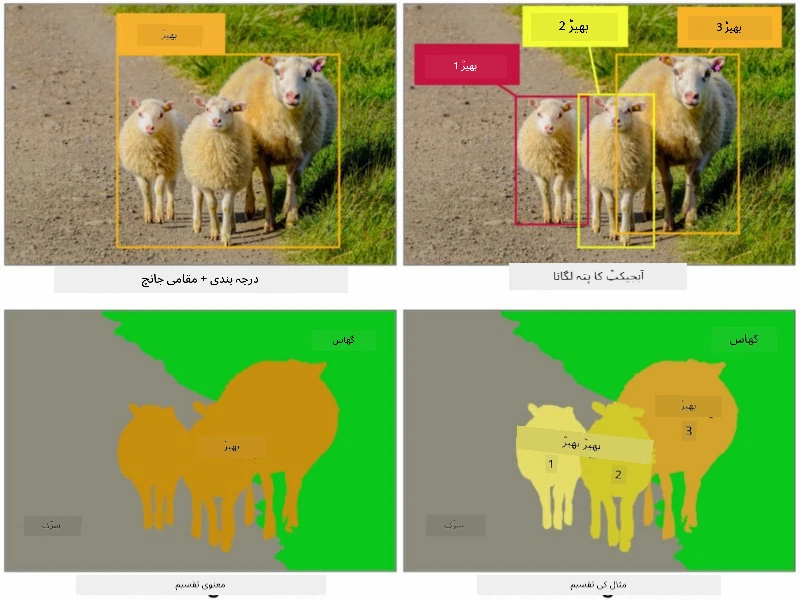
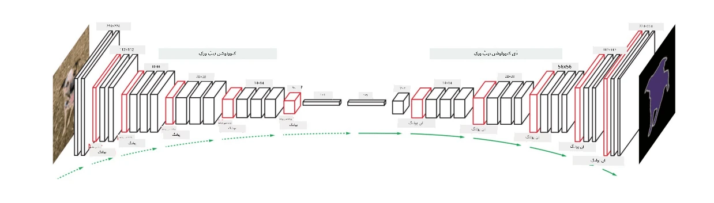

# تقسیم

ہم نے پہلے آبجیکٹ ڈیٹیکشن کے بارے میں سیکھا تھا، جو ہمیں تصویر میں اشیاء کو ان کے *باؤنڈنگ باکسز* کی پیش گوئی کے ذریعے تلاش کرنے کی اجازت دیتا ہے۔ تاہم، کچھ کاموں کے لیے ہمیں صرف باؤنڈنگ باکسز کی ضرورت نہیں ہوتی بلکہ اشیاء کی زیادہ درست لوکلائزیشن کی ضرورت ہوتی ہے۔ اس کام کو **تقسیم** کہا جاتا ہے۔

## [لیکچر سے پہلے کا کوئز](https://ff-quizzes.netlify.app/en/ai/quiz/23)

تقسیم کو **پکسل کی درجہ بندی** کے طور پر دیکھا جا سکتا ہے، جہاں تصویر کے **ہر** پکسل کے لیے ہمیں اس کی کلاس کی پیش گوئی کرنی ہوتی ہے (*بیک گراؤنڈ* بھی ایک کلاس ہوتی ہے)۔ تقسیم کے دو اہم الگورتھم ہیں:

* **سیمینٹک تقسیم** صرف پکسل کی کلاس بتاتی ہے اور ایک ہی کلاس کی مختلف اشیاء کے درمیان فرق نہیں کرتی۔
* **انسٹینس تقسیم** کلاسز کو مختلف انسٹینسز میں تقسیم کرتی ہے۔

انسٹینس تقسیم کے لیے، یہ بھیڑیں مختلف اشیاء ہیں، لیکن سیمینٹک تقسیم کے لیے تمام بھیڑیں ایک کلاس کے طور پر دکھائی جاتی ہیں۔

> تصویر [اس بلاگ پوسٹ](https://nirmalamurali.medium.com/image-classification-vs-semantic-segmentation-vs-instance-segmentation-625c33a08d50) سے لی گئی ہے۔

تقسیم کے لیے مختلف نیورل آرکیٹیکچرز موجود ہیں، لیکن ان سب کی ساخت ایک جیسی ہوتی ہے۔ ایک لحاظ سے، یہ اس آٹو اینکوڈر سے مشابہ ہے جس کے بارے میں آپ نے پہلے سیکھا تھا، لیکن اصل تصویر کو ڈی کنسٹرکٹ کرنے کے بجائے، ہمارا مقصد ایک **ماسک** کو ڈی کنسٹرکٹ کرنا ہے۔ اس طرح، تقسیم کا نیٹ ورک درج ذیل حصے رکھتا ہے:

* **اینکوڈر** ان پٹ تصویر سے فیچرز نکالتا ہے۔
* **ڈی کوڈر** ان فیچرز کو **ماسک تصویر** میں تبدیل کرتا ہے، جس کا سائز اور چینلز کی تعداد کلاسز کی تعداد کے مطابق ہوتی ہے۔

> تصویر [اس اشاعت](https://arxiv.org/pdf/2001.05566.pdf) سے لی گئی ہے۔

ہم خاص طور پر اس نقصان کے فنکشن کا ذکر کریں گے جو تقسیم کے لیے استعمال ہوتا ہے۔ جب کلاسیکل آٹو اینکوڈرز استعمال کیے جاتے ہیں، تو ہمیں دو تصاویر کے درمیان مماثلت کو ماپنے کی ضرورت ہوتی ہے، اور ہم اس کے لیے میین اسکوائر ایرر (MSE) استعمال کر سکتے ہیں۔ تقسیم میں، ہدف ماسک تصویر میں ہر پکسل کلاس نمبر کی نمائندگی کرتا ہے (تیسرے ڈائمینشن کے ساتھ ون-ہاٹ-اینکوڈڈ)، لہذا ہمیں درجہ بندی کے لیے مخصوص نقصان کے فنکشنز استعمال کرنے کی ضرورت ہوتی ہے - کراس اینٹروپی نقصان، جو تمام پکسلز پر اوسط کیا جاتا ہے۔ اگر ماسک بائنری ہو - **بائنری کراس اینٹروپی نقصان** (BCE) استعمال کیا جاتا ہے۔

> ✅ ون-ہاٹ اینکوڈنگ ایک طریقہ ہے جس کے ذریعے کلاس لیبل کو کلاسز کی تعداد کے برابر لمبائی والے ویکٹر میں اینکوڈ کیا جاتا ہے۔ [اس مضمون](https://datagy.io/sklearn-one-hot-encode/) پر ایک نظر ڈالیں۔

## طبی امیجنگ کے لیے تقسیم

اس سبق میں، ہم تقسیم کو عملی طور پر دیکھیں گے، جہاں ہم نیٹ ورک کو طبی تصاویر میں انسانی نیوی (جسے تل بھی کہا جاتا ہے) کو پہچاننے کے لیے تربیت دیں گے۔ ہم <a href="https://www.fc.up.pt/addi/ph2%20database.html">PH2 ڈیٹا بیس</a> کے ڈرمو سکوپی تصاویر کو بطور تصویر ذریعہ استعمال کریں گے۔ اس ڈیٹا سیٹ میں تین کلاسز کی 200 تصاویر شامل ہیں: عام نیوی، غیر معمولی نیوی، اور میلانوما۔ تمام تصاویر کے ساتھ ایک **ماسک** بھی شامل ہے جو نیوی کو نمایاں کرتا ہے۔

> ✅ یہ تکنیک خاص طور پر اس قسم کی طبی امیجنگ کے لیے موزوں ہے، لیکن آپ اور کون سی حقیقی دنیا کی ایپلیکیشنز کا تصور کر سکتے ہیں؟

> تصویر PH2 ڈیٹا بیس سے لی گئی ہے۔

ہم ایک ماڈل کو تربیت دیں گے تاکہ کسی بھی نیوی کو اس کے پس منظر سے الگ کیا جا سکے۔

## ✍️ مشقیں: سیمینٹک تقسیم

نیچے دیے گئے نوٹ بکس کھولیں تاکہ مختلف سیمینٹک تقسیم آرکیٹیکچرز کے بارے میں مزید جان سکیں، ان کے ساتھ کام کرنے کی مشق کریں، اور انہیں عملی طور پر دیکھیں۔

* [سیمینٹک تقسیم پائی ٹارچ](SemanticSegmentationPytorch.ipynb)
* [سیمینٹک تقسیم ٹینسر فلو](SemanticSegmentationTF.ipynb)

## [لیکچر کے بعد کا کوئز](https://ff-quizzes.netlify.app/en/ai/quiz/24)

## نتیجہ

تقسیم تصویر کی درجہ بندی کے لیے ایک بہت طاقتور تکنیک ہے، جو باؤنڈنگ باکسز سے آگے بڑھ کر پکسل لیول کی درجہ بندی تک جاتی ہے۔ یہ طبی امیجنگ سمیت دیگر ایپلیکیشنز میں استعمال ہونے والی تکنیک ہے۔

## 🚀 چیلنج

جسم کی تقسیم تصاویر میں لوگوں کے ساتھ کیے جانے والے عام کاموں میں سے ایک ہے۔ دیگر اہم کاموں میں **اسکلیٹن ڈیٹیکشن** اور **پوز ڈیٹیکشن** شامل ہیں۔ [OpenPose](https://github.com/CMU-Perceptual-Computing-Lab/openpose) لائبریری کو آزمائیں تاکہ دیکھ سکیں کہ پوز ڈیٹیکشن کیسے استعمال کیا جا سکتا ہے۔

## جائزہ اور خود مطالعہ

یہ [ویکیپیڈیا مضمون](https://wikipedia.org/wiki/Image_segmentation) اس تکنیک کے مختلف ایپلیکیشنز کا ایک اچھا جائزہ پیش کرتا ہے۔ انسٹینس تقسیم اور پیناپٹک تقسیم کے ذیلی شعبوں کے بارے میں مزید جانیں۔

## [اسائنمنٹ](lab/README.md)

اس لیب میں، [Segmentation Full Body MADS Dataset](https://www.kaggle.com/datasets/tapakah68/segmentation-full-body-mads-dataset) کا استعمال کرتے ہوئے **انسانی جسم کی تقسیم** کرنے کی کوشش کریں۔

---

