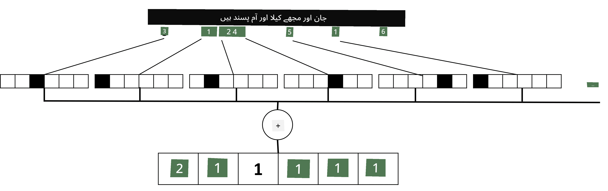

# ٹیکسٹ کو ٹینسرز کے طور پر پیش کرنا

## [لیکچر سے پہلے کا کوئز](https://ff-quizzes.netlify.app/en/ai/quiz/25)

## ٹیکسٹ کی درجہ بندی

اس سیکشن کے پہلے حصے میں، ہم **ٹیکسٹ کی درجہ بندی** کے کام پر توجہ مرکوز کریں گے۔ ہم [AG News](https://www.kaggle.com/amananandrai/ag-news-classification-dataset) ڈیٹا سیٹ استعمال کریں گے، جس میں خبریں شامل ہیں جیسے:

* زمرہ: سائنس/ٹیک
* عنوان: Ky. کمپنی نے پیپٹائڈز کا مطالعہ کرنے کے لیے گرانٹ جیت لی (AP)
* مواد: AP - ایک کمپنی جو یونیورسٹی آف لوئس ول کے کیمسٹری ریسرچر کے ذریعہ قائم کی گئی تھی، نے ترقی کے لیے گرانٹ جیت لی...

ہمارا مقصد یہ ہوگا کہ متن کی بنیاد پر خبر کو ایک زمرے میں درجہ بندی کریں۔

## ٹیکسٹ کی نمائندگی

اگر ہم نیورل نیٹ ورکس کے ساتھ قدرتی زبان کی پروسیسنگ (NLP) کے کاموں کو حل کرنا چاہتے ہیں، تو ہمیں کسی طرح ٹیکسٹ کو ٹینسرز کے طور پر پیش کرنے کی ضرورت ہوگی۔ کمپیوٹر پہلے ہی متن کے کرداروں کو نمبروں کے طور پر پیش کرتے ہیں جو آپ کی اسکرین پر فونٹس کو ASCII یا UTF-8 جیسے انکوڈنگز کے ذریعے نقشہ بناتے ہیں۔

> [تصویر کا ماخذ](https://www.seobility.net/en/wiki/ASCII)

انسانوں کے طور پر، ہم سمجھتے ہیں کہ ہر حرف **کیا ظاہر کرتا ہے**، اور تمام کردار ایک ساتھ مل کر جملے کے الفاظ کیسے بناتے ہیں۔ تاہم، کمپیوٹرز خود بخود ایسی سمجھ نہیں رکھتے، اور نیورل نیٹ ورک کو تربیت کے دوران معنی سیکھنا پڑتا ہے۔

لہذا، ہم ٹیکسٹ کی نمائندگی کرتے وقت مختلف طریقے استعمال کر سکتے ہیں:

* **کردار کی سطح کی نمائندگی**، جب ہم ٹیکسٹ کو ہر کردار کو ایک نمبر کے طور پر پیش کرتے ہیں۔ فرض کریں کہ ہمارے ٹیکسٹ کارپس میں *C* مختلف کردار ہیں، تو لفظ *Hello* کو 5x*C* ٹینسر کے طور پر پیش کیا جائے گا۔ ہر حرف ایک-ہاٹ انکوڈنگ میں ایک ٹینسر کالم کے مطابق ہوگا۔
* **لفظ کی سطح کی نمائندگی**، جس میں ہم اپنے ٹیکسٹ کے تمام الفاظ کی ایک **لغت** بناتے ہیں، اور پھر الفاظ کو ایک-ہاٹ انکوڈنگ کے ذریعے پیش کرتے ہیں۔ یہ طریقہ کسی حد تک بہتر ہے، کیونکہ ہر حرف خود زیادہ معنی نہیں رکھتا، اور اس طرح اعلی سطحی معنوی تصورات - الفاظ - کا استعمال کرتے ہوئے ہم نیورل نیٹ ورک کے لیے کام کو آسان بناتے ہیں۔ تاہم، بڑی لغت کے سائز کی وجہ سے، ہمیں اعلی جہتی کم کثافت والے ٹینسرز سے نمٹنا پڑتا ہے۔

چاہے کوئی بھی نمائندگی ہو، ہمیں پہلے ٹیکسٹ کو **ٹوکینز** کی ترتیب میں تبدیل کرنا ہوگا، ایک ٹوکن یا تو ایک کردار، ایک لفظ، یا کبھی کبھی ایک لفظ کا حصہ ہوتا ہے۔ پھر، ہم ٹوکن کو ایک نمبر میں تبدیل کرتے ہیں، عام طور پر **لغت** کا استعمال کرتے ہوئے، اور یہ نمبر ایک-ہاٹ انکوڈنگ کے ذریعے نیورل نیٹ ورک میں فیڈ کیا جا سکتا ہے۔

## این-گرامز

قدرتی زبان میں، الفاظ کے درست معنی صرف سیاق و سباق میں ہی طے کیے جا سکتے ہیں۔ مثال کے طور پر، *نیورل نیٹ ورک* اور *فشنگ نیٹ ورک* کے معنی بالکل مختلف ہیں۔ اس بات کو مدنظر رکھنے کے لیے ایک طریقہ یہ ہے کہ ہم اپنے ماڈل کو الفاظ کے جوڑوں پر بنائیں، اور لفظی جوڑوں کو الگ لغت کے ٹوکنز کے طور پر سمجھیں۔ اس طرح، جملہ *I like to go fishing* کو درج ذیل ٹوکنز کی ترتیب میں پیش کیا جائے گا: *I like*, *like to*, *to go*, *go fishing*. اس طریقے کا مسئلہ یہ ہے کہ لغت کا سائز نمایاں طور پر بڑھ جاتا ہے، اور *go fishing* اور *go shopping* جیسے امتزاج مختلف ٹوکنز کے ذریعے پیش کیے جاتے ہیں، جو کسی بھی معنوی مماثلت کو شیئر نہیں کرتے حالانکہ فعل ایک جیسا ہے۔

کچھ معاملات میں، ہم تین الفاظ کے امتزاج -- ٹرائی-گرامز -- استعمال کرنے پر غور کر سکتے ہیں۔ اس طرح کا طریقہ اکثر **این-گرامز** کہلاتا ہے۔ نیز، کردار کی سطح کی نمائندگی کے ساتھ این-گرامز کا استعمال کرنا سمجھ میں آتا ہے، جس صورت میں این-گرامز مختلف سلیبلز کے تقریباً مساوی ہوں گے۔

## بیگ آف ورڈز اور TF/IDF

جب ٹیکسٹ کی درجہ بندی جیسے کاموں کو حل کرتے ہیں، تو ہمیں ٹیکسٹ کو ایک مقررہ سائز کے ویکٹر کے ذریعے پیش کرنے کے قابل ہونا چاہیے، جسے ہم آخری ڈینس کلاسیفائر کے ان پٹ کے طور پر استعمال کریں گے۔ اس کا ایک آسان طریقہ یہ ہے کہ تمام انفرادی لفظی نمائندگیوں کو یکجا کریں، مثلاً انہیں جمع کر کے۔ اگر ہم ہر لفظ کی ایک-ہاٹ انکوڈنگز کو جمع کریں، تو ہم فریکوئنسیز کے ایک ویکٹر کے ساتھ ختم ہوں گے، جو یہ دکھاتا ہے کہ ہر لفظ ٹیکسٹ کے اندر کتنی بار ظاہر ہوتا ہے۔ ٹیکسٹ کی اس طرح کی نمائندگی کو **بیگ آف ورڈز** (BoW) کہا جاتا ہے۔

> تصویر مصنف کی طرف سے

BoW بنیادی طور پر ظاہر کرتا ہے کہ کون سے الفاظ ٹیکسٹ میں ظاہر ہوتے ہیں اور کس مقدار میں، جو واقعی یہ ظاہر کرنے کے لیے ایک اچھا اشارہ ہو سکتا ہے کہ ٹیکسٹ کس بارے میں ہے۔ مثال کے طور پر، سیاست پر خبر کا مضمون ممکنہ طور پر *صدر* اور *ملک* جیسے الفاظ پر مشتمل ہوگا، جبکہ سائنسی اشاعت میں *کولیڈر*, *دریافت کیا*, وغیرہ جیسے الفاظ ہوں گے۔ اس طرح، لفظی فریکوئنسیز بہت سے معاملات میں ٹیکسٹ کے مواد کا ایک اچھا اشارہ ہو سکتی ہیں۔

BoW کے ساتھ مسئلہ یہ ہے کہ کچھ عام الفاظ، جیسے *اور*, *ہے*, وغیرہ زیادہ تر ٹیکسٹس میں ظاہر ہوتے ہیں، اور ان کی سب سے زیادہ فریکوئنسی ہوتی ہے، جو واقعی اہم الفاظ کو چھپا دیتی ہے۔ ہم ان الفاظ کی اہمیت کو کم کر سکتے ہیں، پورے دستاویز کے مجموعے میں الفاظ کے ظاہر ہونے کی فریکوئنسی کو مدنظر رکھتے ہوئے۔ یہ TF/IDF طریقہ کے پیچھے بنیادی خیال ہے، جسے اس سبق کے ساتھ منسلک نوٹ بکس میں مزید تفصیل سے کور کیا گیا ہے۔

تاہم، ان میں سے کوئی بھی طریقہ ٹیکسٹ کے **معنی** کو مکمل طور پر مدنظر نہیں رکھ سکتا۔ ہمیں اس کے لیے زیادہ طاقتور نیورل نیٹ ورک ماڈلز کی ضرورت ہے، جن پر ہم اس سیکشن میں بعد میں بات کریں گے۔

## ✍️ مشقیں: ٹیکسٹ کی نمائندگی

اپنی تعلیم کو درج ذیل نوٹ بکس میں جاری رکھیں:

* [PyTorch کے ساتھ ٹیکسٹ کی نمائندگی](TextRepresentationPyTorch.ipynb)
* [TensorFlow کے ساتھ ٹیکسٹ کی نمائندگی](TextRepresentationTF.ipynb)

## نتیجہ

اب تک، ہم نے تکنیکوں کا مطالعہ کیا ہے جو مختلف الفاظ کو فریکوئنسی وزن دے سکتی ہیں۔ تاہم، وہ معنی یا ترتیب کو پیش کرنے کے قابل نہیں ہیں۔ جیسا کہ مشہور لسانیات دان جے آر فرث نے 1935 میں کہا تھا، "لفظ کا مکمل مطلب ہمیشہ سیاق و سباق میں ہوتا ہے، اور سیاق و سباق کے بغیر معنی کا کوئی مطالعہ سنجیدگی سے نہیں لیا جا سکتا۔" ہم اس کورس میں بعد میں سیکھیں گے کہ زبان کی ماڈلنگ کا استعمال کرتے ہوئے ٹیکسٹ سے سیاق و سباق کی معلومات کو کیسے حاصل کیا جائے۔

## 🚀 چیلنج

بیگ آف ورڈز اور مختلف ڈیٹا ماڈلز کا استعمال کرتے ہوئے کچھ دیگر مشقیں آزمائیں۔ آپ اس [Kaggle مقابلے](https://www.kaggle.com/competitions/word2vec-nlp-tutorial/overview/part-1-for-beginners-bag-of-words) سے متاثر ہو سکتے ہیں۔

## [لیکچر کے بعد کا کوئز](https://ff-quizzes.netlify.app/en/ai/quiz/26)

## جائزہ اور خود مطالعہ

Microsoft Learn پر ٹیکسٹ ایمبیڈنگز اور بیگ آف ورڈز تکنیکوں کے ساتھ اپنی مہارتوں کی مشق کریں: [Microsoft Learn](https://docs.microsoft.com/learn/modules/intro-natural-language-processing-pytorch/?WT.mc_id=academic-77998-cacaste)

## [اسائنمنٹ: نوٹ بکس](assignment.md)

---

