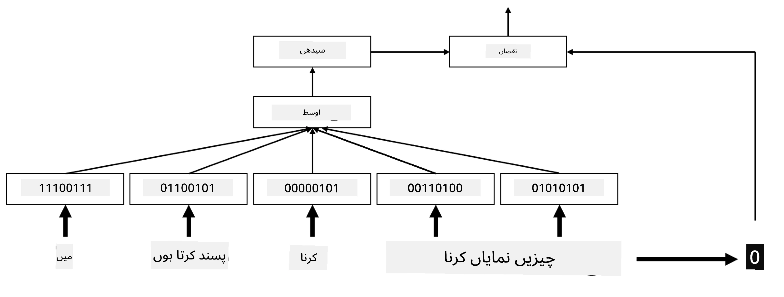
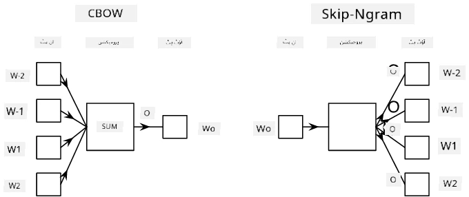

# ایمبیڈنگز

## [لیکچر سے پہلے کا کوئز](https://ff-quizzes.netlify.app/en/ai/quiz/27)

جب ہم BoW یا TF/IDF پر مبنی کلاسیفائرز کو ٹرین کر رہے تھے، تو ہم `vocab_size` لمبائی کے ہائی ڈائمینشنل بیگ آف ورڈز ویکٹرز پر کام کر رہے تھے، اور ہم کم ڈائمینشنل پوزیشنل ریپریزنٹیشن ویکٹرز کو واضح طور پر اسپارس ون-ہاٹ ریپریزنٹیشن میں تبدیل کر رہے تھے۔ تاہم، یہ ون-ہاٹ ریپریزنٹیشن میموری کے لحاظ سے مؤثر نہیں ہے۔ اس کے علاوہ، ہر لفظ کو دوسرے الفاظ سے آزاد سمجھا جاتا ہے، یعنی ون-ہاٹ انکوڈڈ ویکٹرز الفاظ کے درمیان کسی بھی معنوی مشابہت کو ظاہر نہیں کرتے۔

**ایمبیڈنگ** کا خیال یہ ہے کہ الفاظ کو کم ڈائمینشنل ڈینس ویکٹرز کے ذریعے ظاہر کیا جائے، جو کسی نہ کسی طرح ایک لفظ کے معنوی مطلب کو ظاہر کرتے ہیں۔ ہم بعد میں یہ بات کریں گے کہ بامعنی ورڈ ایمبیڈنگز کیسے بنائی جائیں، لیکن فی الحال ایمبیڈنگز کو ایک طریقہ سمجھیں جو لفظ کے ویکٹر کی ڈائمینشن کو کم کرتا ہے۔

ایمبیڈنگ لیئر ایک لفظ کو ان پٹ کے طور پر لے گی اور ایک مخصوص `embedding_size` کے آؤٹ پٹ ویکٹر کو پیدا کرے گی۔ ایک لحاظ سے، یہ `Linear` لیئر سے بہت مشابہ ہے، لیکن یہ ون-ہاٹ انکوڈڈ ویکٹر لینے کے بجائے، ایک لفظ نمبر کو ان پٹ کے طور پر لے سکتی ہے، جس سے بڑے ون-ہاٹ انکوڈڈ ویکٹرز بنانے سے بچا جا سکتا ہے۔

ایمبیڈنگ لیئر کو ہمارے کلاسیفائر نیٹ ورک کی پہلی لیئر کے طور پر استعمال کرکے، ہم بیگ آف ورڈز ماڈل سے **ایمبیڈنگ بیگ** ماڈل میں تبدیل ہو سکتے ہیں، جہاں ہم پہلے اپنے متن کے ہر لفظ کو متعلقہ ایمبیڈنگ میں تبدیل کرتے ہیں، اور پھر ان تمام ایمبیڈنگز پر کوئی مجموعی فنکشن جیسے `sum`، `average` یا `max` کا حساب لگاتے ہیں۔

> تصویر مصنف کی جانب سے

## ✍️ مشقیں: ایمبیڈنگز

مندرجہ ذیل نوٹ بکس میں اپنی تعلیم جاری رکھیں:
* [PyTorch کے ساتھ ایمبیڈنگز](EmbeddingsPyTorch.ipynb)
* [TensorFlow کے ساتھ ایمبیڈنگز](EmbeddingsTF.ipynb)

## معنوی ایمبیڈنگز: Word2Vec

اگرچہ ایمبیڈنگ لیئر نے الفاظ کو ویکٹر ریپریزنٹیشن میں میپ کرنا سیکھا، لیکن یہ ریپریزنٹیشن ضروری نہیں کہ زیادہ معنوی ہو۔ یہ بہتر ہوگا کہ ہم ایک ویکٹر ریپریزنٹیشن سیکھیں جس میں مشابہ الفاظ یا مترادفات ایسے ویکٹرز کے مطابق ہوں جو کسی ویکٹر فاصلے (مثلاً یُوکلِیڈین فاصلے) کے لحاظ سے ایک دوسرے کے قریب ہوں۔

اس کے لیے، ہمیں اپنے ایمبیڈنگ ماڈل کو ایک بڑے ٹیکسٹ کلیکشن پر ایک خاص طریقے سے پری ٹرین کرنے کی ضرورت ہے۔ معنوی ایمبیڈنگز کو ٹرین کرنے کا ایک طریقہ [Word2Vec](https://en.wikipedia.org/wiki/Word2vec) کہلاتا ہے۔ یہ دو اہم آرکیٹیکچرز پر مبنی ہے جو الفاظ کی تقسیم شدہ ریپریزنٹیشن پیدا کرنے کے لیے استعمال ہوتے ہیں:

- **کنٹینیوس بیگ آف ورڈز** (CBoW) — اس آرکیٹیکچر میں، ہم ماڈل کو ارد گرد کے سیاق و سباق سے ایک لفظ کی پیش گوئی کرنے کے لیے ٹرین کرتے ہیں۔ دیے گئے ngram $(W_{-2},W_{-1},W_0,W_1,W_2)$ کے لیے، ماڈل کا مقصد $W_0$ کی پیش گوئی $(W_{-2},W_{-1},W_1,W_2)$ سے کرنا ہے۔
- **کنٹینیوس اسکیپ-گرام** CBoW کے برعکس ہے۔ ماڈل سیاق و سباق کے ارد گرد کے الفاظ کی ونڈو کا استعمال موجودہ لفظ کی پیش گوئی کے لیے کرتا ہے۔

CBoW تیز ہے، جبکہ اسکیپ-گرام سست ہے، لیکن کم استعمال ہونے والے الفاظ کی بہتر نمائندگی کرتا ہے۔

> تصویر [اس مقالے](https://arxiv.org/pdf/1301.3781.pdf) سے

Word2Vec پری ٹرین شدہ ایمبیڈنگز (اور دیگر مشابہ ماڈلز جیسے GloVe) کو نیورل نیٹ ورکس میں ایمبیڈنگ لیئر کی جگہ بھی استعمال کیا جا سکتا ہے۔ تاہم، ہمیں وکیبلری کے مسائل سے نمٹنا ہوگا، کیونکہ Word2Vec/GloVe کو پری ٹرین کرنے کے لیے استعمال ہونے والی وکیبلری ممکنہ طور پر ہمارے ٹیکسٹ کارپس کی وکیبلری سے مختلف ہوگی۔ اس مسئلے کو حل کرنے کے لیے اوپر دیے گئے نوٹ بکس کو دیکھیں۔

## سیاقی ایمبیڈنگز

روایتی پری ٹرین شدہ ایمبیڈنگ ریپریزنٹیشنز جیسے Word2Vec کی ایک اہم حد الفاظ کے معنی کی وضاحت کا مسئلہ ہے۔ اگرچہ پری ٹرین شدہ ایمبیڈنگز سیاق و سباق میں الفاظ کے کچھ معنی کو پکڑ سکتی ہیں، لیکن ایک لفظ کے ہر ممکنہ معنی کو ایک ہی ایمبیڈنگ میں انکوڈ کیا جاتا ہے۔ یہ نیچے والے ماڈلز میں مسائل پیدا کر سکتا ہے، کیونکہ بہت سے الفاظ جیسے 'play' کے مختلف سیاق و سباق میں مختلف معنی ہو سکتے ہیں۔

مثال کے طور پر، لفظ 'play' ان دو مختلف جملوں میں بالکل مختلف معنی رکھتا ہے:

- میں تھیٹر میں ایک **play** دیکھنے گیا۔
- جان اپنے دوستوں کے ساتھ **play** کرنا چاہتا ہے۔

اوپر دی گئی پری ٹرین شدہ ایمبیڈنگز لفظ 'play' کے ان دونوں معانی کو ایک ہی ایمبیڈنگ میں ظاہر کرتی ہیں۔ اس حد کو دور کرنے کے لیے، ہمیں **لینگویج ماڈل** پر مبنی ایمبیڈنگز بنانی ہوں گی، جو ایک بڑے ٹیکسٹ کارپس پر ٹرین کیا گیا ہو، اور *جانتا ہو* کہ الفاظ کو مختلف سیاق و سباق میں کیسے ترتیب دیا جا سکتا ہے۔ سیاقی ایمبیڈنگز پر بات کرنا اس سبق کے دائرہ کار سے باہر ہے، لیکن ہم ان پر بعد میں کورس میں بات کریں گے جب ہم لینگویج ماڈلز پر بات کریں گے۔

## نتیجہ

اس سبق میں، آپ نے سیکھا کہ TensorFlow اور PyTorch میں ایمبیڈنگ لیئرز کیسے بنائی جائیں اور ان کا استعمال کیسے کیا جائے تاکہ الفاظ کے معنوی معانی کو بہتر طور پر ظاہر کیا جا سکے۔

## 🚀 چیلنج

Word2Vec کو کچھ دلچسپ ایپلیکیشنز کے لیے استعمال کیا گیا ہے، بشمول گانے کے بول اور شاعری بنانا۔ [اس مضمون](https://www.politetype.com/blog/word2vec-color-poems) کو دیکھیں جو بتاتا ہے کہ مصنف نے Word2Vec کو شاعری بنانے کے لیے کیسے استعمال کیا۔ [ڈین شِفمین کی یہ ویڈیو](https://www.youtube.com/watch?v=LSS_bos_TPI&ab_channel=TheCodingTrain) بھی دیکھیں تاکہ اس تکنیک کی ایک مختلف وضاحت دریافت کی جا سکے۔ پھر ان تکنیکوں کو اپنے ٹیکسٹ کارپس پر آزمانے کی کوشش کریں، شاید Kaggle سے حاصل کردہ۔

## [لیکچر کے بعد کا کوئز](https://ff-quizzes.netlify.app/en/ai/quiz/28)

## جائزہ اور خود مطالعہ

Word2Vec پر اس مقالے کو پڑھیں: [Efficient Estimation of Word Representations in Vector Space](https://arxiv.org/pdf/1301.3781.pdf)

## [اسائنمنٹ: نوٹ بکس](assignment.md)

---

