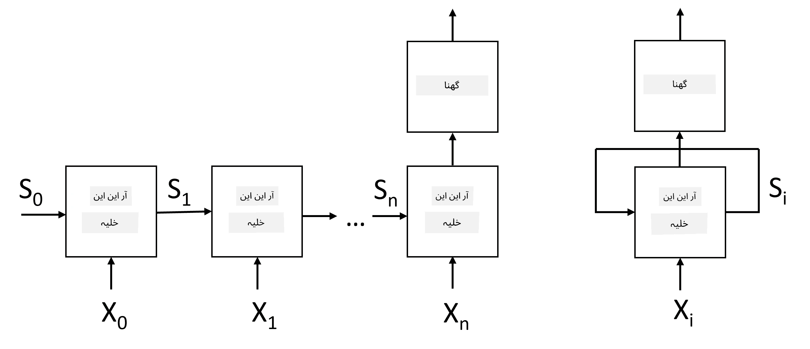
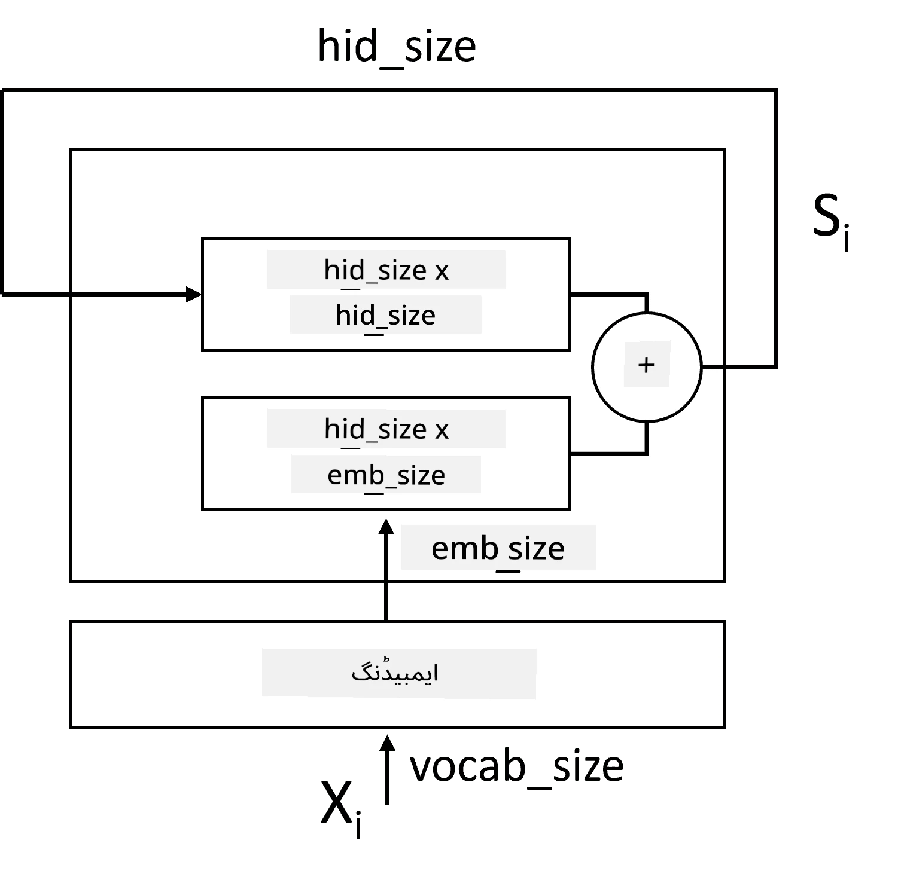
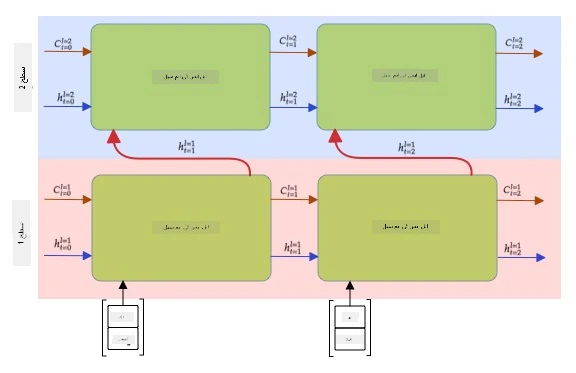

# ری کرنٹ نیورل نیٹ ورکس

## [لیکچر سے پہلے کا کوئز](https://ff-quizzes.netlify.app/en/ai/quiz/31)

پچھلے حصوں میں، ہم نے متن کی بھرپور معنوی نمائندگیوں اور ایمبیڈنگز کے اوپر ایک سادہ لکیری کلاسیفائر کا استعمال کیا۔ یہ آرکیٹیکچر جملے میں الفاظ کے مجموعی معنی کو پکڑتا ہے، لیکن یہ الفاظ کی **ترتیب** کو مدنظر نہیں رکھتا، کیونکہ ایمبیڈنگز کے اوپر ایگریگیشن آپریشن نے اصل متن سے یہ معلومات ختم کر دی۔ چونکہ یہ ماڈلز الفاظ کی ترتیب کو ماڈل کرنے سے قاصر ہیں، یہ زیادہ پیچیدہ یا مبہم کام جیسے کہ متن کی تخلیق یا سوالات کے جوابات دینے کو حل نہیں کر سکتے۔

متن کی ترتیب کے معنی کو سمجھنے کے لیے، ہمیں ایک اور نیورل نیٹ ورک آرکیٹیکچر استعمال کرنے کی ضرورت ہے، جسے **ری کرنٹ نیورل نیٹ ورک** یا RNN کہا جاتا ہے۔ RNN میں، ہم اپنے جملے کو نیٹ ورک کے ذریعے ایک وقت میں ایک علامت کے ساتھ گزارتے ہیں، اور نیٹ ورک کچھ **حالت** پیدا کرتا ہے، جسے ہم اگلی علامت کے ساتھ دوبارہ نیٹ ورک میں پاس کرتے ہیں۔

> تصویر مصنف کی جانب سے

دیے گئے ان پٹ ٹوکنز X0,...,Xn کی ترتیب کے ساتھ، RNN نیورل نیٹ ورک بلاکس کی ایک ترتیب بناتا ہے، اور اس ترتیب کو اینڈ ٹو اینڈ بیک پروپیگیشن کے ذریعے تربیت دیتا ہے۔ ہر نیٹ ورک بلاک ایک جوڑی (Xi,Si) کو ان پٹ کے طور پر لیتا ہے، اور نتیجے کے طور پر Si+1 پیدا کرتا ہے۔ آخری حالت Sn یا (آؤٹ پٹ Yn) کو نتیجہ پیدا کرنے کے لیے ایک لکیری کلاسیفائر میں بھیجا جاتا ہے۔ تمام نیٹ ورک بلاکس ایک جیسے وزن کا اشتراک کرتے ہیں، اور ایک بیک پروپیگیشن پاس کے ذریعے اینڈ ٹو اینڈ تربیت دی جاتی ہے۔

چونکہ حالت ویکٹرز S0,...,Sn نیٹ ورک کے ذریعے پاس کیے جاتے ہیں، یہ الفاظ کے درمیان ترتیب وار انحصار سیکھنے کے قابل ہوتا ہے۔ مثال کے طور پر، جب لفظ *not* ترتیب میں کہیں ظاہر ہوتا ہے، تو یہ حالت ویکٹر کے اندر کچھ عناصر کو منفی کرنے کے لیے سیکھ سکتا ہے، جس کے نتیجے میں نفی پیدا ہوتی ہے۔

> ✅ چونکہ تصویر میں موجود تمام RNN بلاکس کے وزن مشترک ہیں، اسی تصویر کو ایک بلاک (دائیں طرف) کے طور پر ظاہر کیا جا سکتا ہے جس میں ایک ری کرنٹ فیڈبیک لوپ ہوتا ہے، جو نیٹ ورک کی آؤٹ پٹ حالت کو دوبارہ ان پٹ میں بھیجتا ہے۔

## RNN سیل کی ساخت

آئیے دیکھتے ہیں کہ ایک سادہ RNN سیل کیسے منظم ہوتا ہے۔ یہ پچھلی حالت Si-1 اور موجودہ علامت Xi کو ان پٹ کے طور پر قبول کرتا ہے، اور آؤٹ پٹ حالت Si پیدا کرنا ہوتی ہے (اور، بعض اوقات، ہم کچھ اور آؤٹ پٹ Yi میں بھی دلچسپی رکھتے ہیں، جیسا کہ جنریٹو نیٹ ورکس کے معاملے میں)۔

ایک سادہ RNN سیل کے اندر دو وزن میٹرکس ہوتے ہیں: ایک ان پٹ علامت کو تبدیل کرتا ہے (اسے W کہتے ہیں)، اور دوسرا ان پٹ حالت کو تبدیل کرتا ہے (H)۔ اس صورت میں نیٹ ورک کا آؤٹ پٹ &sigma;(W&times;Xi+H&times;Si-1+b) کے طور پر حساب کیا جاتا ہے، جہاں &sigma; ایک ایکٹیویشن فنکشن ہے اور b اضافی بائس ہے۔

> تصویر مصنف کی جانب سے

بہت سے معاملات میں، ان پٹ ٹوکنز کو RNN میں داخل ہونے سے پہلے ایمبیڈنگ لیئر کے ذریعے پاس کیا جاتا ہے تاکہ جہتی کمی کی جا سکے۔ اس صورت میں، اگر ان پٹ ویکٹرز کا ڈائمینشن *emb_size* ہے، اور حالت ویکٹر *hid_size* ہے - W کا سائز *emb_size*&times;*hid_size* ہوگا، اور H کا سائز *hid_size*&times;*hid_size* ہوگا۔

## لانگ شارٹ ٹرم میموری (LSTM)

کلاسیکل RNNs کے اہم مسائل میں سے ایک **vanishing gradients** کا مسئلہ ہے۔ چونکہ RNNs کو ایک بیک پروپیگیشن پاس میں اینڈ ٹو اینڈ تربیت دی جاتی ہے، یہ نیٹ ورک کی ابتدائی تہوں تک غلطی کو پھیلانے میں دشواری کا سامنا کرتا ہے، اور اس طرح نیٹ ورک دور دراز ٹوکنز کے درمیان تعلقات سیکھنے سے قاصر ہوتا ہے۔ اس مسئلے سے بچنے کے ایک طریقے میں **واضح حالت مینجمنٹ** کو **gates** کے ذریعے متعارف کرانا شامل ہے۔ اس قسم کی دو مشہور آرکیٹیکچرز ہیں: **لانگ شارٹ ٹرم میموری** (LSTM) اور **گیٹڈ ریلے یونٹ** (GRU)۔

> تصویر کا ذریعہ TBD

LSTM نیٹ ورک RNN کی طرح منظم ہے، لیکن یہاں دو حالتیں ہیں جو تہہ سے تہہ تک منتقل ہوتی ہیں: اصل حالت C، اور چھپی ہوئی ویکٹر H۔ ہر یونٹ پر، چھپی ہوئی ویکٹر Hi کو ان پٹ Xi کے ساتھ جوڑا جاتا ہے، اور وہ **gates** کے ذریعے حالت C کے ساتھ کیا ہوتا ہے اسے کنٹرول کرتے ہیں۔ ہر گیٹ ایک نیورل نیٹ ورک ہے جس میں سگموئڈ ایکٹیویشن (آؤٹ پٹ [0,1] کی حد میں) ہوتا ہے، جسے حالت ویکٹر کے ساتھ ضرب کرتے وقت بٹ وائز ماسک کے طور پر سمجھا جا سکتا ہے۔ درج ذیل گیٹس ہیں (تصویر میں بائیں سے دائیں):

* **فرگٹ گیٹ** چھپی ہوئی ویکٹر لیتا ہے اور طے کرتا ہے کہ ویکٹر C کے کون سے اجزاء کو بھولنا ہے، اور کون سے پاس کرنا ہے۔
* **ان پٹ گیٹ** ان پٹ اور چھپی ہوئی ویکٹرز سے کچھ معلومات لیتا ہے اور اسے حالت میں داخل کرتا ہے۔
* **آؤٹ پٹ گیٹ** حالت کو *tanh* ایکٹیویشن کے ساتھ ایک لکیری لیئر کے ذریعے تبدیل کرتا ہے، پھر اس کے کچھ اجزاء کو چھپی ہوئی ویکٹر Hi کا استعمال کرتے ہوئے منتخب کرتا ہے تاکہ نئی حالت Ci+1 پیدا کی جا سکے۔

حالت C کے اجزاء کو کچھ جھنڈے کے طور پر سمجھا جا سکتا ہے جنہیں آن اور آف کیا جا سکتا ہے۔ مثال کے طور پر، جب ہم ترتیب میں نام *Alice* کا سامنا کرتے ہیں، تو ہم فرض کر سکتے ہیں کہ یہ ایک خاتون کردار کی طرف اشارہ کرتا ہے، اور حالت میں جھنڈا اٹھا سکتے ہیں کہ ہمارے پاس جملے میں ایک خاتون اسم ہے۔ جب ہم مزید جملے *and Tom* کا سامنا کرتے ہیں، تو ہم جھنڈا اٹھائیں گے کہ ہمارے پاس جمع اسم ہے۔ اس طرح حالت کو جوڑ کر ہم جملے کے حصوں کی گرامر خصوصیات کو برقرار رکھ سکتے ہیں۔

> ✅ LSTM کی اندرونی ساخت کو سمجھنے کے لیے ایک بہترین ذریعہ یہ شاندار مضمون ہے [Understanding LSTM Networks](https://colah.github.io/posts/2015-08-Understanding-LSTMs/) کرسٹوفر اولاہ کی جانب سے۔

## بائی ڈائریکشنل اور ملٹی لیئر RNNs

ہم نے ری کرنٹ نیٹ ورکس پر بات کی ہے جو ایک سمت میں کام کرتے ہیں، ترتیب کے آغاز سے آخر تک۔ یہ قدرتی لگتا ہے، کیونکہ یہ اس طرح سے مشابہت رکھتا ہے جس طرح ہم پڑھتے ہیں اور تقریر سنتے ہیں۔ تاہم، چونکہ بہت سے عملی معاملات میں ہمارے پاس ان پٹ ترتیب تک بے ترتیب رسائی ہوتی ہے، یہ دونوں سمتوں میں ری کرنٹ کمپیوٹیشن چلانے کے لیے معنی خیز ہو سکتا ہے۔ ایسے نیٹ ورکس کو **بائی ڈائریکشنل** RNNs کہا جاتا ہے۔ بائی ڈائریکشنل نیٹ ورک کے ساتھ کام کرتے وقت، ہمیں دو چھپی ہوئی حالت ویکٹرز کی ضرورت ہوگی، ہر سمت کے لیے ایک۔

ایک ری کرنٹ نیٹ ورک، چاہے وہ ایک سمت میں ہو یا بائی ڈائریکشنل، ترتیب کے اندر کچھ پیٹرنز کو پکڑتا ہے، اور انہیں حالت ویکٹر میں ذخیرہ کر سکتا ہے یا آؤٹ پٹ میں منتقل کر سکتا ہے۔ جیسا کہ کنوولوشنل نیٹ ورکس کے ساتھ، ہم پہلے والے پر ایک اور ری کرنٹ لیئر بنا سکتے ہیں تاکہ اعلیٰ سطح کے پیٹرنز کو پکڑ سکیں اور پہلی لیئر کے ذریعے نکالے گئے کم سطح کے پیٹرنز سے تعمیر کریں۔ یہ ہمیں **ملٹی لیئر RNN** کے تصور کی طرف لے جاتا ہے، جو دو یا زیادہ ری کرنٹ نیٹ ورکس پر مشتمل ہوتا ہے، جہاں پچھلی لیئر کا آؤٹ پٹ اگلی لیئر میں ان پٹ کے طور پر پاس کیا جاتا ہے۔

*تصویر [اس شاندار پوسٹ](https://towardsdatascience.com/from-a-lstm-cell-to-a-multilayer-lstm-network-with-pytorch-2899eb5696f3) فرنینڈو لوپیز کی جانب سے*

## ✍️ مشقیں: ایمبیڈنگز

اپنی تعلیم کو درج ذیل نوٹ بکس میں جاری رکھیں:

* [PyTorch کے ساتھ RNNs](RNNPyTorch.ipynb)
* [TensorFlow کے ساتھ RNNs](RNNTF.ipynb)

## نتیجہ

اس یونٹ میں، ہم نے دیکھا کہ RNNs کو ترتیب کی درجہ بندی کے لیے استعمال کیا جا سکتا ہے، لیکن حقیقت میں، وہ بہت سے مزید کاموں کو سنبھال سکتے ہیں، جیسے کہ متن کی تخلیق، مشین ترجمہ، اور مزید۔ ہم ان کاموں پر اگلے یونٹ میں غور کریں گے۔

## 🚀 چیلنج

LSTMs کے بارے میں کچھ لٹریچر پڑھیں اور ان کے اطلاقات پر غور کریں:

- [Grid Long Short-Term Memory](https://arxiv.org/pdf/1507.01526v1.pdf)
- [Show, Attend and Tell: Neural Image Caption
Generation with Visual Attention](https://arxiv.org/pdf/1502.03044v2.pdf)

## [لیکچر کے بعد کا کوئز](https://ff-quizzes.netlify.app/en/ai/quiz/32)

## جائزہ اور خود مطالعہ

- [Understanding LSTM Networks](https://colah.github.io/posts/2015-08-Understanding-LSTMs/) کرسٹوفر اولاہ کی جانب سے۔

## [Assignment: Notebooks](assignment.md)

---

