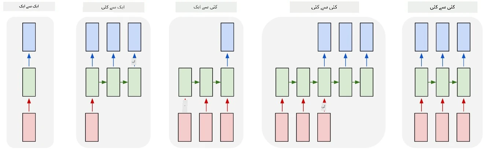
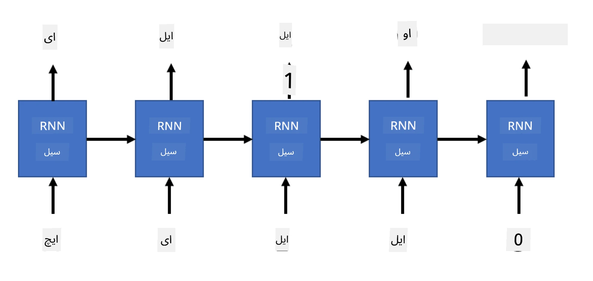

# جنریٹو نیٹ ورکس

## [لیکچر سے پہلے کا کوئز](https://ff-quizzes.netlify.app/en/ai/quiz/33)

ریکرنٹ نیورل نیٹ ورکس (RNNs) اور ان کے گیٹڈ سیل ویریئنٹس جیسے لانگ شارٹ ٹرم میموری سیلز (LSTMs) اور گیٹڈ ریکرنٹ یونٹس (GRUs) نے زبان کی ماڈلنگ کے لیے ایک طریقہ فراہم کیا ہے، کیونکہ یہ الفاظ کی ترتیب سیکھ سکتے ہیں اور سیکوئنس میں اگلے لفظ کی پیش گوئی کر سکتے ہیں۔ یہ ہمیں RNNs کو **جنریٹو ٹاسکس** کے لیے استعمال کرنے کی اجازت دیتا ہے، جیسے عام متن کی تخلیق، مشین ترجمہ، اور یہاں تک کہ تصویر کی وضاحت۔

> ✅ ان تمام مواقع کے بارے میں سوچیں جب آپ نے جنریٹو ٹاسکس جیسے ٹائپ کرتے وقت متن کی تکمیل سے فائدہ اٹھایا۔ اپنی پسندیدہ ایپلیکیشنز پر تحقیق کریں تاکہ معلوم ہو سکے کہ آیا انہوں نے RNNs کا استعمال کیا۔

پچھلے یونٹ میں زیر بحث RNN آرکیٹیکچر میں، ہر RNN یونٹ اگلی چھپی ہوئی حالت کو آؤٹ پٹ کے طور پر پیدا کرتا تھا۔ تاہم، ہم ہر ریکرنٹ یونٹ میں ایک اور آؤٹ پٹ بھی شامل کر سکتے ہیں، جو ہمیں ایک **سیکوئنس** آؤٹ پٹ کرنے کی اجازت دے گا (جو اصل سیکوئنس کے برابر لمبائی کا ہوگا)۔ مزید برآں، ہم ایسے RNN یونٹس استعمال کر سکتے ہیں جو ہر قدم پر ان پٹ قبول نہیں کرتے، اور صرف کچھ ابتدائی حالت ویکٹر لیتے ہیں، اور پھر آؤٹ پٹس کا ایک سیکوئنس پیدا کرتے ہیں۔

یہ مختلف نیورل آرکیٹیکچرز کی اجازت دیتا ہے، جیسا کہ نیچے دی گئی تصویر میں دکھایا گیا ہے:



> تصویر بلاگ پوسٹ [Unreasonable Effectiveness of Recurrent Neural Networks](http://karpathy.github.io/2015/05/21/rnn-effectiveness/) سے لی گئی ہے، از [Andrej Karpaty](http://karpathy.github.io/)

* **ایک سے ایک** ایک روایتی نیورل نیٹ ورک ہے جس میں ایک ان پٹ اور ایک آؤٹ پٹ ہوتا ہے۔
* **ایک سے کئی** ایک جنریٹو آرکیٹیکچر ہے جو ایک ان پٹ ویلیو قبول کرتا ہے، اور آؤٹ پٹ ویلیوز کا ایک سیکوئنس پیدا کرتا ہے۔ مثال کے طور پر، اگر ہم ایک **تصویر کی وضاحت** نیٹ ورک کو تربیت دینا چاہتے ہیں جو تصویر کی متن کی وضاحت پیدا کرے، تو ہم تصویر کو ان پٹ کے طور پر لے سکتے ہیں، اسے CNN کے ذریعے چھپی ہوئی حالت حاصل کرنے کے لیے پاس کر سکتے ہیں، اور پھر ایک ریکرنٹ چین کیپشن کو لفظ بہ لفظ پیدا کرے گا۔
* **کئی سے ایک** ان RNN آرکیٹیکچرز سے مطابقت رکھتا ہے جنہیں ہم نے پچھلے یونٹ میں بیان کیا تھا، جیسے متن کی درجہ بندی۔
* **کئی سے کئی**، یا **سیکوئنس سے سیکوئنس** ایسے کاموں سے مطابقت رکھتا ہے جیسے **مشین ترجمہ**، جہاں ہمارے پاس پہلے RNN ان پٹ سیکوئنس سے تمام معلومات کو چھپی ہوئی حالت میں جمع کرتا ہے، اور دوسرا RNN چین اس حالت کو آؤٹ پٹ سیکوئنس میں کھولتا ہے۔

اس یونٹ میں، ہم سادہ جنریٹو ماڈلز پر توجہ مرکوز کریں گے جو ہمیں متن تخلیق کرنے میں مدد دیتے ہیں۔ سادگی کے لیے، ہم کریکٹر لیول ٹوکنائزیشن استعمال کریں گے۔

ہم اس RNN کو متن قدم بہ قدم تخلیق کرنے کے لیے تربیت دیں گے۔ ہر قدم پر، ہم `nchars` کی لمبائی کے کریکٹرز کا ایک سیکوئنس لیں گے، اور نیٹ ورک سے ہر ان پٹ کریکٹر کے لیے اگلا آؤٹ پٹ کریکٹر پیدا کرنے کو کہیں گے:



جب متن تخلیق کرتے ہیں (انفرنس کے دوران)، ہم کچھ **پرومپٹ** کے ساتھ شروع کرتے ہیں، جسے RNN سیلز کے ذریعے اس کی درمیانی حالت پیدا کرنے کے لیے پاس کیا جاتا ہے، اور پھر اس حالت سے تخلیق شروع ہوتی ہے۔ ہم ایک وقت میں ایک کریکٹر تخلیق کرتے ہیں، اور حالت اور تخلیق شدہ کریکٹر کو اگلے کریکٹر تخلیق کرنے کے لیے دوسرے RNN سیل کو پاس کرتے ہیں، جب تک کہ ہم کافی کریکٹرز تخلیق نہ کر لیں۔


> تصویر مصنف کی جانب سے

## ✍️ مشقیں: جنریٹو نیٹ ورکس

اپنی تعلیم کو درج ذیل نوٹ بکس میں جاری رکھیں:

* [PyTorch کے ساتھ جنریٹو نیٹ ورکس](GenerativePyTorch.ipynb)
* [TensorFlow کے ساتھ جنریٹو نیٹ ورکس](GenerativeTF.ipynb)

## نرم متن تخلیق اور درجہ حرارت

ہر RNN سیل کا آؤٹ پٹ کریکٹرز کی ایک احتمال تقسیم ہے۔ اگر ہم ہمیشہ اگلے کریکٹر کے طور پر وہ کریکٹر لیں جس کی احتمال سب سے زیادہ ہو، تو تخلیق شدہ متن اکثر "چکر" میں جا سکتا ہے، جہاں وہی کریکٹر سیکوئنس بار بار آتے ہیں، جیسے اس مثال میں:

```
today of the second the company and a second the company ...
```

تاہم، اگر ہم اگلے کریکٹر کے لیے احتمال تقسیم کو دیکھیں، تو یہ ممکن ہے کہ چند سب سے زیادہ احتمالات کے درمیان فرق بہت زیادہ نہ ہو، مثلاً ایک کریکٹر کی احتمال 0.2 ہو، اور دوسرے کی 0.19۔ مثال کے طور پر، جب '*play*' سیکوئنس میں اگلے کریکٹر کی تلاش کرتے ہیں، اگلا کریکٹر برابر طور پر اسپیس یا **e** ہو سکتا ہے (جیسے لفظ *player* میں)۔

یہ ہمیں اس نتیجے پر لے جاتا ہے کہ ہمیشہ سب سے زیادہ احتمال والے کریکٹر کو منتخب کرنا "منصفانہ" نہیں ہوتا، کیونکہ دوسرے سب سے زیادہ احتمال والے کریکٹر کو منتخب کرنا بھی معنی خیز متن کی طرف لے جا سکتا ہے۔ زیادہ دانشمندانہ طریقہ یہ ہے کہ نیٹ ورک آؤٹ پٹ کی دی گئی احتمال تقسیم سے کریکٹرز کو **نمونہ** کریں۔ ہم ایک پیرامیٹر، **درجہ حرارت** بھی استعمال کر سکتے ہیں، جو احتمال تقسیم کو ہموار کرے گا، اگر ہم زیادہ بے ترتیب پن شامل کرنا چاہتے ہیں، یا اسے زیادہ کھڑا کرے گا، اگر ہم سب سے زیادہ احتمال والے کریکٹرز پر زیادہ قائم رہنا چاہتے ہیں۔

دیکھیں کہ یہ نرم متن تخلیق نوٹ بکس میں کیسے نافذ کی گئی ہے۔

## نتیجہ

جبکہ متن تخلیق اپنے آپ میں مفید ہو سکتا ہے، بڑے فوائد RNNs کا استعمال کرتے ہوئے کچھ ابتدائی فیچر ویکٹر سے متن تخلیق کرنے کی صلاحیت سے آتے ہیں۔ مثال کے طور پر، متن تخلیق مشین ترجمہ کے حصے کے طور پر استعمال ہوتی ہے (سیکوئنس سے سیکوئنس، اس صورت میں *encoder* سے حالت ویکٹر استعمال کیا جاتا ہے تاکہ ترجمہ شدہ پیغام کو تخلیق یا *decode* کیا جا سکے)، یا تصویر کی متن وضاحت تخلیق کرنے کے لیے (اس صورت میں فیچر ویکٹر CNN extractor سے آئے گا)۔

## 🚀 چیلنج

Microsoft Learn پر اس موضوع پر کچھ اسباق لیں:

* [PyTorch](https://docs.microsoft.com/learn/modules/intro-natural-language-processing-pytorch/6-generative-networks/?WT.mc_id=academic-77998-cacaste)/[TensorFlow](https://docs.microsoft.com/learn/modules/intro-natural-language-processing-tensorflow/5-generative-networks/?WT.mc_id=academic-77998-cacaste) کے ساتھ متن تخلیق

## [لیکچر کے بعد کا کوئز](https://ff-quizzes.netlify.app/en/ai/quiz/34)

## جائزہ اور خود مطالعہ

اپنے علم کو بڑھانے کے لیے یہاں کچھ مضامین ہیں:

* مارکوف چین، LSTM اور GPT-2 کے ساتھ متن تخلیق کے مختلف طریقے: [بلاگ پوسٹ](https://towardsdatascience.com/text-generation-gpt-2-lstm-markov-chain-9ea371820e1e)
* [Keras دستاویزات](https://keras.io/examples/generative/lstm_character_level_text_generation/) میں متن تخلیق کی مثال

## [اسائنمنٹ](lab/README.md)

ہم نے دیکھا کہ کریکٹر بہ کریکٹر متن کیسے تخلیق کیا جاتا ہے۔ لیب میں، آپ لفظ کی سطح پر متن تخلیق کو دریافت کریں گے۔

---

