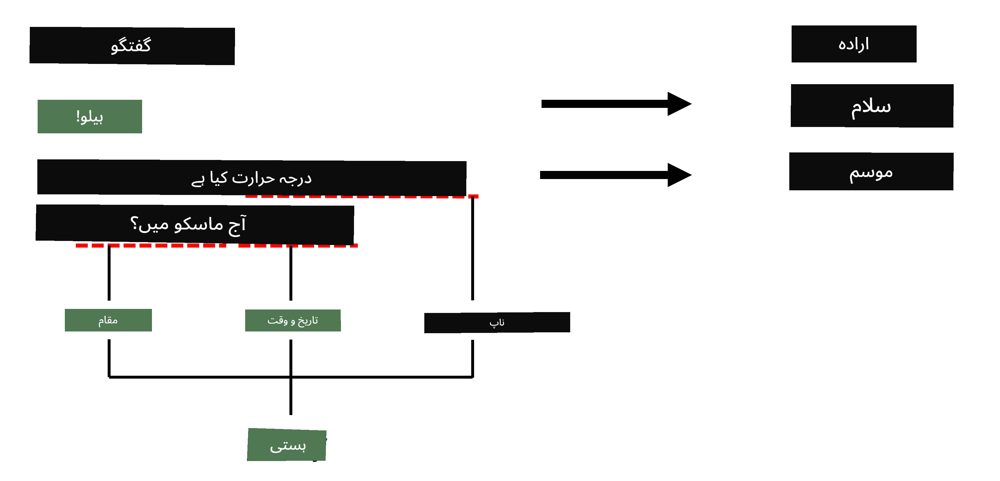

# نام شدہ ادارہ کی شناخت

اب تک، ہم زیادہ تر ایک NLP کام - درجہ بندی پر توجہ مرکوز کر رہے تھے۔ تاہم، نیورل نیٹ ورکس کے ذریعے دیگر NLP کام بھی انجام دیے جا سکتے ہیں۔ ان کاموں میں سے ایک **[نام شدہ ادارہ کی شناخت](https://wikipedia.org/wiki/Named-entity_recognition)** (NER) ہے، جو متن میں مخصوص اداروں کو پہچاننے سے متعلق ہے، جیسے مقامات، افراد کے نام، تاریخ و وقت کے وقفے، کیمیائی فارمولے وغیرہ۔

## [لیکچر سے پہلے کا کوئز](https://ff-quizzes.netlify.app/en/ai/quiz/37)

## NER کے استعمال کی مثال

فرض کریں کہ آپ ایک قدرتی زبان چیٹ بوٹ تیار کرنا چاہتے ہیں، جیسے Amazon Alexa یا Google Assistant۔ ذہین چیٹ بوٹس اس طرح کام کرتے ہیں کہ وہ صارف کی خواہش کو سمجھنے کے لیے ان پٹ جملے پر متن کی درجہ بندی کرتے ہیں۔ اس درجہ بندی کا نتیجہ **ارادہ** کہلاتا ہے، جو یہ طے کرتا ہے کہ چیٹ بوٹ کو کیا کرنا چاہیے۔

> تصویر مصنف کی جانب سے

تاہم، صارف جملے کے حصے کے طور پر کچھ پیرامیٹرز فراہم کر سکتا ہے۔ مثال کے طور پر، موسم کے بارے میں پوچھتے وقت، وہ مقام یا تاریخ کی وضاحت کر سکتا ہے۔ بوٹ کو ان اداروں کو سمجھنے اور عمل کرنے سے پہلے پیرامیٹر سلاٹس کو مناسب طریقے سے بھرنے کے قابل ہونا چاہیے۔ یہی وہ جگہ ہے جہاں NER کام آتا ہے۔

> ✅ ایک اور مثال [سائنسی طبی مقالوں کا تجزیہ](https://soshnikov.com/science/analyzing-medical-papers-with-azure-and-text-analytics-for-health/) ہو سکتی ہے۔ ہمیں خاص طبی اصطلاحات، جیسے بیماریوں اور طبی مادوں کو تلاش کرنا ہوتا ہے۔ جبکہ چند بیماریوں کو شاید substring search کے ذریعے نکالا جا سکتا ہے، زیادہ پیچیدہ ادارے، جیسے کیمیائی مرکبات اور دوا کے نام، ایک زیادہ پیچیدہ طریقہ کار کی ضرورت رکھتے ہیں۔

## NER بطور ٹوکن درجہ بندی

NER ماڈلز بنیادی طور پر **ٹوکن درجہ بندی ماڈلز** ہیں، کیونکہ ہمیں ہر ان پٹ ٹوکن کے لیے فیصلہ کرنا ہوتا ہے کہ آیا وہ کسی ادارے سے تعلق رکھتا ہے یا نہیں، اور اگر رکھتا ہے تو کس ادارے کی کلاس سے۔

ذیل میں دیے گئے مقالے کے عنوان پر غور کریں:

**Tricuspid valve regurgitation** اور **lithium carbonate** **toxicity** ایک نوزائیدہ بچے میں۔

یہاں ادارے ہیں:

* Tricuspid valve regurgitation ایک بیماری ہے (`DIS`)
* Lithium carbonate ایک کیمیائی مادہ ہے (`CHEM`)
* Toxicity بھی ایک بیماری ہے (`DIS`)

نوٹ کریں کہ ایک ادارہ کئی ٹوکنز پر مشتمل ہو سکتا ہے۔ اور، جیسا کہ اس مثال میں، ہمیں دو مسلسل اداروں کے درمیان فرق کرنا ہوتا ہے۔ لہذا، ہر ادارے کے لیے دو کلاسز استعمال کرنا عام ہے - ایک ادارے کے پہلے ٹوکن کی وضاحت کرنے کے لیے (`B-`، **شروع** کے لیے)، اور دوسرا ادارے کے تسلسل کے لیے (`I-`، **اندرونی ٹوکن** کے لیے)۔ ہم `O` کو ایک کلاس کے طور پر استعمال کرتے ہیں تاکہ تمام **دیگر** ٹوکنز کی نمائندگی کی جا سکے۔ اس طرح کی ٹوکن ٹیگنگ کو [BIO ٹیگنگ](https://en.wikipedia.org/wiki/Inside%E2%80%93outside%E2%80%93beginning_(tagging)) (یا IOB) کہا جاتا ہے۔ جب ٹیگ کیا جائے، تو ہمارا عنوان اس طرح نظر آئے گا:

Token | Tag
------|-----
Tricuspid | B-DIS
valve | I-DIS
regurgitation | I-DIS
and | O
lithium | B-CHEM
carbonate | I-CHEM
toxicity | B-DIS
in | O
a | O
newborn | O
infant | O
. | O

چونکہ ہمیں ٹوکنز اور کلاسز کے درمیان ایک سے ایک مطابقت پیدا کرنی ہوتی ہے، ہم اس تصویر سے ایک دائیں طرف **کئی سے کئی** نیورل نیٹ ورک ماڈل بنا سکتے ہیں:

> *تصویر [اس بلاگ پوسٹ](http://karpathy.github.io/2015/05/21/rnn-effectiveness/) سے لی گئی ہے، جو [Andrej Karpathy](http://karpathy.github.io/) کی جانب سے ہے۔ NER ٹوکن درجہ بندی ماڈلز اس تصویر میں دائیں طرف کے نیٹ ورک آرکیٹیکچر سے مطابقت رکھتے ہیں۔*

## NER ماڈلز کی تربیت

چونکہ NER ماڈل بنیادی طور پر ایک ٹوکن درجہ بندی ماڈل ہے، ہم اس کام کے لیے وہی RNNs استعمال کر سکتے ہیں جن سے ہم پہلے ہی واقف ہیں۔ اس صورت میں، recurrent نیٹ ورک کا ہر بلاک ٹوکن ID واپس کرے گا۔ درج ذیل مثال نوٹ بک دکھاتی ہے کہ LSTM کو ٹوکن درجہ بندی کے لیے کیسے تربیت دی جائے۔

## ✍️ مثال نوٹ بکس: NER

اپنی تعلیم کو درج ذیل نوٹ بک میں جاری رکھیں:

* [NER with TensorFlow](NER-TF.ipynb)

## نتیجہ

NER ماڈل ایک **ٹوکن درجہ بندی ماڈل** ہے، جس کا مطلب ہے کہ اسے ٹوکن درجہ بندی انجام دینے کے لیے استعمال کیا جا سکتا ہے۔ یہ NLP میں ایک بہت عام کام ہے، جو متن میں مخصوص اداروں کو پہچاننے میں مدد کرتا ہے، جیسے مقامات، نام، تاریخیں، اور مزید۔

## 🚀 چیلنج

ذیل میں دیے گئے اسائنمنٹ کو مکمل کریں تاکہ طبی اصطلاحات کے لیے ایک نام شدہ ادارہ شناخت ماڈل تربیت کریں، پھر اسے ایک مختلف ڈیٹا سیٹ پر آزمائیں۔

## [لیکچر کے بعد کا کوئز](https://ff-quizzes.netlify.app/en/ai/quiz/38)

## جائزہ اور خود مطالعہ

بلاگ [The Unreasonable Effectiveness of Recurrent Neural Networks](http://karpathy.github.io/2015/05/21/rnn-effectiveness/) کو پڑھیں اور اس مضمون کے Further Reading سیکشن کے ساتھ آگے بڑھیں تاکہ اپنی معلومات کو گہرا کریں۔

## [اسائنمنٹ](lab/README.md)

اس سبق کے اسائنمنٹ میں، آپ کو ایک طبی ادارہ شناخت ماڈل تربیت دینا ہوگا۔ آپ اس سبق میں بیان کردہ LSTM ماڈل کی تربیت سے شروع کر سکتے ہیں، اور پھر BERT transformer ماڈل استعمال کر سکتے ہیں۔ تمام تفصیلات حاصل کرنے کے لیے [ہدایات](lab/README.md) پڑھیں۔

---

