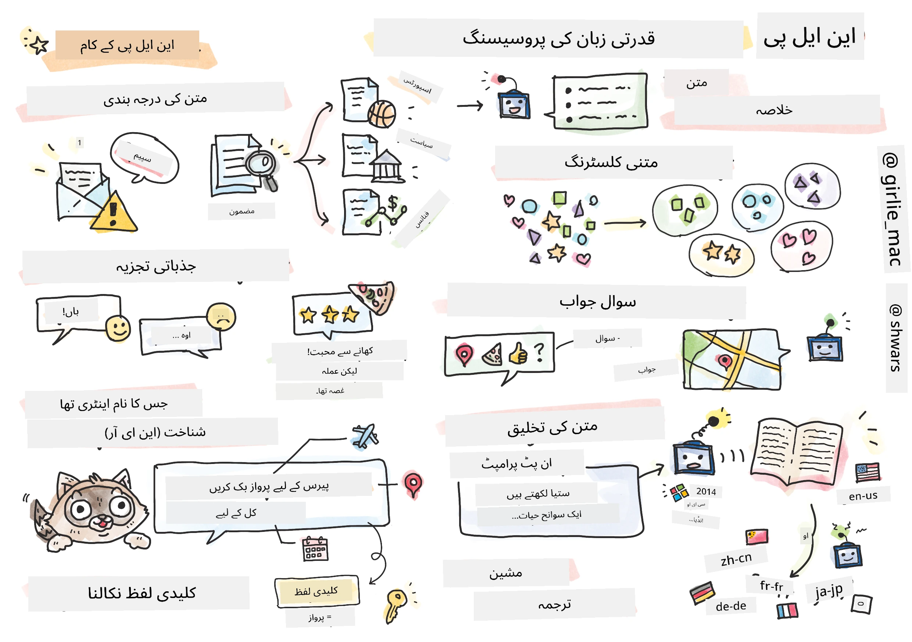

# قدرتی زبان کی پروسیسنگ



اس حصے میں، ہم نیورل نیٹ ورکس کا استعمال کرتے ہوئے **قدرتی زبان کی پروسیسنگ (NLP)** سے متعلق کاموں کو حل کرنے پر توجہ مرکوز کریں گے۔ NLP کے کئی مسائل ہیں جنہیں ہم چاہتے ہیں کہ کمپیوٹر حل کر سکیں:

* **ٹیکسٹ کی درجہ بندی** ایک عام درجہ بندی کا مسئلہ ہے جو ٹیکسٹ سیکوئنسز سے متعلق ہے۔ مثال کے طور پر، ای میل پیغامات کو اسپام یا نان اسپام کے طور پر درجہ بندی کرنا، یا مضامین کو کھیل، کاروبار، سیاست وغیرہ کے زمرے میں تقسیم کرنا۔ اسی طرح، چیٹ بوٹس تیار کرتے وقت، ہمیں اکثر یہ سمجھنے کی ضرورت ہوتی ہے کہ صارف کیا کہنا چاہتا ہے -- اس صورت میں ہم **ارادے کی درجہ بندی** سے نمٹ رہے ہوتے ہیں۔ ارادے کی درجہ بندی میں اکثر ہمیں کئی زمروں سے نمٹنا پڑتا ہے۔

* **جذبات کا تجزیہ** ایک عام ریگریشن مسئلہ ہے، جہاں ہمیں ایک جملے کے مثبت/منفی معنی کے مطابق ایک نمبر (جذبہ) تفویض کرنا ہوتا ہے۔ جذبات کے تجزیے کا ایک زیادہ جدید ورژن **پہلو پر مبنی جذبات کا تجزیہ** (ABSA) ہے، جہاں ہم جذبات کو پورے جملے کے بجائے اس کے مختلف حصوں (پہلوؤں) سے منسلک کرتے ہیں، جیسے: *اس ریستوران میں، مجھے کھانے کا ذائقہ پسند آیا، لیکن ماحول بہت خراب تھا*۔

* **نامزد ادارے کی شناخت** (NER) اس مسئلے سے متعلق ہے کہ متن سے مخصوص اداروں کو نکالا جائے۔ مثال کے طور پر، ہمیں یہ سمجھنے کی ضرورت ہو سکتی ہے کہ جملے *مجھے کل پیرس جانا ہے* میں *کل* تاریخ کو ظاہر کرتا ہے، اور *پیرس* ایک مقام ہے۔

* **کلیدی الفاظ کا اخراج** NER سے ملتا جلتا ہے، لیکن ہمیں جملے کے معنی کے لیے اہم الفاظ کو خودکار طور پر نکالنا ہوتا ہے، بغیر کسی مخصوص ادارے کی اقسام کے لیے پہلے سے تربیت کیے۔

* **ٹیکسٹ کلسٹرنگ** اس وقت مفید ہو سکتی ہے جب ہم ایک جیسے جملوں کو گروپ کرنا چاہتے ہیں، جیسے تکنیکی مدد کی گفتگو میں ایک جیسے سوالات۔

* **سوالات کے جوابات دینا** ایک ماڈل کی صلاحیت کو ظاہر کرتا ہے کہ وہ کسی مخصوص سوال کا جواب دے سکے۔ ماڈل کو ایک متن کا حصہ اور ایک سوال ان پٹ کے طور پر دیا جاتا ہے، اور اسے متن میں وہ جگہ فراہم کرنی ہوتی ہے جہاں سوال کا جواب موجود ہو (یا بعض اوقات، جواب کا متن تیار کرنا ہوتا ہے)۔

* **ٹیکسٹ جنریشن** ایک ماڈل کی صلاحیت ہے کہ وہ نیا متن تیار کرے۔ اسے ایک درجہ بندی کے مسئلے کے طور پر سمجھا جا سکتا ہے جو کسی *ٹیکسٹ پرامپٹ* کی بنیاد پر اگلا حرف/لفظ پیش گوئی کرتا ہے۔ جدید ٹیکسٹ جنریشن ماڈلز، جیسے GPT-3، دیگر NLP کاموں کو حل کرنے کے قابل ہیں، جیسے درجہ بندی، ایک تکنیک کے ذریعے جسے [پرامپٹ پروگرامنگ](https://towardsdatascience.com/software-3-0-how-prompting-will-change-the-rules-of-the-game-a982fbfe1e0) یا [پرامپٹ انجینئرنگ](https://medium.com/swlh/openai-gpt-3-and-prompt-engineering-dcdc2c5fcd29) کہا جاتا ہے۔

* **ٹیکسٹ کا خلاصہ بنانا** ایک تکنیک ہے جب ہم چاہتے ہیں کہ کمپیوٹر طویل متن کو "پڑھے" اور اسے چند جملوں میں خلاصہ کرے۔

* **مشین ترجمہ** کو ایک زبان میں متن کو سمجھنے اور دوسری زبان میں متن تیار کرنے کے امتزاج کے طور پر دیکھا جا سکتا ہے۔

شروع میں، زیادہ تر NLP کام روایتی طریقوں جیسے گرامر کے ذریعے حل کیے جاتے تھے۔ مثال کے طور پر، مشین ترجمہ میں پارسرز کا استعمال کیا جاتا تھا تاکہ ابتدائی جملے کو ایک نحو کے درخت میں تبدیل کیا جا سکے، پھر جملے کے معنی کو ظاہر کرنے کے لیے اعلیٰ سطحی معنوی ڈھانچے نکالے جاتے تھے، اور ان معنی اور ہدف زبان کی گرامر کی بنیاد پر نتیجہ تیار کیا جاتا تھا۔ آج کل، بہت سے NLP کام نیورل نیٹ ورکس کا استعمال کرتے ہوئے زیادہ مؤثر طریقے سے حل کیے جاتے ہیں۔

> بہت سے کلاسیکی NLP طریقے [Natural Language Processing Toolkit (NLTK)](https://www.nltk.org) پائتھون لائبریری میں نافذ کیے گئے ہیں۔ ایک شاندار [NLTK کتاب](https://www.nltk.org/book/) آن لائن دستیاب ہے جو یہ بتاتی ہے کہ مختلف NLP کاموں کو NLTK کا استعمال کرتے ہوئے کیسے حل کیا جا سکتا ہے۔

ہمارے کورس میں، ہم زیادہ تر NLP کے لیے نیورل نیٹ ورکس کے استعمال پر توجہ مرکوز کریں گے، اور جہاں ضرورت ہو NLTK کا استعمال کریں گے۔

ہم نے پہلے ہی نیورل نیٹ ورکس کو ٹیبلر ڈیٹا اور تصاویر کے ساتھ کام کرنے کے لیے استعمال کرنے کے بارے میں سیکھا ہے۔ ان ڈیٹا کی اقسام اور متن کے درمیان بنیادی فرق یہ ہے کہ متن متغیر لمبائی کا ایک سلسلہ ہے، جبکہ تصاویر کے معاملے میں ان پٹ سائز پہلے سے معلوم ہوتا ہے۔ اگرچہ کنوولوشنل نیٹ ورکس ان پٹ ڈیٹا سے پیٹرن نکال سکتے ہیں، متن میں پیٹرن زیادہ پیچیدہ ہوتے ہیں۔ مثال کے طور پر، ہم یہ دیکھ سکتے ہیں کہ نفی کسی موضوع سے کئی الفاظ کے فاصلے پر ہو سکتی ہے (جیسے: *مجھے نارنگیاں پسند نہیں ہیں*، بمقابلہ *مجھے وہ بڑی رنگین مزیدار نارنگیاں پسند نہیں ہیں*)، اور اسے اب بھی ایک ہی پیٹرن کے طور پر سمجھا جانا چاہیے۔ لہذا، زبان کو سنبھالنے کے لیے ہمیں نیورل نیٹ ورکس کی نئی اقسام متعارف کرانے کی ضرورت ہے، جیسے *ریکررنٹ نیٹ ورکس* اور *ٹرانسفارمرز*۔

## لائبریریاں انسٹال کریں

اگر آپ اس کورس کو چلانے کے لیے مقامی پائتھون انسٹالیشن استعمال کر رہے ہیں، تو آپ کو NLP کے لیے تمام مطلوبہ لائبریریاں درج ذیل کمانڈز کے ذریعے انسٹال کرنے کی ضرورت ہو سکتی ہے:

**PyTorch کے لیے**
```bash
pip install -r requirements-torch.txt
```  
**TensorFlow کے لیے**
```bash
pip install -r requirements-tf.txt
```  

> آپ TensorFlow کے ساتھ NLP کو [Microsoft Learn](https://docs.microsoft.com/learn/modules/intro-natural-language-processing-tensorflow/?WT.mc_id=academic-77998-cacaste) پر آزما سکتے ہیں۔

## GPU وارننگ

اس حصے میں، کچھ مثالوں میں ہم کافی بڑے ماڈلز کی تربیت کریں گے۔
* **GPU سے لیس کمپیوٹر استعمال کریں**: بڑے ماڈلز کے ساتھ کام کرتے وقت انتظار کے وقت کو کم کرنے کے لیے اپنے نوٹ بکس کو GPU سے لیس کمپیوٹر پر چلانا بہتر ہے۔
* **GPU میموری کی حدود**: GPU پر چلانے سے ایسی صورتحال پیدا ہو سکتی ہے جہاں آپ کی GPU میموری ختم ہو جائے، خاص طور پر جب بڑے ماڈلز کی تربیت کی جا رہی ہو۔
* **GPU میموری کا استعمال**: تربیت کے دوران GPU میموری کا استعمال مختلف عوامل پر منحصر ہوتا ہے، بشمول منی بیچ کا سائز۔
* **منی بیچ کا سائز کم کریں**: اگر آپ کو GPU میموری کے مسائل کا سامنا ہو، تو اپنے کوڈ میں منی بیچ کے سائز کو کم کرنے پر غور کریں۔
* **TensorFlow GPU میموری ریلیز**: TensorFlow کے پرانے ورژن ایک ہی پائتھون کرنل میں متعدد ماڈلز کی تربیت کے دوران GPU میموری کو صحیح طریقے سے ریلیز نہیں کر سکتے۔ GPU میموری کے استعمال کو مؤثر طریقے سے منظم کرنے کے لیے، آپ TensorFlow کو صرف ضرورت کے مطابق GPU میموری مختص کرنے کے لیے ترتیب دے سکتے ہیں۔
* **کوڈ شامل کریں**: TensorFlow کو GPU میموری مختص کرنے کے لیے صرف ضرورت کے وقت ترتیب دینے کے لیے، اپنے نوٹ بکس میں درج ذیل کوڈ شامل کریں:

```python
physical_devices = tf.config.list_physical_devices('GPU') 
if len(physical_devices)>0:
    tf.config.experimental.set_memory_growth(physical_devices[0], True) 
```  

اگر آپ کلاسیکی مشین لرننگ کے نقطہ نظر سے NLP سیکھنے میں دلچسپی رکھتے ہیں، تو [یہ سبق](https://github.com/microsoft/ML-For-Beginners/tree/main/6-NLP) دیکھیں۔

## اس حصے میں
اس حصے میں ہم درج ذیل موضوعات کے بارے میں سیکھیں گے:

* [ٹیکسٹ کو ٹینسرز کے طور پر ظاہر کرنا](13-TextRep/README.md)  
* [ورڈ ایمبیڈنگز](14-Emdeddings/README.md)  
* [زبان کی ماڈلنگ](15-LanguageModeling/README.md)  
* [ریکررنٹ نیورل نیٹ ورکس](16-RNN/README.md)  
* [جنریٹو نیٹ ورکس](17-GenerativeNetworks/README.md)  
* [ٹرانسفارمرز](18-Transformers/README.md)  

**ڈسکلیمر**:  
یہ دستاویز AI ترجمہ سروس [Co-op Translator](https://github.com/Azure/co-op-translator) کا استعمال کرتے ہوئے ترجمہ کی گئی ہے۔ ہم درستگی کے لیے کوشش کرتے ہیں، لیکن براہ کرم آگاہ رہیں کہ خودکار ترجمے میں غلطیاں یا غیر درستیاں ہو سکتی ہیں۔ اصل دستاویز کو اس کی اصل زبان میں مستند ذریعہ سمجھا جانا چاہیے۔ اہم معلومات کے لیے، پیشہ ور انسانی ترجمہ کی سفارش کی جاتی ہے۔ ہم اس ترجمے کے استعمال سے پیدا ہونے والی کسی بھی غلط فہمی یا غلط تشریح کے ذمہ دار نہیں ہیں۔