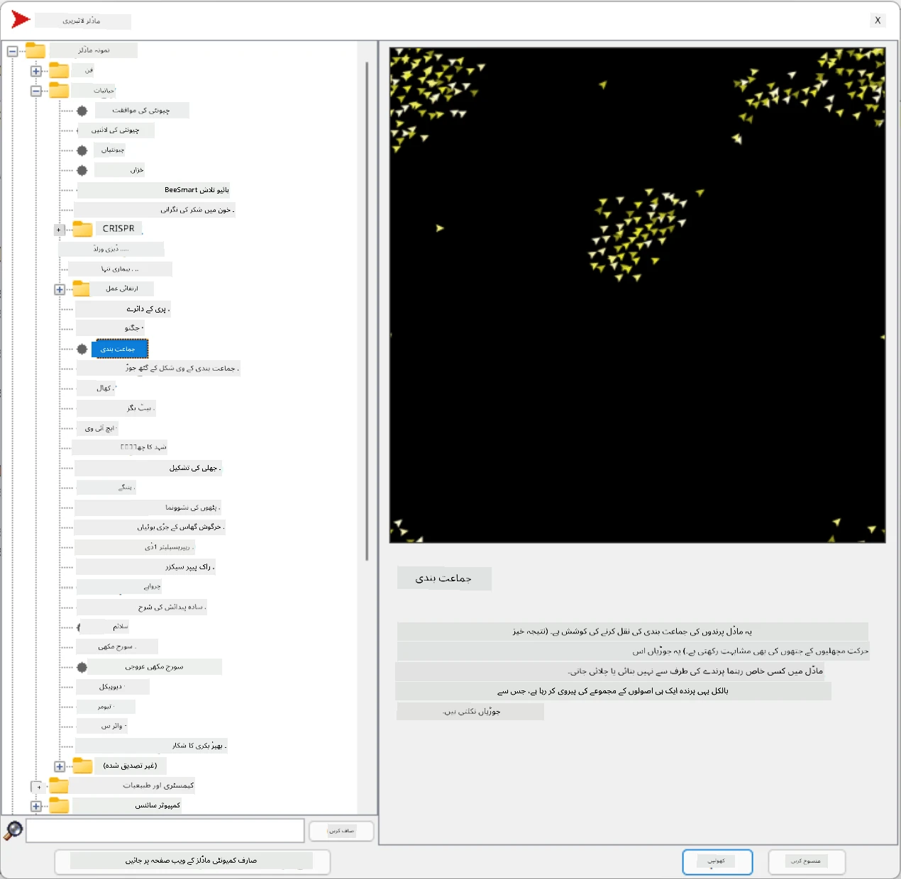

# ملٹی ایجنٹ سسٹمز

ذہانت حاصل کرنے کے ممکنہ طریقوں میں سے ایک **ابھرتا ہوا** (یا **ہم آہنگ**) طریقہ ہے، جو اس حقیقت پر مبنی ہے کہ بہت سے نسبتاً سادہ ایجنٹس کے مشترکہ رویے کے نتیجے میں پورے نظام کا زیادہ پیچیدہ (یا ذہین) رویہ پیدا ہو سکتا ہے۔ نظریاتی طور پر، یہ [اجتماعی ذہانت](https://en.wikipedia.org/wiki/Collective_intelligence)، [ابھرتا ہوا نظریہ](https://en.wikipedia.org/wiki/Global_brain)، اور [ارتقائی سائبرنیٹکس](https://en.wikipedia.org/wiki/Global_brain) کے اصولوں پر مبنی ہے، جو بیان کرتے ہیں کہ اعلیٰ سطح کے نظام کچھ اضافی قدر حاصل کرتے ہیں جب انہیں نچلی سطح کے نظاموں سے مناسب طریقے سے جوڑا جائے (*میٹاسسٹم ٹرانزیشن کا اصول*).

## [لیکچر سے پہلے کا کوئز](https://ff-quizzes.netlify.app/en/ai/quiz/45)

**ملٹی ایجنٹ سسٹمز** کی سمت 1990 کی دہائی میں AI میں ابھری، انٹرنیٹ اور تقسیم شدہ نظاموں کی ترقی کے جواب میں۔ AI کے کلاسیکی نصابی کتابوں میں سے ایک، [Artificial Intelligence: A Modern Approach](https://en.wikipedia.org/wiki/Artificial_Intelligence:_A_Modern_Approach)، ملٹی ایجنٹ سسٹمز کے نقطہ نظر سے کلاسیکی AI کے نظریے پر توجہ مرکوز کرتی ہے۔

ملٹی ایجنٹ نقطہ نظر کا مرکز **ایجنٹ** کا تصور ہے - ایک ایسی ہستی جو کسی **ماحول** میں رہتی ہے، جسے وہ محسوس کر سکتی ہے اور اس پر عمل کر سکتی ہے۔ یہ ایک بہت وسیع تعریف ہے، اور ایجنٹس کی کئی مختلف اقسام اور درجہ بندی ہو سکتی ہیں:

* ان کی استدلال کی صلاحیت کے لحاظ سے:
   - **ردعمل دینے والے** ایجنٹس عام طور پر درخواست-جواب قسم کے سادہ رویے رکھتے ہیں
   - **غور و فکر کرنے والے** ایجنٹس کسی قسم کی منطقی استدلال اور/یا منصوبہ بندی کی صلاحیتوں کو استعمال کرتے ہیں
* اس جگہ کے لحاظ سے جہاں ایجنٹ اپنا کوڈ چلاتا ہے:
   - **جامد** ایجنٹس ایک مخصوص نیٹ ورک نوڈ پر کام کرتے ہیں
   - **متحرک** ایجنٹس اپنا کوڈ نیٹ ورک نوڈز کے درمیان منتقل کر سکتے ہیں
* ان کے رویے کے لحاظ سے:
   - **غیر فعال ایجنٹس** کے پاس مخصوص اہداف نہیں ہوتے۔ ایسے ایجنٹس بیرونی محرکات پر ردعمل دے سکتے ہیں، لیکن خود کوئی کارروائی شروع نہیں کریں گے۔
   - **فعال ایجنٹس** کے پاس کچھ اہداف ہوتے ہیں جنہیں وہ حاصل کرنے کی کوشش کرتے ہیں
   - **ادراکی ایجنٹس** پیچیدہ منصوبہ بندی اور استدلال شامل کرتے ہیں

ملٹی ایجنٹ سسٹمز آج کل کئی ایپلیکیشنز میں استعمال ہوتے ہیں:

* گیمز میں، بہت سے غیر کھلاڑی کردار کسی قسم کی AI استعمال کرتے ہیں، اور انہیں ذہین ایجنٹس سمجھا جا سکتا ہے
* ویڈیو پروڈکشن میں، ہجوم پر مشتمل پیچیدہ 3D مناظر کو رینڈر کرنے کے لیے عام طور پر ملٹی ایجنٹ سیمولیشن استعمال کی جاتی ہے
* سسٹمز ماڈلنگ میں، ملٹی ایجنٹ نقطہ نظر پیچیدہ ماڈل کے رویے کی نقل کرنے کے لیے استعمال ہوتا ہے۔ مثال کے طور پر، ملٹی ایجنٹ نقطہ نظر کو COVID-19 بیماری کے عالمی پھیلاؤ کی پیش گوئی کے لیے کامیابی سے استعمال کیا گیا ہے۔ اسی طرح کا نقطہ نظر شہر میں ٹریفک کی نقل کرنے کے لیے استعمال کیا جا سکتا ہے، اور دیکھ سکتے ہیں کہ ٹریفک قوانین میں تبدیلیوں پر یہ کیسے ردعمل ظاہر کرتا ہے۔
* پیچیدہ آٹومیشن سسٹمز میں، ہر ڈیوائس ایک آزاد ایجنٹ کے طور پر کام کر سکتی ہے، جو پورے نظام کو کم یکجا اور زیادہ مضبوط بناتی ہے۔

ہم ملٹی ایجنٹ سسٹمز میں گہرائی میں جانے میں زیادہ وقت نہیں گزاریں گے، لیکن **ملٹی ایجنٹ ماڈلنگ** کی ایک مثال پر غور کریں گے۔

## نیٹ لوگو

[NetLogo](https://ccl.northwestern.edu/netlogo/) ایک ملٹی ایجنٹ ماڈلنگ ماحول ہے جو [Logo](https://en.wikipedia.org/wiki/Logo_(programming_language)) پروگرامنگ زبان کے ایک ترمیم شدہ ورژن پر مبنی ہے۔ یہ زبان بچوں کو پروگرامنگ کے تصورات سکھانے کے لیے تیار کی گئی تھی، اور یہ آپ کو ایک ایجنٹ **کچھوا** کو کنٹرول کرنے کی اجازت دیتی ہے، جو حرکت کر سکتا ہے اور پیچھے ایک نشان چھوڑ سکتا ہے۔ یہ پیچیدہ جیومیٹرک اشکال بنانے کی اجازت دیتا ہے، جو ایجنٹ کے رویے کو سمجھنے کا ایک بہت بصری طریقہ ہے۔

نیٹ لوگو میں، ہم `create-turtles` کمانڈ کا استعمال کرتے ہوئے کئی کچھوے بنا سکتے ہیں۔ پھر ہم تمام کچھووں کو کچھ اعمال کرنے کا حکم دے سکتے ہیں (نیچے دیے گئے مثال میں - 10 پوائنٹ آگے بڑھنا):

```
create-turtles 10
ask turtles [
  forward 10
]
```

ظاہر ہے، یہ دلچسپ نہیں ہوتا جب تمام کچھوے ایک ہی کام کرتے ہیں، لہذا ہم کچھووں کے گروپس کو `ask` کر سکتے ہیں، جیسے وہ جو کسی خاص نقطہ کے قریب ہوں۔ ہم `breed [cats cat]` کمانڈ کا استعمال کرتے ہوئے مختلف *نسلوں* کے کچھوے بھی بنا سکتے ہیں۔ یہاں `cat` نسل کا نام ہے، اور ہمیں واحد اور جمع دونوں الفاظ کی وضاحت کرنی ہوگی، کیونکہ مختلف کمانڈز وضاحت کے لیے مختلف شکلیں استعمال کرتی ہیں۔

> ✅ ہم نیٹ لوگو زبان کو سیکھنے میں نہیں جائیں گے - اگر آپ مزید سیکھنے میں دلچسپی رکھتے ہیں تو آپ شاندار [Beginner's Interactive NetLogo Dictionary](https://ccl.northwestern.edu/netlogo/bind/) وسائل کا دورہ کر سکتے ہیں۔

آپ نیٹ لوگو کو [ڈاؤن لوڈ](https://ccl.northwestern.edu/netlogo/download.shtml) اور انسٹال کر کے آزما سکتے ہیں۔

### ماڈلز لائبریری

نیٹ لوگو کی ایک بہترین بات یہ ہے کہ اس میں کام کرنے والے ماڈلز کی ایک لائبریری موجود ہے جسے آپ آزما سکتے ہیں۔ **File &rightarrow; Models Library** پر جائیں، اور آپ کے پاس ماڈلز کے انتخاب کے لیے کئی زمرے ہیں۔



> دمتری سوشنیکوف کے ذریعہ ماڈلز لائبریری کا اسکرین شاٹ

آپ ایک ماڈل کھول سکتے ہیں، مثال کے طور پر **Biology &rightarrow; Flocking**۔

### بنیادی اصول

ماڈل کھولنے کے بعد، آپ کو نیٹ لوگو کے مرکزی اسکرین پر لے جایا جاتا ہے۔ یہاں ایک نمونہ ماڈل ہے جو بھیڑیوں اور بھیڑوں کی آبادی کو محدود وسائل (گھاس) کے ساتھ بیان کرتا ہے۔


> دمتری سوشنیکوف کے ذریعہ اسکرین شاٹ

اس اسکرین پر، آپ دیکھ سکتے ہیں:

* **انٹرفیس** سیکشن جس میں شامل ہیں:
  - مرکزی میدان، جہاں تمام ایجنٹس رہتے ہیں
  - مختلف کنٹرولز: بٹن، سلائیڈرز، وغیرہ
  - گراف جو آپ سیمولیشن کے پیرامیٹرز کو ظاہر کرنے کے لیے استعمال کر سکتے ہیں
* **کوڈ** ٹیب جس میں ایڈیٹر شامل ہے، جہاں آپ نیٹ لوگو پروگرام لکھ سکتے ہیں

زیادہ تر معاملات میں، انٹرفیس میں ایک **Setup** بٹن ہوتا ہے، جو سیمولیشن کی حالت کو شروع کرتا ہے، اور ایک **Go** بٹن ہوتا ہے جو عملدرآمد شروع کرتا ہے۔ یہ متعلقہ ہینڈلرز کے ذریعے کوڈ میں اس طرح نظر آتے ہیں:

```
to go [
...
]
```

نیٹ لوگو کی دنیا درج ذیل اشیاء پر مشتمل ہے:

* **ایجنٹس** (کچھوے) جو میدان میں حرکت کر سکتے ہیں اور کچھ کر سکتے ہیں۔ آپ ایجنٹس کو `ask turtles [...]` نحو کا استعمال کرتے ہوئے حکم دیتے ہیں، اور بریکٹ میں کوڈ تمام ایجنٹس کے ذریعہ *کچھوا موڈ* میں چلایا جاتا ہے۔
* **پیچز** میدان کے مربع علاقے ہیں، جن پر ایجنٹس رہتے ہیں۔ آپ تمام ایجنٹس کا حوالہ دے سکتے ہیں جو ایک ہی پیچ پر ہیں، یا آپ پیچ کے رنگ اور کچھ دیگر خصوصیات کو تبدیل کر سکتے ہیں۔ آپ پیچز کو کچھ کرنے کے لیے `ask patches` بھی کہہ سکتے ہیں۔
* **مشاہدہ کرنے والا** ایک منفرد ایجنٹ ہے جو دنیا کو کنٹرول کرتا ہے۔ تمام بٹن ہینڈلرز *مشاہدہ کرنے والے موڈ* میں چلائے جاتے ہیں۔

> ✅ ملٹی ایجنٹ ماحول کی خوبصورتی یہ ہے کہ کچھوا موڈ یا پیچ موڈ میں چلنے والا کوڈ تمام ایجنٹس کے ذریعہ ایک ہی وقت میں متوازی طور پر چلایا جاتا ہے۔ اس طرح، تھوڑا سا کوڈ لکھ کر اور انفرادی ایجنٹ کے رویے کو پروگرام کر کے، آپ پورے سیمولیشن سسٹم کے پیچیدہ رویے کو تخلیق کر سکتے ہیں۔

### فلوکنگ

ملٹی ایجنٹ رویے کی ایک مثال کے طور پر، آئیے **[فلوکنگ](https://en.wikipedia.org/wiki/Flocking_(behavior))** پر غور کریں۔ فلوکنگ ایک پیچیدہ نمونہ ہے جو بہت ملتا جلتا ہے جیسے پرندوں کے جھنڈ اڑتے ہیں۔ انہیں اڑتے ہوئے دیکھ کر آپ سوچ سکتے ہیں کہ وہ کسی قسم کے اجتماعی الگورتھم کی پیروی کرتے ہیں، یا ان کے پاس *اجتماعی ذہانت* کی کوئی شکل ہے۔ تاہم، یہ پیچیدہ رویہ اس وقت پیدا ہوتا ہے جب ہر انفرادی ایجنٹ (اس معاملے میں، ایک *پرندہ*) صرف اپنے قریب کے کچھ دوسرے ایجنٹس کو دیکھتا ہے، اور تین سادہ اصولوں کی پیروی کرتا ہے:

* **ہم آہنگی** - یہ پڑوسی ایجنٹس کی اوسط سمت کی طرف مڑتا ہے
* **یکجہتی** - یہ پڑوسیوں کی اوسط پوزیشن کی طرف مڑنے کی کوشش کرتا ہے (*طویل فاصلے کی کشش*)
* **علیحدگی** - جب دوسرے پرندوں کے بہت قریب ہو جاتا ہے، تو یہ دور جانے کی کوشش کرتا ہے (*مختصر فاصلے کی دفع*)

آپ فلوکنگ کی مثال چلا سکتے ہیں اور رویے کا مشاہدہ کر سکتے ہیں۔ آپ پیرامیٹرز کو بھی ایڈجسٹ کر سکتے ہیں، جیسے *علیحدگی کی ڈگری*، یا *دیکھنے کی حد*، جو یہ بتاتی ہے کہ ہر پرندہ کتنی دور دیکھ سکتا ہے۔ نوٹ کریں کہ اگر آپ دیکھنے کی حد کو 0 تک کم کر دیتے ہیں، تو تمام پرندے اندھے ہو جاتے ہیں، اور فلوکنگ رک جاتی ہے۔ اگر آپ علیحدگی کو 0 تک کم کر دیتے ہیں، تو تمام پرندے ایک سیدھی لائن میں جمع ہو جاتے ہیں۔

> ✅ **کوڈ** ٹیب پر جائیں اور دیکھیں کہ فلوکنگ کے تین اصول (ہم آہنگی، یکجہتی، اور علیحدگی) کو کوڈ میں کہاں نافذ کیا گیا ہے۔ نوٹ کریں کہ ہم صرف ان ایجنٹس کا حوالہ دیتے ہیں جو نظر میں ہیں۔

### دیکھنے کے لیے دیگر ماڈلز

کچھ مزید دلچسپ ماڈلز ہیں جن کے ساتھ آپ تجربہ کر سکتے ہیں:

* **Art &rightarrow; Fireworks** دکھاتا ہے کہ آتش بازی کو انفرادی آگ کے دھاروں کے اجتماعی رویے کے طور پر کیسے سمجھا جا سکتا ہے
* **Social Science &rightarrow; Traffic Basic** اور **Social Science &rightarrow; Traffic Grid** شہر کے ٹریفک کا ماڈل 1D اور 2D گرڈ میں ٹریفک لائٹس کے ساتھ یا بغیر دکھاتے ہیں۔ سیمولیشن میں ہر کار درج ذیل اصولوں کی پیروی کرتی ہے:
   - اگر اس کے سامنے کی جگہ خالی ہے - رفتار بڑھائیں (ایک خاص زیادہ سے زیادہ رفتار تک)
   - اگر یہ سامنے رکاوٹ دیکھتی ہے - بریک لگائیں (اور آپ ایڈجسٹ کر سکتے ہیں کہ ڈرائیور کتنی دور دیکھ سکتا ہے)
* **Social Science &rightarrow; Party** دکھاتا ہے کہ لوگ کاک ٹیل پارٹی کے دوران کیسے گروپ بناتے ہیں۔ آپ پیرامیٹرز کے ایسے امتزاج تلاش کر سکتے ہیں جو گروپ کی خوشی میں سب سے تیز اضافہ کرتے ہیں۔

جیسا کہ آپ ان مثالوں سے دیکھ سکتے ہیں، ملٹی ایجنٹ سیمولیشنز انفرادی افراد پر مشتمل پیچیدہ نظام کے رویے کو سمجھنے کا ایک مفید طریقہ ہو سکتی ہیں جو ایک ہی یا اسی طرح کی منطق کی پیروی کرتے ہیں۔ یہ ورچوئل ایجنٹس کو کنٹرول کرنے کے لیے بھی استعمال کیا جا سکتا ہے، جیسے [NPCs](https://en.wikipedia.org/wiki/NPC) کمپیوٹر گیمز میں، یا 3D متحرک دنیا میں ایجنٹس۔

## غور و فکر کرنے والے ایجنٹس

اوپر بیان کردہ ایجنٹس بہت سادہ ہیں، جو ماحول میں تبدیلیوں پر کسی قسم کے الگورتھم کا استعمال کرتے ہوئے ردعمل دیتے ہیں۔ اس طرح وہ **ردعمل دینے والے ایجنٹس** ہیں۔ تاہم، کبھی کبھی ایجنٹس استدلال کر سکتے ہیں اور اپنے عمل کی منصوبہ بندی کر سکتے ہیں، جس صورت میں انہیں **غور و فکر کرنے والے** کہا جاتا ہے۔

ایک عام مثال ایک ذاتی ایجنٹ ہوگی جو انسان سے چھٹی کے دورے کی بکنگ کے لیے ہدایت حاصل کرتا ہے۔ فرض کریں کہ انٹرنیٹ پر بہت سے ایجنٹس موجود ہیں، جو اس کی مدد کر سکتے ہیں۔ اسے پھر دوسرے ایجنٹس سے رابطہ کرنا چاہیے تاکہ دیکھے کہ کون سی پروازیں دستیاب ہیں، مختلف تاریخوں کے لیے ہوٹل کی قیمتیں کیا ہیں، اور بہترین قیمت پر بات چیت کرنے کی کوشش کریں۔ جب چھٹی کا منصوبہ مکمل ہو جائے اور مالک کی طرف سے تصدیق ہو جائے، تو یہ بکنگ کے ساتھ آگے بڑھ سکتا ہے۔

ایسا کرنے کے لیے، ایجنٹس کو **بات چیت** کرنے کی ضرورت ہوتی ہے۔ کامیاب بات چیت کے لیے انہیں ضرورت ہوتی ہے:

* کچھ **معیاری زبانیں علم کا تبادلہ کرنے کے لیے**، جیسے [Knowledge Interchange Format](https://en.wikipedia.org/wiki/Knowledge_Interchange_Format) (KIF) اور [Knowledge Query and Manipulation Language](https://en.wikipedia.org/wiki/Knowledge_Query_and_Manipulation_Language) (KQML)۔ یہ زبانیں [Speech Act theory](https://en.wikipedia.org/wiki/Speech_act) کی بنیاد پر تیار کی گئی ہیں۔
* ان زبانوں میں **بات چیت کے پروٹوکولز** بھی شامل ہونے چاہئیں، مختلف **نیلامی کی اقسام** پر مبنی۔
* ایک **مشترکہ اونٹولوجی** کا استعمال، تاکہ وہ ایک ہی تصورات کا حوالہ دیں اور ان کے معنی کو جانیں۔
* یہ دریافت کرنے کا ایک طریقہ کہ مختلف ایجنٹس کیا کر سکتے ہیں، جو کسی قسم کی اونٹولوجی پر بھی مبنی ہے۔

غور و فکر کرنے والے ایجنٹس ردعمل دینے والوں سے کہیں زیادہ پیچیدہ ہیں، کیونکہ وہ صرف ماحول میں تبدیلیوں پر ردعمل ظاہر نہیں کرتے، انہیں *عمل شروع کرنے* کے قابل بھی ہونا چاہیے۔ غور و فکر کرنے والے ایجنٹس کے لیے تجویز کردہ آرکیٹیکچرز میں سے ایک **Belief-Desire-Intention (BDI)** ایجنٹ ہے:

* **Beliefs** ایجنٹ کے ماحول کے بارے میں علم کا ایک مجموعہ بناتے ہیں۔ یہ علم کی بنیاد یا قواعد کے ایک مجموعے کے طور پر تشکیل دیا جا سکتا ہے جسے ایجنٹ ماحول میں کسی خاص صورتحال پر لاگو کر سکتا ہے۔
* **Desires** ایجنٹ کے کرنے کی خواہشات کو بیان کرتے ہیں، یعنی اس کے اہداف۔ مثال کے طور پر، اوپر ذاتی معاون ایجنٹ کا مقصد ایک دورے کی بکنگ کرنا ہے، اور ہوٹل ایجنٹ کا مقصد منافع کو زیادہ سے زیادہ کرنا ہے۔
* **Intentions** مخصوص اعمال ہیں جو ایجنٹ اپنے اہداف کو حاصل کرنے کے لیے منصوبہ بندی کرتا ہے۔ اعمال عام طور پر ماحول کو تبدیل کرتے ہیں اور دوسرے ایجنٹس کے ساتھ بات چیت کا سبب بنتے ہیں۔

ملٹی ایجنٹ سسٹمز بنانے کے لیے کچھ پلیٹ فارمز دستیاب ہیں، جیسے [JADE](https://jade.tilab.com/)۔ [یہ مقالہ](https://arxiv.org/ftp/arxiv/papers/2007/2007.08961.pdf) ملٹی ایجنٹ پلیٹ فارمز کا جائزہ پیش کرتا ہے، ساتھ ہی ملٹی ایجنٹ سسٹمز کی مختصر تاریخ اور ان کے مختلف استعمال کے منظرنامے۔

## نتیجہ

ملٹی ایجنٹ سسٹمز مختلف شکلیں لے سکتے ہیں اور کئی مختلف ایپلیکیشنز میں استعمال ہو سکتے ہیں۔ 
یہ سب انفرادی ایجنٹ کے سادہ رویے پر توجہ مرکوز کرتے ہیں، اور پورے نظام کے زیادہ پیچیدہ رویے کو **ہم آہنگ اثر** کی وجہ سے حاصل کرتے ہیں۔

## 🚀 چیلنج

اس سبق کو حقیقی دنیا میں لے جائیں اور ایک ملٹی ایجنٹ سسٹم کا تصور کرنے کی کوشش کریں جو کسی مسئلے کو حل کر سکے۔ مثال کے طور پر، اسکول بس کے راستے کو بہتر بنانے کے لیے ملٹی ایجنٹ سسٹم کو کیا کرنے کی ضرورت ہوگی؟ یہ بیکری میں کیسے کام کر سکتا ہے؟

## [لیکچر کے بعد کا کوئز](https://ff-quizzes.netlify.app/en/ai/quiz/46)

## جائزہ اور خود مطالعہ

صنعت میں اس قسم کے نظام کے استعمال کا جائزہ لیں۔ ایک ڈومین جیسے مینوفیکچرنگ یا ویڈیو گیم انڈسٹری کا انتخاب کریں اور دریافت کریں کہ ملٹی ایجنٹ سسٹمز منفرد مسائل کو حل کرنے کے لیے کیسے استعمال کیے جا سکتے ہیں۔

## [نیٹ لوگو اسائنمنٹ](assignment.md)

---

