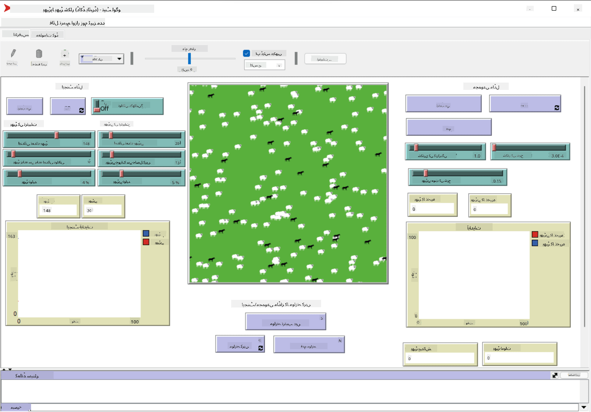

<!--
CO_OP_TRANSLATOR_METADATA:
{
  "original_hash": "1ddf651d7681b4449f9d09ea3b17911e",
  "translation_date": "2025-08-26T09:57:22+00:00",
  "source_file": "lessons/6-Other/23-MultiagentSystems/README.md",
  "language_code": "ur"
}
-->
# ملٹی ایجنٹ سسٹمز

ذہانت حاصل کرنے کے ممکنہ طریقوں میں سے ایک **ایمرجینٹ** (یا **سینرجیٹک**) طریقہ ہے، جو اس حقیقت پر مبنی ہے کہ کئی نسبتاً سادہ ایجنٹس کے مشترکہ رویے سے پورے نظام کا زیادہ پیچیدہ (یا ذہین) رویہ پیدا ہو سکتا ہے۔ نظریاتی طور پر، یہ [اجتماعی ذہانت](https://en.wikipedia.org/wiki/Collective_intelligence)، [ایمرجینٹزم](https://en.wikipedia.org/wiki/Global_brain) اور [ارتقائی سائبرنیٹکس](https://en.wikipedia.org/wiki/Global_brain) کے اصولوں پر مبنی ہے، جو یہ بیان کرتے ہیں کہ اعلیٰ سطح کے نظام کو کچھ اضافی قدر حاصل ہوتی ہے جب انہیں نچلی سطح کے نظاموں سے مناسب طریقے سے جوڑا جائے (جسے *میٹاسسٹم ٹرانزیشن کا اصول* کہا جاتا ہے)۔

## [لیکچر سے پہلے کا کوئز](https://red-field-0a6ddfd03.1.azurestaticapps.net/quiz/123)

**ملٹی ایجنٹ سسٹمز** کی سمت 1990 کی دہائی میں AI میں ابھری، جب انٹرنیٹ اور ڈسٹریبیوٹڈ سسٹمز کا پھیلاؤ ہوا۔ AI کی ایک کلاسیکی کتاب، [Artificial Intelligence: A Modern Approach](https://en.wikipedia.org/wiki/Artificial_Intelligence:_A_Modern_Approach)، ملٹی ایجنٹ سسٹمز کے نقطہ نظر سے کلاسیکی AI پر توجہ مرکوز کرتی ہے۔

ملٹی ایجنٹ طریقہ کار کا مرکزی تصور **ایجنٹ** کا ہے - ایک ایسی ہستی جو کسی **ماحول** میں رہتی ہے، جسے وہ محسوس کر سکتی ہے اور اس پر عمل کر سکتی ہے۔ یہ ایک بہت وسیع تعریف ہے، اور ایجنٹس کی کئی مختلف اقسام اور درجہ بندیاں ہو سکتی ہیں:

* ان کی استدلال کرنے کی صلاحیت کے لحاظ سے:
   - **ری ایکٹو** ایجنٹس عام طور پر سادہ درخواست-جواب قسم کے رویے رکھتے ہیں۔
   - **ڈیلیبریٹو** ایجنٹس کسی قسم کی منطقی استدلال اور/یا منصوبہ بندی کی صلاحیتوں کا استعمال کرتے ہیں۔
* اس جگہ کے لحاظ سے جہاں ایجنٹ اپنا کوڈ چلاتا ہے:
   - **اسٹیٹک** ایجنٹس ایک مخصوص نیٹ ورک نوڈ پر کام کرتے ہیں۔
   - **موبائل** ایجنٹس اپنے کوڈ کو نیٹ ورک نوڈز کے درمیان منتقل کر سکتے ہیں۔
* ان کے رویے کے لحاظ سے:
   - **پیسِو ایجنٹس** کے کوئی خاص مقاصد نہیں ہوتے۔ ایسے ایجنٹس بیرونی محرکات پر ردعمل دے سکتے ہیں، لیکن خود سے کوئی عمل شروع نہیں کریں گے۔
   - **ایکٹیو ایجنٹس** کے کچھ مقاصد ہوتے ہیں جن کا وہ تعاقب کرتے ہیں۔
   - **کاگنیٹو ایجنٹس** پیچیدہ منصوبہ بندی اور استدلال شامل کرتے ہیں۔

آج کل ملٹی ایجنٹ سسٹمز کئی ایپلیکیشنز میں استعمال ہو رہے ہیں:

* گیمز میں، بہت سے نان پلیئر کریکٹرز کسی نہ کسی قسم کی AI کا استعمال کرتے ہیں، اور انہیں ذہین ایجنٹس سمجھا جا سکتا ہے۔
* ویڈیو پروڈکشن میں، ہجوم پر مشتمل پیچیدہ 3D مناظر کو رینڈر کرنے کے لیے عام طور پر ملٹی ایجنٹ سیمولیشن کا استعمال کیا جاتا ہے۔
* سسٹمز ماڈلنگ میں، ملٹی ایجنٹ طریقہ کار کو ایک پیچیدہ ماڈل کے رویے کی نقل کرنے کے لیے استعمال کیا جاتا ہے۔ مثال کے طور پر، ملٹی ایجنٹ طریقہ کار کو COVID-19 بیماری کے عالمی پھیلاؤ کی پیش گوئی کے لیے کامیابی سے استعمال کیا گیا ہے۔ اسی طرح کا طریقہ کار شہر میں ٹریفک کو ماڈل کرنے کے لیے استعمال کیا جا سکتا ہے، اور یہ دیکھنے کے لیے کہ ٹریفک قوانین میں تبدیلیوں پر یہ کیسے ردعمل ظاہر کرتا ہے۔
* پیچیدہ آٹومیشن سسٹمز میں، ہر ڈیوائس ایک آزاد ایجنٹ کے طور پر کام کر سکتی ہے، جو پورے نظام کو کم یکجہتی اور زیادہ مضبوط بناتی ہے۔

ہم ملٹی ایجنٹ سسٹمز میں گہرائی میں جانے کے لیے زیادہ وقت نہیں گزاریں گے، لیکن **ملٹی ایجنٹ ماڈلنگ** کی ایک مثال پر غور کریں گے۔

## نیٹ لوگو

[NetLogo](https://ccl.northwestern.edu/netlogo/) ایک ملٹی ایجنٹ ماڈلنگ ماحول ہے جو [Logo](https://en.wikipedia.org/wiki/Logo_(programming_language)) پروگرامنگ زبان کے ایک ترمیم شدہ ورژن پر مبنی ہے۔ یہ زبان بچوں کو پروگرامنگ کے تصورات سکھانے کے لیے تیار کی گئی تھی، اور یہ آپ کو ایک ایجنٹ کو کنٹرول کرنے کی اجازت دیتی ہے جسے **ٹَرٹل** کہا جاتا ہے، جو حرکت کر سکتا ہے اور پیچھے ایک نشان چھوڑ سکتا ہے۔ یہ پیچیدہ جیومیٹرک اشکال بنانے کی اجازت دیتا ہے، جو ایجنٹ کے رویے کو سمجھنے کا ایک بہت بصری طریقہ ہے۔

NetLogo میں، ہم `create-turtles` کمانڈ کا استعمال کرتے ہوئے کئی ٹرٹلز بنا سکتے ہیں۔ ہم پھر تمام ٹرٹلز کو کچھ اعمال کرنے کا حکم دے سکتے ہیں (نیچے دیے گئے مثال میں - 10 پوائنٹس آگے بڑھنا):

```
create-turtles 10
ask turtles [
  forward 10
]
```

ظاہر ہے، یہ دلچسپ نہیں ہوتا جب تمام ٹرٹلز ایک ہی کام کرتے ہیں، اس لیے ہم `ask` کمانڈ کا استعمال کرتے ہوئے ٹرٹلز کے گروپس کو حکم دے سکتے ہیں، مثلاً وہ جو کسی خاص نقطے کے قریب ہوں۔ ہم `breed [cats cat]` کمانڈ کا استعمال کرتے ہوئے مختلف *نسلوں* کے ٹرٹلز بھی بنا سکتے ہیں۔ یہاں `cat` نسل کا نام ہے، اور ہمیں واحد اور جمع دونوں الفاظ کی وضاحت کرنی ہوگی، کیونکہ مختلف کمانڈز وضاحت کے لیے مختلف شکلیں استعمال کرتی ہیں۔

> ✅ ہم NetLogo زبان سیکھنے میں زیادہ وقت نہیں گزاریں گے - اگر آپ مزید سیکھنے میں دلچسپی رکھتے ہیں تو آپ شاندار [Beginner's Interactive NetLogo Dictionary](https://ccl.northwestern.edu/netlogo/bind/) وسائل کا دورہ کر سکتے ہیں۔

آپ NetLogo کو [ڈاؤن لوڈ](https://ccl.northwestern.edu/netlogo/download.shtml) اور انسٹال کر کے آزما سکتے ہیں۔

### ماڈلز لائبریری

NetLogo کی ایک زبردست خصوصیت یہ ہے کہ اس میں کام کرنے والے ماڈلز کی ایک لائبریری موجود ہے جسے آپ آزما سکتے ہیں۔ **File → Models Library** پر جائیں، اور آپ کے پاس ماڈلز کے کئی زمروں میں سے انتخاب کرنے کا آپشن ہوگا۔


> دمتری سوشنیکوف کے ذریعہ ماڈلز لائبریری کا اسکرین شاٹ

آپ ماڈلز میں سے ایک کھول سکتے ہیں، مثلاً **Biology → Flocking**۔

### بنیادی اصول

ماڈل کھولنے کے بعد، آپ کو NetLogo کی مرکزی اسکرین پر لے جایا جاتا ہے۔ یہاں ایک نمونہ ماڈل ہے جو بھیڑیوں اور بھیڑوں کی آبادی کو محدود وسائل (گھاس) کے ساتھ بیان کرتا ہے۔



> دمتری سوشنیکوف کے ذریعہ اسکرین شاٹ

اس اسکرین پر، آپ دیکھ سکتے ہیں:

* **انٹرفیس** سیکشن، جس میں شامل ہیں:
  - مرکزی میدان، جہاں تمام ایجنٹس رہتے ہیں
  - مختلف کنٹرولز: بٹن، سلائیڈرز، وغیرہ
  - گراف، جنہیں آپ سیمولیشن کے پیرامیٹرز کو ظاہر کرنے کے لیے استعمال کر سکتے ہیں
* **کوڈ** ٹیب، جس میں ایڈیٹر شامل ہے، جہاں آپ NetLogo پروگرام لکھ سکتے ہیں

زیادہ تر معاملات میں، انٹرفیس میں ایک **Setup** بٹن ہوگا، جو سیمولیشن کی حالت کو شروع کرتا ہے، اور ایک **Go** بٹن ہوگا جو عمل درآمد شروع کرتا ہے۔ یہ متعلقہ ہینڈلرز کے ذریعے کوڈ میں سنبھالے جاتے ہیں، جو اس طرح نظر آتے ہیں:

```
to go [
...
]
```

NetLogo کی دنیا درج ذیل اشیاء پر مشتمل ہے:

* **ایجنٹس** (ٹرٹلز) جو میدان میں حرکت کر سکتے ہیں اور کچھ کر سکتے ہیں۔ آپ `ask turtles [...]` نحو کا استعمال کرتے ہوئے ایجنٹس کو حکم دیتے ہیں، اور بریکٹ میں کوڈ تمام ایجنٹس کے ذریعہ *ٹرٹل موڈ* میں چلایا جاتا ہے۔
* **پیچز** میدان کے مربع علاقے ہیں، جن پر ایجنٹس رہتے ہیں۔ آپ ایک ہی پیچ پر موجود تمام ایجنٹس کا حوالہ دے سکتے ہیں، یا آپ پیچ کے رنگ اور دیگر خصوصیات کو تبدیل کر سکتے ہیں۔ آپ پیچز کو کچھ کرنے کے لیے `ask patches` بھی استعمال کر سکتے ہیں۔
* **آبزرور** ایک منفرد ایجنٹ ہے جو دنیا کو کنٹرول کرتا ہے۔ تمام بٹن ہینڈلرز *آبزرور موڈ* میں چلائے جاتے ہیں۔

> ✅ ملٹی ایجنٹ ماحول کی خوبصورتی یہ ہے کہ ٹرٹل موڈ یا پیچ موڈ میں چلنے والا کوڈ تمام ایجنٹس کے ذریعہ ایک ہی وقت میں متوازی طور پر چلایا جاتا ہے۔ اس طرح، تھوڑا سا کوڈ لکھ کر اور انفرادی ایجنٹ کے رویے کو پروگرام کر کے، آپ پورے سیمولیشن سسٹم کے پیچیدہ رویے کو تخلیق کر سکتے ہیں۔

### فلوکنگ

ملٹی ایجنٹ رویے کی ایک مثال کے طور پر، **[Flocking](https://en.wikipedia.org/wiki/Flocking_(behavior))** پر غور کریں۔ فلوکنگ ایک پیچیدہ نمونہ ہے جو پرندوں کے جھنڈ کے اڑنے کے انداز سے بہت مشابہت رکھتا ہے۔ انہیں اڑتے ہوئے دیکھ کر آپ سوچ سکتے ہیں کہ وہ کسی قسم کے اجتماعی الگورتھم کی پیروی کر رہے ہیں، یا ان کے پاس کسی قسم کی *اجتماعی ذہانت* ہے۔ تاہم، یہ پیچیدہ رویہ اس وقت پیدا ہوتا ہے جب ہر انفرادی ایجنٹ (اس صورت میں، ایک *پرندہ*) صرف اپنے قریب کے کچھ دوسرے ایجنٹس کا مشاہدہ کرتا ہے، اور تین سادہ اصولوں پر عمل کرتا ہے:

* **الائنمنٹ** - یہ قریبی ایجنٹس کی اوسط سمت کی طرف مڑتا ہے۔
* **کوہیشن** - یہ ہمسایوں کی اوسط پوزیشن کی طرف مڑنے کی کوشش کرتا ہے (*طویل فاصلے کی کشش*)۔
* **سیپریشن** - جب دوسرے پرندوں کے بہت قریب آتا ہے، تو یہ دور جانے کی کوشش کرتا ہے (*قلیل فاصلے کی مزاحمت*)۔

آپ فلوکنگ کی مثال چلا سکتے ہیں اور رویے کا مشاہدہ کر سکتے ہیں۔ آپ پیرامیٹرز کو بھی ایڈجسٹ کر سکتے ہیں، جیسے *علیحدگی کی ڈگری*، یا *دیکھنے کی حد*، جو یہ طے کرتی ہے کہ ہر پرندہ کتنی دور تک دیکھ سکتا ہے۔ نوٹ کریں کہ اگر آپ دیکھنے کی حد کو 0 تک کم کر دیں، تو تمام پرندے اندھے ہو جاتے ہیں، اور فلوکنگ رک جاتی ہے۔ اگر آپ علیحدگی کو 0 تک کم کر دیں، تو تمام پرندے ایک سیدھی لائن میں جمع ہو جاتے ہیں۔

> ✅ **کوڈ** ٹیب پر جائیں اور دیکھیں کہ فلوکنگ کے تین اصول (الائنمنٹ، کوہیشن اور سیپریشن) کوڈ میں کہاں نافذ کیے گئے ہیں۔ نوٹ کریں کہ ہم صرف ان ایجنٹس کا حوالہ دیتے ہیں جو نظر میں ہیں۔

### دیکھنے کے لیے دیگر ماڈلز

کچھ اور دلچسپ ماڈلز ہیں جن کے ساتھ آپ تجربہ کر سکتے ہیں:

* **Art → Fireworks** دکھاتا ہے کہ آتشبازی کو انفرادی فائر اسٹریمز کے اجتماعی رویے کے طور پر کیسے سمجھا جا سکتا ہے۔
* **Social Science → Traffic Basic** اور **Social Science → Traffic Grid** شہر کے ٹریفک کا ماڈل 1D اور 2D گرڈ میں ٹریفک لائٹس کے ساتھ یا بغیر دکھاتے ہیں۔ سیمولیشن میں ہر کار درج ذیل اصولوں پر عمل کرتی ہے:
   - اگر اس کے سامنے کی جگہ خالی ہو - رفتار بڑھائیں (ایک خاص زیادہ سے زیادہ رفتار تک)
   - اگر سامنے رکاوٹ نظر آئے - بریک لگائیں (اور آپ ایڈجسٹ کر سکتے ہیں کہ ڈرائیور کتنی دور تک دیکھ سکتا ہے)
* **Social Science → Party** دکھاتا ہے کہ کاک ٹیل پارٹی کے دوران لوگ کیسے گروپ بناتے ہیں۔ آپ ان پیرامیٹرز کے امتزاج کو تلاش کر سکتے ہیں جو گروپ کی خوشی میں تیزی سے اضافے کا باعث بنتے ہیں۔

جیسا کہ آپ ان مثالوں سے دیکھ سکتے ہیں، ملٹی ایجنٹ سیمولیشنز انفرادی طور پر ایک جیسے یا ملتے جلتے منطق پر عمل کرنے والے افراد پر مشتمل پیچیدہ نظام کے رویے کو سمجھنے کا ایک مفید طریقہ ہو سکتی ہیں۔ یہ ورچوئل ایجنٹس، جیسے [NPCs](https://en.wikipedia.org/wiki/NPC) کو کمپیوٹر گیمز میں یا 3D اینیمیٹڈ دنیا میں کنٹرول کرنے کے لیے بھی استعمال کی جا سکتی ہیں۔

## ڈیلیبریٹو ایجنٹس

اوپر بیان کردہ ایجنٹس بہت سادہ ہیں، جو ماحول میں تبدیلیوں پر کسی قسم کے الگورتھم کا استعمال کرتے ہوئے ردعمل ظاہر کرتے ہیں۔ اس طرح، وہ **ری ایکٹو ایجنٹس** ہیں۔ تاہم، بعض اوقات ایجنٹس استدلال کر سکتے ہیں اور اپنے اعمال کی منصوبہ بندی کر سکتے ہیں، اس صورت میں انہیں **ڈیلیبریٹو** کہا جاتا ہے۔

ایک عام مثال ایک ذاتی ایجنٹ ہوگی جو انسان سے چھٹیوں کے دورے کی بکنگ کے لیے ہدایت حاصل کرتا ہے۔ فرض کریں کہ انٹرنیٹ پر بہت سے ایجنٹس موجود ہیں جو اس کی مدد کر سکتے ہیں۔ اسے پھر دوسرے ایجنٹس سے رابطہ کرنا چاہیے تاکہ یہ دیکھ سکے کہ کون سی پروازیں دستیاب ہیں، مختلف تاریخوں کے لیے ہوٹل کی قیمتیں کیا ہیں، اور بہترین قیمت پر بات چیت کرنے کی کوشش کریں۔ جب چھٹیوں کا منصوبہ مکمل ہو جائے اور مالک کی طرف سے تصدیق ہو جائے، تو یہ بکنگ کے ساتھ آگے بڑھ سکتا ہے۔

ایسا کرنے کے لیے، ایجنٹس کو **مواصلات** کی ضرورت ہوتی ہے۔ کامیاب مواصلات کے لیے انہیں درج ذیل کی ضرورت ہوتی ہے:

* **علم کے تبادلے کے لیے معیاری زبانیں**، جیسے [Knowledge Interchange Format](https://en.wikipedia.org/wiki/Knowledge_Interchange_Format) (KIF) اور [Knowledge Query and Manipulation Language](https://en.wikipedia.org/wiki/Knowledge_Query_and_Manipulation_Language) (KQML)۔ یہ زبانیں [Speech Act theory](https://en.wikipedia.org/wiki/Speech_act) کی بنیاد پر ڈیزائن کی گئی ہیں۔
* ان زبانوں میں **مذاکرات کے پروٹوکولز** بھی شامل ہونے چاہئیں، جو مختلف **نیلامی کی اقسام** پر مبنی ہوں۔
* استعمال کے لیے ایک **مشترکہ اونٹولوجی**، تاکہ وہ ایک ہی تصورات کا حوالہ دے سکیں اور ان کے معنی کو جان سکیں۔
* یہ دریافت کرنے کا ایک طریقہ کہ مختلف ایجنٹس کیا کر سکتے ہیں، جو کسی قسم کی اونٹولوجی پر بھی مبنی ہو۔

ڈیلیبریٹو ایجنٹس ری ایکٹو ایجنٹس کے مقابلے میں کہیں زیادہ پیچیدہ ہیں، کیونکہ وہ صرف ماحول میں تبدیلیوں پر ردعمل ظاہر نہیں کرتے، بلکہ انہیں *اعمال شروع کرنے* کے قابل بھی ہونا چاہیے۔ ڈیلیبریٹو ایجنٹس کے لیے تجویز کردہ آرکیٹیکچرز میں سے ایک **Belief-Desire-Intention (BDI)** ایجنٹ ہے:

* **Beliefs** ایجنٹ کے ماحول کے بارے میں علم کا ایک مجموعہ تشکیل دیتے ہیں۔ یہ ایک نالج بیس یا قواعد کے سیٹ کے طور پر تشکیل دیا جا سکتا ہے جسے ایجنٹ ماحول میں کسی خاص صورتحال پر لاگو کر سکتا ہے۔
* **Desires** اس بات کی وضاحت کرتے ہیں کہ ایجنٹ کیا کرنا چاہتا ہے، یعنی اس کے مقاصد۔ مثال کے طور پر، اوپر بیان کردہ ذاتی معاون ایجنٹ کا مقصد ایک دورے کی بکنگ کرنا ہے، اور ہوٹل ایجنٹ کا مقصد منافع کو زیادہ سے زیادہ کرنا ہے۔
* **Intentions** وہ مخصوص اعمال ہیں جو ایجنٹ اپنے مقاصد کے حصول کے لیے منصوبہ بندی کرتا ہے۔ اعمال عام طور پر ماحول کو تبدیل کرتے ہیں اور دوسرے ایجنٹس کے ساتھ مواصلات کا سبب بنتے ہیں۔

ملٹی ایجنٹ سسٹمز بنانے کے لیے کچھ پلیٹ فارمز دستیاب ہیں، جیسے [JADE](https://jade.tilab.com/)۔ [یہ مقالہ](https://arxiv.org/ftp/arxiv/papers/2007/2007.08961.pdf) ملٹی ایجنٹ پلیٹ فارمز کا جائزہ فراہم کرتا ہے، ساتھ ہی ملٹی ایجنٹ سسٹمز کی مختصر تاریخ اور ان کے مختلف استعمال کے منظرنامے بھی۔

## نتیجہ

ملٹی ایجنٹ سسٹمز مختلف شکلیں اختیار کر سکتے ہیں اور مختلف ایپلیکیشنز میں استعمال ہو سکتے ہیں۔  
یہ سب انفرادی ایجنٹ کے سادہ رویے پر توجہ مرکوز کرتے ہیں، اور **سینرجیٹک اثر** کی وجہ سے پورے نظام کے زیادہ پیچیدہ رویے کو حاصل کرتے ہیں۔

## 🚀 چیلنج

اس سبق کو حقیقی دنیا میں لے جائیں اور ایک مسئلہ حل کرنے کے لیے ملٹی ایجنٹ سسٹم کا تصور کرنے کی کوشش کریں۔ مثال کے طور پر، ایک ملٹی ایجنٹ سسٹم کو اسکول بس کے راستے کو بہتر بنانے کے لیے کیا کرنے کی ضرورت ہوگی؟ یہ ایک بیکری میں کیسے کام کر سکتا ہے؟

## [لیکچر کے بعد کا کوئز](https://red-field-0a6ddfd03.1.azurestaticapps.net/quiz/223)

## جائزہ اور خود مطالعہ

صنعت میں اس قسم کے نظام کے استعمال کا جائزہ لیں۔

**ڈسکلیمر**:  
یہ دستاویز AI ترجمہ سروس [Co-op Translator](https://github.com/Azure/co-op-translator) کا استعمال کرتے ہوئے ترجمہ کی گئی ہے۔ ہم درستگی کے لیے کوشش کرتے ہیں، لیکن براہ کرم آگاہ رہیں کہ خودکار ترجمے میں غلطیاں یا عدم درستگی ہو سکتی ہیں۔ اصل دستاویز، جو اس کی اصل زبان میں ہے، کو مستند ذریعہ سمجھا جانا چاہیے۔ اہم معلومات کے لیے، پیشہ ور انسانی ترجمہ کی سفارش کی جاتی ہے۔ اس ترجمے کے استعمال سے پیدا ہونے والی کسی بھی غلط فہمی یا غلط تشریح کے لیے ہم ذمہ دار نہیں ہیں۔