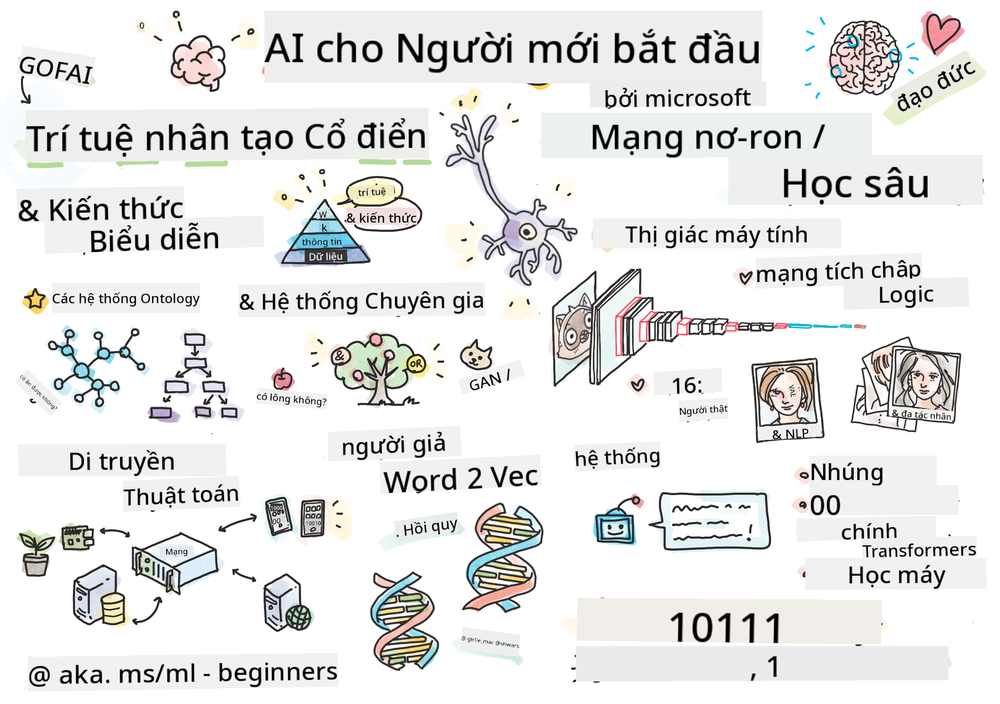

<!--
CO_OP_TRANSLATOR_METADATA:
{
  "original_hash": "14816e97d79b296c87811724f7785923",
  "translation_date": "2026-01-01T12:23:44+00:00",
  "source_file": "README.md",
  "language_code": "vi"
}
-->

# Trí Tuệ Nhân Tạo Cho Người Mới - Chương Trình Học

||
|:---:|
| AI For Beginners - _Sketchnote bởi [@girlie_mac](https://twitter.com/girlie_mac)_ |

Khám phá thế giới của **Artificial Intelligence** (AI) với chương trình học 12 tuần, 24 bài học của chúng tôi!  Nó bao gồm các bài học thực hành, bài kiểm tra và phòng thí nghiệm. Chương trình phù hợp cho người mới bắt đầu và bao quát các công cụ như TensorFlow và PyTorch, cũng như đạo đức trong AI

### 🌐 Hỗ trợ Đa Ngôn ngữ

#### Hỗ trợ qua GitHub Action (Tự động & Luôn Cập nhật)

<!-- CO-OP TRANSLATOR LANGUAGES TABLE START -->
[Tiếng Ả Rập](../ar/README.md) | [Tiếng Bengal](../bn/README.md) | [Tiếng Bulgaria](../bg/README.md) | [Tiếng Myanmar (Burmese)](../my/README.md) | [Tiếng Trung (Giản thể)](../zh/README.md) | [Tiếng Trung (Phồn thể, Hồng Kông)](../hk/README.md) | [Tiếng Trung (Phồn thể, Macau)](../mo/README.md) | [Tiếng Trung (Phồn thể, Đài Loan)](../tw/README.md) | [Tiếng Croatia](../hr/README.md) | [Tiếng Séc](../cs/README.md) | [Tiếng Đan Mạch](../da/README.md) | [Tiếng Hà Lan](../nl/README.md) | [Tiếng Estonia](../et/README.md) | [Tiếng Phần Lan](../fi/README.md) | [Tiếng Pháp](../fr/README.md) | [Tiếng Đức](../de/README.md) | [Tiếng Hy Lạp](../el/README.md) | [Tiếng Do Thái](../he/README.md) | [Tiếng Hindi](../hi/README.md) | [Tiếng Hungary](../hu/README.md) | [Tiếng Indonesia](../id/README.md) | [Tiếng Ý](../it/README.md) | [Tiếng Nhật](../ja/README.md) | [Tiếng Kannada](../kn/README.md) | [Tiếng Hàn](../ko/README.md) | [Tiếng Lithuania](../lt/README.md) | [Tiếng Mã Lai](../ms/README.md) | [Tiếng Malayalam](../ml/README.md) | [Tiếng Marathi](../mr/README.md) | [Tiếng Nepal](../ne/README.md) | [Tiếng Pidgin Nigeria](../pcm/README.md) | [Tiếng Na Uy](../no/README.md) | [Tiếng Ba Tư (Farsi)](../fa/README.md) | [Tiếng Ba Lan](../pl/README.md) | [Tiếng Bồ Đào Nha (Brazil)](../br/README.md) | [Tiếng Bồ Đào Nha (Portugal)](../pt/README.md) | [Tiếng Punjabi (Gurmukhi)](../pa/README.md) | [Tiếng Romania](../ro/README.md) | [Tiếng Nga](../ru/README.md) | [Tiếng Serbia (Cyrillic)](../sr/README.md) | [Tiếng Slovakia](../sk/README.md) | [Tiếng Slovenia](../sl/README.md) | [Tiếng Tây Ban Nha](../es/README.md) | [Tiếng Swahili](../sw/README.md) | [Tiếng Thụy Điển](../sv/README.md) | [Tiếng Tagalog (Filipino)](../tl/README.md) | [Tiếng Tamil](../ta/README.md) | [Tiếng Telugu](../te/README.md) | [Tiếng Thái](../th/README.md) | [Tiếng Thổ Nhĩ Kỳ](../tr/README.md) | [Tiếng Ukraina](../uk/README.md) | [Tiếng Urdu](../ur/README.md) | [Tiếng Việt](./README.md)
<!-- CO-OP TRANSLATOR LANGUAGES TABLE END -->

**If you wish to have additional translations languages supported are listed [here](https://github.com/Azure/co-op-translator/blob/main/getting_started/supported-languages.md)**

## Tham gia Cộng đồng

## Bạn sẽ học được gì

**[Sơ đồ tư duy của Khóa học](http://soshnikov.com/courses/ai-for-beginners/mindmap.html)**

Trong chương trình này, bạn sẽ học:

* Các phương pháp tiếp cận khác nhau đối với Trí tuệ Nhân tạo, bao gồm phương pháp ký hiệu "cũ tốt" với **Biểu diễn Tri thức** và suy luận ([GOFAI](https://en.wikipedia.org/wiki/Symbolic_artificial_intelligence)).
* **Mạng Nơ-ron** và **Học Sâu**, là cốt lõi của AI hiện đại. Chúng tôi sẽ minh họa các khái niệm đằng sau những chủ đề quan trọng này bằng mã trong hai framework phổ biến nhất - [TensorFlow](http://Tensorflow.org) và [PyTorch](http://pytorch.org).
* **Kiến trúc Nơ-ron** để làm việc với hình ảnh và văn bản. Chúng tôi sẽ đề cập đến các mô hình gần đây nhưng có thể hơi thiếu so với những gì là tiên tiến nhất.
* Các phương pháp AI ít phổ biến hơn, chẳng hạn như **Thuật toán Di truyền** và **Hệ thống Đa Tác nhân**.

Những gì chúng tôi sẽ không đề cập trong chương trình này:

> [Tìm tất cả tài nguyên bổ sung cho khóa học này trong bộ sưu tập Microsoft Learn của chúng tôi](https://learn.microsoft.com/en-us/collections/7w28iy2xrqzdj0?WT.mc_id=academic-77998-bethanycheum)

* Các trường hợp kinh doanh sử dụng **AI trong Kinh doanh**. Hãy cân nhắc tham gia lộ trình học [Giới thiệu về AI cho người dùng doanh nghiệp](https://docs.microsoft.com/learn/paths/introduction-ai-for-business-users/?WT.mc_id=academic-77998-bethanycheum) trên Microsoft Learn, hoặc [AI Business School](https://www.microsoft.com/ai/ai-business-school/?WT.mc_id=academic-77998-bethanycheum), được phát triển hợp tác với [INSEAD](https://www.insead.edu/).
* **Machine Learning Kinh điển**, được mô tả kỹ trong [Chương trình Machine Learning cho Người mới bắt đầu](http://github.com/Microsoft/ML-for-Beginners) của chúng tôi.
* Ứng dụng AI thực tiễn xây dựng bằng **[Cognitive Services](https://azure.microsoft.com/services/cognitive-services/?WT.mc_id=academic-77998-bethanycheum)**. Đối với điều này, chúng tôi khuyên bạn bắt đầu với các module Microsoft Learn cho [thị giác](https://docs.microsoft.com/learn/paths/create-computer-vision-solutions-azure-cognitive-services/?WT.mc_id=academic-77998-bethanycheum), [xử lý ngôn ngữ tự nhiên](https://docs.microsoft.com/learn/paths/explore-natural-language-processing/?WT.mc_id=academic-77998-bethanycheum), **[Generative AI with Azure OpenAI Service](https://learn.microsoft.com/en-us/training/paths/develop-ai-solutions-azure-openai/?WT.mc_id=academic-77998-bethanycheum)** và các chủ đề khác.
* Các **Framework Đám mây** ML cụ thể, chẳng hạn như [Azure Machine Learning](https://azure.microsoft.com/services/machine-learning/?WT.mc_id=academic-77998-bethanycheum), [Microsoft Fabric](https://learn.microsoft.com/en-us/training/paths/get-started-fabric/?WT.mc_id=academic-77998-bethanycheum), hoặc [Azure Databricks](https://docs.microsoft.com/learn/paths/data-engineer-azure-databricks?WT.mc_id=academic-77998-bethanycheum). Hãy cân nhắc sử dụng các lộ trình học [Build and operate machine learning solutions with Azure Machine Learning](https://docs.microsoft.com/learn/paths/build-ai-solutions-with-azure-ml-service/?WT.mc_id=academic-77998-bethanycheum) và [Build and Operate Machine Learning Solutions with Azure Databricks](https://docs.microsoft.com/learn/paths/build-operate-machine-learning-solutions-azure-databricks/?WT.mc_id=academic-77998-bethanycheum).
* **Conversational AI** và **Chat Bots**. Có một lộ trình học riêng [Create conversational AI solutions](https://docs.microsoft.com/learn/paths/create-conversational-ai-solutions/?WT.mc_id=academic-77998-bethanycheum), và bạn cũng có thể tham khảo [bài viết trên blog này](https://soshnikov.com/azure/hello-bot-conversational-ai-on-microsoft-platform/) để biết chi tiết hơn.
* **Toán học Sâu** đằng sau học sâu. Cho điều này, chúng tôi khuyên [Deep Learning](https://www.amazon.com/Deep-Learning-Adaptive-Computation-Machine/dp/0262035618) của Ian Goodfellow, Yoshua Bengio và Aaron Courville, cuốn sách cũng có sẵn trực tuyến tại [https://www.deeplearningbook.org/](https://www.deeplearningbook.org/).

Để có phần giới thiệu nhẹ nhàng về các chủ đề _AI trên Đám mây_ bạn có thể cân nhắc tham gia Lộ trình Học [Bắt đầu với trí tuệ nhân tạo trên Azure](https://docs.microsoft.com/learn/paths/get-started-with-artificial-intelligence-on-azure/?WT.mc_id=academic-77998-bethanycheum).

# Nội dung

|     |                                                                 Liên kết bài học                                                                  |                                           PyTorch/Keras/TensorFlow                                          | Lab                                                            |
| :-: | :------------------------------------------------------------------------------------------------------------------------------------------: | :---------------------------------------------------------------------------------------------: | ------------------------------------------------------------------------------ |
| 0  |                                 [Thiết lập Khóa học](./lessons/0-course-setup/setup.md)                                 |                      [Thiết lập Môi trường Phát triển của bạn](./lessons/0-course-setup/how-to-run.md)                       |   |
| I  |               [**Giới thiệu về AI**](./lessons/1-Intro/README.md)      | | |
| 01  |       [Giới thiệu và Lịch sử của AI](./lessons/1-Intro/README.md)       |           -                            | -  |
| II |              **AI Biểu tượng**              |
| 02  |       [Biểu diễn Tri thức và Hệ chuyên gia](./lessons/2-Symbolic/README.md)       |            [Hệ chuyên gia](./lessons/2-Symbolic/Animals.ipynb) /  [Bản thể học](./lessons/2-Symbolic/FamilyOntology.ipynb) /[Đồ thị Khái niệm](./lessons/2-Symbolic/MSConceptGraph.ipynb)                             |  |
| III |                        [**Giới thiệu về Mạng Nơ-ron**](./lessons/3-NeuralNetworks/README.md) |||
| 03  |                [Perceptron](./lessons/3-NeuralNetworks/03-Perceptron/README.md)                 |                       [Sổ ghi chép](./lessons/3-NeuralNetworks/03-Perceptron/Perceptron.ipynb)                      | [Bài Lab](./lessons/3-NeuralNetworks/03-Perceptron/lab/README.md) |
| 04  |                   [Perceptron nhiều lớp và Tạo framework riêng của chúng ta](./lessons/3-NeuralNetworks/04-OwnFramework/README.md)                   |        [Sổ ghi chép](./lessons/3-NeuralNetworks/04-OwnFramework/OwnFramework.ipynb)        | [Bài Lab](./lessons/3-NeuralNetworks/04-OwnFramework/lab/README.md) |
| 05  |            [Giới thiệu về Frameworks (PyTorch/TensorFlow) và Quá khớp](./lessons/3-NeuralNetworks/05-Frameworks/README.md)             |           [PyTorch](./lessons/3-NeuralNetworks/05-Frameworks/IntroPyTorch.ipynb) / [Keras](./lessons/3-NeuralNetworks/05-Frameworks/IntroKeras.ipynb) / [TensorFlow](./lessons/3-NeuralNetworks/05-Frameworks/IntroKerasTF.ipynb)             | [Bài Lab](./lessons/3-NeuralNetworks/05-Frameworks/lab/README.md) |
| IV  |            [**Thị giác máy tính**](./lessons/4-ComputerVision/README.md)             | [PyTorch](https://docs.microsoft.com/learn/modules/intro-computer-vision-pytorch/?WT.mc_id=academic-77998-cacaste) / [TensorFlow](https://docs.microsoft.com/learn/modules/intro-computer-vision-TensorFlow/?WT.mc_id=academic-77998-cacaste)| [Khám phá Thị giác Máy tính trên Microsoft Azure](https://learn.microsoft.com/en-us/collections/7w28iy2xrqzdj0?WT.mc_id=academic-77998-bethanycheum) |
| 06  |            [Giới thiệu về Thị giác Máy tính. OpenCV](./lessons/4-ComputerVision/06-IntroCV/README.md)             |           [Sổ ghi chép](./lessons/4-ComputerVision/06-IntroCV/OpenCV.ipynb)         | [Bài Lab](./lessons/4-ComputerVision/06-IntroCV/lab/README.md) |
| 07  |            [Mạng nơ-ron tích chập](./lessons/4-ComputerVision/07-ConvNets/README.md) &  [Kiến trúc CNN](./lessons/4-ComputerVision/07-ConvNets/CNN_Architectures.md)             |           [PyTorch](./lessons/4-ComputerVision/07-ConvNets/ConvNetsPyTorch.ipynb) /[TensorFlow](./lessons/4-ComputerVision/07-ConvNets/ConvNetsTF.ipynb)             | [Bài Lab](./lessons/4-ComputerVision/07-ConvNets/lab/README.md) |
| 08  |            [Mạng đã được huấn luyện trước và Học chuyển giao](./lessons/4-ComputerVision/08-TransferLearning/README.md) và [Mẹo huấn luyện](./lessons/4-ComputerVision/08-TransferLearning/TrainingTricks.md)             |           [PyTorch](./lessons/4-ComputerVision/08-TransferLearning/TransferLearningPyTorch.ipynb) / [TensorFlow](./lessons/3-NeuralNetworks/05-Frameworks/IntroKerasTF.ipynb)             | [Bài Lab](./lessons/4-ComputerVision/08-TransferLearning/lab/README.md) |
| 09  |            [Autoencoder và VAE](./lessons/4-ComputerVision/09-Autoencoders/README.md)             |           [PyTorch](./lessons/4-ComputerVision/09-Autoencoders/AutoEncodersPyTorch.ipynb) / [TensorFlow](./lessons/4-ComputerVision/09-Autoencoders/AutoencodersTF.ipynb)             |  |
| 10  |            [Mạng Tạo Sinh Đối Kháng và Chuyển đổi Phong cách Nghệ thuật](./lessons/4-ComputerVision/10-GANs/README.md)             |           [PyTorch](./lessons/4-ComputerVision/10-GANs/GANPyTorch.ipynb) / [TensorFlow](./lessons/4-ComputerVision/10-GANs/GANTF.ipynb)             |  |
| 11  |            [Phát hiện đối tượng](./lessons/4-ComputerVision/11-ObjectDetection/README.md)             |         [TensorFlow](./lessons/4-ComputerVision/11-ObjectDetection/ObjectDetection.ipynb)             | [Bài Lab](./lessons/4-ComputerVision/11-ObjectDetection/lab/README.md) |
| 12  |            [Phân đoạn ngữ nghĩa. U-Net](./lessons/4-ComputerVision/12-Segmentation/README.md)             |           [PyTorch](./lessons/4-ComputerVision/12-Segmentation/SemanticSegmentationPytorch.ipynb) / [TensorFlow](./lessons/4-ComputerVision/12-Segmentation/SemanticSegmentationTF.ipynb)             |  |
| V  |            [**Xử lý ngôn ngữ tự nhiên**](./lessons/5-NLP/README.md)             | [PyTorch](https://docs.microsoft.com/learn/modules/intro-natural-language-processing-pytorch/?WT.mc_id=academic-77998-cacaste) /[TensorFlow](https://docs.microsoft.com/learn/modules/intro-natural-language-processing-TensorFlow/?WT.mc_id=academic-77998-cacaste) | [Khám phá Xử lý Ngôn ngữ Tự nhiên trên Microsoft Azure](https://learn.microsoft.com/en-us/collections/7w28iy2xrqzdj0?WT.mc_id=academic-77998-bethanycheum)|
| 13  |            [Biểu diễn Văn bản. Bow/TF-IDF](./lessons/5-NLP/13-TextRep/README.md)             |           [PyTorch](https://github.com/microsoft/AI-For-Beginners/blob/main/lessons/5-NLP/13-TextRep/TextRepresentationPyTorch.ipynb) / [TensorFlow](https://github.com/microsoft/AI-For-Beginners/blob/main/lessons/5-NLP/13-TextRep/TextRepresentationTF.ipynb)             | |
| 14  |            [Nhúng từ ngữ nghĩa. Word2Vec và GloVe](./lessons/5-NLP/14-Embeddings/README.md)             |           [PyTorch](https://github.com/microsoft/AI-For-Beginners/blob/main/lessons/5-NLP/14-Embeddings/EmbeddingsPyTorch.ipynb) / [TensorFlow](https://github.com/microsoft/AI-For-Beginners/blob/main/lessons/5-NLP/14-Embeddings/EmbeddingsTF.ipynb)             |  |
| 15  |            [Mô hình ngôn ngữ. Huấn luyện nhúng của riêng bạn](./lessons/5-NLP/15-LanguageModeling/README.md)             |           [PyTorch](https://github.com/microsoft/AI-For-Beginners/blob/main/lessons/5-NLP/15-LanguageModeling/CBoW-PyTorch.ipynb) / [TensorFlow](https://github.com/microsoft/AI-For-Beginners/blob/main/lessons/5-NLP/15-LanguageModeling/CBoW-TF.ipynb)             | [Bài Lab](./lessons/5-NLP/15-LanguageModeling/lab/README.md) |
| 16  |            [Mạng nơ-ron hồi tiếp](./lessons/5-NLP/16-RNN/README.md)             |           [PyTorch](https://github.com/microsoft/AI-For-Beginners/blob/main/lessons/5-NLP/16-RNN/RNNPyTorch.ipynb) / [TensorFlow](https://github.com/microsoft/AI-For-Beginners/blob/main/lessons/5-NLP/16-RNN/RNNTF.ipynb)             |  |
| 17  |            [Mạng hồi tiếp sinh tạo](./lessons/5-NLP/17-GenerativeNetworks/README.md)             |           [PyTorch](https://github.com/microsoft/AI-For-Beginners/blob/main/lessons/5-NLP/17-GenerativeNetworks/GenerativePyTorch.ipynb) / [TensorFlow](https://github.com/microsoft/AI-For-Beginners/blob/main/lessons/5-NLP/17-GenerativeNetworks/GenerativeTF.ipynb)             | [Bài Lab](./lessons/5-NLP/17-GenerativeNetworks/lab/README.md) |
| 18  |            [Transformers. BERT.](./lessons/5-NLP/18-Transformers/README.md)             |           [PyTorch](https://github.com/microsoft/AI-For-Beginners/blob/main/lessons/5-NLP/18-Transformers/TransformersPyTorch.ipynb) /[TensorFlow](https://github.com/microsoft/AI-For-Beginners/blob/main/lessons/5-NLP/18-Transformers/TransformersTF.ipynb)             |  |
| 19  |            [Nhận dạng thực thể có tên](./lessons/5-NLP/19-NER/README.md)             |           [TensorFlow](https://microsoft.github.io/AI-For-Beginners/lessons/5-NLP/19-NER/NER-TF.ipynb)             | [Bài Lab](./lessons/5-NLP/19-NER/lab/README.md) |
| 20  |            [Mô hình ngôn ngữ lớn, Lập trình prompt và tác vụ few-shot](./lessons/5-NLP/20-LangModels/README.md)             |           [PyTorch](https://microsoft.github.io/AI-For-Beginners/lessons/5-NLP/20-LangModels/GPT-PyTorch.ipynb) | |
| VI |            **Các kỹ thuật AI khác** || |
| 21  |            [Thuật toán di truyền](./lessons/6-Other/21-GeneticAlgorithms/README.md)             |           [Sổ ghi chép](./lessons/6-Other/21-GeneticAlgorithms/Genetic.ipynb) | |
| 22  |            [Học tăng cường sâu](./lessons/6-Other/22-DeepRL/README.md)             |           [PyTorch](./lessons/6-Other/22-DeepRL/CartPole-RL-PyTorch.ipynb) /[TensorFlow](./lessons/6-Other/22-DeepRL/CartPole-RL-TF.ipynb)             | [Bài Lab](./lessons/6-Other/22-DeepRL/lab/README.md) |
| 23  |            [Hệ thống đa tác nhân](./lessons/6-Other/23-MultiagentSystems/README.md)             |  | |
| VII |            **Đạo đức AI** | | |
| 24  |            [Đạo đức AI và Trách nhiệm trong AI](./lessons/7-Ethics/README.md)             |           [Microsoft Learn: Nguyên tắc AI có trách nhiệm](https://docs.microsoft.com/learn/paths/responsible-ai-business-principles/?WT.mc_id=academic-77998-cacaste) | |
| IX  |            **Phần bổ sung** | | |
| 25  |            [Mạng đa phương thức, CLIP và VQGAN](./lessons/X-Extras/X1-MultiModal/README.md)             |           [Sổ ghi chép](./lessons/X-Extras/X1-MultiModal/Clip.ipynb)    | |

## Mỗi bài học bao gồm

* Tài liệu đọc trước
* Các Sổ ghi chép Jupyter có thể thực thi, thường là dành riêng cho framework (**PyTorch** hoặc **TensorFlow**). Sổ ghi chép có thể thực thi cũng chứa nhiều nội dung lý thuyết, vì vậy để hiểu chủ đề bạn cần xem qua ít nhất một phiên bản của sổ ghi chép (hoặc PyTorch hoặc TensorFlow).
* **Labs** có sẵn cho một số chủ đề, cho bạn cơ hội thử áp dụng những gì bạn đã học vào một vấn đề cụ thể.
* Một số phần chứa liên kết đến [**MS Learn**](https://learn.microsoft.com/en-us/collections/7w28iy2xrqzdj0?WT.mc_id=academic-77998-bethanycheum) các module bao gồm các chủ đề liên quan.

## Bắt đầu

### 🎯 Mới với AI? Bắt đầu tại đây!

Nếu bạn hoàn toàn mới với AI và muốn các ví dụ thực hành nhanh chóng, hãy xem [**Ví dụ Dành cho Người mới bắt đầu**](./examples/README.md)! Chúng bao gồm:

- 🌟 **Hello AI World** - Chương trình AI đầu tiên của bạn (nhận dạng mẫu)
- 🧠 **Mạng nơ-ron đơn giản** - Xây dựng một mạng nơ-ron từ đầu  
- 🖼️ **Bộ phân loại ảnh** - Phân loại hình ảnh với chú thích chi tiết
- 💬 **Cảm xúc văn bản** - Phân tích văn bản tích cực/tiêu cực

These examples are designed to help you understand AI concepts before diving into the full curriculum.

### 📚 Thiết lập Toàn bộ Chương trình học

- We have created a [bài học thiết lập](./lessons/0-course-setup/setup.md) to help you with setting up your development environment. - Dành cho giáo viên, we have created a [bài học thiết lập chương trình học](./lessons/0-course-setup/for-teachers.md) for you too!
- How to [Chạy mã trong VSCode hoặc a Codepace](./lessons/0-course-setup/how-to-run.md)

Follow these steps:

Fork the Repository: Click on the "Fork" button at the top-right corner of this page.

Clone the Repository: `git clone https://github.com/microsoft/AI-For-Beginners.git`

Don't forget to star (🌟) this repo to find it easier later.

## Gặp gỡ những người học khác

Join our [máy chủ Discord chính thức về AI](https://aka.ms/genai-discord?WT.mc_id=academic-105485-bethanycheum) to meet and network with other learners taking this course and get support.

If you have product feedback or questions whilst building visit our [Diễn đàn Nhà phát triển Azure AI Foundry](https://aka.ms/foundry/forum)

## Quizzes 

> **Một ghi chú về các bài kiểm tra**: Tất cả các bài kiểm tra nằm trong thư mục Quiz-app tại etc\quiz-app, hoặc [Trực tuyến tại đây](https://ff-quizzes.netlify.app/) They are linked from within the lessons the quiz app can be run locally or deployed to Azure; follow the instruction in the `quiz-app` folder. They are gradually being localized.

## Cần giúp đỡ

Do you have suggestions or found spelling or code errors? Raise an issue or create a pull request.

## Lời cảm ơn đặc biệt

* **✍️ Tác giả chính:** [Dmitry Soshnikov](http://soshnikov.com), PhD
* **🔥 Biên tập:** [Jen Looper](https://twitter.com/jenlooper), PhD
* **🎨 Minh họa sketchnote:** [Tomomi Imura](https://twitter.com/girlie_mac)
* **✅ Người tạo quiz:** [Lateefah Bello](https://github.com/CinnamonXI), [MLSA](https://studentambassadors.microsoft.com/)
* **🙏 Cộng tác viên chính:** [Evgenii Pishchik](https://github.com/Pe4enIks)

## Các chương trình học khác

Our team produces other curricula! Check out:

<!-- CO-OP TRANSLATOR OTHER COURSES START -->
### LangChain

---

### Azure / Edge / MCP / Agents

---
 
### Chuỗi AI Tạo Sinh

[-9333EA?style=for-the-badge&labelColor=E5E7EB&color=9333EA)](https://github.com/microsoft/Generative-AI-for-beginners-dotnet?WT.mc_id=academic-105485-koreyst)
[-C084FC?style=for-the-badge&labelColor=E5E7EB&color=C084FC)](https://github.com/microsoft/generative-ai-for-beginners-java?WT.mc_id=academic-105485-koreyst)
[-E879F9?style=for-the-badge&labelColor=E5E7EB&color=E879F9)](https://github.com/microsoft/generative-ai-with-javascript?WT.mc_id=academic-105485-koreyst)

---
 
### Học cốt lõi

---
 
### Chuỗi Copilot

<!-- CO-OP TRANSLATOR OTHER COURSES END -->

## Nhận trợ giúp

If you get stuck or have any questions about building AI apps. Join fellow learners and experienced developers in discussions about MCP. It's a supportive community where questions are welcome and knowledge is shared freely.

If you have product feedback or errors while building visit:

---

<!-- CO-OP TRANSLATOR DISCLAIMER START -->
Miễn trừ trách nhiệm:
Tài liệu này đã được dịch bằng dịch vụ dịch thuật AI Co-op Translator (https://github.com/Azure/co-op-translator). Mặc dù chúng tôi nỗ lực để đảm bảo độ chính xác, xin lưu ý rằng các bản dịch tự động có thể chứa lỗi hoặc không chính xác. Tài liệu gốc bằng ngôn ngữ gốc của nó nên được coi là nguồn chính thức. Đối với những thông tin quan trọng, nên sử dụng dịch vụ dịch thuật chuyên nghiệp do con người thực hiện. Chúng tôi không chịu trách nhiệm về bất kỳ hiểu nhầm hoặc giải thích sai nào phát sinh từ việc sử dụng bản dịch này.
<!-- CO-OP TRANSLATOR DISCLAIMER END -->