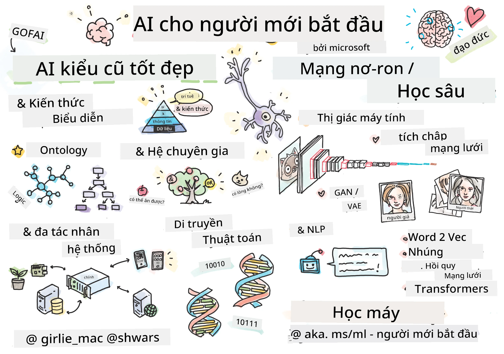

[](https://github.com/microsoft/AI-For-Beginners/blob/main/LICENSE)
[](https://GitHub.com/microsoft/AI-For-Beginners/graphs/contributors/)
[](https://GitHub.com/microsoft/AI-For-Beginners/issues/)
[](https://GitHub.com/microsoft/AI-For-Beginners/pulls/)
[](http://makeapullrequest.com)

[](https://GitHub.com/microsoft/AI-For-Beginners/watchers/)
[](https://GitHub.com/microsoft/AI-For-Beginners/network/)
[](https://GitHub.com/microsoft/AI-For-Beginners/stargazers/)
[](https://mybinder.org/v2/gh/microsoft/ai-for-beginners/HEAD)
[](https://gitter.im/Microsoft/ai-for-beginners?utm_source=badge&utm_medium=badge&utm_campaign=pr-badge)

[](https://discord.gg/nTYy5BXMWG)

# Trí Tuệ Nhân Tạo cho Người Mới Bắt Đầu - Chương Trình Học

||
|:---:|
| AI For Beginners - _Sketchnote bởi [@girlie_mac](https://twitter.com/girlie_mac)_ |

Khám phá thế giới của **Trí Tuệ Nhân Tạo** (AI) với chương trình học 12 tuần, 24 bài học! Bao gồm các bài học thực hành, câu đố và phòng lab. Chương trình học thân thiện với người mới bắt đầu và bao gồm các công cụ như TensorFlow và PyTorch, cũng như đạo đức trong AI


### 🌐 Hỗ Trợ Đa Ngôn Ngữ

#### Hỗ trợ qua GitHub Action (Tự động & Luôn Cập Nhật)

<!-- CO-OP TRANSLATOR LANGUAGES TABLE START -->
[Tiếng Ả Rập](../ar/README.md) | [Tiếng Bengal](../bn/README.md) | [Tiếng Bulgaria](../bg/README.md) | [Tiếng Miến Điện (Myanmar)](../my/README.md) | [Tiếng Trung (Giản thể)](../zh-CN/README.md) | [Tiếng Trung (Phồn thể, Hồng Kông)](../zh-HK/README.md) | [Tiếng Trung (Phồn thể, Macau)](../zh-MO/README.md) | [Tiếng Trung (Phồn thể, Đài Loan)](../zh-TW/README.md) | [Tiếng Croatia](../hr/README.md) | [Tiếng Séc](../cs/README.md) | [Tiếng Đan Mạch](../da/README.md) | [Tiếng Hà Lan](../nl/README.md) | [Tiếng Estonia](../et/README.md) | [Tiếng Phần Lan](../fi/README.md) | [Tiếng Pháp](../fr/README.md) | [Tiếng Đức](../de/README.md) | [Tiếng Hy Lạp](../el/README.md) | [Tiếng Hebrew](../he/README.md) | [Tiếng Hindi](../hi/README.md) | [Tiếng Hungary](../hu/README.md) | [Tiếng Indonesia](../id/README.md) | [Tiếng Ý](../it/README.md) | [Tiếng Nhật](../ja/README.md) | [Tiếng Kannada](../kn/README.md) | [Tiếng Hàn](../ko/README.md) | [Tiếng Lithuania](../lt/README.md) | [Tiếng Malay](../ms/README.md) | [Tiếng Malayalam](../ml/README.md) | [Tiếng Marathi](../mr/README.md) | [Tiếng Nepal](../ne/README.md) | [Tiếng Pidgin Nigeria](../pcm/README.md) | [Tiếng Na Uy](../no/README.md) | [Tiếng Ba Tư (Farsi)](../fa/README.md) | [Tiếng Ba Lan](../pl/README.md) | [Tiếng Bồ Đào Nha (Brazil)](../pt-BR/README.md) | [Tiếng Bồ Đào Nha (Bồ Đào Nha)](../pt-PT/README.md) | [Tiếng Punjab (Gurmukhi)](../pa/README.md) | [Tiếng Romania](../ro/README.md) | [Tiếng Nga](../ru/README.md) | [Tiếng Serbia (Chữ Kirin)](../sr/README.md) | [Tiếng Slovakia](../sk/README.md) | [Tiếng Slovenia](../sl/README.md) | [Tiếng Tây Ban Nha](../es/README.md) | [Tiếng Swahili](../sw/README.md) | [Tiếng Thụy Điển](../sv/README.md) | [Tiếng Tagalog (Filipino)](../tl/README.md) | [Tiếng Tamil](../ta/README.md) | [Tiếng Telugu](../te/README.md) | [Tiếng Thái](../th/README.md) | [Tiếng Thổ Nhĩ Kỳ](../tr/README.md) | [Tiếng Ukraina](../uk/README.md) | [Tiếng Urdu](../ur/README.md) | [Tiếng Việt](./README.md)

> **Ưu tiên Sao Chép Cục Bộ?**

> Kho lưu trữ này bao gồm hơn 50 bản dịch ngôn ngữ, điều này làm tăng đáng kể kích thước tải xuống. Để sao chép mà không có bản dịch, sử dụng sparse checkout:
> ```bash
> git clone --filter=blob:none --sparse https://github.com/microsoft/AI-For-Beginners.git
> cd AI-For-Beginners
> git sparse-checkout set --no-cone '/*' '!translations' '!translated_images'
> ```
> Điều này cung cấp cho bạn tất cả những gì cần thiết để hoàn thành khóa học với tốc độ tải xuống nhanh hơn nhiều.
<!-- CO-OP TRANSLATOR LANGUAGES TABLE END -->

**Nếu bạn muốn có thêm các ngôn ngữ dịch được hỗ trợ, danh sách có tại [đây](https://github.com/Azure/co-op-translator/blob/main/getting_started/supported-languages.md)**

## Tham gia Cộng đồng
[](https://discord.gg/nTYy5BXMWG)

## Bạn sẽ học được gì

**[Sơ đồ tư duy của khóa học](http://soshnikov.com/courses/ai-for-beginners/mindmap.html)**

Trong chương trình học này, bạn sẽ học:

* Các phương pháp tiếp cận khác nhau đối với Trí Tuệ Nhân Tạo, bao gồm phương pháp biểu tượng "cổ điển" với **Biểu diễn Kiến thức** và suy luận ([GOFAI](https://en.wikipedia.org/wiki/Symbolic_artificial_intelligence)).
* **Mạng Nơ-ron** và **Học Sâu**, là cốt lõi của AI hiện đại. Chúng tôi sẽ minh họa các khái niệm đằng sau các chủ đề quan trọng này bằng mã trong hai khung phổ biến nhất - [TensorFlow](http://Tensorflow.org) và [PyTorch](http://pytorch.org).
* **Kiến Trúc Nơ-ron** cho làm việc với hình ảnh và văn bản. Chúng tôi sẽ đề cập các mô hình mới đây nhưng có thể thiếu một chút về trạng thái nghệ thuật hiện tại.
* Các phương pháp AI ít phổ biến hơn, như **Thuật Toán Di Truyền** và **Hệ Thống Đa Tác Nhân**.

Những gì chúng tôi sẽ không đề cập trong chương trình này:

> [Tìm tất cả tài nguyên bổ sung cho khóa học này trong bộ sưu tập Microsoft Learn của chúng tôi](https://learn.microsoft.com/en-us/collections/7w28iy2xrqzdj0?WT.mc_id=academic-77998-bethanycheum)

* Các trường hợp kinh doanh sử dụng **AI trong Kinh doanh**. Hãy xem xét tham gia con đường học [Giới thiệu về AI cho người dùng doanh nghiệp](https://docs.microsoft.com/learn/paths/introduction-ai-for-business-users/?WT.mc_id=academic-77998-bethanycheum) trên Microsoft Learn, hoặc [Trường Kinh doanh AI](https://www.microsoft.com/ai/ai-business-school/?WT.mc_id=academic-77998-bethanycheum), phát triển hợp tác với [INSEAD](https://www.insead.edu/).
* **Học Máy Cổ Điển**, được mô tả rõ trong chương trình học [Học Máy cho Người Mới Bắt Đầu](http://github.com/Microsoft/ML-for-Beginners).
* Các ứng dụng AI thực tế xây dựng bằng **[Dịch vụ Nhận thức](https://azure.microsoft.com/services/cognitive-services/?WT.mc_id=academic-77998-bethanycheum)**. Để làm điều này, chúng tôi khuyến nghị bạn bắt đầu với các module Microsoft Learn cho [thị giác](https://docs.microsoft.com/learn/paths/create-computer-vision-solutions-azure-cognitive-services/?WT.mc_id=academic-77998-bethanycheum), [xử lý ngôn ngữ tự nhiên](https://docs.microsoft.com/learn/paths/explore-natural-language-processing/?WT.mc_id=academic-77998-bethanycheum), **[AI Sinh Tạo với Dịch vụ Azure OpenAI](https://learn.microsoft.com/en-us/training/paths/develop-ai-solutions-azure-openai/?WT.mc_id=academic-77998-bethanycheum)** và các module khác.
* Các **Khung Đám Mây** ML cụ thể, như [Azure Machine Learning](https://azure.microsoft.com/services/machine-learning/?WT.mc_id=academic-77998-bethanycheum), [Microsoft Fabric](https://learn.microsoft.com/en-us/training/paths/get-started-fabric/?WT.mc_id=academic-77998-bethanycheum), hoặc [Azure Databricks](https://docs.microsoft.com/learn/paths/data-engineer-azure-databricks?WT.mc_id=academic-77998-bethanycheum). Xem xét sử dụng các con đường học [Xây dựng và vận hành giải pháp học máy với Azure ML](https://docs.microsoft.com/learn/paths/build-ai-solutions-with-azure-ml-service/?WT.mc_id=academic-77998-bethanycheum) và [Xây dựng và vận hành giải pháp học máy với Azure Databricks](https://docs.microsoft.com/learn/paths/build-operate-machine-learning-solutions-azure-databricks/?WT.mc_id=academic-77998-bethanycheum).
* **AI Đàm Thoại** và **Chat Bot**. Có con đường học riêng [Tạo giải pháp AI đàm thoại](https://docs.microsoft.com/learn/paths/create-conversational-ai-solutions/?WT.mc_id=academic-77998-bethanycheum), và bạn cũng có thể tham khảo [bài đăng blog này](https://soshnikov.com/azure/hello-bot-conversational-ai-on-microsoft-platform/) để biết thêm chi tiết.
* **Toán Học Sâu** đằng sau học sâu. Để làm điều này, chúng tôi khuyến nghị [Học sâu](https://www.amazon.com/Deep-Learning-Adaptive-Computation-Machine/dp/0262035618) của Ian Goodfellow, Yoshua Bengio và Aaron Courville, cũng có sẵn trực tuyến tại [https://www.deeplearningbook.org/](https://www.deeplearningbook.org/).

Để có giới thiệu nhẹ nhàng về các chủ đề _AI trên Đám Mây_, bạn có thể cân nhắc tham gia Đường dẫn Học tập [Bắt đầu với trí tuệ nhân tạo trên Azure](https://docs.microsoft.com/learn/paths/get-started-with-artificial-intelligence-on-azure/?WT.mc_id=academic-77998-bethanycheum).

# Nội dung

|     |                                                                 Liên kết Bài học                                                                  |                                           PyTorch/Keras/TensorFlow                                          | Phòng Lab                                                            |
| :-: | :------------------------------------------------------------------------------------------------------------------------------------------: | :---------------------------------------------------------------------------------------------: | ------------------------------------------------------------------------------ |
| 0  |                                 [Thiết lập Khóa học](./lessons/0-course-setup/setup.md)                                 |                      [Thiết lập Môi trường Phát triển Của Bạn](./lessons/0-course-setup/how-to-run.md)                       |   |
| I  |               [**Giới thiệu về AI**](./lessons/1-Intro/README.md)      | | |
| 01  |       [Giới thiệu và Lịch sử AI](./lessons/1-Intro/README.md)       |           -                            | -  |
| II |              **AI Biểu Tượng**              |
| 02  |       [Biểu diễn Kiến thức và Hệ Thống Chuyên Gia](./lessons/2-Symbolic/README.md)       |            [Hệ Thống Chuyên Gia](./lessons/2-Symbolic/Animals.ipynb) /  [Ontology](./lessons/2-Symbolic/FamilyOntology.ipynb) /[Biểu đồ Khái niệm](./lessons/2-Symbolic/MSConceptGraph.ipynb)                             |  |
| III |                        [**Giới thiệu về Mạng Nơ-ron**](./lessons/3-NeuralNetworks/README.md) |||
| 03  |                [Perceptron](./lessons/3-NeuralNetworks/03-Perceptron/README.md)                 |                       [Sổ tay](./lessons/3-NeuralNetworks/03-Perceptron/Perceptron.ipynb)                      | [Thực hành](./lessons/3-NeuralNetworks/03-Perceptron/lab/README.md) |
| 04  |                   [Perceptron Đa Lớp và Tạo Khung Công tác của Riêng chúng ta](./lessons/3-NeuralNetworks/04-OwnFramework/README.md)                   |        [Sổ tay](./lessons/3-NeuralNetworks/04-OwnFramework/OwnFramework.ipynb)        | [Thực hành](./lessons/3-NeuralNetworks/04-OwnFramework/lab/README.md) |
| 05  |            [Giới thiệu về Khung công tác (PyTorch/TensorFlow) và Quá khớp](./lessons/3-NeuralNetworks/05-Frameworks/README.md)             |           [PyTorch](./lessons/3-NeuralNetworks/05-Frameworks/IntroPyTorch.ipynb) / [Keras](./lessons/3-NeuralNetworks/05-Frameworks/IntroKeras.ipynb) / [TensorFlow](./lessons/3-NeuralNetworks/05-Frameworks/IntroKerasTF.ipynb)             | [Thực hành](./lessons/3-NeuralNetworks/05-Frameworks/lab/README.md) |
| IV  |            [**Thị giác Máy tính**](./lessons/4-ComputerVision/README.md)             | [PyTorch](https://docs.microsoft.com/learn/modules/intro-computer-vision-pytorch/?WT.mc_id=academic-77998-cacaste) / [TensorFlow](https://docs.microsoft.com/learn/modules/intro-computer-vision-TensorFlow/?WT.mc_id=academic-77998-cacaste)| [Khám phá Thị giác Máy tính trên Microsoft Azure](https://learn.microsoft.com/en-us/collections/7w28iy2xrqzdj0?WT.mc_id=academic-77998-bethanycheum) |
| 06  |            [Giới thiệu về Thị giác Máy tính. OpenCV](./lessons/4-ComputerVision/06-IntroCV/README.md)             |           [Sổ tay](./lessons/4-ComputerVision/06-IntroCV/OpenCV.ipynb)         | [Thực hành](./lessons/4-ComputerVision/06-IntroCV/lab/README.md) |
| 07  |            [Mạng Nơ-ron Tích chập](./lessons/4-ComputerVision/07-ConvNets/README.md) &  [Kiến trúc CNN](./lessons/4-ComputerVision/07-ConvNets/CNN_Architectures.md)             |           [PyTorch](./lessons/4-ComputerVision/07-ConvNets/ConvNetsPyTorch.ipynb) /[TensorFlow](./lessons/4-ComputerVision/07-ConvNets/ConvNetsTF.ipynb)             | [Thực hành](./lessons/4-ComputerVision/07-ConvNets/lab/README.md) |
| 08  |            [Mạng đã huấn luyện sẵn và Học chuyển giao](./lessons/4-ComputerVision/08-TransferLearning/README.md) và [Mẹo huấn luyện](./lessons/4-ComputerVision/08-TransferLearning/TrainingTricks.md)             |           [PyTorch](./lessons/4-ComputerVision/08-TransferLearning/TransferLearningPyTorch.ipynb) / [TensorFlow](./lessons/3-NeuralNetworks/05-Frameworks/IntroKerasTF.ipynb)             | [Thực hành](./lessons/4-ComputerVision/08-TransferLearning/lab/README.md) |
| 09  |            [Autoencoders và VAEs](./lessons/4-ComputerVision/09-Autoencoders/README.md)             |           [PyTorch](./lessons/4-ComputerVision/09-Autoencoders/AutoEncodersPyTorch.ipynb) / [TensorFlow](./lessons/4-ComputerVision/09-Autoencoders/AutoencodersTF.ipynb)             |  |
| 10  |            [Mạng Đối Kháng Sinh Tạo & Chuyển giao Phong cách Nghệ thuật](./lessons/4-ComputerVision/10-GANs/README.md)             |           [PyTorch](./lessons/4-ComputerVision/10-GANs/GANPyTorch.ipynb) / [TensorFlow](./lessons/4-ComputerVision/10-GANs/GANTF.ipynb)             |  |
| 11  |            [Phát hiện Đối tượng](./lessons/4-ComputerVision/11-ObjectDetection/README.md)             |         [TensorFlow](./lessons/4-ComputerVision/11-ObjectDetection/ObjectDetection.ipynb)             | [Thực hành](./lessons/4-ComputerVision/11-ObjectDetection/lab/README.md) |
| 12  |            [Phân đoạn Ngữ nghĩa. U-Net](./lessons/4-ComputerVision/12-Segmentation/README.md)             |           [PyTorch](./lessons/4-ComputerVision/12-Segmentation/SemanticSegmentationPytorch.ipynb) / [TensorFlow](./lessons/4-ComputerVision/12-Segmentation/SemanticSegmentationTF.ipynb)             |  |
| V  |            [**Xử lý Ngôn ngữ Tự nhiên**](./lessons/5-NLP/README.md)             | [PyTorch](https://docs.microsoft.com/learn/modules/intro-natural-language-processing-pytorch/?WT.mc_id=academic-77998-cacaste) /[TensorFlow](https://docs.microsoft.com/learn/modules/intro-natural-language-processing-TensorFlow/?WT.mc_id=academic-77998-cacaste) | [Khám phá Xử lý Ngôn ngữ Tự nhiên trên Microsoft Azure](https://learn.microsoft.com/en-us/collections/7w28iy2xrqzdj0?WT.mc_id=academic-77998-bethanycheum)|
| 13  |            [Biểu diễn Văn bản. Bow/TF-IDF](./lessons/5-NLP/13-TextRep/README.md)             |           [PyTorch](https://github.com/microsoft/AI-For-Beginners/blob/main/lessons/5-NLP/13-TextRep/TextRepresentationPyTorch.ipynb) / [TensorFlow](https://github.com/microsoft/AI-For-Beginners/blob/main/lessons/5-NLP/13-TextRep/TextRepresentationTF.ipynb)             | |
| 14  |            [Nhúng từ ngữ ngữ nghĩa. Word2Vec và GloVe](./lessons/5-NLP/14-Embeddings/README.md)             |           [PyTorch](https://github.com/microsoft/AI-For-Beginners/blob/main/lessons/5-NLP/14-Embeddings/EmbeddingsPyTorch.ipynb) / [TensorFlow](https://github.com/microsoft/AI-For-Beginners/blob/main/lessons/5-NLP/14-Embeddings/EmbeddingsTF.ipynb)             |  |
| 15  |            [Mô hình Ngôn ngữ. Huấn luyện nhúng riêng của bạn](./lessons/5-NLP/15-LanguageModeling/README.md)             |           [PyTorch](https://github.com/microsoft/AI-For-Beginners/blob/main/lessons/5-NLP/15-LanguageModeling/CBoW-PyTorch.ipynb) / [TensorFlow](https://github.com/microsoft/AI-For-Beginners/blob/main/lessons/5-NLP/15-LanguageModeling/CBoW-TF.ipynb)             | [Thực hành](./lessons/5-NLP/15-LanguageModeling/lab/README.md) |
| 16  |            [Mạng Nơ-ron Hồi tiếp](./lessons/5-NLP/16-RNN/README.md)             |           [PyTorch](https://github.com/microsoft/AI-For-Beginners/blob/main/lessons/5-NLP/16-RNN/RNNPyTorch.ipynb) / [TensorFlow](https://github.com/microsoft/AI-For-Beginners/blob/main/lessons/5-NLP/16-RNN/RNNTF.ipynb)             |  |
| 17  |            [Mạng Hồi tiếp Sinh tạo](./lessons/5-NLP/17-GenerativeNetworks/README.md)             |           [PyTorch](https://github.com/microsoft/AI-For-Beginners/blob/main/lessons/5-NLP/17-GenerativeNetworks/GenerativePyTorch.ipynb) / [TensorFlow](https://github.com/microsoft/AI-For-Beginners/blob/main/lessons/5-NLP/17-GenerativeNetworks/GenerativeTF.ipynb)             | [Thực hành](./lessons/5-NLP/17-GenerativeNetworks/lab/README.md) |
| 18  |            [Transformers. BERT.](./lessons/5-NLP/18-Transformers/README.md)             |           [PyTorch](https://github.com/microsoft/AI-For-Beginners/blob/main/lessons/5-NLP/18-Transformers/TransformersPyTorch.ipynb) /[TensorFlow](https://github.com/microsoft/AI-For-Beginners/blob/main/lessons/5-NLP/18-Transformers/TransformersTF.ipynb)             |  |
| 19  |            [Nhận dạng Thực thể có tên](./lessons/5-NLP/19-NER/README.md)             |           [TensorFlow](https://microsoft.github.io/AI-For-Beginners/lessons/5-NLP/19-NER/NER-TF.ipynb)             | [Thực hành](./lessons/5-NLP/19-NER/lab/README.md) |
| 20  |            [Mô hình Ngôn ngữ Lớn, Lập trình Lời nhắc và Nhiệm vụ Few-Shot](./lessons/5-NLP/20-LangModels/README.md)             |           [PyTorch](https://microsoft.github.io/AI-For-Beginners/lessons/5-NLP/20-LangModels/GPT-PyTorch.ipynb) | |
| VI |            **Kỹ thuật AI Khác** || |
| 21  |            [Thuật toán Di truyền](./lessons/6-Other/21-GeneticAlgorithms/README.md)             |           [Sổ tay](./lessons/6-Other/21-GeneticAlgorithms/Genetic.ipynb) | |
| 22  |            [Học Tăng cường Sâu](./lessons/6-Other/22-DeepRL/README.md)             |           [PyTorch](./lessons/6-Other/22-DeepRL/CartPole-RL-PyTorch.ipynb) /[TensorFlow](./lessons/6-Other/22-DeepRL/CartPole-RL-TF.ipynb)             | [Thực hành](./lessons/6-Other/22-DeepRL/lab/README.md) |
| 23  |            [Hệ thống Đa tác nhân](./lessons/6-Other/23-MultiagentSystems/README.md)             |  | |
| VII |            **Đạo đức AI** | | |
| 24  |            [Đạo đức AI và AI có Trách nhiệm](./lessons/7-Ethics/README.md)             |           [Microsoft Learn: Nguyên tắc AI có Trách nhiệm](https://docs.microsoft.com/learn/paths/responsible-ai-business-principles/?WT.mc_id=academic-77998-cacaste) | |
| IX  |            **Phần thêm** | | |
| 25  |            [Mạng Đa phương thức, CLIP và VQGAN](./lessons/X-Extras/X1-MultiModal/README.md)             |           [Sổ tay](./lessons/X-Extras/X1-MultiModal/Clip.ipynb)    | |

## Mỗi bài học bao gồm

* Tài liệu đọc trước
* Các Jupyter Notebooks có thể chạy được, thường đặc thù cho khung công tác (**PyTorch** hoặc **TensorFlow**). Sổ tay có thể chạy cũng chứa nhiều tài liệu lý thuyết, do đó để hiểu chủ đề bạn cần làm quen ít nhất một phiên bản của sổ tay (PyTorch hoặc TensorFlow).
* **Các phòng thí nghiệm** có sẵn cho một số chủ đề, giúp bạn có cơ hội thử áp dụng tài liệu đã học vào một vấn đề cụ thể.
* Một số phần chứa các liên kết đến các module [**MS Learn**](https://learn.microsoft.com/en-us/collections/7w28iy2xrqzdj0?WT.mc_id=academic-77998-bethanycheum) liên quan.

## Bắt đầu

### 🎯 Mới với AI? Bắt đầu Tại đây!

Nếu bạn hoàn toàn mới với AI và muốn có những ví dụ thực hành nhanh, hãy xem [**Ví dụ dành cho Người mới bắt đầu**](./examples/README.md)! Bao gồm:

- 🌟 **Hello AI World** - Chương trình AI đầu tiên của bạn (nhận dạng mẫu)
- 🧠 **Mạng Nơ-ron Đơn giản** - Xây dựng một mạng nơ-ron từ đầu  

- 🖼️ **Phân loại Hình ảnh** - Phân loại hình ảnh với các chú thích chi tiết
- 💬 **Phân tích Cảm xúc Văn bản** - Phân tích văn bản tích cực/tiêu cực

Các ví dụ này được thiết kế để giúp bạn hiểu các khái niệm AI trước khi đi sâu vào toàn bộ chương trình học.

### 📚 Thiết lập Toàn bộ Chương trình

- Chúng tôi đã tạo một [bài học thiết lập](./lessons/0-course-setup/setup.md) để giúp bạn thiết lập môi trường phát triển của mình.
- Đối với các Nhà giáo dục, chúng tôi cũng đã tạo một [bài học thiết lập chương trình học](./lessons/0-course-setup/for-teachers.md) dành cho bạn!
- Cách [Chạy mã trên VSCode hoặc Codespace](./lessons/0-course-setup/how-to-run.md)

Hãy làm theo các bước sau:

Fork Repository: Nhấn nút "Fork" ở góc trên bên phải của trang này.

Clone Repository: `git clone https://github.com/microsoft/AI-For-Beginners.git`

Đừng quên đánh dấu (🌟) repo này để dễ tìm lại sau.

## Gặp gỡ các Học viên khác

Tham gia [máy chủ Discord AI chính thức của chúng tôi](https://aka.ms/genai-discord?WT.mc_id=academic-105485-bethanycheum) để gặp gỡ và kết nối với các học viên khác đang tham gia khóa học này và nhận sự hỗ trợ.

Nếu bạn có phản hồi sản phẩm hoặc câu hỏi trong quá trình xây dựng, hãy truy cập [Diễn đàn Nhà phát triển Azure AI Foundry của chúng tôi](https://aka.ms/foundry/forum)

## Bài Kiểm Tra

> **Lưu ý về các bài kiểm tra**: Tất cả các bài kiểm tra được chứa trong thư mục Quiz-app ở etc\quiz-app, hoặc [Trực tuyến Tại đây](https://ff-quizzes.netlify.app/). Chúng được liên kết trong các bài học, ứng dụng kiểm tra có thể chạy cục bộ hoặc triển khai lên Azure; làm theo hướng dẫn trong thư mục `quiz-app`. Chúng đang được dần dần địa phương hóa.

## Cần Giúp Đỡ

Bạn có đề xuất hoặc phát hiện lỗi chính tả hay lỗi mã? Hãy tạo vấn đề (issue) hoặc tạo pull request.

## Lời Cảm Ơn Đặc Biệt

* **✍️ Tác giả chính:** [Dmitry Soshnikov](http://soshnikov.com), Tiến sĩ
* **🔥 Biên tập viên:** [Jen Looper](https://twitter.com/jenlooper), Tiến sĩ
* **🎨 Minh họa Sketchnote:** [Tomomi Imura](https://twitter.com/girlie_mac)
* **✅ Người tạo bài kiểm tra:** [Lateefah Bello](https://github.com/CinnamonXI), [MLSA](https://studentambassadors.microsoft.com/)
* **🙏 Những người đóng góp chính:** [Evgenii Pishchik](https://github.com/Pe4enIks)

## Các Chương trình học khác

Nhóm của chúng tôi còn sản xuất các chương trình học khác! Khám phá:

<!-- CO-OP TRANSLATOR OTHER COURSES START -->
### LangChain
[](https://aka.ms/langchain4j-for-beginners)
[](https://aka.ms/langchainjs-for-beginners?WT.mc_id=m365-94501-dwahlin)

---

### Azure / Edge / MCP / Agents
[](https://github.com/microsoft/AZD-for-beginners?WT.mc_id=academic-105485-koreyst)
[](https://github.com/microsoft/edgeai-for-beginners?WT.mc_id=academic-105485-koreyst)
[](https://github.com/microsoft/mcp-for-beginners?WT.mc_id=academic-105485-koreyst)
[](https://github.com/microsoft/ai-agents-for-beginners?WT.mc_id=academic-105485-koreyst)

---

### Chuỗi AI Tạo Sinh
[](https://github.com/microsoft/generative-ai-for-beginners?WT.mc_id=academic-105485-koreyst)
[-9333EA?style=for-the-badge&labelColor=E5E7EB&color=9333EA)](https://github.com/microsoft/Generative-AI-for-beginners-dotnet?WT.mc_id=academic-105485-koreyst)
[-C084FC?style=for-the-badge&labelColor=E5E7EB&color=C084FC)](https://github.com/microsoft/generative-ai-for-beginners-java?WT.mc_id=academic-105485-koreyst)
[-E879F9?style=for-the-badge&labelColor=E5E7EB&color=E879F9)](https://github.com/microsoft/generative-ai-with-javascript?WT.mc_id=academic-105485-koreyst)

---

### Học tập Cốt lõi
[](https://aka.ms/ml-beginners?WT.mc_id=academic-105485-koreyst)
[](https://aka.ms/datascience-beginners?WT.mc_id=academic-105485-koreyst)
[](https://aka.ms/ai-beginners?WT.mc_id=academic-105485-koreyst)
[](https://github.com/microsoft/Security-101?WT.mc_id=academic-96948-sayoung)
[](https://aka.ms/webdev-beginners?WT.mc_id=academic-105485-koreyst)
[](https://aka.ms/iot-beginners?WT.mc_id=academic-105485-koreyst)
[](https://github.com/microsoft/xr-development-for-beginners?WT.mc_id=academic-105485-koreyst)

---

### Chuỗi Copilot
[](https://aka.ms/GitHubCopilotAI?WT.mc_id=academic-105485-koreyst)
[](https://github.com/microsoft/mastering-github-copilot-for-dotnet-csharp-developers?WT.mc_id=academic-105485-koreyst)
[](https://github.com/microsoft/CopilotAdventures?WT.mc_id=academic-105485-koreyst)
<!-- CO-OP TRANSLATOR OTHER COURSES END -->

## Nhận Hỗ Trợ

Nếu bạn gặp khó khăn hoặc có bất kỳ câu hỏi nào về việc xây dựng các ứng dụng AI. Hãy tham gia cùng các học viên và nhà phát triển có kinh nghiệm trong các cuộc thảo luận về MCP. Đây là một cộng đồng hỗ trợ, nơi các câu hỏi được chào đón và kiến thức được chia sẻ tự do.

[](https://discord.gg/nTYy5BXMWG)

Nếu bạn có phản hồi sản phẩm hoặc lỗi khi xây dựng, hãy truy cập:

[](https://aka.ms/foundry/forum)

---

<!-- CO-OP TRANSLATOR DISCLAIMER START -->
**Tuyên bố từ chối trách nhiệm**:  
Tài liệu này đã được dịch bằng dịch vụ dịch thuật AI [Co-op Translator](https://github.com/Azure/co-op-translator). Mặc dù chúng tôi cố gắng đảm bảo độ chính xác, xin lưu ý rằng các bản dịch tự động có thể chứa lỗi hoặc không chính xác. Tài liệu gốc bằng ngôn ngữ nguyên bản nên được coi là nguồn thông tin chính thức. Đối với thông tin quan trọng, nên sử dụng dịch vụ dịch thuật chuyên nghiệp bởi con người. Chúng tôi không chịu trách nhiệm về bất kỳ sự hiểu lầm hoặc giải thích sai nào phát sinh từ việc sử dụng bản dịch này.
<!-- CO-OP TRANSLATOR DISCLAIMER END -->