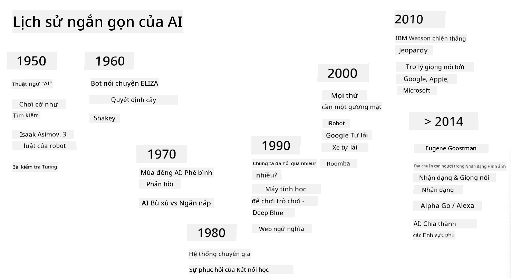
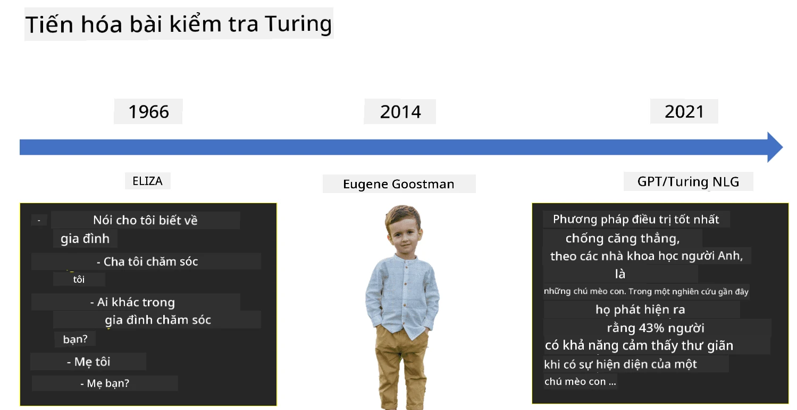

# Giới thiệu về AI

> Hình vẽ bởi [Tomomi Imura](https://twitter.com/girlie_mac)

## [Câu hỏi trước bài giảng](https://ff-quizzes.netlify.app/en/ai/quiz/1)

**Trí tuệ nhân tạo** là một lĩnh vực khoa học thú vị nghiên cứu cách chúng ta có thể làm cho máy tính thể hiện hành vi thông minh, ví dụ như thực hiện những việc mà con người làm tốt.

Ban đầu, máy tính được phát minh bởi [Charles Babbage](https://en.wikipedia.org/wiki/Charles_Babbage) để xử lý các con số theo một quy trình được định nghĩa rõ ràng - một thuật toán. Máy tính hiện đại, mặc dù tiên tiến hơn rất nhiều so với mô hình ban đầu được đề xuất vào thế kỷ 19, vẫn tuân theo ý tưởng về các tính toán có kiểm soát. Do đó, có thể lập trình một máy tính để thực hiện một việc gì đó nếu chúng ta biết chính xác chuỗi các bước cần thực hiện để đạt được mục tiêu.

> Ảnh bởi [Vickie Soshnikova](http://twitter.com/vickievalerie)

> ✅ Xác định tuổi của một người từ bức ảnh của họ là một nhiệm vụ không thể lập trình rõ ràng, vì chúng ta không biết cách chúng ta đưa ra con số trong đầu khi làm điều đó.

---

Tuy nhiên, có một số nhiệm vụ mà chúng ta không biết cách giải quyết một cách rõ ràng. Hãy xem xét việc xác định tuổi của một người từ bức ảnh của họ. Bằng cách nào đó, chúng ta học được cách làm điều này vì chúng ta đã thấy nhiều ví dụ về những người ở các độ tuổi khác nhau, nhưng chúng ta không thể giải thích rõ ràng cách chúng ta làm điều đó, cũng như không thể lập trình máy tính để làm điều đó. Đây chính là loại nhiệm vụ mà **Trí tuệ nhân tạo** (AI) quan tâm.

✅ Hãy nghĩ về một số nhiệm vụ mà bạn có thể giao cho máy tính và sẽ được hưởng lợi từ AI. Hãy cân nhắc các lĩnh vực tài chính, y học và nghệ thuật - những lĩnh vực này đang hưởng lợi từ AI như thế nào ngày nay?

## AI yếu và AI mạnh

AI yếu | AI mạnh
---------------------------------------|-------------------------------------
AI yếu đề cập đến các hệ thống AI được thiết kế và huấn luyện cho một nhiệm vụ cụ thể hoặc một tập hợp nhiệm vụ hẹp.|AI mạnh, hay Trí tuệ Nhân tạo Tổng quát (AGI), đề cập đến các hệ thống AI có trí thông minh và hiểu biết ở mức độ con người.
Các hệ thống AI này không có trí thông minh tổng quát; chúng xuất sắc trong việc thực hiện một nhiệm vụ được định nghĩa trước nhưng thiếu sự hiểu biết thực sự hoặc ý thức.|Các hệ thống AI này có khả năng thực hiện bất kỳ nhiệm vụ trí tuệ nào mà con người có thể làm, thích nghi với các lĩnh vực khác nhau và sở hữu một dạng ý thức hoặc tự nhận thức.
Ví dụ về AI yếu bao gồm trợ lý ảo như Siri hoặc Alexa, các thuật toán gợi ý được sử dụng bởi các dịch vụ phát trực tuyến, và các chatbot được thiết kế cho các nhiệm vụ dịch vụ khách hàng cụ thể.|Đạt được AI mạnh là một mục tiêu dài hạn của nghiên cứu AI và sẽ đòi hỏi sự phát triển của các hệ thống AI có thể suy luận, học hỏi, hiểu và thích nghi trên một loạt các nhiệm vụ và ngữ cảnh.
AI yếu rất chuyên biệt và không sở hữu khả năng nhận thức giống con người hoặc khả năng giải quyết vấn đề tổng quát ngoài phạm vi hẹp của nó.|AI mạnh hiện tại là một khái niệm lý thuyết, và chưa có hệ thống AI nào đạt đến mức độ trí thông minh tổng quát này.

Để biết thêm thông tin, tham khảo **[Trí tuệ Nhân tạo Tổng quát](https://en.wikipedia.org/wiki/Artificial_general_intelligence)** (AGI).

## Định nghĩa về Trí thông minh và Bài kiểm tra Turing

Một trong những vấn đề khi xử lý thuật ngữ **[Trí thông minh](https://en.wikipedia.org/wiki/Intelligence)** là không có định nghĩa rõ ràng cho thuật ngữ này. Một số người có thể cho rằng trí thông minh liên quan đến **tư duy trừu tượng**, hoặc đến **tự nhận thức**, nhưng chúng ta không thể định nghĩa nó một cách chính xác.

> [Ảnh](https://unsplash.com/photos/75715CVEJhI) bởi [Amber Kipp](https://unsplash.com/@sadmax) từ Unsplash

Để thấy sự mơ hồ của thuật ngữ *trí thông minh*, hãy thử trả lời câu hỏi: "Một con mèo có thông minh không?". Những người khác nhau có xu hướng đưa ra các câu trả lời khác nhau cho câu hỏi này, vì không có bài kiểm tra nào được chấp nhận rộng rãi để chứng minh khẳng định này là đúng hay không. Và nếu bạn nghĩ rằng có - hãy thử cho mèo của bạn làm bài kiểm tra IQ...

✅ Hãy nghĩ một chút về cách bạn định nghĩa trí thông minh. Một con quạ có thể giải mê cung để lấy thức ăn có thông minh không? Một đứa trẻ có thông minh không?

---

Khi nói về AGI, chúng ta cần có một cách nào đó để xác định liệu chúng ta đã tạo ra một hệ thống thực sự thông minh hay chưa. [Alan Turing](https://en.wikipedia.org/wiki/Alan_Turing) đã đề xuất một cách gọi là **[Bài kiểm tra Turing](https://en.wikipedia.org/wiki/Turing_test)**, cũng hoạt động như một định nghĩa về trí thông minh. Bài kiểm tra so sánh một hệ thống nhất định với một thứ gì đó vốn dĩ thông minh - một con người thực sự, và vì bất kỳ so sánh tự động nào cũng có thể bị vượt qua bởi một chương trình máy tính, chúng ta sử dụng một người làm người thẩm vấn. Vì vậy, nếu một con người không thể phân biệt giữa một người thực và một hệ thống máy tính trong cuộc đối thoại dựa trên văn bản - hệ thống đó được coi là thông minh.

> Một chatbot tên là [Eugene Goostman](https://en.wikipedia.org/wiki/Eugene_Goostman), được phát triển tại St.Petersburg, đã gần như vượt qua bài kiểm tra Turing vào năm 2014 bằng cách sử dụng một mẹo cá nhân thông minh. Nó tuyên bố ngay từ đầu rằng nó là một cậu bé 13 tuổi người Ukraine, điều này giải thích cho sự thiếu kiến thức và một số điểm không nhất quán trong văn bản. Bot đã thuyết phục 30% giám khảo rằng nó là con người sau một cuộc đối thoại kéo dài 5 phút, một chỉ số mà Turing tin rằng một máy móc có thể đạt được vào năm 2000. Tuy nhiên, cần hiểu rằng điều này không có nghĩa là chúng ta đã tạo ra một hệ thống thông minh, hoặc rằng một hệ thống máy tính đã đánh lừa người thẩm vấn - hệ thống không đánh lừa con người, mà chính những người tạo ra bot đã làm điều đó!

✅ Bạn đã bao giờ bị một chatbot đánh lừa khiến bạn nghĩ rằng bạn đang nói chuyện với một con người chưa? Nó đã thuyết phục bạn như thế nào?

## Các cách tiếp cận khác nhau đối với AI

Nếu chúng ta muốn một máy tính hành xử như con người, chúng ta cần bằng cách nào đó mô phỏng cách suy nghĩ của chúng ta bên trong máy tính. Do đó, chúng ta cần cố gắng hiểu điều gì làm cho con người trở nên thông minh.

> Để có thể lập trình trí thông minh vào một cỗ máy, chúng ta cần hiểu cách các quá trình ra quyết định của chính chúng ta hoạt động. Nếu bạn tự suy ngẫm một chút, bạn sẽ nhận ra rằng có một số quá trình diễn ra một cách vô thức – ví dụ, chúng ta có thể phân biệt một con mèo với một con chó mà không cần suy nghĩ – trong khi một số quá trình khác liên quan đến lý luận.

Có hai cách tiếp cận khả thi đối với vấn đề này:

Cách tiếp cận từ trên xuống (Lý luận biểu tượng) | Cách tiếp cận từ dưới lên (Mạng nơ-ron)
---------------------------------------|-------------------------------------
Cách tiếp cận từ trên xuống mô phỏng cách một người lý luận để giải quyết vấn đề. Nó bao gồm việc trích xuất **kiến thức** từ con người và biểu diễn nó dưới dạng mà máy tính có thể đọc được. Chúng ta cũng cần phát triển một cách để mô phỏng **lý luận** bên trong máy tính. | Cách tiếp cận từ dưới lên mô phỏng cấu trúc của não người, bao gồm một số lượng lớn các đơn vị đơn giản gọi là **nơ-ron**. Mỗi nơ-ron hoạt động như một trung bình có trọng số của các đầu vào của nó, và chúng ta có thể huấn luyện một mạng lưới nơ-ron để giải quyết các vấn đề hữu ích bằng cách cung cấp **dữ liệu huấn luyện**.

Ngoài ra còn có một số cách tiếp cận khác đối với trí thông minh:

* Một cách tiếp cận **Nổi lên**, **Hợp lực** hoặc **đa tác nhân** dựa trên thực tế rằng hành vi thông minh phức tạp có thể đạt được thông qua sự tương tác của một số lượng lớn các tác nhân đơn giản. Theo [cybernetics tiến hóa](https://en.wikipedia.org/wiki/Global_brain#Evolutionary_cybernetics), trí thông minh có thể *nổi lên* từ hành vi phản ứng đơn giản hơn trong quá trình *chuyển đổi hệ thống siêu cấp*.

* Một cách tiếp cận **Tiến hóa**, hoặc **thuật toán di truyền** là một quá trình tối ưu hóa dựa trên các nguyên tắc của tiến hóa.

Chúng ta sẽ xem xét những cách tiếp cận này sau trong khóa học, nhưng ngay bây giờ chúng ta sẽ tập trung vào hai hướng chính: từ trên xuống và từ dưới lên.

### Cách tiếp cận từ trên xuống

Trong một **cách tiếp cận từ trên xuống**, chúng ta cố gắng mô phỏng cách chúng ta lý luận. Vì chúng ta có thể theo dõi suy nghĩ của mình khi lý luận, chúng ta có thể cố gắng chính thức hóa quá trình này và lập trình nó vào máy tính. Điều này được gọi là **lý luận biểu tượng**.

Con người có xu hướng có một số quy tắc trong đầu hướng dẫn các quá trình ra quyết định của họ. Ví dụ, khi một bác sĩ chẩn đoán bệnh nhân, họ có thể nhận ra rằng một người bị sốt, và do đó có thể có một số viêm nhiễm trong cơ thể. Bằng cách áp dụng một tập hợp lớn các quy tắc cho một vấn đề cụ thể, bác sĩ có thể đưa ra chẩn đoán cuối cùng.

Cách tiếp cận này phụ thuộc rất nhiều vào **biểu diễn kiến thức** và **lý luận**. Việc trích xuất kiến thức từ một chuyên gia con người có thể là phần khó khăn nhất, vì trong nhiều trường hợp bác sĩ sẽ không biết chính xác tại sao họ lại đưa ra một chẩn đoán cụ thể. Đôi khi giải pháp chỉ xuất hiện trong đầu họ mà không cần suy nghĩ rõ ràng. Một số nhiệm vụ, chẳng hạn như xác định tuổi của một người từ một bức ảnh, hoàn toàn không thể giảm xuống thành việc thao tác kiến thức.

### Cách tiếp cận từ dưới lên

Ngược lại, chúng ta có thể cố gắng mô phỏng các yếu tố đơn giản nhất trong não của chúng ta – một nơ-ron. Chúng ta có thể xây dựng một cái gọi là **mạng nơ-ron nhân tạo** bên trong máy tính, và sau đó cố gắng dạy nó giải quyết các vấn đề bằng cách cung cấp các ví dụ. Quá trình này tương tự như cách một đứa trẻ sơ sinh học về môi trường xung quanh bằng cách quan sát.

✅ Hãy nghiên cứu một chút về cách trẻ sơ sinh học hỏi. Các yếu tố cơ bản trong não của một đứa trẻ là gì?

> | Còn về ML thì sao?         |      |
> |--------------|-----------|
> | Một phần của Trí tuệ Nhân tạo dựa trên việc máy tính học cách giải quyết vấn đề dựa trên một số dữ liệu được gọi là **Học máy**. Chúng ta sẽ không xem xét học máy cổ điển trong khóa học này - chúng tôi giới thiệu bạn đến chương trình học riêng [Học máy cho người mới bắt đầu](http://aka.ms/ml-beginners). |       |

## Lịch sử ngắn gọn về AI

Trí tuệ Nhân tạo được bắt đầu như một lĩnh vực vào giữa thế kỷ 20. Ban đầu, lý luận biểu tượng là cách tiếp cận phổ biến, và nó đã dẫn đến một số thành công quan trọng, chẳng hạn như các hệ thống chuyên gia – các chương trình máy tính có thể hoạt động như một chuyên gia trong một số lĩnh vực vấn đề hạn chế. Tuy nhiên, sớm nhận ra rằng cách tiếp cận này không mở rộng tốt. Việc trích xuất kiến thức từ một chuyên gia, biểu diễn nó trong máy tính, và giữ cho cơ sở kiến thức đó chính xác hóa ra là một nhiệm vụ rất phức tạp, và quá tốn kém để thực tế trong nhiều trường hợp. Điều này dẫn đến cái gọi là [Mùa đông AI](https://en.wikipedia.org/wiki/AI_winter) vào những năm 1970.

> Hình ảnh bởi [Dmitry Soshnikov](http://soshnikov.com)

Theo thời gian, tài nguyên tính toán trở nên rẻ hơn, và nhiều dữ liệu hơn đã trở nên có sẵn, vì vậy các cách tiếp cận mạng nơ-ron bắt đầu thể hiện hiệu suất tuyệt vời trong việc cạnh tranh với con người trong nhiều lĩnh vực, chẳng hạn như thị giác máy tính hoặc hiểu giọng nói. Trong thập kỷ qua, thuật ngữ Trí tuệ Nhân tạo chủ yếu được sử dụng như một từ đồng nghĩa với Mạng nơ-ron, vì hầu hết các thành công của AI mà chúng ta nghe thấy đều dựa trên chúng.

Chúng ta có thể quan sát cách các cách tiếp cận thay đổi, ví dụ, trong việc tạo ra một chương trình máy tính chơi cờ vua:

* Các chương trình cờ vua ban đầu dựa trên tìm kiếm – một chương trình cố gắng ước tính các nước đi có thể của đối thủ trong một số nước đi tiếp theo, và chọn một nước đi tối ưu dựa trên vị trí tối ưu có thể đạt được trong vài nước đi. Điều này dẫn đến sự phát triển của thuật toán tìm kiếm [alpha-beta pruning](https://en.wikipedia.org/wiki/Alpha%E2%80%93beta_pruning).
* Các chiến lược tìm kiếm hoạt động tốt vào cuối trò chơi, nơi không gian tìm kiếm bị giới hạn bởi một số lượng nhỏ các nước đi có thể. Tuy nhiên, vào đầu trò chơi, không gian tìm kiếm rất lớn, và thuật toán có thể được cải thiện bằng cách học hỏi từ các trận đấu hiện có giữa các người chơi. Các thí nghiệm tiếp theo đã sử dụng cái gọi là [lý luận dựa trên trường hợp](https://en.wikipedia.org/wiki/Case-based_reasoning), nơi chương trình tìm kiếm các trường hợp trong cơ sở kiến thức rất giống với vị trí hiện tại trong trò chơi.
* Các chương trình hiện đại chiến thắng người chơi con người dựa trên mạng nơ-ron và [học tăng cường](https://en.wikipedia.org/wiki/Reinforcement_learning), nơi các chương trình học chơi chỉ bằng cách chơi lâu dài với chính mình và học hỏi từ những sai lầm của chính mình – giống như con người học chơi cờ vua. Tuy nhiên, một chương trình máy tính có thể chơi nhiều trận hơn trong thời gian ngắn hơn nhiều, và do đó có thể học nhanh hơn.

✅ Hãy nghiên cứu một chút về các trò chơi khác đã được AI chơi.

Tương tự, chúng ta có thể thấy cách tiếp cận đối với việc tạo ra các “chương trình nói chuyện” (có thể vượt qua bài kiểm tra Turing) đã thay đổi:

* Các chương trình đầu tiên thuộc loại này như [Eliza](https://en.wikipedia.org/wiki/ELIZA), dựa trên các quy tắc ngữ pháp rất đơn giản và việc tái định dạng câu đầu vào thành một câu hỏi.
* Các trợ lý hiện đại, chẳng hạn như Cortana, Siri hoặc Google Assistant đều là các hệ thống lai sử dụng Mạng nơ-ron để chuyển đổi giọng nói thành văn bản và nhận ra ý định của chúng ta, và sau đó sử dụng một số lý luận hoặc thuật toán rõ ràng để thực hiện các hành động cần thiết.
* Trong tương lai, chúng ta có thể mong đợi một mô hình hoàn toàn dựa trên mạng nơ-ron để xử lý đối thoại một cách độc lập. Các mạng nơ-ron GPT gần đây và [Turing-NLG](https://www.microsoft.com/research/blog/turing-nlg-a-17-billion-parameter-language-model-by-microsoft) cho thấy thành công lớn trong lĩnh vực này.

> Hình ảnh của Dmitry Soshnikov, [ảnh](https://unsplash.com/photos/r8LmVbUKgns) bởi [Marina Abrosimova](https://unsplash.com/@abrosimova_marina_foto), Unsplash

## Nghiên cứu AI gần đây

Sự phát triển mạnh mẽ gần đây trong nghiên cứu mạng nơ-ron bắt đầu từ khoảng năm 2010, khi các bộ dữ liệu công khai lớn bắt đầu xuất hiện. Một bộ sưu tập hình ảnh khổng lồ mang tên [ImageNet](https://en.wikipedia.org/wiki/ImageNet), chứa khoảng 14 triệu hình ảnh được chú thích, đã khai sinh ra [Thử thách Nhận diện Hình ảnh Quy mô Lớn ImageNet](https://image-net.org/challenges/LSVRC/).

> Hình ảnh của [Dmitry Soshnikov](http://soshnikov.com)

Năm 2012, [Mạng Nơ-ron Tích chập](../4-ComputerVision/07-ConvNets/README.md) lần đầu tiên được sử dụng trong phân loại hình ảnh, dẫn đến sự giảm đáng kể trong lỗi phân loại (từ gần 30% xuống còn 16,4%). Năm 2015, kiến trúc ResNet từ Microsoft Research [đạt được độ chính xác ngang tầm con người](https://doi.org/10.1109/ICCV.2015.123).

Kể từ đó, Mạng Nơ-ron đã thể hiện hiệu quả rất cao trong nhiều nhiệm vụ:

---

Năm | Đạt được ngang tầm con người
-----|--------
2015 | [Phân loại Hình ảnh](https://doi.org/10.1109/ICCV.2015.123)
2016 | [Nhận diện Giọng nói Hội thoại](https://arxiv.org/abs/1610.05256)
2018 | [Dịch Máy Tự động](https://arxiv.org/abs/1803.05567) (Trung Quốc sang Anh)
2020 | [Chú thích Hình ảnh](https://arxiv.org/abs/2009.13682)

Trong vài năm qua, chúng ta đã chứng kiến những thành công lớn với các mô hình ngôn ngữ lớn, như BERT và GPT-3. Điều này chủ yếu xảy ra nhờ vào việc có rất nhiều dữ liệu văn bản tổng quát sẵn có, cho phép chúng ta huấn luyện các mô hình để nắm bắt cấu trúc và ý nghĩa của văn bản, tiền huấn luyện chúng trên các bộ sưu tập văn bản tổng quát, và sau đó chuyên môn hóa các mô hình đó cho các nhiệm vụ cụ thể hơn. Chúng ta sẽ tìm hiểu thêm về [Xử lý Ngôn ngữ Tự nhiên](../5-NLP/README.md) sau trong khóa học này.

## 🚀 Thử thách

Hãy khám phá trên internet để xác định, theo ý kiến của bạn, AI được sử dụng hiệu quả nhất ở đâu. Có phải trong một ứng dụng bản đồ, hay một dịch vụ chuyển giọng nói thành văn bản, hoặc một trò chơi điện tử? Nghiên cứu cách hệ thống đó được xây dựng.

## [Câu đố sau bài giảng](https://ff-quizzes.netlify.app/en/ai/quiz/2)

## Ôn tập & Tự học

Ôn lại lịch sử của AI và ML bằng cách đọc qua [bài học này](https://github.com/microsoft/ML-For-Beginners/tree/main/1-Introduction/2-history-of-ML). Lấy một yếu tố từ bản vẽ phác thảo ở đầu bài học đó hoặc bài học này và nghiên cứu sâu hơn để hiểu bối cảnh văn hóa đã định hình sự phát triển của nó.

**Bài tập**: [Game Jam](assignment.md)

---

<!-- CO-OP TRANSLATOR DISCLAIMER START -->
**Tuyên bố miễn trừ trách nhiệm**:  
Tài liệu này đã được dịch bằng dịch vụ dịch thuật AI [Co-op Translator](https://github.com/Azure/co-op-translator). Mặc dù chúng tôi cố gắng đảm bảo độ chính xác, xin lưu ý rằng các bản dịch tự động có thể chứa lỗi hoặc không chính xác. Tài liệu gốc bằng ngôn ngữ bản địa nên được coi là nguồn thông tin chính thức. Đối với thông tin quan trọng, nên sử dụng dịch vụ dịch thuật chuyên nghiệp bởi con người. Chúng tôi không chịu trách nhiệm cho bất kỳ sự hiểu lầm hoặc diễn giải sai nào phát sinh từ việc sử dụng bản dịch này.
<!-- CO-OP TRANSLATOR DISCLAIMER END -->