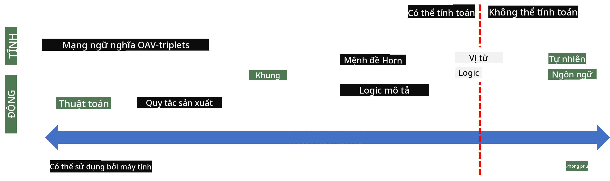
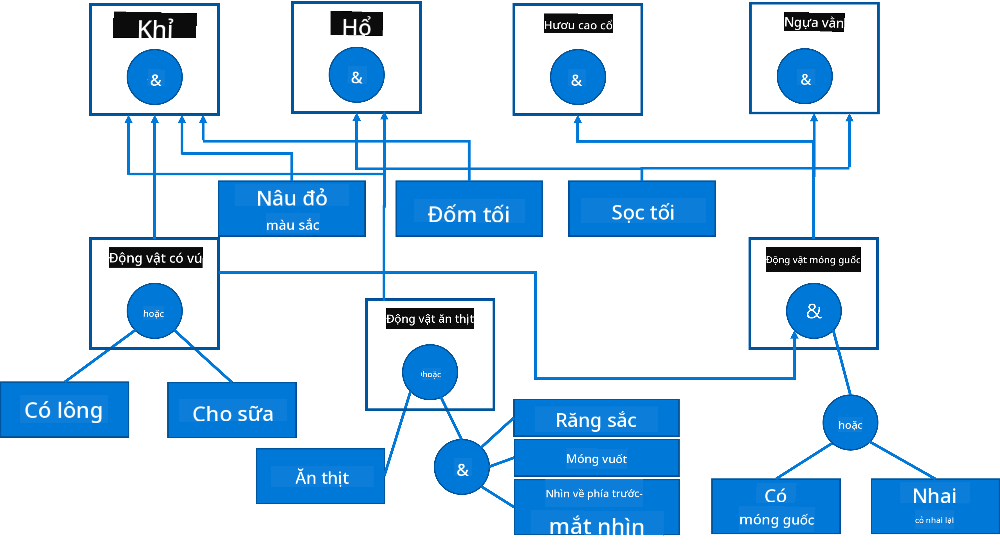

<!--
CO_OP_TRANSLATOR_METADATA:
{
  "original_hash": "7d097f7fda9166ead615e4c34552381b",
  "translation_date": "2025-09-23T10:31:08+00:00",
  "source_file": "lessons/2-Symbolic/README.md",
  "language_code": "vi"
}
-->
# Đại diện Tri thức và Hệ thống Chuyên gia


> Sketchnote bởi [Tomomi Imura](https://twitter.com/girlie_mac)

Cuộc tìm kiếm trí tuệ nhân tạo dựa trên việc tìm kiếm tri thức, nhằm hiểu thế giới giống như cách con người làm. Nhưng làm thế nào để thực hiện điều này?

## [Câu hỏi trước bài giảng](https://ff-quizzes.netlify.app/en/ai/quiz/3)

Trong những ngày đầu của AI, cách tiếp cận từ trên xuống để tạo ra các hệ thống thông minh (đã được thảo luận trong bài học trước) rất phổ biến. Ý tưởng là trích xuất tri thức từ con người vào một dạng mà máy có thể đọc được, sau đó sử dụng nó để tự động giải quyết vấn đề. Cách tiếp cận này dựa trên hai ý tưởng lớn:

* Đại diện Tri thức
* Lý luận

## Đại diện Tri thức

Một trong những khái niệm quan trọng trong AI biểu tượng là **tri thức**. Điều quan trọng là phải phân biệt tri thức với *thông tin* hoặc *dữ liệu*. Ví dụ, người ta có thể nói rằng sách chứa tri thức, vì chúng ta có thể học từ sách và trở thành chuyên gia. Tuy nhiên, những gì sách chứa thực ra được gọi là *dữ liệu*, và bằng cách đọc sách và tích hợp dữ liệu này vào mô hình thế giới của chúng ta, chúng ta chuyển đổi dữ liệu thành tri thức.

> ✅ **Tri thức** là thứ nằm trong đầu chúng ta và đại diện cho sự hiểu biết của chúng ta về thế giới. Nó được thu nhận thông qua quá trình **học tập** chủ động, tích hợp các mảnh thông tin mà chúng ta nhận được vào mô hình thế giới của mình.

Thông thường, chúng ta không định nghĩa tri thức một cách nghiêm ngặt, nhưng chúng ta liên kết nó với các khái niệm liên quan khác bằng [Kim tự tháp DIKW](https://en.wikipedia.org/wiki/DIKW_pyramid). Nó bao gồm các khái niệm sau:

* **Dữ liệu** là thứ được biểu diễn trên phương tiện vật lý, chẳng hạn như văn bản viết hoặc lời nói. Dữ liệu tồn tại độc lập với con người và có thể được truyền giữa các cá nhân.
* **Thông tin** là cách chúng ta diễn giải dữ liệu trong đầu. Ví dụ, khi chúng ta nghe từ *máy tính*, chúng ta có một số hiểu biết về nó.
* **Tri thức** là thông tin được tích hợp vào mô hình thế giới của chúng ta. Ví dụ, một khi chúng ta học được máy tính là gì, chúng ta bắt đầu có một số ý tưởng về cách nó hoạt động, giá cả và mục đích sử dụng. Mạng lưới các khái niệm liên quan này hình thành tri thức của chúng ta.
* **Sự khôn ngoan** là một cấp độ cao hơn trong sự hiểu biết của chúng ta về thế giới, và nó đại diện cho *siêu tri thức*, ví dụ như một khái niệm về cách và thời điểm sử dụng tri thức.


*Hình ảnh [từ Wikipedia](https://commons.wikimedia.org/w/index.php?curid=37705247), Bởi Longlivetheux - Tác phẩm của chính mình, CC BY-SA 4.0*

Do đó, vấn đề của **đại diện tri thức** là tìm một cách hiệu quả để biểu diễn tri thức bên trong máy tính dưới dạng dữ liệu, để có thể sử dụng tự động. Điều này có thể được xem như một phổ:



> Hình ảnh bởi [Dmitry Soshnikov](http://soshnikov.com)

* Ở bên trái, có các loại đại diện tri thức rất đơn giản có thể được máy tính sử dụng hiệu quả. Loại đơn giản nhất là thuật toán, khi tri thức được biểu diễn bằng một chương trình máy tính. Tuy nhiên, đây không phải là cách tốt nhất để biểu diễn tri thức, vì nó không linh hoạt. Tri thức trong đầu chúng ta thường không mang tính thuật toán.
* Ở bên phải, có các đại diện như văn bản tự nhiên. Đây là loại mạnh mẽ nhất, nhưng không thể sử dụng để lý luận tự động.

> ✅ Hãy nghĩ trong một phút về cách bạn biểu diễn tri thức trong đầu và chuyển nó thành ghi chú. Có định dạng nào đặc biệt giúp bạn ghi nhớ tốt hơn không?

## Phân loại Đại diện Tri thức Máy tính

Chúng ta có thể phân loại các phương pháp đại diện tri thức máy tính thành các danh mục sau:

* **Đại diện mạng** dựa trên thực tế rằng chúng ta có một mạng lưới các khái niệm liên quan trong đầu. Chúng ta có thể cố gắng tái tạo các mạng lưới này dưới dạng đồ thị trong máy tính - một **mạng ngữ nghĩa**.

1. **Bộ ba Đối tượng-Thuộc tính-Giá trị** hoặc **cặp thuộc tính-giá trị**. Vì một đồ thị có thể được biểu diễn trong máy tính dưới dạng danh sách các nút và cạnh, chúng ta có thể biểu diễn một mạng ngữ nghĩa bằng danh sách các bộ ba, chứa đối tượng, thuộc tính và giá trị. Ví dụ, chúng ta xây dựng các bộ ba sau về ngôn ngữ lập trình:

Đối tượng | Thuộc tính | Giá trị
----------|------------|-------
Python | là | Ngôn ngữ không kiểu
Python | được phát minh bởi | Guido van Rossum
Python | cú pháp khối | thụt lề
Ngôn ngữ không kiểu | không có | định nghĩa kiểu

> ✅ Hãy nghĩ cách các bộ ba có thể được sử dụng để biểu diễn các loại tri thức khác.

2. **Đại diện phân cấp** nhấn mạnh thực tế rằng chúng ta thường tạo ra một hệ thống phân cấp các đối tượng trong đầu. Ví dụ, chúng ta biết rằng chim hoàng yến là một loài chim, và tất cả các loài chim đều có cánh. Chúng ta cũng có một số ý tưởng về màu sắc của chim hoàng yến, và tốc độ bay của chúng.

   - **Đại diện khung** dựa trên việc biểu diễn mỗi đối tượng hoặc lớp đối tượng dưới dạng một **khung** chứa **khe**. Các khe có giá trị mặc định, giới hạn giá trị, hoặc các thủ tục được lưu trữ có thể được gọi để lấy giá trị của một khe. Tất cả các khung tạo thành một hệ thống phân cấp tương tự như hệ thống phân cấp đối tượng trong các ngôn ngữ lập trình hướng đối tượng.
   - **Kịch bản** là một loại khung đặc biệt đại diện cho các tình huống phức tạp có thể diễn ra theo thời gian.

**Python**

Khe | Giá trị | Giá trị mặc định | Khoảng |
----|---------|------------------|--------|
Tên | Python | | |
Là | Ngôn ngữ không kiểu | | |
Kiểu biến | | CamelCase | |
Độ dài chương trình | | | 5-5000 dòng |
Cú pháp khối | Thụt lề | | |

3. **Đại diện thủ tục** dựa trên việc biểu diễn tri thức bằng danh sách các hành động có thể được thực hiện khi một điều kiện nhất định xảy ra.
   - Quy tắc sản xuất là các câu lệnh if-then cho phép chúng ta rút ra kết luận. Ví dụ, một bác sĩ có thể có quy tắc nói rằng **NẾU** bệnh nhân bị sốt cao **HOẶC** mức protein C-reactive cao trong xét nghiệm máu **THÌ** bệnh nhân bị viêm. Khi gặp một trong các điều kiện, chúng ta có thể đưa ra kết luận về viêm, và sau đó sử dụng nó trong lý luận tiếp theo.
   - Thuật toán có thể được coi là một dạng đại diện thủ tục khác, mặc dù chúng hầu như không bao giờ được sử dụng trực tiếp trong các hệ thống dựa trên tri thức.

4. **Logic** ban đầu được Aristotle đề xuất như một cách để biểu diễn tri thức phổ quát của con người.
   - Logic vị từ như một lý thuyết toán học quá phong phú để có thể tính toán, do đó một số tập hợp con của nó thường được sử dụng, chẳng hạn như các mệnh đề Horn được sử dụng trong Prolog.
   - Logic mô tả là một họ các hệ thống logic được sử dụng để biểu diễn và lý luận về các hệ thống phân cấp đối tượng trong các đại diện tri thức phân tán như *web ngữ nghĩa*.

## Hệ thống Chuyên gia

Một trong những thành công ban đầu của AI biểu tượng là các **hệ thống chuyên gia** - các hệ thống máy tính được thiết kế để hoạt động như một chuyên gia trong một lĩnh vực vấn đề hạn chế. Chúng dựa trên một **cơ sở tri thức** được trích xuất từ một hoặc nhiều chuyên gia con người, và chứa một **động cơ suy luận** thực hiện một số lý luận dựa trên cơ sở đó.

 | 
---------------------------------------------|------------------------------------------------
Cấu trúc đơn giản của hệ thần kinh con người | Kiến trúc của hệ thống dựa trên tri thức

Hệ thống chuyên gia được xây dựng giống như hệ thống lý luận của con người, chứa **bộ nhớ ngắn hạn** và **bộ nhớ dài hạn**. Tương tự, trong các hệ thống dựa trên tri thức, chúng ta phân biệt các thành phần sau:

* **Bộ nhớ vấn đề**: chứa tri thức về vấn đề đang được giải quyết, ví dụ như nhiệt độ hoặc huyết áp của bệnh nhân, liệu bệnh nhân có bị viêm hay không, v.v. Tri thức này còn được gọi là **tri thức tĩnh**, vì nó chứa ảnh chụp nhanh về những gì chúng ta hiện biết về vấn đề - trạng thái vấn đề.
* **Cơ sở tri thức**: đại diện cho tri thức dài hạn về một lĩnh vực vấn đề. Nó được trích xuất thủ công từ các chuyên gia con người, và không thay đổi từ lần tư vấn này sang lần tư vấn khác. Vì nó cho phép chúng ta điều hướng từ trạng thái vấn đề này sang trạng thái khác, nó cũng được gọi là **tri thức động**.
* **Động cơ suy luận**: điều phối toàn bộ quá trình tìm kiếm trong không gian trạng thái vấn đề, đặt câu hỏi cho người dùng khi cần thiết. Nó cũng chịu trách nhiệm tìm các quy tắc phù hợp để áp dụng cho mỗi trạng thái.

Ví dụ, hãy xem xét hệ thống chuyên gia sau đây để xác định một loài động vật dựa trên các đặc điểm vật lý của nó:



> Hình ảnh bởi [Dmitry Soshnikov](http://soshnikov.com)

Sơ đồ này được gọi là **cây AND-OR**, và nó là một biểu diễn đồ họa của một tập hợp các quy tắc sản xuất. Vẽ cây rất hữu ích khi bắt đầu trích xuất tri thức từ chuyên gia. Để biểu diễn tri thức bên trong máy tính, việc sử dụng các quy tắc sẽ thuận tiện hơn:

```
IF the animal eats meat
OR (animal has sharp teeth
    AND animal has claws
    AND animal has forward-looking eyes
) 
THEN the animal is a carnivore
```

Bạn có thể nhận thấy rằng mỗi điều kiện ở phía bên trái của quy tắc và hành động thực chất là các bộ ba đối tượng-thuộc tính-giá trị (OAV). **Bộ nhớ làm việc** chứa tập hợp các bộ ba OAV tương ứng với vấn đề hiện đang được giải quyết. Một **động cơ quy tắc** tìm kiếm các quy tắc mà điều kiện được thỏa mãn và áp dụng chúng, thêm một bộ ba mới vào bộ nhớ làm việc.

> ✅ Hãy viết cây AND-OR của riêng bạn về một chủ đề mà bạn yêu thích!

### Suy luận Tiến và Suy luận Lùi

Quá trình được mô tả ở trên được gọi là **suy luận tiến**. Nó bắt đầu với một số dữ liệu ban đầu về vấn đề có sẵn trong bộ nhớ làm việc, và sau đó thực hiện vòng lặp lý luận sau:

1. Nếu thuộc tính mục tiêu có trong bộ nhớ làm việc - dừng lại và đưa ra kết quả
2. Tìm tất cả các quy tắc mà điều kiện hiện tại được thỏa mãn - thu được **tập hợp xung đột** của các quy tắc.
3. Thực hiện **giải quyết xung đột** - chọn một quy tắc sẽ được thực hiện trong bước này. Có thể có các chiến lược giải quyết xung đột khác nhau:
   - Chọn quy t
- Một họ ngôn ngữ dựa trên XML để mô tả tri thức: RDF (Resource Description Framework), RDFS (RDF Schema), OWL (Ontology Web Language).

Một khái niệm cốt lõi trong Semantic Web là khái niệm **Ontology**. Nó đề cập đến việc đặc tả rõ ràng một miền vấn đề bằng cách sử dụng một số phương pháp biểu diễn tri thức chính thức. Ontology đơn giản nhất có thể chỉ là một hệ thống phân cấp các đối tượng trong miền vấn đề, nhưng các ontology phức tạp hơn sẽ bao gồm các quy tắc có thể được sử dụng để suy luận.

Trong Semantic Web, tất cả các biểu diễn đều dựa trên các bộ ba. Mỗi đối tượng và mỗi mối quan hệ đều được xác định duy nhất bằng URI. Ví dụ, nếu chúng ta muốn nêu rõ rằng chương trình giảng dạy AI này được phát triển bởi Dmitry Soshnikov vào ngày 1 tháng 1 năm 2022 - đây là các bộ ba mà chúng ta có thể sử dụng:


```
http://github.com/microsoft/ai-for-beginners http://www.example.com/terms/creation-date “Jan 13, 2007”
http://github.com/microsoft/ai-for-beginners http://purl.org/dc/elements/1.1/creator http://soshnikov.com
```

> ✅ Ở đây `http://www.example.com/terms/creation-date` và `http://purl.org/dc/elements/1.1/creator` là một số URI được chấp nhận rộng rãi để biểu thị các khái niệm *người tạo* và *ngày tạo*.

Trong trường hợp phức tạp hơn, nếu chúng ta muốn định nghĩa một danh sách các người tạo, chúng ta có thể sử dụng một số cấu trúc dữ liệu được định nghĩa trong RDF.


> Các sơ đồ trên bởi [Dmitry Soshnikov](http://soshnikov.com)

Tiến trình xây dựng Semantic Web đã bị chậm lại phần nào bởi sự thành công của các công cụ tìm kiếm và các kỹ thuật xử lý ngôn ngữ tự nhiên, cho phép trích xuất dữ liệu có cấu trúc từ văn bản. Tuy nhiên, trong một số lĩnh vực vẫn có những nỗ lực đáng kể để duy trì các ontology và cơ sở tri thức. Một vài dự án đáng chú ý:

* [WikiData](https://wikidata.org/) là một tập hợp các cơ sở tri thức có thể đọc được bằng máy liên kết với Wikipedia. Phần lớn dữ liệu được khai thác từ các *InfoBoxes* của Wikipedia, các phần nội dung có cấu trúc bên trong các trang Wikipedia. Bạn có thể [truy vấn](https://query.wikidata.org/) WikiData bằng SPARQL, một ngôn ngữ truy vấn đặc biệt dành cho Semantic Web. Đây là một truy vấn mẫu hiển thị các màu mắt phổ biến nhất ở con người:

```sparql
#defaultView:BubbleChart
SELECT ?eyeColorLabel (COUNT(?human) AS ?count)
WHERE
{
  ?human wdt:P31 wd:Q5.       # human instance-of homo sapiens
  ?human wdt:P1340 ?eyeColor. # human eye-color ?eyeColor
  SERVICE wikibase:label { bd:serviceParam wikibase:language "en". }
}
GROUP BY ?eyeColorLabel
```

* [DBpedia](https://www.dbpedia.org/) là một nỗ lực khác tương tự như WikiData.

> ✅ Nếu bạn muốn thử nghiệm xây dựng các ontology của riêng mình, hoặc mở các ontology hiện có, có một trình chỉnh sửa ontology trực quan tuyệt vời gọi là [Protégé](https://protege.stanford.edu/). Tải xuống hoặc sử dụng trực tuyến.


*Trình chỉnh sửa Web Protégé mở với ontology Gia đình Romanov. Ảnh chụp màn hình bởi Dmitry Soshnikov*

## ✍️ Bài tập: Ontology Gia đình

Xem [FamilyOntology.ipynb](https://github.com/Ezana135/AI-For-Beginners/blob/main/lessons/2-Symbolic/FamilyOntology.ipynb) để biết ví dụ về cách sử dụng các kỹ thuật Semantic Web để suy luận về các mối quan hệ gia đình. Chúng ta sẽ lấy một cây gia đình được biểu diễn theo định dạng GEDCOM phổ biến và một ontology về các mối quan hệ gia đình để xây dựng một đồ thị của tất cả các mối quan hệ gia đình cho một tập hợp các cá nhân.

## Microsoft Concept Graph

Trong hầu hết các trường hợp, các ontology được tạo ra một cách cẩn thận bằng tay. Tuy nhiên, cũng có thể **khai thác** các ontology từ dữ liệu không có cấu trúc, ví dụ như từ các văn bản ngôn ngữ tự nhiên.

Một nỗ lực như vậy đã được thực hiện bởi Microsoft Research, và kết quả là [Microsoft Concept Graph](https://blogs.microsoft.com/ai/microsoft-researchers-release-graph-that-helps-machines-conceptualize/?WT.mc_id=academic-77998-cacaste).

Đây là một tập hợp lớn các thực thể được nhóm lại với nhau bằng mối quan hệ kế thừa `is-a`. Nó cho phép trả lời các câu hỏi như "Microsoft là gì?" - câu trả lời có thể là "một công ty với xác suất 0.87, và một thương hiệu với xác suất 0.75".

Graph này có sẵn dưới dạng REST API hoặc dưới dạng một tệp văn bản lớn liệt kê tất cả các cặp thực thể.

## ✍️ Bài tập: Concept Graph

Hãy thử notebook [MSConceptGraph.ipynb](https://github.com/microsoft/AI-For-Beginners/blob/main/lessons/2-Symbolic/MSConceptGraph.ipynb) để xem cách chúng ta có thể sử dụng Microsoft Concept Graph để nhóm các bài báo tin tức vào một số danh mục.

## Kết luận

Ngày nay, AI thường được coi là đồng nghĩa với *Machine Learning* hoặc *Neural Networks*. Tuy nhiên, con người cũng thể hiện khả năng suy luận rõ ràng, điều mà hiện tại các mạng nơ-ron chưa xử lý được. Trong các dự án thực tế, suy luận rõ ràng vẫn được sử dụng để thực hiện các nhiệm vụ yêu cầu giải thích, hoặc khả năng thay đổi hành vi của hệ thống một cách có kiểm soát.

## 🚀 Thử thách

Trong notebook Family Ontology liên quan đến bài học này, có cơ hội để thử nghiệm với các mối quan hệ gia đình khác. Hãy thử khám phá các kết nối mới giữa các thành viên trong cây gia đình.

## [Post-lecture quiz](https://ff-quizzes.netlify.app/en/ai/quiz/4)

## Ôn tập & Tự học

Hãy nghiên cứu trên internet để khám phá các lĩnh vực mà con người đã cố gắng định lượng và mã hóa tri thức. Tìm hiểu về Bloom's Taxonomy, và quay lại lịch sử để học cách con người cố gắng hiểu thế giới của họ. Khám phá công trình của Linnaeus để tạo ra một hệ thống phân loại sinh vật, và quan sát cách Dmitri Mendeleev tạo ra một phương pháp để mô tả và nhóm các nguyên tố hóa học. Bạn có thể tìm thấy những ví dụ thú vị nào khác?

**Bài tập**: [Xây dựng một Ontology](assignment.md)

---

