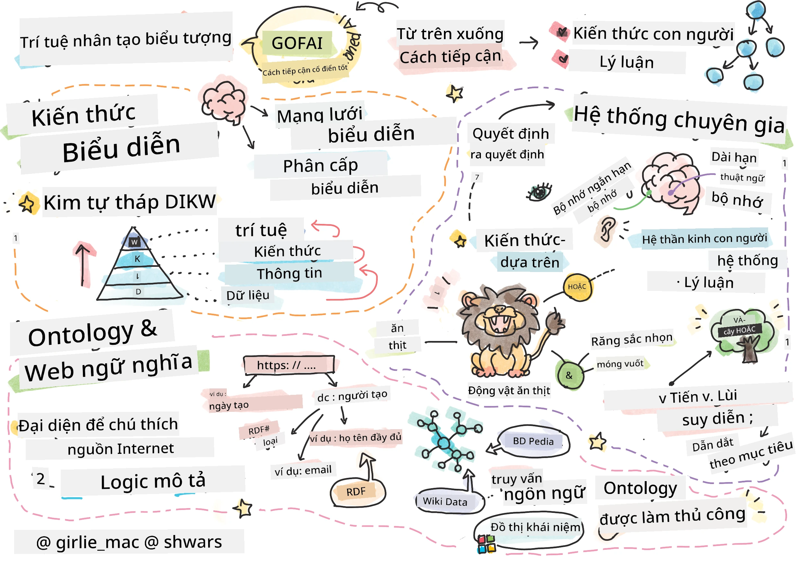
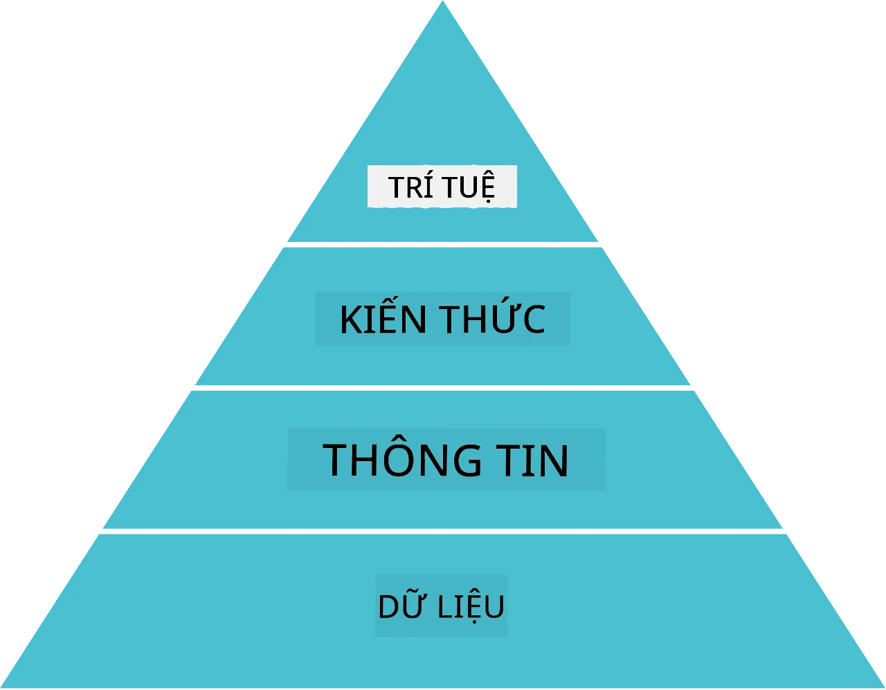
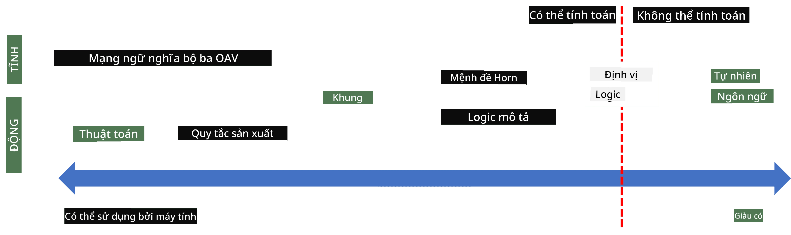
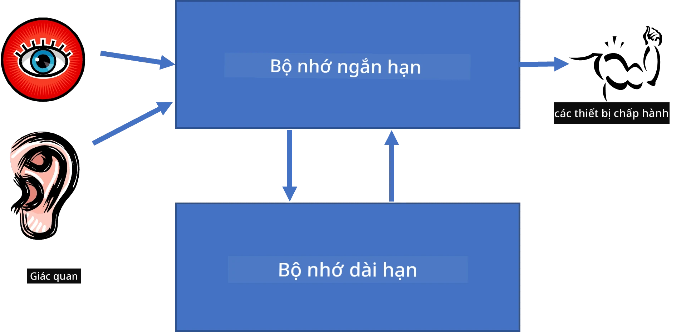
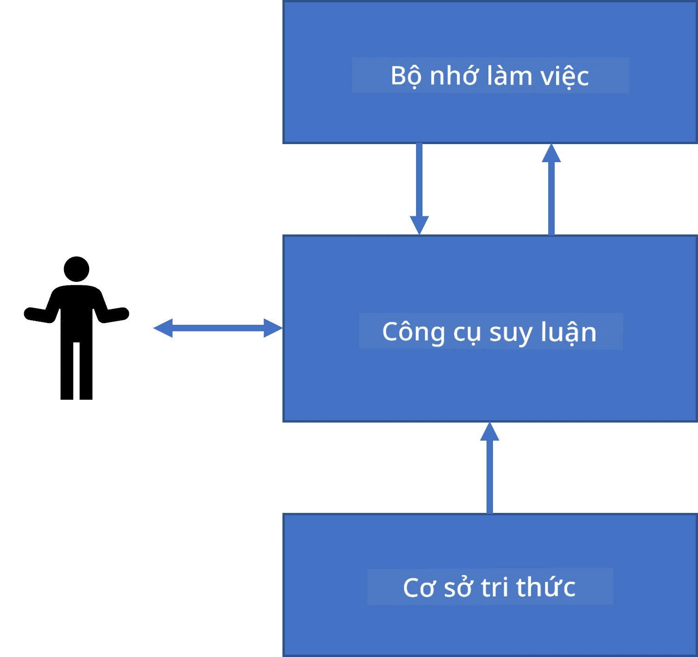
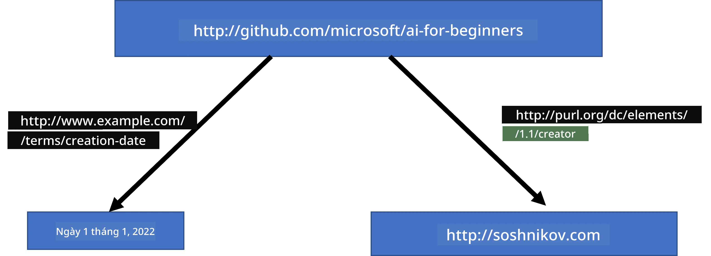
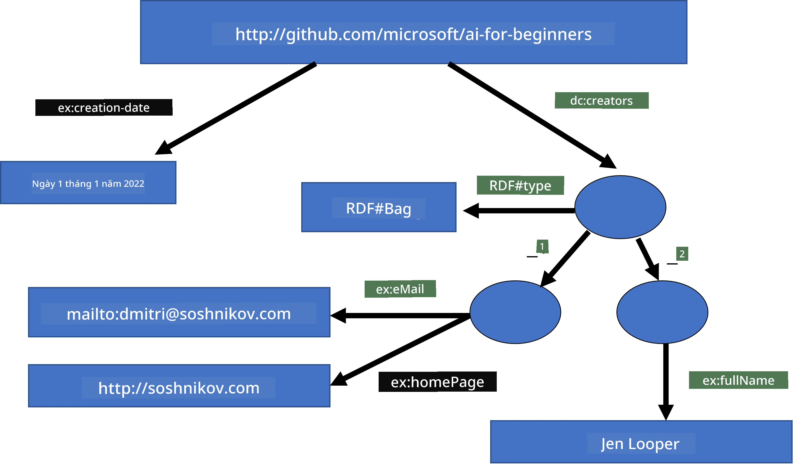
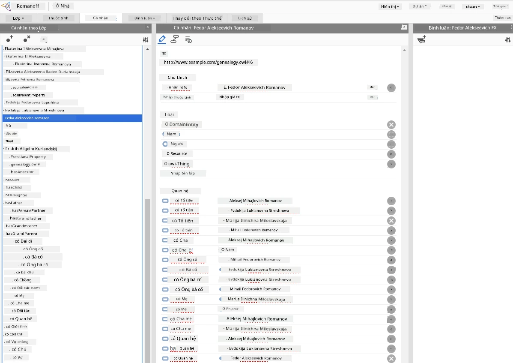

# Đại diện tri thức và hệ chuyên gia



> Sketchnote bởi [Tomomi Imura](https://twitter.com/girlie_mac)

Cuộc tìm kiếm trí tuệ nhân tạo dựa trên việc tìm kiếm tri thức, để hiểu thế giới tương tự như cách con người làm. Nhưng làm thế nào bạn có thể thực hiện điều này?

## [Bài kiểm tra trước bài giảng](https://ff-quizzes.netlify.app/en/ai/quiz/3)

Trong những ngày đầu của AI, phương pháp từ trên xuống để tạo các hệ thống thông minh (đã thảo luận trong bài học trước) rất phổ biến. Ý tưởng là trích xuất tri thức từ con người thành dạng máy có thể đọc được, rồi sử dụng để giải quyết vấn đề một cách tự động. Phương pháp này dựa trên hai ý tưởng lớn:

* Đại diện tri thức
* Suy luận

## Đại diện tri thức

Một trong những khái niệm quan trọng trong AI ký hiệu là **tri thức**. Quan trọng là phân biệt tri thức với *thông tin* hay *dữ liệu*. Ví dụ, người ta có thể nói rằng sách chứa tri thức, vì người ta có thể học sách và trở thành chuyên gia. Tuy nhiên, những gì sách chứa thực sự được gọi là *dữ liệu*, và bằng cách đọc sách và tích hợp dữ liệu này vào mô hình thế giới của chúng ta, chúng ta chuyển dữ liệu thành tri thức.

> ✅ **Tri thức** là thứ có trong đầu chúng ta và thể hiện sự hiểu biết của chúng ta về thế giới. Nó được thu nhận qua một quá trình học tập **tích cực**, tích hợp các mẩu thông tin nhận được vào mô hình thế giới hiện tại của chúng ta.

Thông thường, chúng ta không định nghĩa tri thức một cách chặt chẽ, mà căn cứ vào các khái niệm liên quan khác qua [Kim tự tháp DIKW](https://en.wikipedia.org/wiki/DIKW_pyramid). Nó bao gồm các khái niệm sau:

* **Dữ liệu** là thứ thể hiện trên các phương tiện vật lý, như văn bản viết hoặc lời nói. Dữ liệu tồn tại độc lập với con người và có thể được truyền giữa người với người.
* **Thông tin** là cách chúng ta diễn giải dữ liệu trong đầu mình. Ví dụ, khi nghe từ *máy tính*, ta có một số hiểu biết về nó.
* **Tri thức** là thông tin được tích hợp vào mô hình thế giới của chúng ta. Ví dụ, khi ta học về máy tính, ta bắt đầu có ý niệm về cách nó hoạt động, giá cả và ứng dụng. Mạng lưới các khái niệm liên quan này tạo thành tri thức của chúng ta.
* **Trí tuệ** là một cấp độ cao hơn trong hiểu biết về thế giới, đại diện cho *meta-knowledge*, ví dụ như cách và khi nào nên sử dụng tri thức.



*Hình ảnh [từ Wikipedia](https://commons.wikimedia.org/w/index.php?curid=37705247), Tác giả Longlivetheux - Tác phẩm riêng, CC BY-SA 4.0*

Do đó, vấn đề **đại diện tri thức** là tìm cách hiệu quả để biểu diễn tri thức bên trong máy tính dưới dạng dữ liệu, nhằm làm cho tri thức có thể sử dụng tự động. Điều này có thể xem như một phổ:



> Hình bởi [Dmitry Soshnikov](http://soshnikov.com)

* Ở bên trái, là các loại đại diện tri thức rất đơn giản có thể được máy tính sử dụng hiệu quả. Đơn giản nhất là thuật toán, khi tri thức được biểu diễn bởi chương trình máy tính. Tuy nhiên, đây không phải cách tốt nhất để biểu diễn tri thức vì nó không linh hoạt. Tri thức trong đầu chúng ta thường không phải là thuật toán.
* Ở bên phải, là các biểu diễn như văn bản tự nhiên. Nó mạnh mẽ nhất, nhưng không thể dùng cho suy luận tự động.

> ✅ Hãy suy nghĩ một lát về cách bạn đại diện tri thức trong đầu và chuyển đổi nó thành ghi chú. Có định dạng nào phù hợp giúp bạn ghi nhớ tốt hơn không?

## Phân loại các Đại diện Tri thức trên máy tính

Chúng ta có thể phân loại các phương pháp đại diện tri thức trên máy tính thành các nhóm sau:

* **Mạng lưới đại diện** dựa trên thực tế là chúng ta có mạng lưới các khái niệm liên quan trong đầu. Có thể tái tạo mạng lưới này dưới dạng đồ thị trong máy tính - gọi là **mạng ngữ nghĩa**.

1. **Bộ ba Đối tượng - Thuộc tính - Giá trị** hoặc **cặp thuộc tính - giá trị**. Vì đồ thị có thể biểu diễn dưới dạng danh sách các nút và cạnh, chúng ta có thể biểu diễn mạng ngữ nghĩa bằng danh sách các bộ ba, chứa đối tượng, thuộc tính, và giá trị. Ví dụ, ta xây dựng các bộ ba sau về các ngôn ngữ lập trình:

Đối tượng | Thuộc tính | Giá trị
----------|------------|---------
Python    | là         | Ngôn-ngữ-không-gõ-kiểu
Python    | sáng tạo bởi | Guido van Rossum
Python    | cú pháp khối | thụt lề
Ngôn-ngữ-không-gõ-kiểu | không có | định nghĩa kiểu

> ✅ Suy nghĩ cách sử dụng bộ ba để đại diện cho các loại tri thức khác.

2. **Đại diện phân cấp** nhấn mạnh thực tế rằng chúng ta thường tạo ra một hệ thống phân cấp các đối tượng trong đầu. Ví dụ, ta biết rằng chim hoàng yến là một loài chim, và tất cả chim đều có cánh. Ta cũng biết màu sắc thường thấy của hoàng yến và tốc độ bay của nó.

   - **Đại diện khung** dựa trên việc biểu diễn mỗi đối tượng hoặc lớp đối tượng như một **khung** chứa các **khung con (slots)**. Các khung con có thể có giá trị mặc định, giới hạn giá trị, hoặc thủ tục lưu trữ có thể gọi để lấy giá trị. Tất cả các khung tạo thành một phân cấp tương tự như phân cấp đối tượng trong lập trình hướng đối tượng.
   - **Kịch bản** là loại khung đặc biệt đại diện cho các tình huống phức tạp có thể diễn ra theo thời gian.

**Python**

Khung con | Giá trị | Giá trị mặc định | Khoảng |
----------|----------|------------------|--------|
Tên       | Python   |                  |        |
Là        | Ngôn-ngữ-không-gõ-kiểu |         |        |
Kiểu đặt biến |          | CamelCase        |        |
Chiều dài chương trình |          |                  | 5-5000 dòng |
Cú pháp khối | Thụt lề |                  |        |

3. **Đại diện thủ tục** dựa trên việc biểu diễn tri thức dưới dạng danh sách các hành động có thể thực hiện khi một điều kiện nhất định xảy ra.
   - Quy tắc sản xuất là các câu lệnh nếu-thì cho phép chúng ta rút ra kết luận. Ví dụ, bác sĩ có thể có quy tắc nói rằng **NẾU** bệnh nhân sốt cao **HOẶC** nồng độ Protein C phản ứng trong máu cao **THÌ** anh ta bị viêm. Khi gặp một trong các điều kiện này, ta có thể rút ra kết luận về viêm và dùng nó trong suy luận tiếp theo.
   - Thuật toán cũng có thể xem như một dạng đại diện thủ tục, dù hiếm khi dùng trực tiếp trong các hệ thống dựa trên tri thức.

4. **Logic** được Aristotle đề xuất ban đầu như một cách biểu diễn tri thức phổ quát của con người.
   - Logic vị từ như một lý thuyết toán học quá phức tạp để máy tính có thể xử lý hoàn toàn, do đó thường dùng một tập con, như các mệnh đề Horn trong Prolog.
   - Logic mô tả là họ hệ thống logic dùng để biểu diễn và suy luận về phân cấp đối tượng trong các đại diện tri thức phân tán như *mạng ngữ nghĩa*.

## Hệ chuyên gia

Một trong những thành công đầu tiên của AI ký hiệu là các **hệ chuyên gia** - các hệ thống máy tính được thiết kế để đóng vai trò chuyên gia trong một lĩnh vực vấn đề giới hạn. Chúng dựa trên **cơ sở tri thức** trích xuất từ một hoặc nhiều chuyên gia con người, và có chứa **bộ suy luận** thực hiện suy luận dựa trên đó.

 | 
--------------------------------------------------------|----------------------------------------------------
Cấu trúc đơn giản của hệ thần kinh con người              | Kiến trúc hệ thống dựa trên tri thức

Hệ chuyên gia được xây dựng như hệ thống suy luận của con người, có **bộ nhớ ngắn hạn** và **bộ nhớ dài hạn**. Tương tự trong hệ dựa trên tri thức ta phân biệt các thành phần:

* **Bộ nhớ vấn đề**: chứa tri thức về bài toán đang giải, ví dụ nhiệt độ hay huyết áp của bệnh nhân, liệu anh ta có bị viêm hay không, vv. Tri thức này còn gọi là **tri thức tĩnh**, vì nó chứa một ảnh chụp nhanh về trạng thái hiện tại của vấn đề - gọi là *trạng thái bài toán*.
* **Cơ sở tri thức**: đại diện tri thức dài hạn về miền vấn đề. Được trích xuất thủ công từ các chuyên gia con người, không thay đổi giữa các lần tham vấn. Vì cho phép chuyển từ trạng thái vấn đề này sang trạng thái khác, nó còn gọi là **tri thức động**.
* **Bộ suy luận**: phối hợp toàn bộ quá trình tìm kiếm trong không gian trạng thái bài toán, hỏi người dùng khi cần. Nó cũng chịu trách nhiệm tìm các quy tắc thích hợp sẽ áp dụng cho mỗi trạng thái.

Lấy ví dụ hệ chuyên gia xác định một con vật dựa trên đặc điểm thể chất:


> Hình bởi [Dmitry Soshnikov](http://soshnikov.com)

Sơ đồ này gọi là **cây AND-OR**, là biểu diễn đồ họa của một tập các quy tắc sản xuất. Vẽ cây rất hữu ích khi bắt đầu trích xuất tri thức từ chuyên gia. Để biểu diễn tri thức trong máy tính, thường dùng quy tắc:

```
IF the animal eats meat
OR (animal has sharp teeth
    AND animal has claws
    AND animal has forward-looking eyes
) 
THEN the animal is a carnivore
```

Bạn có thể nhận thấy mỗi điều kiện bên trái quy tắc và hành động đều là những bộ ba đối tượng-thuộc tính-giá trị (OAV). **Bộ nhớ làm việc** chứa tập hợp các bộ ba OAV tương ứng với vấn đề đang giải. Một **bộ máy quy tắc** tìm các quy tắc thỏa mãn điều kiện và áp dụng, thêm một bộ ba mới vào bộ nhớ làm việc.

> ✅ Viết cây AND-OR của riêng bạn về một chủ đề bạn thích!

### Suy luận Tiến và Suy luận Lùi

Quá trình mô tả ở trên gọi là **suy luận tiến**. Nó bắt đầu với dữ liệu ban đầu về vấn đề trong bộ nhớ làm việc, rồi thực hiện vòng lặp suy luận:

1. Nếu thuộc tính mục tiêu có trong bộ nhớ làm việc - dừng lại và cho kết quả
2. Tìm tất cả quy tắc có điều kiện hiện đang thỏa mãn - thu được **tập hợp xung đột** các quy tắc.
3. Thực hiện **giải quyết xung đột** - chọn một quy tắc sẽ thực thi bước này. Có thể có các chiến lược giải quyết xung đột khác nhau:
   - Chọn quy tắc áp dụng đầu tiên trong cơ sở tri thức
   - Chọn ngẫu nhiên một quy tắc
   - Chọn quy tắc *cụ thể hơn*, tức là thỏa nhiều điều kiện bên trái (LHS) nhất
4. Áp dụng quy tắc đã chọn và thêm kiến thức mới vào trạng thái bài toán
5. Lặp lại từ bước 1.

Tuy nhiên, trong một số trường hợp, ta có thể muốn bắt đầu với kiến thức trống về vấn đề, và hỏi những câu hỏi giúp ta đi đến kết luận. Ví dụ, xét chẩn đoán y tế, thường ta không làm hết các xét nghiệm trước khi bắt đầu chẩn đoán. Ta muốn chỉ thực hiện khi cần quyết định.

Quá trình này có thể mô phỏng bằng **suy luận lùi**. Nó được điều khiển bởi **mục tiêu** - giá trị thuộc tính ta cần tìm:

1. Chọn tất cả quy tắc có thể cho ta giá trị của mục tiêu (tức có mục tiêu ở bên phải (RHS)) - tập hợp xung đột
1. Nếu không có quy tắc nào cho thuộc tính đó, hoặc có quy tắc bảo hỏi người dùng - thì hỏi, nếu không:
1. Dùng chiến lược giải quyết xung đột để chọn một quy tắc sử dụng làm *giả thuyết* - ta sẽ cố gắng chứng minh nó
1. Lặp lại tuần hoàn quy trình cho tất cả thuộc tính ở bên trái quy tắc, cố chứng minh chúng như mục tiêu
1. Nếu bất kỳ lúc nào quá trình không thành công - dùng quy tắc khác tại bước 3.

> ✅ Trong những tình huống nào suy luận tiến phù hợp hơn? Còn suy luận lùi thì sao?

### Triển khai Hệ chuyên gia

Hệ chuyên gia có thể được triển khai bằng các công cụ khác nhau:

* Lập trình trực tiếp bằng một ngôn ngữ lập trình cấp cao. Đây không phải ý kiến tốt, vì lợi thế chính của hệ dựa trên tri thức là tri thức được tách biệt khỏi bộ suy luận, và có thể chuyên gia lĩnh vực không cần biết chi tiết suy luận vẫn viết được quy tắc.
* Sử dụng **khung hệ chuyên gia**, tức là hệ được thiết kế đặc biệt để nhập tri thức bằng một ngôn ngữ đại diện tri thức.

## ✍️ Bài tập: Suy luận động vật

Xem [Animals.ipynb](https://github.com/microsoft/AI-For-Beginners/blob/main/lessons/2-Symbolic/Animals.ipynb) để xem ví dụ về triển khai hệ chuyên gia suy luận tiến và lùi.

> **Lưu ý**: Ví dụ này khá đơn giản, chỉ để hiểu ý tưởng về cách hệ chuyên gia hoạt động. Khi bạn bắt đầu tạo hệ như vậy, bạn chỉ nhìn thấy hành vi *thông minh* khi có một số lượng quy tắc nhất định, khoảng 200+. Đến một lúc, các quy tắc trở nên quá phức tạp để nhớ hết, và bạn sẽ tự hỏi vì sao hệ đưa ra quyết định đó. Tuy nhiên, điểm quan trọng của hệ dựa trên tri thức là bạn luôn có thể *giải thích* chính xác cách các quyết định được đưa ra.

## Các Ontology và Mạng ngữ nghĩa

Vào cuối thế kỷ 20 có sáng kiến sử dụng đại diện tri thức để chú thích tài nguyên Internet, nhằm tìm kiếm tài nguyên phù hợp với các truy vấn rất cụ thể. Phong trào này gọi là **Mạng ngữ nghĩa**, dựa trên một số khái niệm:

- Đại diện tri thức đặc biệt dựa trên **[logic mô tả](https://en.wikipedia.org/wiki/Description_logic)** (DL). Nó giống đại diện khung vì xây dựng hệ phân cấp các đối tượng với thuộc tính, nhưng có ngữ nghĩa logic chính thức và suy luận. Có một họ các DL cân bằng giữa tính biểu đạt và độ phức tạp thuật toán trong suy luận.
- Đại diện tri thức phân tán, trong đó tất cả khái niệm được đại diện bằng định danh URI toàn cầu, cho phép tạo các phân cấp tri thức trải rộng trên Internet.
- Một họ các ngôn ngữ dựa trên XML để mô tả kiến thức: RDF (Resource Description Framework), RDFS (RDF Schema), OWL (Ontology Web Language).

Một khái niệm cốt lõi trong Semantic Web là khái niệm **Ontology**. Nó chỉ việc định nghĩa rõ ràng một miền vấn đề sử dụng một số cách biểu diễn kiến thức chính thức. Ontology đơn giản nhất có thể chỉ là một hệ thống phân cấp các đối tượng trong miền vấn đề, nhưng các ontology phức tạp hơn sẽ bao gồm các quy tắc có thể dùng để suy luận.

Trong Semantic Web, tất cả các biểu diễn đều dựa trên các bộ ba. Mỗi đối tượng và mỗi quan hệ đều được xác định duy nhất bằng URI. Ví dụ, nếu ta muốn phát biểu sự thật rằng Chương trình học AI này đã được Dmitry Soshnikov phát triển vào ngày 1 tháng 1 năm 2022 - đây là các bộ ba mà ta có thể sử dụng:



```
http://github.com/microsoft/ai-for-beginners http://www.example.com/terms/creation-date “Jan 1, 2022”
http://github.com/microsoft/ai-for-beginners http://purl.org/dc/elements/1.1/creator http://soshnikov.com
```

> ✅ Ở đây `http://www.example.com/terms/creation-date` và `http://purl.org/dc/elements/1.1/creator` là những URI phổ biến và được chấp nhận rộng rãi để biểu đạt khái niệm *người tạo* và *ngày tạo*.

Trong trường hợp phức tạp hơn, nếu ta muốn định nghĩa một danh sách các người tạo, ta có thể sử dụng một số cấu trúc dữ liệu được định nghĩa trong RDF.



> Các sơ đồ trên bởi [Dmitry Soshnikov](http://soshnikov.com)

Sự tiến triển trong việc xây dựng Semantic Web đã phần nào bị chậm lại bởi sự thành công của các công cụ tìm kiếm và kỹ thuật xử lý ngôn ngữ tự nhiên, cho phép khai thác dữ liệu có cấu trúc từ văn bản. Tuy nhiên, ở một vài lĩnh vực vẫn có những nỗ lực đáng kể để duy trì các ontology và cơ sở kiến thức. Một số dự án đáng chú ý:

* [WikiData](https://wikidata.org/) là một tập hợp các cơ sở tri thức có thể đọc bởi máy liên kết với Wikipedia. Phần lớn dữ liệu được khai thác từ các *InfoBox* trong Wikipedia, các phần nội dung có cấu trúc bên trong các trang Wikipedia. Bạn có thể [truy vấn](https://query.wikidata.org/) wikidata bằng SPARQL, một ngôn ngữ truy vấn đặc biệt cho Semantic Web. Đây là một truy vấn mẫu hiển thị các màu mắt phổ biến nhất ở người:

```sparql
#defaultView:BubbleChart
SELECT ?eyeColorLabel (COUNT(?human) AS ?count)
WHERE
{
  ?human wdt:P31 wd:Q5.       # human instance-of homo sapiens
  ?human wdt:P1340 ?eyeColor. # human eye-color ?eyeColor
  SERVICE wikibase:label { bd:serviceParam wikibase:language "en". }
}
GROUP BY ?eyeColorLabel
```

* [DBpedia](https://www.dbpedia.org/) là một nỗ lực khác tương tự WikiData.

> ✅ Nếu bạn muốn thử nghiệm xây dựng ontology của riêng mình hoặc mở các ontology hiện có, có một công cụ chỉnh sửa ontology trực quan tuyệt vời gọi là [Protégé](https://protege.stanford.edu/). Tải về hoặc sử dụng trực tuyến.



*Trình chỉnh sửa Web Protégé mở với ontology gia đình Romanov. Ảnh chụp màn hình bởi Dmitry Soshnikov*

## ✍️ Bài tập: Ontology Gia đình


Xem [FamilyOntology.ipynb](https://github.com/Ezana135/AI-For-Beginners/blob/main/lessons/2-Symbolic/FamilyOntology.ipynb) để có ví dụ về việc sử dụng các kỹ thuật Semantic Web để suy luận về các mối quan hệ gia đình. Chúng ta sẽ lấy một cây gia đình được biểu diễn theo định dạng GEDCOM thông dụng và một ontology về các mối quan hệ gia đình để xây dựng một đồ thị tất cả các mối quan hệ gia đình cho một tập cá thể cho trước.

## Microsoft Concept Graph

Trong hầu hết các trường hợp, các ontology được tạo ra cẩn thận bằng tay. Tuy nhiên, cũng có thể **khai thác** ontology từ dữ liệu phi cấu trúc, ví dụ từ các văn bản ngôn ngữ tự nhiên.

Một nỗ lực như vậy đã được thực hiện bởi Microsoft Research, và kết quả là [Microsoft Concept Graph](https://blogs.microsoft.com/ai/microsoft-researchers-release-graph-that-helps-machines-conceptualize/?WT.mc_id=academic-77998-cacaste).

Đó là một tập hợp lớn các thực thể được nhóm lại với nhau sử dụng quan hệ kế thừa `is-a`. Nó cho phép trả lời các câu hỏi như "Microsoft là gì?" - câu trả lời có thể là "một công ty với xác suất 0.87, và một thương hiệu với xác suất 0.75".

Đồ thị này có thể truy cập qua REST API, hoặc như một tập tin văn bản lớn có thể tải về liệt kê tất cả các cặp thực thể.

## ✍️ Bài tập: Đồ thị Khái niệm

Thử notebook [MSConceptGraph.ipynb](https://github.com/microsoft/AI-For-Beginners/blob/main/lessons/2-Symbolic/MSConceptGraph.ipynb) để xem cách ta có thể sử dụng Microsoft Concept Graph để phân nhóm các bài báo tin tức thành một vài thể loại.

## Kết luận

Ngày nay, AI thường được coi là đồng nghĩa với *Machine Learning* hoặc *Neural Networks*. Tuy nhiên, con người cũng thể hiện khả năng suy luận rõ ràng, điều mà hiện nay mạng nơ-ron chưa xử lý được. Trong các dự án thực tế, suy luận rõ ràng vẫn được dùng để thực hiện các nhiệm vụ yêu cầu giải thích, hoặc có thể điều chỉnh hành vi của hệ thống một cách có kiểm soát.

## 🚀 Thách thức

Trong notebook Ontology Gia đình đi kèm bài học này, có cơ hội thử nghiệm các mối quan hệ gia đình khác. Hãy cố gắng khám phá các kết nối mới giữa các thành viên trong cây gia đình.

## [Bài kiểm tra sau bài giảng](https://ff-quizzes.netlify.app/en/ai/quiz/4)

## Ôn tập & Tự học

Hãy tìm hiểu trên internet để khám phá những lĩnh vực mà con người đã cố gắng định lượng và mã hóa kiến thức. Tìm hiểu về Phân loại học của Bloom, và quay ngược lại lịch sử xem con người từng cố gắng hiểu thế giới của họ như thế nào. Khám phá công trình của Linnaeus trong việc tạo ra một phân loại học các sinh vật, và quan sát cách Dmitri Mendeleev đã tạo ra phương pháp mô tả và nhóm các nguyên tố hóa học. Bạn có thể tìm thêm những ví dụ thú vị nào khác?

**Bài tập**: [Xây dựng một Ontology](assignment.md)

---

<!-- CO-OP TRANSLATOR DISCLAIMER START -->
**Tuyên bố từ chối trách nhiệm**:  
Tài liệu này đã được dịch bằng dịch vụ dịch thuật AI [Co-op Translator](https://github.com/Azure/co-op-translator). Mặc dù chúng tôi cố gắng đảm bảo độ chính xác, xin lưu ý rằng các bản dịch tự động có thể chứa lỗi hoặc không chính xác. Văn bản gốc bằng ngôn ngữ bản địa nên được coi là nguồn thông tin chính thống. Đối với các thông tin quan trọng, nên sử dụng dịch vụ dịch thuật chuyên nghiệp bởi con người. Chúng tôi không chịu trách nhiệm đối với bất kỳ sự hiểu lầm hay giải thích sai nào phát sinh từ việc sử dụng bản dịch này.
<!-- CO-OP TRANSLATOR DISCLAIMER END -->