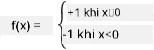

# Giới thiệu về Mạng Nơ-ron: Perceptron

## [Câu hỏi trước bài giảng](https://ff-quizzes.netlify.app/en/ai/quiz/5)

Một trong những nỗ lực đầu tiên để triển khai một thứ gì đó tương tự như mạng nơ-ron hiện đại được thực hiện bởi Frank Rosenblatt từ Cornell Aeronautical Laboratory vào năm 1957. Đây là một thiết bị phần cứng có tên "Mark-1", được thiết kế để nhận diện các hình học cơ bản như tam giác, hình vuông và hình tròn.

|      |      |
|--------------|-----------|
| | |

> Hình ảnh [từ Wikipedia](https://en.wikipedia.org/wiki/Perceptron)

Một hình ảnh đầu vào được biểu diễn bằng mảng 20x20 tế bào quang, vì vậy mạng nơ-ron có 400 đầu vào và một đầu ra nhị phân. Một mạng đơn giản chỉ chứa một nơ-ron, còn được gọi là **đơn vị logic ngưỡng**. Các trọng số của mạng nơ-ron hoạt động như các chiết áp, cần được điều chỉnh thủ công trong giai đoạn huấn luyện.

> ✅ Chiết áp là một thiết bị cho phép người dùng điều chỉnh điện trở của một mạch.

> Tờ New York Times đã viết về perceptron vào thời điểm đó: *phôi thai của một máy tính điện tử mà [Hải quân] kỳ vọng sẽ có thể đi, nói, nhìn, viết, tự tái tạo và nhận thức được sự tồn tại của chính nó.*

## Mô hình Perceptron

Giả sử chúng ta có N đặc trưng trong mô hình, khi đó vector đầu vào sẽ là một vector kích thước N. Perceptron là một mô hình **phân loại nhị phân**, tức là nó có thể phân biệt giữa hai lớp dữ liệu đầu vào. Chúng ta sẽ giả định rằng với mỗi vector đầu vào x, đầu ra của perceptron sẽ là +1 hoặc -1, tùy thuộc vào lớp. Đầu ra được tính bằng công thức:

y(x) = f(w<sup>T</sup>x)

trong đó f là hàm kích hoạt dạng bước.

<!-- img src="http://www.sciweavers.org/tex2img.php?eq=f%28x%29%20%3D%20%5Cbegin%7Bcases%7D%0A%20%20%20%20%20%20%20%20%20%2B1%20%26%20x%20%5Cgeq%200%20%5C%5C%0A%20%20%20%20%20%20%20%20%20-1%20%26%20x%20%3C%200%0A%20%20%20%20%20%20%20%5Cend%7Bcases%7D%20%5C%5C%0A&bc=White&fc=Black&im=jpg&fs=12&ff=arev&edit=0" align="center" border="0" alt="f(x) = \begin{cases} +1 & x \geq 0 \\ -1 & x < 0 \end{cases} \\" width="154" height="50" / -->


## Huấn luyện Perceptron

Để huấn luyện perceptron, chúng ta cần tìm một vector trọng số w sao cho phân loại đúng hầu hết các giá trị, tức là dẫn đến **lỗi** nhỏ nhất. Lỗi E này được định nghĩa bởi **tiêu chí perceptron** theo cách sau:

E(w) = -&sum;w<sup>T</sup>x<sub>i</sub>t<sub>i</sub>

trong đó:

* tổng được thực hiện trên các điểm dữ liệu huấn luyện i dẫn đến phân loại sai
* x<sub>i</sub> là dữ liệu đầu vào, và t<sub>i</sub> là -1 hoặc +1 tương ứng với ví dụ âm và dương.

Tiêu chí này được coi là một hàm của trọng số w, và chúng ta cần tối ưu hóa nó. Thường thì một phương pháp gọi là **gradient descent** được sử dụng, trong đó chúng ta bắt đầu với một trọng số ban đầu w<sup>(0)</sup>, và sau đó tại mỗi bước cập nhật trọng số theo công thức:

w<sup>(t+1)</sup> = w<sup>(t)</sup> - &eta;&nabla;E(w)

Ở đây &eta; là **tốc độ học**, và &nabla;E(w) biểu thị **gradient** của E. Sau khi tính toán gradient, chúng ta có:

w<sup>(t+1)</sup> = w<sup>(t)</sup> + &sum;&eta;x<sub>i</sub>t<sub>i</sub>

Thuật toán trong Python trông như sau:

```python
def train(positive_examples, negative_examples, num_iterations = 100, eta = 1):

    weights = [0,0,0] # Initialize weights (almost randomly :)
        
    for i in range(num_iterations):
        pos = random.choice(positive_examples)
        neg = random.choice(negative_examples)

        z = np.dot(pos, weights) # compute perceptron output
        if z < 0: # positive example classified as negative
            weights = weights + eta*weights.shape

        z  = np.dot(neg, weights)
        if z >= 0: # negative example classified as positive
            weights = weights - eta*weights.shape

    return weights
```

## Kết luận

Trong bài học này, bạn đã tìm hiểu về perceptron, một mô hình phân loại nhị phân, và cách huấn luyện nó bằng cách sử dụng vector trọng số.

## 🚀 Thử thách

Nếu bạn muốn thử xây dựng perceptron của riêng mình, hãy thử [bài thực hành này trên Microsoft Learn](https://docs.microsoft.com/en-us/azure/machine-learning/component-reference/two-class-averaged-perceptron?WT.mc_id=academic-77998-cacaste) sử dụng [Azure ML designer](https://docs.microsoft.com/en-us/azure/machine-learning/concept-designer?WT.mc_id=academic-77998-cacaste).

## [Câu hỏi sau bài giảng](https://ff-quizzes.netlify.app/en/ai/quiz/6)

## Ôn tập & Tự học

Để xem cách chúng ta có thể sử dụng perceptron để giải quyết một bài toán đơn giản cũng như các vấn đề thực tế, và để tiếp tục học - hãy truy cập notebook [Perceptron](Perceptron.ipynb).

Đây là một [bài viết thú vị về perceptron](https://towardsdatascience.com/what-is-a-perceptron-basics-of-neural-networks-c4cfea20c590).

## [Bài tập](lab/README.md)

Trong bài học này, chúng ta đã triển khai một perceptron cho nhiệm vụ phân loại nhị phân, và đã sử dụng nó để phân loại giữa hai chữ số viết tay. Trong bài thực hành này, bạn được yêu cầu giải quyết vấn đề phân loại chữ số hoàn toàn, tức là xác định chữ số nào có khả năng tương ứng với một hình ảnh cho trước.

* [Hướng dẫn](lab/README.md)
* [Notebook](lab/PerceptronMultiClass.ipynb)

---

