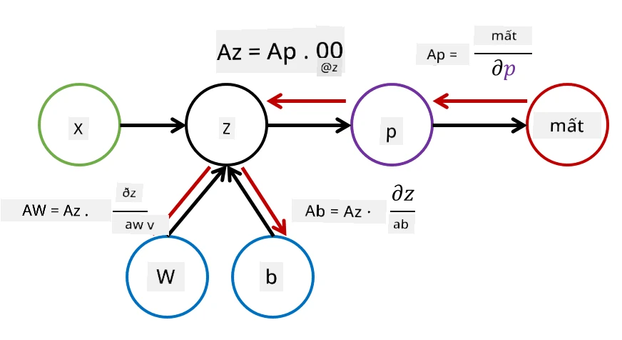

# Giới thiệu về Mạng Neural. Perceptron Đa Tầng

Trong phần trước, bạn đã tìm hiểu về mô hình mạng neural đơn giản nhất - perceptron một tầng, một mô hình phân loại hai lớp tuyến tính.

Trong phần này, chúng ta sẽ mở rộng mô hình này thành một khung linh hoạt hơn, cho phép chúng ta:

* thực hiện **phân loại đa lớp** ngoài phân loại hai lớp
* giải quyết **bài toán hồi quy** ngoài phân loại
* phân tách các lớp không thể phân tách tuyến tính

Chúng ta cũng sẽ phát triển một khung mô-đun riêng trong Python, cho phép xây dựng các kiến trúc mạng neural khác nhau.

## [Câu hỏi trước bài giảng](https://ff-quizzes.netlify.app/en/ai/quiz/7)

## Formal hóa Học Máy

Hãy bắt đầu bằng cách formal hóa bài toán Học Máy. Giả sử chúng ta có một tập dữ liệu huấn luyện **X** với nhãn **Y**, và cần xây dựng một mô hình *f* để đưa ra dự đoán chính xác nhất. Chất lượng của dự đoán được đo lường bằng **Hàm mất mát** &lagran;. Các hàm mất mát thường được sử dụng bao gồm:

* Đối với bài toán hồi quy, khi cần dự đoán một con số, chúng ta có thể sử dụng **lỗi tuyệt đối** &sum;i|f(x(i))-y(i)|, hoặc **lỗi bình phương** &sum;i(f(x(i))-y(i))2
* Đối với phân loại, chúng ta sử dụng **mất mát 0-1** (về cơ bản giống với **độ chính xác** của mô hình), hoặc **mất mát logistic**.

Đối với perceptron một tầng, hàm *f* được định nghĩa là một hàm tuyến tính *f(x)=wx+b* (ở đây *w* là ma trận trọng số, *x* là vector các đặc trưng đầu vào, và *b* là vector độ lệch). Đối với các kiến trúc mạng neural khác nhau, hàm này có thể có dạng phức tạp hơn.

> Trong trường hợp phân loại, thường mong muốn đầu ra của mạng là xác suất của các lớp tương ứng. Để chuyển đổi các số bất kỳ thành xác suất (ví dụ: để chuẩn hóa đầu ra), chúng ta thường sử dụng hàm **softmax** &sigma;, và hàm *f* trở thành *f(x)=&sigma;(wx+b)*

Trong định nghĩa của *f* ở trên, *w* và *b* được gọi là **tham số** &theta;=⟨*w,b*⟩. Với tập dữ liệu ⟨**X**,**Y**⟩, chúng ta có thể tính toán lỗi tổng thể trên toàn bộ tập dữ liệu dưới dạng một hàm của tham số &theta;.

> ✅ **Mục tiêu của việc huấn luyện mạng neural là giảm thiểu lỗi bằng cách thay đổi tham số &theta;**

## Tối ưu hóa Gradient Descent

Có một phương pháp tối ưu hóa hàm nổi tiếng gọi là **gradient descent**. Ý tưởng là chúng ta có thể tính đạo hàm (trong trường hợp đa chiều gọi là **gradient**) của hàm mất mát đối với các tham số, và thay đổi tham số sao cho lỗi giảm đi. Điều này có thể được formal hóa như sau:

* Khởi tạo tham số bằng một số giá trị ngẫu nhiên w(0), b(0)
* Lặp lại bước sau nhiều lần:
    - w(i+1) = w(i)-&eta;&part;&lagran;/&part;w
    - b(i+1) = b(i)-&eta;&part;&lagran;/&part;b

Trong quá trình huấn luyện, các bước tối ưu hóa được tính toán dựa trên toàn bộ tập dữ liệu (nhớ rằng hàm mất mát được tính bằng tổng qua tất cả các mẫu huấn luyện). Tuy nhiên, trong thực tế, chúng ta lấy các phần nhỏ của tập dữ liệu gọi là **minibatches**, và tính toán gradient dựa trên một tập con của dữ liệu. Vì tập con được lấy ngẫu nhiên mỗi lần, phương pháp này được gọi là **stochastic gradient descent** (SGD).

## Perceptron Đa Tầng và Backpropagation

Mạng một tầng, như chúng ta đã thấy ở trên, có khả năng phân loại các lớp có thể phân tách tuyến tính. Để xây dựng một mô hình phong phú hơn, chúng ta có thể kết hợp nhiều tầng của mạng. Về mặt toán học, điều này có nghĩa là hàm *f* sẽ có dạng phức tạp hơn và được tính toán qua nhiều bước:
* z1=w1x+b1
* z2=w2&alpha;(z1)+b2
* f = &sigma;(z2)

Ở đây, &alpha; là một **hàm kích hoạt phi tuyến**, &sigma; là hàm softmax, và tham số &theta;=<*w1,b1,w2,b2*>.

Thuật toán gradient descent vẫn giữ nguyên, nhưng việc tính toán gradient sẽ khó khăn hơn. Dựa vào quy tắc đạo hàm chuỗi, chúng ta có thể tính đạo hàm như sau:

* &part;&lagran;/&part;w2 = (&part;&lagran;/&part;&sigma;)(&part;&sigma;/&part;z2)(&part;z2/&part;w2)
* &part;&lagran;/&part;w1 = (&part;&lagran;/&part;&sigma;)(&part;&sigma;/&part;z2)(&part;z2/&part;&alpha;)(&part;&alpha;/&part;z1)(&part;z1/&part;w1)

> ✅ Quy tắc đạo hàm chuỗi được sử dụng để tính đạo hàm của hàm mất mát đối với các tham số.

Lưu ý rằng phần bên trái nhất của tất cả các biểu thức này là giống nhau, và do đó chúng ta có thể tính toán hiệu quả các đạo hàm bắt đầu từ hàm mất mát và đi "ngược lại" qua đồ thị tính toán. Vì vậy, phương pháp huấn luyện perceptron đa tầng được gọi là **backpropagation**, hay 'backprop'.

> TODO: trích dẫn hình ảnh

> ✅ Chúng ta sẽ tìm hiểu backprop chi tiết hơn trong ví dụ notebook của chúng ta.  

## Kết luận

Trong bài học này, chúng ta đã xây dựng thư viện mạng neural của riêng mình và sử dụng nó cho một bài toán phân loại hai chiều đơn giản.

## 🚀 Thử thách

Trong notebook đi kèm, bạn sẽ triển khai khung của riêng mình để xây dựng và huấn luyện perceptron đa tầng. Bạn sẽ có cơ hội tìm hiểu chi tiết cách các mạng neural hiện đại hoạt động.

Hãy tiếp tục với notebook [OwnFramework](OwnFramework.ipynb) và làm việc qua nó.

## [Câu hỏi sau bài giảng](https://ff-quizzes.netlify.app/en/ai/quiz/8)

## Ôn tập & Tự học

Backpropagation là một thuật toán phổ biến được sử dụng trong AI và ML, đáng để nghiên cứu [chi tiết hơn](https://wikipedia.org/wiki/Backpropagation)

## [Bài tập](lab/README.md)

Trong bài thực hành này, bạn được yêu cầu sử dụng khung mà bạn đã xây dựng trong bài học này để giải bài toán phân loại chữ số viết tay MNIST.

* [Hướng dẫn](lab/README.md)
* [Notebook](lab/MyFW_MNIST.ipynb)

---

