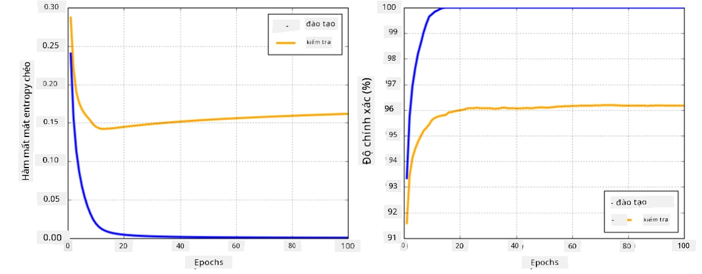

# Các Framework Mạng Neural

Như chúng ta đã học, để có thể huấn luyện mạng neural một cách hiệu quả, chúng ta cần làm hai việc:

* Thao tác trên các tensor, ví dụ như nhân, cộng, và tính các hàm như sigmoid hoặc softmax
* Tính gradient của tất cả các biểu thức, để thực hiện tối ưu hóa bằng phương pháp gradient descent

## [Câu hỏi trước bài giảng](https://ff-quizzes.netlify.app/en/ai/quiz/9)

Mặc dù thư viện `numpy` có thể thực hiện phần đầu tiên, chúng ta cần một cơ chế để tính gradient. Trong [framework của chúng ta](../04-OwnFramework/OwnFramework.ipynb) mà chúng ta đã phát triển ở phần trước, chúng ta phải tự lập trình tất cả các hàm đạo hàm bên trong phương thức `backward`, phương thức thực hiện backpropagation. Lý tưởng nhất, một framework nên cho phép chúng ta tính gradient của *bất kỳ biểu thức nào* mà chúng ta có thể định nghĩa.

Một điều quan trọng khác là khả năng thực hiện các tính toán trên GPU, hoặc bất kỳ đơn vị tính toán chuyên dụng nào khác, chẳng hạn như [TPU](https://en.wikipedia.org/wiki/Tensor_Processing_Unit). Việc huấn luyện mạng neural sâu đòi hỏi *rất nhiều* tính toán, và khả năng phân phối các tính toán này trên GPU là rất quan trọng.

> ✅ Thuật ngữ 'parallelize' có nghĩa là phân phối các tính toán trên nhiều thiết bị.

Hiện tại, hai framework mạng neural phổ biến nhất là: [TensorFlow](http://TensorFlow.org) và [PyTorch](https://pytorch.org/). Cả hai đều cung cấp API cấp thấp để thao tác với các tensor trên cả CPU và GPU. Ngoài API cấp thấp, còn có API cấp cao, được gọi là [Keras](https://keras.io/) và [PyTorch Lightning](https://pytorchlightning.ai/) tương ứng.

API cấp thấp | [TensorFlow](http://TensorFlow.org) | [PyTorch](https://pytorch.org/)
--------------|-------------------------------------|--------------------------------
API cấp cao   | [Keras](https://keras.io/) | [PyTorch Lightning](https://pytorchlightning.ai/)

**API cấp thấp** trong cả hai framework cho phép bạn xây dựng cái gọi là **đồ thị tính toán**. Đồ thị này định nghĩa cách tính đầu ra (thường là hàm mất mát) với các tham số đầu vào đã cho, và có thể được đẩy lên GPU để tính toán nếu GPU khả dụng. Có các hàm để phân biệt đồ thị tính toán này và tính gradient, sau đó có thể được sử dụng để tối ưu hóa các tham số của mô hình.

**API cấp cao** xem mạng neural như một **chuỗi các lớp**, và giúp việc xây dựng hầu hết các mạng neural trở nên dễ dàng hơn. Việc huấn luyện mô hình thường yêu cầu chuẩn bị dữ liệu và sau đó gọi hàm `fit` để thực hiện công việc.

API cấp cao cho phép bạn xây dựng các mạng neural điển hình rất nhanh chóng mà không cần lo lắng về nhiều chi tiết. Đồng thời, API cấp thấp cung cấp nhiều quyền kiểm soát hơn đối với quá trình huấn luyện, và do đó chúng được sử dụng nhiều trong nghiên cứu, khi bạn đang làm việc với các kiến trúc mạng neural mới.

Điều quan trọng cần hiểu là bạn có thể sử dụng cả hai API cùng nhau, ví dụ: bạn có thể phát triển kiến trúc lớp mạng của riêng mình bằng API cấp thấp, và sau đó sử dụng nó bên trong mạng lớn hơn được xây dựng và huấn luyện bằng API cấp cao. Hoặc bạn có thể định nghĩa một mạng bằng API cấp cao như một chuỗi các lớp, và sau đó sử dụng vòng lặp huấn luyện cấp thấp của riêng bạn để thực hiện tối ưu hóa. Cả hai API đều sử dụng các khái niệm cơ bản giống nhau, và chúng được thiết kế để hoạt động tốt cùng nhau.

## Học tập

Trong khóa học này, chúng tôi cung cấp hầu hết nội dung cho cả PyTorch và TensorFlow. Bạn có thể chọn framework ưa thích của mình và chỉ học qua các notebook tương ứng. Nếu bạn không chắc chắn nên chọn framework nào, hãy đọc một số thảo luận trên internet về **PyTorch vs. TensorFlow**. Bạn cũng có thể xem qua cả hai framework để hiểu rõ hơn.

Khi có thể, chúng tôi sẽ sử dụng API cấp cao để đơn giản hóa. Tuy nhiên, chúng tôi tin rằng việc hiểu cách mạng neural hoạt động từ cơ bản là rất quan trọng, do đó ban đầu chúng tôi bắt đầu bằng cách làm việc với API cấp thấp và các tensor. Tuy nhiên, nếu bạn muốn bắt đầu nhanh và không muốn dành nhiều thời gian để học các chi tiết này, bạn có thể bỏ qua phần đó và đi thẳng vào các notebook API cấp cao.

## ✍️ Bài tập: Frameworks

Tiếp tục học tập trong các notebook sau:

API cấp thấp | [Notebook TensorFlow+Keras](IntroKerasTF.ipynb) | [PyTorch](IntroPyTorch.ipynb)
--------------|-------------------------------------|--------------------------------
API cấp cao   | [Keras](IntroKeras.ipynb) | *PyTorch Lightning*

Sau khi thành thạo các framework, hãy cùng ôn lại khái niệm về overfitting.

# Overfitting

Overfitting là một khái niệm cực kỳ quan trọng trong học máy, và rất quan trọng để hiểu đúng về nó!

Hãy xem xét vấn đề sau đây về việc xấp xỉ 5 điểm (được biểu diễn bằng `x` trên các đồ thị dưới đây):

 | 
-------------------------|--------------------------
**Mô hình tuyến tính, 2 tham số** | **Mô hình phi tuyến, 7 tham số**
Lỗi huấn luyện = 5.3 | Lỗi huấn luyện = 0
Lỗi kiểm định = 5.1 | Lỗi kiểm định = 20

* Ở bên trái, chúng ta thấy một đường thẳng xấp xỉ tốt. Vì số lượng tham số là phù hợp, mô hình hiểu đúng về phân bố điểm.
* Ở bên phải, mô hình quá mạnh. Vì chúng ta chỉ có 5 điểm và mô hình có 7 tham số, nó có thể điều chỉnh để đi qua tất cả các điểm, làm cho lỗi huấn luyện bằng 0. Tuy nhiên, điều này ngăn mô hình hiểu đúng mẫu dữ liệu, dẫn đến lỗi kiểm định rất cao.

Điều rất quan trọng là đạt được sự cân bằng đúng giữa độ phức tạp của mô hình (số lượng tham số) và số lượng mẫu huấn luyện.

## Tại sao overfitting xảy ra

  * Không đủ dữ liệu huấn luyện
  * Mô hình quá mạnh
  * Quá nhiều nhiễu trong dữ liệu đầu vào

## Cách phát hiện overfitting

Như bạn có thể thấy từ đồ thị trên, overfitting có thể được phát hiện bằng lỗi huấn luyện rất thấp và lỗi kiểm định rất cao. Thông thường trong quá trình huấn luyện, chúng ta sẽ thấy cả lỗi huấn luyện và lỗi kiểm định bắt đầu giảm, và sau đó tại một thời điểm nào đó lỗi kiểm định có thể ngừng giảm và bắt đầu tăng. Đây sẽ là dấu hiệu của overfitting, và là chỉ báo rằng chúng ta nên dừng huấn luyện tại thời điểm này (hoặc ít nhất là lưu lại trạng thái của mô hình).

## Cách ngăn chặn overfitting

Nếu bạn thấy rằng overfitting xảy ra, bạn có thể làm một trong những điều sau:

 * Tăng lượng dữ liệu huấn luyện
 * Giảm độ phức tạp của mô hình
 * Sử dụng một số [kỹ thuật regularization](../../4-ComputerVision/08-TransferLearning/TrainingTricks.md), chẳng hạn như [Dropout](../../4-ComputerVision/08-TransferLearning/TrainingTricks.md#Dropout), mà chúng ta sẽ xem xét sau.

## Overfitting và Sự đánh đổi Bias-Variance

Overfitting thực chất là một trường hợp của một vấn đề tổng quát hơn trong thống kê gọi là [Sự đánh đổi Bias-Variance](https://en.wikipedia.org/wiki/Bias%E2%80%93variance_tradeoff). Nếu chúng ta xem xét các nguồn lỗi có thể có trong mô hình của mình, chúng ta có thể thấy hai loại lỗi:

* **Lỗi Bias** gây ra bởi thuật toán của chúng ta không thể nắm bắt đúng mối quan hệ giữa dữ liệu huấn luyện. Nó có thể xuất phát từ việc mô hình của chúng ta không đủ mạnh (**underfitting**).
* **Lỗi Variance**, gây ra bởi mô hình xấp xỉ nhiễu trong dữ liệu đầu vào thay vì mối quan hệ có ý nghĩa (**overfitting**).

Trong quá trình huấn luyện, lỗi bias giảm (khi mô hình của chúng ta học cách xấp xỉ dữ liệu), và lỗi variance tăng. Điều quan trọng là dừng huấn luyện - hoặc thủ công (khi chúng ta phát hiện overfitting) hoặc tự động (bằng cách áp dụng regularization) - để ngăn chặn overfitting.

## Kết luận

Trong bài học này, bạn đã học về sự khác biệt giữa các API khác nhau của hai framework AI phổ biến nhất, TensorFlow và PyTorch. Ngoài ra, bạn đã học về một chủ đề rất quan trọng, overfitting.

## 🚀 Thử thách

Trong các notebook đi kèm, bạn sẽ tìm thấy 'nhiệm vụ' ở cuối; hãy làm việc qua các notebook và hoàn thành các nhiệm vụ.

## [Câu hỏi sau bài giảng](https://ff-quizzes.netlify.app/en/ai/quiz/10)

## Ôn tập & Tự học

Hãy nghiên cứu về các chủ đề sau:

- TensorFlow
- PyTorch
- Overfitting

Hãy tự hỏi bản thân các câu hỏi sau:

- Sự khác biệt giữa TensorFlow và PyTorch là gì?
- Sự khác biệt giữa overfitting và underfitting là gì?

## [Bài tập](lab/README.md)

Trong bài thực hành này, bạn được yêu cầu giải quyết hai bài toán phân loại bằng cách sử dụng mạng fully-connected đơn lớp và đa lớp với PyTorch hoặc TensorFlow.

* [Hướng dẫn](lab/README.md)
* [Notebook](lab/LabFrameworks.ipynb)

---

