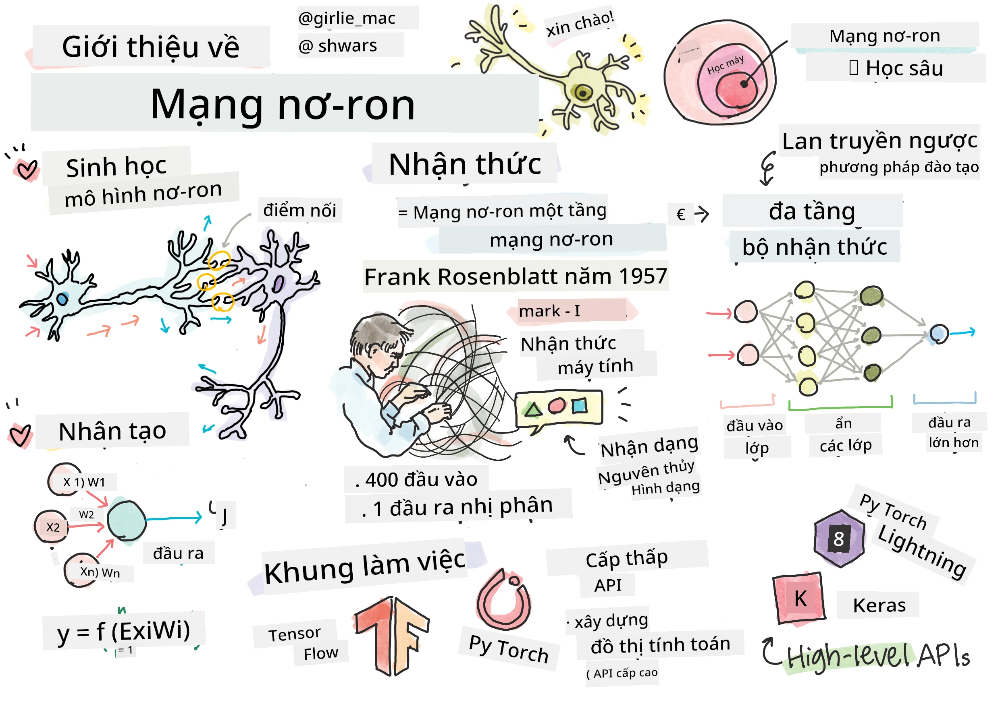
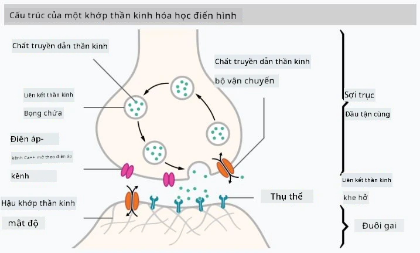

# Giới thiệu về Mạng Nơ-ron

Như chúng ta đã thảo luận trong phần giới thiệu, một trong những cách để đạt được trí tuệ là huấn luyện một **mô hình máy tính** hoặc một **bộ não nhân tạo**. Từ giữa thế kỷ 20, các nhà nghiên cứu đã thử nghiệm nhiều mô hình toán học khác nhau, cho đến những năm gần đây, hướng đi này đã chứng minh được sự thành công vượt bậc. Những mô hình toán học của bộ não này được gọi là **mạng nơ-ron**.

> Đôi khi mạng nơ-ron được gọi là *Mạng Nơ-ron Nhân Tạo*, ANNs, để chỉ rõ rằng chúng ta đang nói về các mô hình, không phải mạng nơ-ron thực sự.

## Học Máy

Mạng Nơ-ron là một phần của lĩnh vực lớn hơn gọi là **Học Máy**, với mục tiêu sử dụng dữ liệu để huấn luyện các mô hình máy tính có khả năng giải quyết vấn đề. Học Máy chiếm một phần lớn trong Trí Tuệ Nhân Tạo, tuy nhiên, chúng ta sẽ không đề cập đến Học Máy cổ điển trong chương trình này.

> Hãy truy cập chương trình học riêng **[Học Máy cho Người Mới Bắt Đầu](http://github.com/microsoft/ml-for-beginners)** của chúng tôi để tìm hiểu thêm về Học Máy cổ điển.

Trong Học Máy, chúng ta giả định rằng có một tập dữ liệu ví dụ **X**, và các giá trị đầu ra tương ứng **Y**. Các ví dụ thường là các vector N chiều bao gồm các **đặc trưng**, và các đầu ra được gọi là **nhãn**.

Chúng ta sẽ xem xét hai vấn đề phổ biến nhất trong học máy:

* **Phân loại**, nơi chúng ta cần phân loại một đối tượng đầu vào vào hai hoặc nhiều lớp.
* **Hồi quy**, nơi chúng ta cần dự đoán một con số cụ thể cho mỗi mẫu đầu vào.

> Khi biểu diễn đầu vào và đầu ra dưới dạng tensor, tập dữ liệu đầu vào là một ma trận kích thước M&times;N, trong đó M là số lượng mẫu và N là số lượng đặc trưng. Nhãn đầu ra Y là một vector kích thước M.

Trong chương trình này, chúng ta sẽ chỉ tập trung vào các mô hình mạng nơ-ron.

## Mô hình của một Nơ-ron

Từ sinh học, chúng ta biết rằng bộ não của chúng ta bao gồm các tế bào thần kinh (nơ-ron), mỗi tế bào có nhiều "đầu vào" (dendrite) và một "đầu ra" (axon). Cả dendrite và axon đều có thể dẫn truyền tín hiệu điện, và các kết nối giữa chúng — được gọi là synapse — có thể thể hiện các mức độ dẫn truyền khác nhau, được điều chỉnh bởi các chất dẫn truyền thần kinh.

 | 
----|----
Nơ-ron Thực *([Hình ảnh](https://en.wikipedia.org/wiki/Synapse#/media/File:SynapseSchematic_lines.svg) từ Wikipedia)* | Nơ-ron Nhân Tạo *(Hình ảnh của Tác giả)*

Do đó, mô hình toán học đơn giản nhất của một nơ-ron bao gồm nhiều đầu vào X1, ..., XN và một đầu ra Y, cùng một loạt các trọng số W1, ..., WN. Đầu ra được tính toán như sau:

trong đó f là một **hàm kích hoạt** phi tuyến.

> Các mô hình nơ-ron ban đầu được mô tả trong bài báo kinh điển [A logical calculus of the ideas immanent in nervous activity](https://www.cs.cmu.edu/~./epxing/Class/10715/reading/McCulloch.and.Pitts.pdf) của Warren McCullock và Walter Pitts vào năm 1943. Donald Hebb trong cuốn sách "[The Organization of Behavior: A Neuropsychological Theory](https://books.google.com/books?id=VNetYrB8EBoC)" đã đề xuất cách thức huấn luyện các mạng này.

## Trong Phần Này

Trong phần này, chúng ta sẽ tìm hiểu về:
* [Perceptron](03-Perceptron/README.md), một trong những mô hình mạng nơ-ron đầu tiên dành cho phân loại hai lớp
* [Mạng nhiều lớp](04-OwnFramework/README.md) với một notebook đi kèm [cách xây dựng framework của riêng chúng ta](04-OwnFramework/OwnFramework.ipynb)
* [Framework Mạng Nơ-ron](05-Frameworks/README.md), với các notebook sau: [PyTorch](05-Frameworks/IntroPyTorch.ipynb) và [Keras/Tensorflow](05-Frameworks/IntroKerasTF.ipynb)
* [Overfitting](../../../../lessons/3-NeuralNetworks/05-Frameworks)

---

**Tuyên bố miễn trừ trách nhiệm**:  
Tài liệu này đã được dịch bằng dịch vụ dịch thuật AI [Co-op Translator](https://github.com/Azure/co-op-translator). Mặc dù chúng tôi cố gắng đảm bảo độ chính xác, xin lưu ý rằng các bản dịch tự động có thể chứa lỗi hoặc không chính xác. Tài liệu gốc bằng ngôn ngữ bản địa nên được coi là nguồn thông tin chính thức. Đối với thông tin quan trọng, khuyến nghị sử dụng dịch vụ dịch thuật chuyên nghiệp bởi con người. Chúng tôi không chịu trách nhiệm cho bất kỳ sự hiểu lầm hoặc diễn giải sai nào phát sinh từ việc sử dụng bản dịch này.