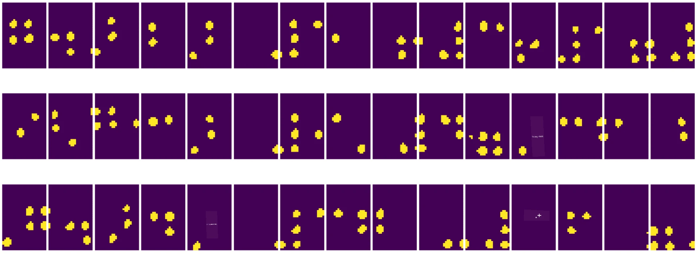
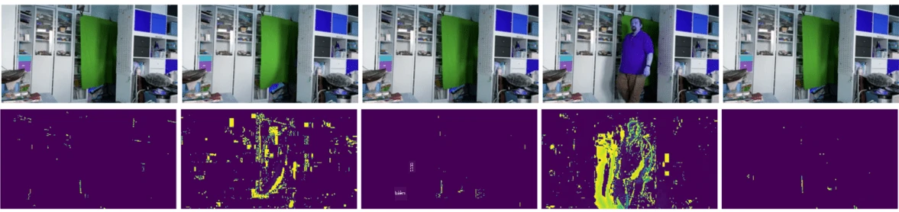

# Giới thiệu về Thị giác Máy tính

[Thị giác Máy tính](https://wikipedia.org/wiki/Computer_vision) là một lĩnh vực nhằm giúp máy tính đạt được khả năng hiểu biết ở mức cao về hình ảnh kỹ thuật số. Đây là một định nghĩa khá rộng, bởi vì *hiểu biết* có thể mang nhiều ý nghĩa khác nhau, bao gồm việc tìm một đối tượng trong hình ảnh (**phát hiện đối tượng**), hiểu điều gì đang xảy ra (**phát hiện sự kiện**), mô tả hình ảnh bằng văn bản, hoặc tái tạo một cảnh trong không gian 3D. Ngoài ra còn có các nhiệm vụ đặc biệt liên quan đến hình ảnh con người: ước tính tuổi và cảm xúc, phát hiện và nhận diện khuôn mặt, và ước tính tư thế 3D, chỉ là một vài ví dụ.

## [Câu hỏi trước bài giảng](https://ff-quizzes.netlify.app/en/ai/quiz/11)

Một trong những nhiệm vụ đơn giản nhất của thị giác máy tính là **phân loại hình ảnh**.

Thị giác máy tính thường được coi là một nhánh của AI. Ngày nay, hầu hết các nhiệm vụ thị giác máy tính đều được giải quyết bằng mạng nơ-ron. Chúng ta sẽ tìm hiểu thêm về loại mạng nơ-ron đặc biệt được sử dụng cho thị giác máy tính, [mạng nơ-ron tích chập](../07-ConvNets/README.md), trong phần này.

Tuy nhiên, trước khi bạn đưa hình ảnh vào mạng nơ-ron, trong nhiều trường hợp, việc sử dụng một số kỹ thuật thuật toán để cải thiện hình ảnh là điều hợp lý.

Có một số thư viện Python có sẵn để xử lý hình ảnh:

* **[imageio](https://imageio.readthedocs.io/en/stable/)** có thể được sử dụng để đọc/ghi các định dạng hình ảnh khác nhau. Nó cũng hỗ trợ ffmpeg, một công cụ hữu ích để chuyển đổi khung hình video thành hình ảnh.
* **[Pillow](https://pillow.readthedocs.io/en/stable/index.html)** (còn được gọi là PIL) mạnh mẽ hơn một chút, và cũng hỗ trợ một số thao tác hình ảnh như biến đổi hình dạng, điều chỉnh bảng màu, và nhiều hơn nữa.
* **[OpenCV](https://opencv.org/)** là một thư viện xử lý hình ảnh mạnh mẽ được viết bằng C++, đã trở thành tiêu chuẩn *de facto* cho xử lý hình ảnh. Nó có giao diện Python tiện lợi.
* **[dlib](http://dlib.net/)** là một thư viện C++ triển khai nhiều thuật toán học máy, bao gồm một số thuật toán Thị giác Máy tính. Nó cũng có giao diện Python và có thể được sử dụng cho các nhiệm vụ khó khăn như phát hiện khuôn mặt và điểm mốc khuôn mặt.

## OpenCV

[OpenCV](https://opencv.org/) được coi là tiêu chuẩn *de facto* cho xử lý hình ảnh. Nó chứa rất nhiều thuật toán hữu ích, được triển khai bằng C++. Bạn cũng có thể gọi OpenCV từ Python.

Một nơi tốt để học OpenCV là [khóa học Learn OpenCV](https://learnopencv.com/getting-started-with-opencv/). Trong chương trình học của chúng ta, mục tiêu không phải là học OpenCV, mà là giới thiệu một số ví dụ về khi nào nó có thể được sử dụng và cách sử dụng.

### Tải hình ảnh

Hình ảnh trong Python có thể được biểu diễn thuận tiện bằng mảng NumPy. Ví dụ, hình ảnh xám với kích thước 320x200 pixel sẽ được lưu trữ trong mảng 200x320, và hình ảnh màu với cùng kích thước sẽ có dạng 200x320x3 (cho 3 kênh màu). Để tải một hình ảnh, bạn có thể sử dụng đoạn mã sau:

```python
import cv2
import matplotlib.pyplot as plt

im = cv2.imread('image.jpeg')
plt.imshow(im)
```

Theo truyền thống, OpenCV sử dụng mã hóa BGR (Xanh-Lục-Đỏ) cho hình ảnh màu, trong khi các công cụ Python khác sử dụng mã hóa RGB (Đỏ-Lục-Xanh) truyền thống hơn. Để hình ảnh hiển thị đúng, bạn cần chuyển đổi nó sang không gian màu RGB, bằng cách hoán đổi các chiều trong mảng NumPy hoặc gọi một hàm của OpenCV:

```python
im = cv2.cvtColor(im,cv2.COLOR_BGR2RGB)
```

Hàm `cvtColor` tương tự cũng có thể được sử dụng để thực hiện các chuyển đổi không gian màu khác như chuyển đổi hình ảnh sang màu xám hoặc không gian màu HSV (Hue-Saturation-Value).

Bạn cũng có thể sử dụng OpenCV để tải video từng khung hình - một ví dụ được đưa ra trong bài tập [OpenCV Notebook](OpenCV.ipynb).

### Xử lý hình ảnh

Trước khi đưa hình ảnh vào mạng nơ-ron, bạn có thể muốn áp dụng một số bước tiền xử lý. OpenCV có thể làm nhiều việc, bao gồm:

* **Thay đổi kích thước** hình ảnh bằng `im = cv2.resize(im, (320,200),interpolation=cv2.INTER_LANCZOS)`
* **Làm mờ** hình ảnh bằng `im = cv2.medianBlur(im,3)` hoặc `im = cv2.GaussianBlur(im, (3,3), 0)`
* Thay đổi **độ sáng và độ tương phản** của hình ảnh có thể được thực hiện bằng các thao tác mảng NumPy, như được mô tả [trong ghi chú Stackoverflow này](https://stackoverflow.com/questions/39308030/how-do-i-increase-the-contrast-of-an-image-in-python-opencv).
* Sử dụng [ngưỡng](https://docs.opencv.org/4.x/d7/d4d/tutorial_py_thresholding.html) bằng cách gọi các hàm `cv2.threshold`/`cv2.adaptiveThreshold`, thường được ưu tiên hơn so với việc điều chỉnh độ sáng hoặc độ tương phản.
* Áp dụng các [biến đổi](https://docs.opencv.org/4.5.5/da/d6e/tutorial_py_geometric_transformations.html) khác nhau lên hình ảnh:
    - **[Biến đổi affine](https://docs.opencv.org/4.5.5/d4/d61/tutorial_warp_affine.html)** có thể hữu ích nếu bạn cần kết hợp xoay, thay đổi kích thước và làm méo hình ảnh và bạn biết vị trí nguồn và đích của ba điểm trong hình ảnh. Biến đổi affine giữ các đường song song song song.
    - **[Biến đổi phối cảnh](https://medium.com/analytics-vidhya/opencv-perspective-transformation-9edffefb2143)** có thể hữu ích khi bạn biết vị trí nguồn và đích của 4 điểm trong hình ảnh. Ví dụ, nếu bạn chụp một bức ảnh của tài liệu hình chữ nhật bằng camera điện thoại từ một góc nào đó, và bạn muốn tạo một hình ảnh hình chữ nhật của tài liệu đó.
* Hiểu chuyển động bên trong hình ảnh bằng cách sử dụng **[dòng quang học](https://docs.opencv.org/4.5.5/d4/dee/tutorial_optical_flow.html)**.

## Ví dụ sử dụng Thị giác Máy tính

Trong [OpenCV Notebook](OpenCV.ipynb), chúng tôi đưa ra một số ví dụ về khi nào thị giác máy tính có thể được sử dụng để thực hiện các nhiệm vụ cụ thể:

* **Tiền xử lý một bức ảnh của sách chữ Braille**. Chúng tôi tập trung vào cách sử dụng ngưỡng, phát hiện đặc điểm, biến đổi phối cảnh và thao tác NumPy để tách các ký hiệu Braille riêng lẻ để phân loại thêm bằng mạng nơ-ron.

 |  | 
----|-----|-----

> Hình ảnh từ [OpenCV.ipynb](OpenCV.ipynb)

* **Phát hiện chuyển động trong video bằng sự khác biệt giữa các khung hình**. Nếu camera cố định, thì các khung hình từ luồng camera sẽ khá giống nhau. Vì các khung hình được biểu diễn dưới dạng mảng, chỉ cần trừ các mảng của hai khung hình liên tiếp, chúng ta sẽ nhận được sự khác biệt pixel, điều này sẽ thấp đối với các khung hình tĩnh và trở nên cao hơn khi có chuyển động đáng kể trong hình ảnh.



> Hình ảnh từ [OpenCV.ipynb](OpenCV.ipynb)

* **Phát hiện chuyển động bằng Dòng Quang học**. [Dòng quang học](https://docs.opencv.org/3.4/d4/dee/tutorial_optical_flow.html) cho phép chúng ta hiểu cách các pixel riêng lẻ trên các khung hình video di chuyển. Có hai loại dòng quang học:

   - **Dòng Quang học Dày đặc** tính toán trường vector cho thấy mỗi pixel đang di chuyển đến đâu.
   - **Dòng Quang học Thưa** dựa trên việc lấy một số đặc điểm nổi bật trong hình ảnh (ví dụ: các cạnh) và xây dựng quỹ đạo của chúng từ khung hình này sang khung hình khác.


> Hình ảnh từ [OpenCV.ipynb](OpenCV.ipynb)

## ✍️ Ví dụ Notebook: OpenCV [thử OpenCV trong thực tế](OpenCV.ipynb)

Hãy thực hiện một số thí nghiệm với OpenCV bằng cách khám phá [OpenCV Notebook](OpenCV.ipynb)

## Kết luận

Đôi khi, các nhiệm vụ tương đối phức tạp như phát hiện chuyển động hoặc phát hiện đầu ngón tay có thể được giải quyết hoàn toàn bằng thị giác máy tính. Do đó, việc biết các kỹ thuật cơ bản của thị giác máy tính và những gì các thư viện như OpenCV có thể làm là rất hữu ích.

## 🚀 Thử thách

Xem [video này](https://docs.microsoft.com/shows/ai-show/ai-show--2021-opencv-ai-competition--grand-prize-winners--cortic-tigers--episode-32?WT.mc_id=academic-77998-cacaste) từ chương trình AI để tìm hiểu về dự án Cortic Tigers và cách họ xây dựng một giải pháp dựa trên khối để phổ biến các nhiệm vụ thị giác máy tính thông qua robot. Hãy nghiên cứu thêm về các dự án khác như thế này giúp người học mới tiếp cận lĩnh vực này.

## [Câu hỏi sau bài giảng](https://ff-quizzes.netlify.app/en/ai/quiz/12)

## Ôn tập & Tự học

Đọc thêm về dòng quang học [trong hướng dẫn tuyệt vời này](https://learnopencv.com/optical-flow-in-opencv/).

## [Bài tập](lab/README.md)

Trong bài thực hành này, bạn sẽ quay một video với các cử chỉ đơn giản, và mục tiêu của bạn là trích xuất các chuyển động lên/xuống/trái/phải bằng dòng quang học.


---

