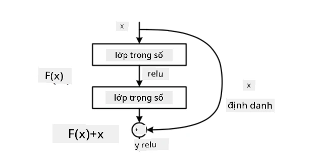

# Các Kiến Trúc CNN Nổi Tiếng

### VGG-16

VGG-16 là một mạng đạt độ chính xác 92.7% trong phân loại top-5 của ImageNet vào năm 2014. Nó có cấu trúc các lớp như sau:

Như bạn có thể thấy, VGG tuân theo kiến trúc hình kim tự tháp truyền thống, bao gồm một chuỗi các lớp tích chập và lớp pooling.

> Hình ảnh từ [Researchgate](https://www.researchgate.net/figure/Vgg16-model-structure-To-get-the-VGG-NIN-model-we-replace-the-2-nd-4-th-6-th-7-th_fig2_335194493)

### ResNet

ResNet là một họ các mô hình được đề xuất bởi Microsoft Research vào năm 2015. Ý tưởng chính của ResNet là sử dụng **khối dư thừa**:

> Hình ảnh từ [bài báo này](https://arxiv.org/pdf/1512.03385.pdf)

Lý do sử dụng đường dẫn nhận dạng là để lớp của chúng ta dự đoán **sự khác biệt** giữa kết quả của lớp trước đó và đầu ra của khối dư thừa - do đó có tên gọi *residual*. Những khối này dễ huấn luyện hơn nhiều, và người ta có thể xây dựng các mạng với hàng trăm khối như vậy (các biến thể phổ biến nhất là ResNet-52, ResNet-101 và ResNet-152).

Bạn cũng có thể nghĩ rằng mạng này có khả năng điều chỉnh độ phức tạp của nó theo dữ liệu. Ban đầu, khi bạn bắt đầu huấn luyện mạng, giá trị trọng số nhỏ, và phần lớn tín hiệu đi qua các lớp nhận dạng. Khi quá trình huấn luyện tiến triển và trọng số trở nên lớn hơn, tầm quan trọng của các tham số mạng tăng lên, và mạng điều chỉnh để phù hợp với khả năng biểu đạt cần thiết để phân loại chính xác các hình ảnh huấn luyện.

### Google Inception

Kiến trúc Google Inception đưa ý tưởng này tiến xa hơn, và xây dựng mỗi lớp mạng như một sự kết hợp của nhiều đường dẫn khác nhau:

> Hình ảnh từ [Researchgate](https://www.researchgate.net/figure/Inception-module-with-dimension-reductions-left-and-schema-for-Inception-ResNet-v1_fig2_355547454)

Ở đây, chúng ta cần nhấn mạnh vai trò của các tích chập 1x1, bởi vì ban đầu chúng có vẻ không hợp lý. Tại sao chúng ta cần chạy qua hình ảnh với bộ lọc 1x1? Tuy nhiên, bạn cần nhớ rằng các bộ lọc tích chập cũng hoạt động với nhiều kênh độ sâu (ban đầu là màu RGB, trong các lớp tiếp theo là các kênh cho các bộ lọc khác nhau), và tích chập 1x1 được sử dụng để trộn các kênh đầu vào này với nhau bằng các trọng số có thể huấn luyện. Nó cũng có thể được xem như là giảm mẫu (pooling) trên chiều kênh.

Đây là [một bài viết blog hay](https://medium.com/analytics-vidhya/talented-mr-1x1-comprehensive-look-at-1x1-convolution-in-deep-learning-f6b355825578) về chủ đề này, và [bài báo gốc](https://arxiv.org/pdf/1312.4400.pdf).

### MobileNet

MobileNet là một họ các mô hình có kích thước giảm, phù hợp cho các thiết bị di động. Hãy sử dụng chúng nếu bạn thiếu tài nguyên và có thể chấp nhận hy sinh một chút độ chính xác. Ý tưởng chính đằng sau chúng là **tích chập phân tách theo chiều sâu**, cho phép biểu diễn các bộ lọc tích chập bằng sự kết hợp của các tích chập không gian và tích chập 1x1 trên các kênh độ sâu. Điều này làm giảm đáng kể số lượng tham số, khiến mạng nhỏ hơn về kích thước, và cũng dễ huấn luyện hơn với ít dữ liệu.

Đây là [một bài viết blog hay về MobileNet](https://medium.com/analytics-vidhya/image-classification-with-mobilenet-cc6fbb2cd470).

## Kết Luận

Trong bài học này, bạn đã học được khái niệm chính đằng sau các mạng nơ-ron thị giác máy tính - mạng tích chập. Các kiến trúc thực tế hỗ trợ phân loại hình ảnh, phát hiện đối tượng, và thậm chí cả các mạng tạo hình ảnh đều dựa trên CNN, chỉ với nhiều lớp hơn và một số mẹo huấn luyện bổ sung.

## 🚀 Thử Thách

Trong các notebook đi kèm, có các ghi chú ở cuối về cách đạt được độ chính xác cao hơn. Hãy thử nghiệm để xem liệu bạn có thể đạt được độ chính xác cao hơn không.

## [Câu hỏi sau bài giảng](https://ff-quizzes.netlify.app/en/ai/quiz/14)

## Ôn Tập & Tự Học

Mặc dù CNN thường được sử dụng cho các nhiệm vụ Thị Giác Máy Tính, chúng cũng rất tốt trong việc trích xuất các mẫu có kích thước cố định. Ví dụ, nếu chúng ta đang xử lý âm thanh, chúng ta cũng có thể muốn sử dụng CNN để tìm kiếm một số mẫu cụ thể trong tín hiệu âm thanh - trong trường hợp này các bộ lọc sẽ là 1 chiều (và CNN này sẽ được gọi là 1D-CNN). Ngoài ra, đôi khi 3D-CNN được sử dụng để trích xuất các đặc điểm trong không gian đa chiều, chẳng hạn như các sự kiện nhất định xảy ra trong video - CNN có thể nắm bắt các mẫu thay đổi đặc điểm theo thời gian. Hãy ôn tập và tự học về các nhiệm vụ khác mà CNN có thể thực hiện.

## [Bài tập](lab/README.md)

Trong bài thực hành này, bạn sẽ phân loại các giống mèo và chó khác nhau. Những hình ảnh này phức tạp hơn so với tập dữ liệu MNIST, có kích thước lớn hơn, và có hơn 10 lớp.

---

