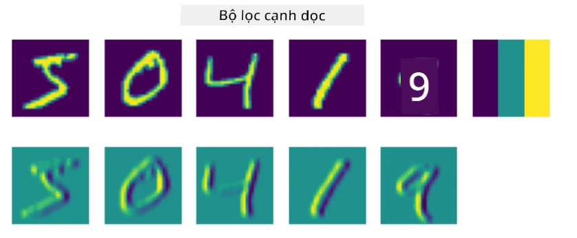
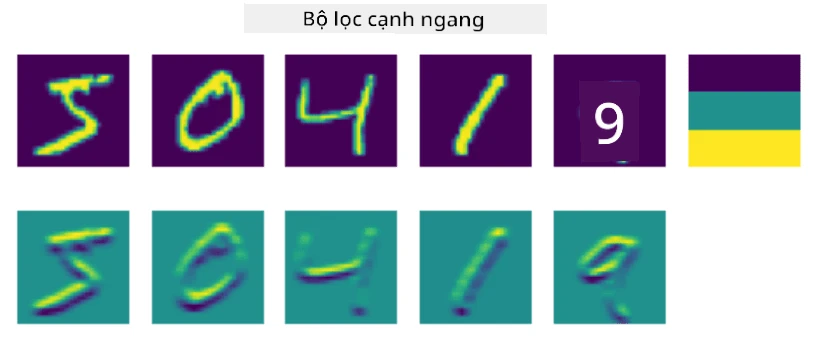
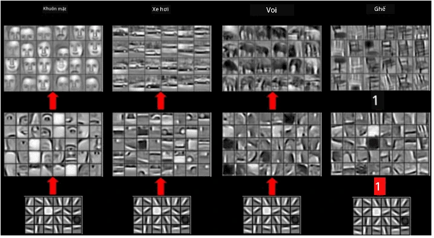
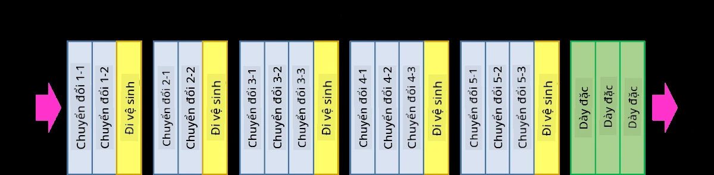
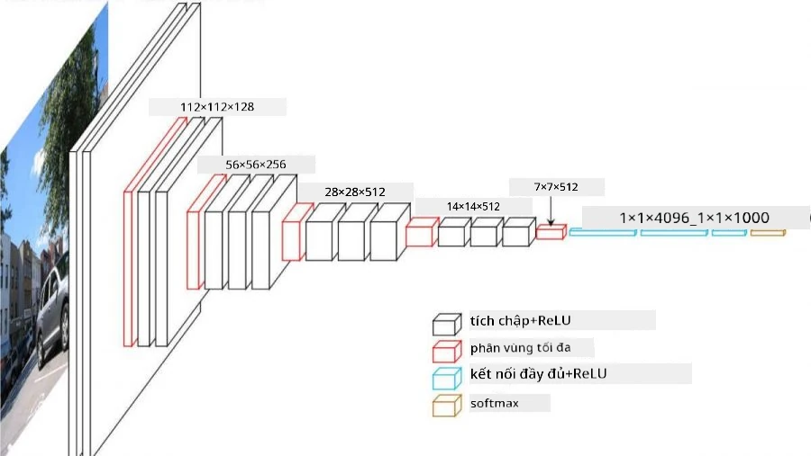

# Mạng Nơ-ron Tích Chập

Chúng ta đã thấy trước đây rằng mạng nơ-ron rất tốt trong việc xử lý hình ảnh, và thậm chí một perceptron một lớp cũng có thể nhận diện chữ số viết tay từ tập dữ liệu MNIST với độ chính xác khá cao. Tuy nhiên, tập dữ liệu MNIST rất đặc biệt, vì tất cả các chữ số đều được căn giữa trong hình ảnh, điều này làm cho nhiệm vụ trở nên đơn giản hơn.

## [Câu hỏi kiểm tra trước bài giảng](https://ff-quizzes.netlify.app/en/ai/quiz/13)

Trong thực tế, chúng ta muốn có khả năng nhận diện các đối tượng trong một bức ảnh bất kể vị trí chính xác của chúng trong hình ảnh. Thị giác máy tính khác với phân loại thông thường, bởi vì khi chúng ta cố gắng tìm một đối tượng cụ thể trong bức ảnh, chúng ta sẽ quét hình ảnh để tìm các **mẫu** cụ thể và các tổ hợp của chúng. Ví dụ, khi tìm kiếm một con mèo, đầu tiên chúng ta có thể tìm các đường ngang, có thể tạo thành râu mèo, và sau đó một tổ hợp nhất định của các râu mèo có thể cho chúng ta biết rằng đó thực sự là hình ảnh của một con mèo. Vị trí tương đối và sự hiện diện của các mẫu nhất định là quan trọng, chứ không phải vị trí chính xác của chúng trong hình ảnh.

Để trích xuất các mẫu, chúng ta sẽ sử dụng khái niệm **bộ lọc tích chập**. Như bạn đã biết, một hình ảnh được biểu diễn bằng một ma trận 2D, hoặc một tensor 3D với độ sâu màu. Việc áp dụng một bộ lọc có nghĩa là chúng ta lấy một ma trận **hạt nhân bộ lọc** tương đối nhỏ, và đối với mỗi điểm ảnh trong hình ảnh gốc, chúng ta tính trung bình có trọng số với các điểm lân cận. Chúng ta có thể hình dung điều này như một cửa sổ nhỏ trượt qua toàn bộ hình ảnh, và tính trung bình tất cả các điểm ảnh theo các trọng số trong ma trận hạt nhân bộ lọc.

 | 
----|----

> Hình ảnh của Dmitry Soshnikov

Ví dụ, nếu chúng ta áp dụng các bộ lọc cạnh dọc và cạnh ngang 3x3 lên các chữ số MNIST, chúng ta có thể làm nổi bật (ví dụ: giá trị cao) những nơi có các cạnh dọc và ngang trong hình ảnh gốc. Do đó, hai bộ lọc này có thể được sử dụng để "tìm kiếm" các cạnh. Tương tự, chúng ta có thể thiết kế các bộ lọc khác để tìm kiếm các mẫu cấp thấp khác:

> Hình ảnh của [Leung-Malik Filter Bank](https://www.robots.ox.ac.uk/~vgg/research/texclass/filters.html)

Tuy nhiên, trong khi chúng ta có thể thiết kế các bộ lọc để trích xuất một số mẫu một cách thủ công, chúng ta cũng có thể thiết kế mạng theo cách mà nó sẽ tự động học các mẫu. Đây là một trong những ý tưởng chính đằng sau CNN.

## Các ý tưởng chính đằng sau CNN

Cách hoạt động của CNN dựa trên các ý tưởng quan trọng sau:

* Bộ lọc tích chập có thể trích xuất các mẫu
* Chúng ta có thể thiết kế mạng theo cách mà các bộ lọc được huấn luyện tự động
* Chúng ta có thể sử dụng cùng một phương pháp để tìm các mẫu trong các đặc trưng cấp cao, không chỉ trong hình ảnh gốc. Do đó, việc trích xuất đặc trưng của CNN hoạt động trên một hệ thống phân cấp các đặc trưng, bắt đầu từ các tổ hợp điểm ảnh cấp thấp, cho đến các tổ hợp cấp cao hơn của các phần trong hình ảnh.

> Hình ảnh từ [một bài báo của Hislop-Lynch](https://www.semanticscholar.org/paper/Computer-vision-based-pedestrian-trajectory-Hislop-Lynch/26e6f74853fc9bbb7487b06dc2cf095d36c9021d), dựa trên [nghiên cứu của họ](https://dl.acm.org/doi/abs/10.1145/1553374.1553453)

## ✍️ Bài tập: Mạng Nơ-ron Tích Chập

Hãy tiếp tục khám phá cách mạng nơ-ron tích chập hoạt động, và cách chúng ta có thể đạt được các bộ lọc có thể huấn luyện, bằng cách làm việc qua các notebook tương ứng:

* [Mạng Nơ-ron Tích Chập - PyTorch](ConvNetsPyTorch.ipynb)
* [Mạng Nơ-ron Tích Chập - TensorFlow](ConvNetsTF.ipynb)

## Kiến trúc Kim Tự Tháp

Hầu hết các CNN được sử dụng để xử lý hình ảnh đều tuân theo một kiến trúc gọi là kiến trúc kim tự tháp. Lớp tích chập đầu tiên được áp dụng lên hình ảnh gốc thường có số lượng bộ lọc tương đối thấp (8-16), tương ứng với các tổ hợp điểm ảnh khác nhau, chẳng hạn như các đường ngang/dọc hoặc nét vẽ. Ở cấp độ tiếp theo, chúng ta giảm kích thước không gian của mạng và tăng số lượng bộ lọc, tương ứng với nhiều tổ hợp hơn của các đặc trưng đơn giản. Với mỗi lớp, khi chúng ta tiến gần đến bộ phân loại cuối cùng, kích thước không gian của hình ảnh giảm, và số lượng bộ lọc tăng lên.

Ví dụ, hãy xem kiến trúc của VGG-16, một mạng đạt được độ chính xác 92.7% trong phân loại top-5 của ImageNet vào năm 2014:

> Hình ảnh từ [Researchgate](https://www.researchgate.net/figure/Vgg16-model-structure-To-get-the-VGG-NIN-model-we-replace-the-2-nd-4-th-6-th-7-th_fig2_335194493)

## Các Kiến Trúc CNN Nổi Tiếng Nhất

[Tiếp tục nghiên cứu về các kiến trúc CNN nổi tiếng nhất](CNN_Architectures.md)

---

