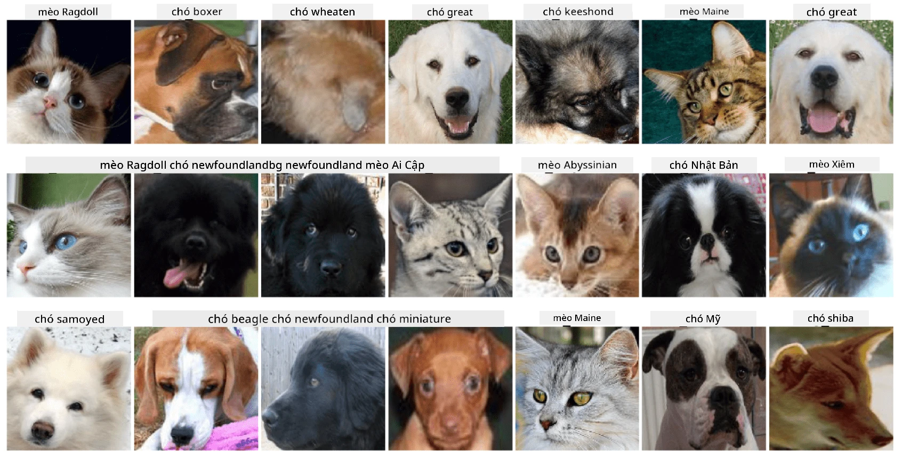

# Phân Loại Khuôn Mặt Thú Cưng

Bài tập thực hành từ [Chương trình AI cho Người Mới Bắt Đầu](https://github.com/microsoft/ai-for-beginners).

## Nhiệm Vụ

Hãy tưởng tượng bạn cần phát triển một ứng dụng cho nhà trẻ thú cưng để lập danh mục tất cả các thú nuôi. Một trong những tính năng tuyệt vời của ứng dụng này là tự động nhận diện giống loài từ một bức ảnh. Điều này có thể được thực hiện thành công bằng cách sử dụng mạng nơ-ron.

Bạn cần huấn luyện một mạng nơ-ron tích chập để phân loại các giống loài khác nhau của mèo và chó bằng cách sử dụng bộ dữ liệu **Pet Faces**.

## Bộ Dữ Liệu

Chúng ta sẽ sử dụng [Bộ Dữ Liệu Thú Cưng Oxford-IIIT](https://www.robots.ox.ac.uk/~vgg/data/pets/), bộ dữ liệu này chứa hình ảnh của 37 giống loài chó và mèo khác nhau.



Để tải bộ dữ liệu, sử dụng đoạn mã sau:

```python
!wget https://thor.robots.ox.ac.uk/~vgg/data/pets/images.tar.gz
!tar xfz images.tar.gz
!rm images.tar.gz
```

**Lưu ý:** Các hình ảnh trong Bộ Dữ Liệu Thú Cưng Oxford-IIIT được tổ chức theo tên tệp (ví dụ: `Abyssinian_1.jpg`, `Bengal_2.jpg`). Notebook bao gồm mã để tổ chức các hình ảnh này vào các thư mục con theo từng giống loài để dễ dàng phân loại hơn.

## Bắt Đầu Notebook

Bắt đầu bài thực hành bằng cách mở [PetFaces.ipynb](PetFaces.ipynb)

## Kết Quả Đạt Được

Bạn đã giải quyết một vấn đề tương đối phức tạp về phân loại hình ảnh từ đầu! Có khá nhiều lớp, nhưng bạn vẫn có thể đạt được độ chính xác hợp lý! Ngoài ra, việc đo lường độ chính xác top-k cũng rất hợp lý, bởi vì một số lớp có thể dễ bị nhầm lẫn ngay cả đối với con người.

---

**Tuyên bố miễn trừ trách nhiệm**:  
Tài liệu này đã được dịch bằng dịch vụ dịch thuật AI [Co-op Translator](https://github.com/Azure/co-op-translator). Mặc dù chúng tôi cố gắng đảm bảo độ chính xác, xin lưu ý rằng các bản dịch tự động có thể chứa lỗi hoặc không chính xác. Tài liệu gốc bằng ngôn ngữ bản địa nên được coi là nguồn thông tin chính thức. Đối với các thông tin quan trọng, khuyến nghị sử dụng dịch vụ dịch thuật chuyên nghiệp bởi con người. Chúng tôi không chịu trách nhiệm cho bất kỳ sự hiểu lầm hoặc diễn giải sai nào phát sinh từ việc sử dụng bản dịch này.