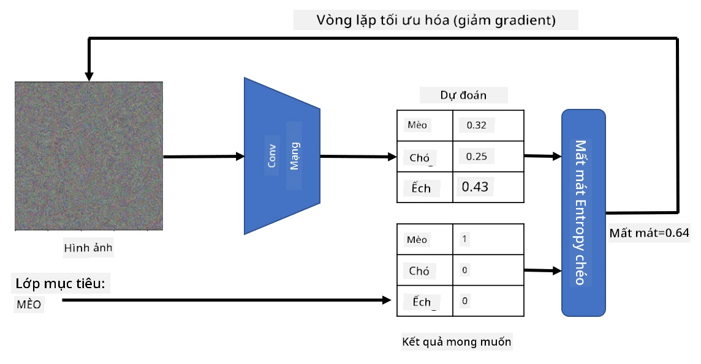

# Mạng Được Huấn Luyện Sẵn và Học Chuyển Giao

Huấn luyện CNN có thể mất rất nhiều thời gian và yêu cầu một lượng lớn dữ liệu. Tuy nhiên, phần lớn thời gian được dành để học các bộ lọc cấp thấp tốt nhất mà mạng có thể sử dụng để trích xuất các mẫu từ hình ảnh. Một câu hỏi tự nhiên được đặt ra - liệu chúng ta có thể sử dụng một mạng nơ-ron đã được huấn luyện trên một tập dữ liệu và điều chỉnh nó để phân loại các hình ảnh khác mà không cần một quá trình huấn luyện đầy đủ?

## [Câu hỏi trước bài giảng](https://ff-quizzes.netlify.app/en/ai/quiz/15)

Phương pháp này được gọi là **học chuyển giao**, bởi vì chúng ta chuyển một số kiến thức từ một mô hình mạng nơ-ron sang một mô hình khác. Trong học chuyển giao, chúng ta thường bắt đầu với một mô hình đã được huấn luyện sẵn, được huấn luyện trên một tập dữ liệu hình ảnh lớn, chẳng hạn như **ImageNet**. Những mô hình này đã có khả năng tốt trong việc trích xuất các đặc điểm từ hình ảnh chung, và trong nhiều trường hợp, chỉ cần xây dựng một bộ phân loại dựa trên những đặc điểm đã trích xuất có thể mang lại kết quả tốt.

> ✅ Học chuyển giao là một thuật ngữ bạn có thể gặp trong các lĩnh vực học thuật khác, chẳng hạn như Giáo dục. Nó đề cập đến quá trình lấy kiến thức từ một lĩnh vực và áp dụng nó vào lĩnh vực khác.

## Mô Hình Được Huấn Luyện Sẵn Như Các Bộ Trích Xuất Đặc Điểm

Các mạng tích chập mà chúng ta đã thảo luận trong phần trước bao gồm một số lớp, mỗi lớp được thiết kế để trích xuất một số đặc điểm từ hình ảnh, bắt đầu từ các tổ hợp pixel cấp thấp (chẳng hạn như đường ngang/dọc hoặc nét vẽ), cho đến các tổ hợp đặc điểm cấp cao hơn, tương ứng với những thứ như mắt của một ngọn lửa. Nếu chúng ta huấn luyện CNN trên một tập dữ liệu đủ lớn và đa dạng, mạng sẽ học cách trích xuất những đặc điểm chung đó.

Cả Keras và PyTorch đều có các hàm để dễ dàng tải trọng số mạng nơ-ron đã được huấn luyện sẵn cho một số kiến trúc phổ biến, hầu hết được huấn luyện trên hình ảnh ImageNet. Những kiến trúc thường được sử dụng nhất được mô tả trên trang [Kiến Trúc CNN](../07-ConvNets/CNN_Architectures.md) từ bài học trước. Đặc biệt, bạn có thể cân nhắc sử dụng một trong những kiến trúc sau:

* **VGG-16/VGG-19** là các mô hình tương đối đơn giản nhưng vẫn mang lại độ chính xác tốt. Thường thì sử dụng VGG như một thử nghiệm đầu tiên là một lựa chọn tốt để xem học chuyển giao hoạt động như thế nào.
* **ResNet** là một họ mô hình được đề xuất bởi Microsoft Research vào năm 2015. Chúng có nhiều lớp hơn, và do đó yêu cầu nhiều tài nguyên hơn.
* **MobileNet** là một họ mô hình có kích thước giảm, phù hợp cho các thiết bị di động. Sử dụng chúng nếu bạn thiếu tài nguyên và có thể chấp nhận giảm một chút độ chính xác.

Dưới đây là các đặc điểm mẫu được trích xuất từ một bức ảnh của một con mèo bởi mạng VGG-16:

## Tập Dữ Liệu Mèo và Chó

Trong ví dụ này, chúng ta sẽ sử dụng một tập dữ liệu về [Mèo và Chó](https://www.microsoft.com/download/details.aspx?id=54765&WT.mc_id=academic-77998-cacaste), rất gần với một kịch bản phân loại hình ảnh thực tế.

## ✍️ Bài Tập: Học Chuyển Giao

Hãy xem học chuyển giao hoạt động trong các notebook tương ứng:

* [Học Chuyển Giao - PyTorch](TransferLearningPyTorch.ipynb)
* [Học Chuyển Giao - TensorFlow](TransferLearningTF.ipynb)

## Hình Ảnh Mèo Đối Kháng

Mạng nơ-ron đã được huấn luyện sẵn chứa các mẫu khác nhau bên trong "bộ não" của nó, bao gồm các khái niệm về **mèo lý tưởng** (cũng như chó lý tưởng, ngựa vằn lý tưởng, v.v.). Sẽ rất thú vị nếu có thể **hình dung hình ảnh này**. Tuy nhiên, điều này không đơn giản, bởi vì các mẫu được phân bố khắp các trọng số của mạng, và cũng được tổ chức theo cấu trúc phân cấp.

Một cách tiếp cận mà chúng ta có thể thực hiện là bắt đầu với một hình ảnh ngẫu nhiên, sau đó cố gắng sử dụng kỹ thuật **tối ưu hóa gradient descent** để điều chỉnh hình ảnh đó sao cho mạng bắt đầu nghĩ rằng đó là một con mèo.

Tuy nhiên, nếu chúng ta làm điều này, chúng ta sẽ nhận được một thứ rất giống với nhiễu ngẫu nhiên. Điều này là do *có nhiều cách để khiến mạng nghĩ rằng hình ảnh đầu vào là một con mèo*, bao gồm một số cách không có ý nghĩa về mặt thị giác. Mặc dù những hình ảnh này chứa nhiều mẫu đặc trưng cho một con mèo, nhưng không có gì ràng buộc chúng phải rõ ràng về mặt thị giác.

Để cải thiện kết quả, chúng ta có thể thêm một thuật ngữ khác vào hàm mất mát, được gọi là **mất mát biến đổi**. Đây là một chỉ số cho thấy mức độ tương đồng giữa các pixel lân cận của hình ảnh. Việc giảm thiểu mất mát biến đổi làm cho hình ảnh mượt mà hơn và loại bỏ nhiễu - từ đó làm lộ ra các mẫu hấp dẫn hơn về mặt thị giác. Dưới đây là ví dụ về các hình ảnh "lý tưởng" như vậy, được phân loại là mèo và ngựa vằn với xác suất cao:

 | 
-----|-----
 *Mèo Lý Tưởng* | *Ngựa Vằn Lý Tưởng*

Cách tiếp cận tương tự có thể được sử dụng để thực hiện cái gọi là **tấn công đối kháng** trên mạng nơ-ron. Giả sử chúng ta muốn đánh lừa một mạng nơ-ron và làm cho một con chó trông giống như một con mèo. Nếu chúng ta lấy hình ảnh của một con chó, được mạng nhận diện là một con chó, chúng ta có thể điều chỉnh nó một chút bằng cách sử dụng tối ưu hóa gradient descent, cho đến khi mạng bắt đầu phân loại nó là một con mèo:

 | 
-----|-----
*Hình ảnh gốc của một con chó* | *Hình ảnh của một con chó được phân loại là mèo*

Xem mã để tái tạo các kết quả trên trong notebook sau:

* [Mèo Lý Tưởng và Đối Kháng - TensorFlow](AdversarialCat_TF.ipynb)

## Kết Luận

Sử dụng học chuyển giao, bạn có thể nhanh chóng tạo ra một bộ phân loại cho nhiệm vụ phân loại đối tượng tùy chỉnh và đạt được độ chính xác cao. Bạn có thể thấy rằng các nhiệm vụ phức tạp hơn mà chúng ta đang giải quyết hiện nay yêu cầu sức mạnh tính toán cao hơn, và không thể dễ dàng giải quyết trên CPU. Trong đơn vị tiếp theo, chúng ta sẽ thử sử dụng một triển khai nhẹ hơn để huấn luyện cùng một mô hình với tài nguyên tính toán thấp hơn, dẫn đến độ chính xác chỉ giảm nhẹ.

## 🚀 Thử Thách

Trong các notebook đi kèm, có các ghi chú ở cuối về cách kiến thức chuyển giao hoạt động tốt nhất với dữ liệu huấn luyện tương đối giống nhau (chẳng hạn như một loại động vật mới). Hãy thử nghiệm với các loại hình ảnh hoàn toàn mới để xem mô hình kiến thức chuyển giao của bạn hoạt động tốt hay kém như thế nào.

## [Câu hỏi sau bài giảng](https://ff-quizzes.netlify.app/en/ai/quiz/16)

## Ôn Tập & Tự Học

Đọc qua [TrainingTricks.md](TrainingTricks.md) để nâng cao kiến thức của bạn về một số cách khác để huấn luyện mô hình.

## [Bài Tập](lab/README.md)

Trong bài thực hành này, chúng ta sẽ sử dụng tập dữ liệu thực tế [Oxford-IIIT](https://www.robots.ox.ac.uk/~vgg/data/pets/) về thú cưng với 35 giống mèo và chó, và chúng ta sẽ xây dựng một bộ phân loại học chuyển giao.

---

